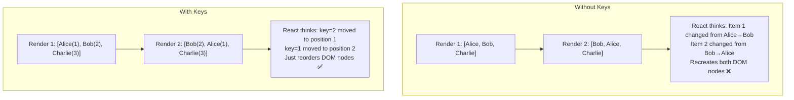

# Fix: "Each Child in a List Should Have a Unique Key Prop" in React

You've seen it. Every React developer has seen it. That yellow console warning staring back at you:

> Warning: Each child in a list should have a unique "key" prop.

It's one of the most common React warnings  and one of the most misunderstood. Most developers slap `key={index}` on their list items and call it a day. And honestly? That works... until it doesn't. Then you're debugging ghost state, inputs that won't clear, and list items that seem to have a mind of their own.

I spent two days tracking down a bug on a team I worked with where a to-do list kept swapping completion states between items after reordering. The culprit? Array index keys. Two days. Let me save you that pain.

## Why React Even Needs Keys

React's reconciliation algorithm  the thing that figures out what changed between renders  needs a way to match elements from the previous render to the new one. When you render a list, React doesn't know which item is which unless you tell it.

Here's the mental model: keys are like name tags at a conference. Without them, React can only go by position. "The third person in line is... still the third person, right?" But if people swap positions, React gets confused.



With keys, React matches by identity. Without them, it matches by position and ends up doing way more work  or worse, preserving state that belongs to a completely different item.

## The Fix: Add a Unique Key

The most basic fix looks like this:

```tsx
// ❌ No key  you'll get the warning
function TodoList({ todos }) {
  return (
    <ul>
      {todos.map((todo) => (
        <li>{todo.text}</li>
      ))}
    </ul>
  );
}

// ✅ Using a unique identifier as key
function TodoList({ todos }) {
  return (
    <ul>
      {todos.map((todo) => (
        <li key={todo.id}>{todo.text}</li>
      ))}
    </ul>
  );
}
```

Simple enough. But the real question is: *what* should you use as the key?

## `id` vs `index`  and Why Index Is Dangerous

Using the array index as a key is the most common "quick fix." And React's own docs will tell you it's a last resort.

```tsx
// ⚠️ Works, but fragile
{todos.map((todo, index) => (
  <li key={index}>{todo.text}</li>
))}
```

This is fine *if and only if* all three of these are true:

1. The list is static  items don't get added, removed, or reordered
2. The items have no state (no inputs, no checkboxes, no animations)
3. The items don't have unique IDs available

The moment you add sorting, filtering, drag-and-drop, or inline editing, index keys will betray you. Here's why: when you remove item at index 2, the item that was at index 3 becomes index 2. React thinks it's the *same* component, so it keeps the old state. Your checkbox stays checked on the wrong item. Your input field shows the wrong text.

A team I worked with built a kanban board with index keys. Everything looked fine until users started dragging cards between columns. Cards would "remember" the state of whatever card used to be at that position. It was a nightmare to debug because the rendered text was correct  only the internal state was wrong.

Here's a comparison of key strategies:

| Strategy | Stable across reorders | Unique | Performance | When to use |
|---|---|---|---|---|
| `item.id` (from DB/API) | Yes | Yes | Best | Always  if you have an ID |
| `item.email` or unique field | Yes | Yes (usually) | Good | When there's no numeric ID |
| `crypto.randomUUID()` | No  regenerates! | Yes | Worst | Never as inline key |
| Array `index` | No | Yes (per render) | OK | Static, stateless lists only |
| `nanoid()` (at creation time) | Yes | Yes | Best | When you generate items client-side |

> **Warning:** Never call `crypto.randomUUID()` or `Math.random()` *inside* the render. That generates a new key every render, which means React unmounts and remounts every item every time. Your performance will tank and all component state will be lost.

## Generating Stable Keys

If your data comes from an API or database, it almost certainly has an `id` field. Use it. But what about client-generated items  like a form where users add rows dynamically?

Generate the ID when the item is *created*, not when it's *rendered*:

```tsx
import { nanoid } from "nanoid";

function DynamicForm() {
  const [fields, setFields] = useState([
    { id: nanoid(), value: "" },
  ]);

  const addField = () => {
    setFields((prev) => [...prev, { id: nanoid(), value: "" }]);
  };

  return (
    <form>
      {fields.map((field) => (
        <input
          key={field.id}
          value={field.value}
          onChange={(e) => updateField(field.id, e.target.value)}
        />
      ))}
      <button type="button" onClick={addField}>
        Add field
      </button>
    </form>
  );
}
```

You could also use `crypto.randomUUID()` instead of `nanoid`  it's built into every modern browser and Node 19+. The key point is: generate it once, store it with the data, and reuse it on every render.

```typescript
// Also fine  no dependency needed
const addField = () => {
  setFields((prev) => [
    ...prev,
    { id: crypto.randomUUID(), value: "" },
  ]);
};
```

## Keys with React Fragments

This one trips people up. When you need to return multiple elements per list item, you reach for Fragments. But the shorthand `<>...</>` syntax doesn't accept props  including `key`.

```tsx
// ❌ Short syntax can't take a key
{items.map((item) => (
  <>
    <dt>{item.term}</dt>
    <dd>{item.definition}</dd>
  </>
))}

// ✅ Use the explicit Fragment import
import { Fragment } from "react";

{items.map((item) => (
  <Fragment key={item.id}>
    <dt>{item.term}</dt>
    <dd>{item.definition}</dd>
  </Fragment>
))}
```

This is the *only* reason you'd ever import `Fragment` explicitly in modern React. The shorthand syntax covers every other case. So if you're mapping over a list and returning multiple sibling elements, remember: `Fragment` with a capital F and an explicit import.

## Nested Lists Need Their Own Keys

Each level of nesting needs its own set of keys. And the keys only need to be unique *among siblings*  not globally.

```tsx
function CourseList({ courses }) {
  return (
    <div>
      {courses.map((course) => (
        <section key={course.id}>
          <h2>{course.title}</h2>
          <ul>
            {course.lessons.map((lesson) => (
              <li key={lesson.id}>{lesson.name}</li>
            ))}
          </ul>
        </section>
      ))}
    </div>
  );
}
```

Notice that `course.id` and `lesson.id` could technically have overlapping values  that's fine. React only compares keys among direct siblings within the same parent. A key of `1` in the courses list and a key of `1` in a lessons list won't collide.

But here's a gotcha: if you're rendering a flat list that *combines* items from different sources, those keys *do* need to be unique across the combined set. I usually prefix them:

```tsx
const combined = [
  ...articles.map((a) => ({ ...a, listKey: `article-${a.id}` })),
  ...videos.map((v) => ({ ...v, listKey: `video-${v.id}` })),
];

{combined.map((item) => (
  <Card key={item.listKey} data={item} />
))}
```

## My Hot Take on Keys

Honestly, the "each child in list should have unique key prop" warning should be an error, not a warning. I've seen it cause real production bugs  data showing up on the wrong row, form inputs that reset themselves, animations firing on the wrong element. The fact that React lets you ignore this is a footgun.

If you're converting HTML templates to JSX and running into this warning everywhere, [SnipShift's HTML to JSX converter](https://snipshift.dev/html-to-jsx) can help you get the structure right before you wire up your keys.

## Quick Checklist

Before you move on, run through this:

- [ ] Every `.map()` call in your JSX has a `key` on the returned element
- [ ] Keys come from stable, unique identifiers  not array indices (unless the list is truly static)
- [ ] You're not generating keys inside render (`key={Math.random()}` is always wrong)
- [ ] Fragments in lists use `<Fragment key={...}>`, not `<>...</>`
- [ ] Nested lists each have their own keys
- [ ] Combined lists use prefixed keys to avoid collisions

## Related Reading

If you're working with React and TypeScript  and you should be  check out the guide on [converting JSX components to TSX](/blog/jsx-to-tsx-react-typescript). And if event handlers in TypeScript trip you up (they trip everyone up), here's a solid reference on [typing React event handlers](/blog/react-typescript-event-handlers).

For more tools to speed up your React workflow, take a look at [SnipShift.dev](https://snipshift.dev)  we build developer utilities that actually save time.
