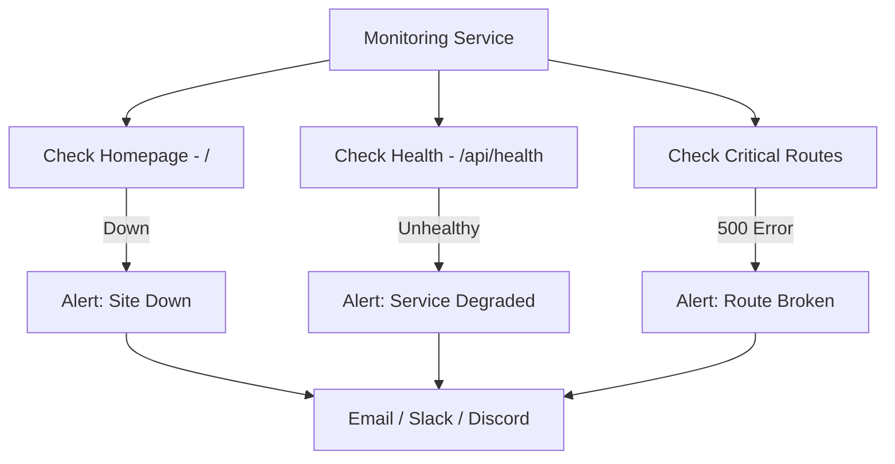

# How to Set Up Uptime Monitoring for Free (Better Stack, UptimeRobot, Checkly)

I learned the hard way why **free uptime monitoring** matters. I'd deployed a side project on a Friday, went out for the weekend, and came back Monday to discover the database connection had died Saturday morning. Nobody noticed because nobody was using it  except the handful of beta users who silently moved on. Two days of downtime, zero alerts.

That was the last time I deployed anything without monitoring. The good news: you can set up solid monitoring in under 15 minutes, and the free tiers of modern monitoring tools are genuinely useful  not crippled trial versions.

## What Should You Actually Monitor?

Before picking a tool, figure out what to check. Most developers start with "monitor the homepage" and stop there. That's better than nothing, but it misses a lot.

Here's what I monitor on every project:

| What to Monitor | Why | Check Type |
|----------------|-----|------------|
| Homepage (`/`) | If this is down, everything is down | HTTP status = 200 |
| API health endpoint (`/api/health`) | Catches database, Redis, external service failures | HTTP status = 200 + JSON body |
| Critical user flows (`/login`, `/dashboard`) | App might be "up" but key pages broken | HTTP status = 200 |
| SSL certificate | Expired certs break everything silently | Certificate expiry check |
| DNS resolution | Catches misconfigured domains after changes | DNS lookup |

The homepage check catches total outages. The health endpoint catches partial failures  your app is responding but the database is down. The critical route checks catch deployment bugs where the app starts but specific pages throw 500s.



> **Tip:** If you don't have a health check endpoint yet, set one up first  it takes 5 minutes. Our [health check endpoint guide](/blog/health-check-endpoint-nodejs) shows you exactly how to build one that checks your database, cache, and external dependencies.

## Better Stack (Formerly Uptime.com / Logtail)

Better Stack has become my default monitoring tool. The free tier is generous and the UI is clean.

**Free tier includes:**
- 5 monitors
- 3-minute check interval
- Email and Slack alerts
- 1 status page
- 6 months of incident history

**Setup in 5 minutes:**

1. Sign up at betterstack.com
2. Go to **Monitors → Create Monitor**
3. Set the URL, check type (HTTP), and expected status code (200)
4. Set the check interval (3 minutes on free tier)
5. Configure your alert method (email by default, or connect Slack)

For the health endpoint, you can also validate the response body. Set the monitor to check for a specific keyword in the response  like `"status":"ok"`  so you're not just checking that the server responds, but that it reports healthy.

**What I like:** The status page feature on the free tier is great. You get a public URL like `status.yourproject.com` that shows uptime history. Users can subscribe to updates. It's professional without any engineering effort.

**What's limited:** 3-minute check interval means you might not catch very brief outages. And 5 monitors fills up fast if you have multiple projects.

## UptimeRobot

UptimeRobot has been around forever and the free tier is still solid.

**Free tier includes:**
- 50 monitors (yes, fifty)
- 5-minute check interval
- Email alerts
- 1 status page
- 2-month log history

**Setup:**

1. Sign up at uptimerobot.com
2. Click **Add New Monitor**
3. Select HTTP(s), enter your URL
4. Set the monitoring interval (5 minutes on free)
5. Add alert contacts (email, or set up integrations)

The main appeal of UptimeRobot is the 50-monitor limit. If you're running a bunch of side projects and want basic monitoring on all of them, UptimeRobot is unbeatable on the free tier. I use it for everything I don't need faster-than-5-minute checks on.

**What I like:** 50 monitors is incredibly generous. The dashboard is no-frills but functional. Been around for years, reliable service.

**What's limited:** 5-minute intervals are coarser than Better Stack's 3 minutes. The UI feels dated compared to newer tools. Alert integrations are more limited on free  Slack integration requires a paid plan or a custom webhook workaround.

### UptimeRobot Discord Webhook

Since a lot of developers use Discord for project communication, here's how to get UptimeRobot alerts in Discord for free:

1. In Discord, go to your channel → **Edit Channel → Integrations → Webhooks → New Webhook**
2. Copy the webhook URL
3. In UptimeRobot, go to **My Settings → Alert Contacts → Add Alert Contact**
4. Select "Webhook" and paste the Discord URL with `/slack` appended: `https://discord.com/api/webhooks/YOUR_ID/YOUR_TOKEN/slack`
5. Set the POST value to use Slack-compatible format

That `/slack` suffix tells Discord to accept Slack-formatted payloads, which UptimeRobot's webhook format is compatible with. Hacky, but it works.

## Checkly: API Monitoring Done Right

Checkly is different from the other two. While Better Stack and UptimeRobot are primarily "is it up?" checks, Checkly is designed for **API monitoring and synthetic checks**  it can run actual scripts that test your API endpoints, validate response bodies, check performance, and even run browser-based checks.

**Free tier includes:**
- 5 API checks + 1 browser check
- 1-minute check interval
- 10 check locations worldwide
- Email and Slack alerts
- Monitoring as Code (Checkly CLI)

**API check example:**

```javascript
// checkly check script
const assert = require("assert");

const response = await fetch("https://yourapp.com/api/health", {
  headers: { "Accept": "application/json" },
});

assert.equal(response.status, 200, "Health endpoint returned non-200");

const body = await response.json();
assert.equal(body.status, "ok", "Health status is not ok");
assert.ok(body.database === "connected", "Database is disconnected");
assert.ok(response.headers.get("x-response-time") < 500, "Response too slow");
```

This isn't just "did I get a 200." It's verifying the response body, checking individual service health, and measuring response time. If your database goes down but your app still returns 200 with a cached response, a simple uptime check won't catch it. Checkly will.

If you're testing API endpoints as part of your monitoring setup and want to quickly convert curl commands into fetch calls or other languages, [SnipShift's Curl to Code converter](https://snipshift.dev/curl-to-code) handles that  paste the curl, get the equivalent JavaScript, Python, or Go code.

**What I like:** The scripting capability is powerful for API-heavy apps. Monitoring as Code means you can version-control your checks. 1-minute intervals on free tier is the fastest of the three.

**What's limited:** Only 5 API checks on free, which goes fast. Browser checks are expensive resource-wise (1 on free). The learning curve is steeper than "paste a URL."

## Comparison: Which One Should You Use?

Here's my honest recommendation based on what I've used in real projects:

| Feature | Better Stack | UptimeRobot | Checkly |
|---------|-------------|-------------|---------|
| Free monitors | 5 | 50 | 5 API + 1 browser |
| Check interval (free) | 3 min | 5 min | 1 min |
| Alert channels (free) | Email, Slack | Email | Email, Slack |
| Status page | Yes (free) | Yes (free) | No (paid) |
| API body validation | Basic keyword | No | Full scripting |
| Monitoring as Code | No | No | Yes (CLI) |
| Best for | General uptime + status page | Many projects, basic checks | API-heavy apps |

**My setup for most projects:** UptimeRobot for basic uptime on everything (thanks to the 50-monitor limit) + Better Stack for the primary project with a status page + Checkly for critical API endpoints that need response validation.

That gives you broad coverage on free tiers without paying a cent.

## Setting Up Alert Channels

Monitoring is useless if you don't see the alerts. Here's how I configure notifications:

**Email** is the baseline  every tool sends email alerts by default. But honestly, email alerts get buried. I've missed downtime notifications sitting in a Gmail promotions tab.

**Slack** is better for team projects. Most tools let you send to a Slack channel on free tiers. Create a `#alerts` channel, connect it, and you get instant visibility.

**Discord webhook** is my go-to for personal projects. Cheaper than Slack (free), and I'm already in Discord. The UptimeRobot trick above works for basic alerts. Better Stack has native Discord support.

**Phone/SMS** is usually paid-only, but Better Stack includes it on paid plans. For production apps that make money, the $20/month for phone alerts is worth it  you'll wake up for a call but sleep through an email.

> **Warning:** Don't route monitoring alerts to a channel that also gets deployment notifications, CI results, and bot messages. Alert fatigue is real. Separate your monitoring alerts into a dedicated channel so nothing gets lost in the noise.

## Status Pages: Worth the Five Minutes

Both Better Stack and UptimeRobot let you create a free public status page. It's a URL you can share with users that shows real-time uptime status for your services.

Why bother? Because when your app goes down  and it will  users need somewhere to check that isn't Twitter. A status page says "we know, we're working on it" without you having to manually post updates. It builds trust, and it takes literally five minutes to set up.

Just add your monitors to the status page, customize the branding, and point a subdomain at it. Done.

## Quick Start Checklist

If you just want to get monitoring running right now, here's the minimum:

1. **Create a health check endpoint** in your app  [here's how](/blog/health-check-endpoint-nodejs)
2. **Sign up for UptimeRobot** (50 free monitors)
3. **Add three monitors:** homepage, health endpoint, one critical route
4. **Set up alerts** to Slack or Discord  not just email
5. **Create a status page**  takes 2 minutes in UptimeRobot or Better Stack

That's it. You'll go from zero visibility to knowing within 5 minutes when something breaks. For most indie developers and small teams, this is more than enough.

For more on building robust APIs that are easy to monitor, check out our [Node.js project structure guide](/blog/node-js-project-structure). And if you're running on Vercel and want to add scheduled health checks, our [Vercel cron jobs guide](/blog/vercel-cron-job-nextjs-setup) can help with that.
