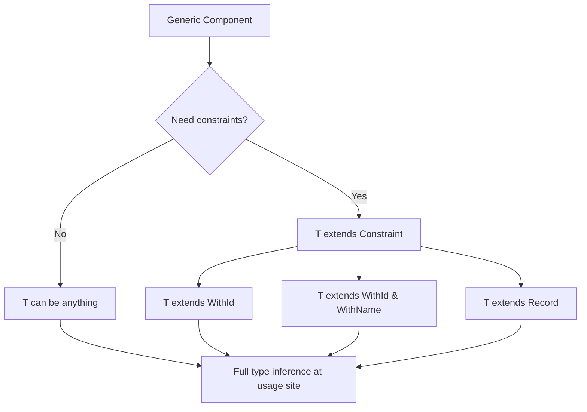

# How to Create a Generic React Component in TypeScript

There's a moment in every React TypeScript project where you build a component  a list, a dropdown, a data table  and realize you've typed the items as `any[]` because the component needs to work with different data shapes. You know it's wrong. You tell yourself you'll fix it later. You won't.

Generic components solve this problem properly. Instead of `any`, you parameterize the component over a type variable, and TypeScript infers the concrete type from usage. Your `<List>` component works with users, products, and todos  all with full type safety, autocompletion, and compile-time error checking.

I've been building generic React components in TypeScript for a while now, and the pattern has become one of my favorite parts of the type system. It's one of those things that feels complex until it clicks, and then it's just... obvious. Let me show you how it works.

## The Generic List Component

Let's start with the most common case: a generic list that renders items of any type.

```typescript
interface ListProps<T> {
  items: T[];
  renderItem: (item: T) => React.ReactNode;
  keyExtractor: (item: T) => string | number;
}

function List<T>({ items, renderItem, keyExtractor }: ListProps<T>) {
  return (
    <ul>
      {items.map((item) => (
        <li key={keyExtractor(item)}>{renderItem(item)}</li>
      ))}
    </ul>
  );
}
```

That `<T>` after the function name is the generic parameter. When you use this component, TypeScript infers `T` from whatever you pass as `items`:

```typescript
interface User {
  id: number;
  name: string;
  email: string;
}

const users: User[] = [
  { id: 1, name: "Alice", email: "alice@example.com" },
  { id: 2, name: "Bob", email: "bob@example.com" },
];

// T is inferred as User  no need to specify it
<List
  items={users}
  renderItem={(user) => <span>{user.name}</span>}  // user is User
  keyExtractor={(user) => user.id}                   // user is User
/>
```

The `renderItem` and `keyExtractor` callbacks are automatically typed. If you try to access `user.nonexistent`, TypeScript catches it. If you change the `User` interface, the callbacks stay in sync. That's the whole point.

And the component doesn't know or care what `T` is. It works with `User`, `Product`, `string`, whatever. The type flows through.

## A Generic Select/Dropdown Component

Dropdowns are another great use case for generic React components in TypeScript. You want the `onChange` callback to give you the actual item  not just a string value from the DOM event.

```typescript
interface SelectProps<T> {
  options: T[];
  value: T | null;
  onChange: (item: T) => void;
  getLabel: (item: T) => string;
  getValue: (item: T) => string;
  placeholder?: string;
}

function Select<T>({
  options,
  value,
  onChange,
  getLabel,
  getValue,
  placeholder = "Select an option",
}: SelectProps<T>) {
  const handleChange = (e: React.ChangeEvent<HTMLSelectElement>) => {
    const selected = options.find(
      (opt) => getValue(opt) === e.target.value
    );
    if (selected) {
      onChange(selected); // T, not string
    }
  };

  return (
    <select
      value={value ? getValue(value) : ""}
      onChange={handleChange}
    >
      <option value="" disabled>
        {placeholder}
      </option>
      {options.map((option) => (
        <option key={getValue(option)} value={getValue(option)}>
          {getLabel(option)}
        </option>
      ))}
    </select>
  );
}
```

Usage looks clean:

```typescript
interface Country {
  code: string;
  name: string;
  population: number;
}

const countries: Country[] = [
  { code: "US", name: "United States", population: 331000000 },
  { code: "GB", name: "United Kingdom", population: 67000000 },
];

<Select
  options={countries}
  value={selectedCountry}
  onChange={(country) => {
    // country is Country, not string
    console.log(country.population); // fully typed
    setSelectedCountry(country);
  }}
  getLabel={(c) => c.name}
  getValue={(c) => c.code}
/>
```

The `onChange` gives you a `Country`, not a raw string. No parsing, no finding the object by ID. The generic makes this possible.

## A Generic Table Component

Tables are where generic components really shine  and where the typing gets a bit more interesting. You need to define columns that reference specific keys of the data type:

```typescript
interface Column<T> {
  key: keyof T;
  header: string;
  render?: (value: T[keyof T], item: T) => React.ReactNode;
  width?: string;
}

interface TableProps<T> {
  data: T[];
  columns: Column<T>[];
  keyExtractor: (item: T) => string | number;
  onRowClick?: (item: T) => void;
}

function Table<T>({
  data,
  columns,
  keyExtractor,
  onRowClick,
}: TableProps<T>) {
  return (
    <table>
      <thead>
        <tr>
          {columns.map((col) => (
            <th key={String(col.key)} style={{ width: col.width }}>
              {col.header}
            </th>
          ))}
        </tr>
      </thead>
      <tbody>
        {data.map((item) => (
          <tr
            key={keyExtractor(item)}
            onClick={() => onRowClick?.(item)}
            style={{ cursor: onRowClick ? "pointer" : "default" }}
          >
            {columns.map((col) => (
              <td key={String(col.key)}>
                {col.render
                  ? col.render(item[col.key], item)
                  : String(item[col.key])}
              </td>
            ))}
          </tr>
        ))}
      </tbody>
    </table>
  );
}
```

The `keyof T` constraint on `Column.key` means TypeScript will only let you reference actual properties of the data type:

```typescript
interface Product {
  id: string;
  name: string;
  price: number;
  inStock: boolean;
}

const columns: Column<Product>[] = [
  { key: "name", header: "Product Name" },
  {
    key: "price",
    header: "Price",
    render: (value) => `$${(value as number).toFixed(2)}`,
  },
  {
    key: "inStock",
    header: "Availability",
    render: (_, product) => (
      <span>{product.inStock ? "In Stock" : "Out of Stock"}</span>
    ),
  },
  // { key: "nonexistent", header: "Nope" }  // ❌ Error!
];

<Table
  data={products}
  columns={columns}
  keyExtractor={(p) => p.id}
  onRowClick={(product) => navigate(`/products/${product.id}`)}
/>
```

> **Tip:** The `render` function's `value` parameter is typed as `T[keyof T]`, which is a union of all value types. For more precise typing per column, you'd need mapped types or a builder pattern  but for most real-world tables, this is good enough.

## Constraining Generics

Sometimes "any type" is too broad. You want the generic to have certain properties. That's where constraints come in:

```typescript
// T must have an 'id' property
interface WithId {
  id: string | number;
}

function SortableList<T extends WithId>({
  items,
  renderItem,
}: {
  items: T[];
  renderItem: (item: T) => React.ReactNode;
}) {
  const sorted = [...items].sort((a, b) => {
    // We can safely access .id because T extends WithId
    if (a.id < b.id) return -1;
    if (a.id > b.id) return 1;
    return 0;
  });

  return (
    <ul>
      {sorted.map((item) => (
        <li key={item.id}>{renderItem(item)}</li>
      ))}
    </ul>
  );
}
```

The `extends` keyword tells TypeScript: "T can be anything, as long as it has at least an `id` that's a `string` or `number`." If you try to use it with a type that doesn't have `id`, you'll get an error at the call site  not somewhere deep inside the component.

You can stack constraints too:

```typescript
interface WithId {
  id: string | number;
}

interface WithName {
  name: string;
}

// T must have both id AND name
function SearchableList<T extends WithId & WithName>({
  items,
  query,
}: {
  items: T[];
  query: string;
}) {
  const filtered = items.filter((item) =>
    item.name.toLowerCase().includes(query.toLowerCase())
  );

  return (
    <ul>
      {filtered.map((item) => (
        <li key={item.id}>{item.name}</li>
      ))}
    </ul>
  );
}
```



## Forwarding Generics Through Props

Here's a pattern that comes up when you're composing generic components: passing the generic type from a parent to a child.

```typescript
interface PaginatedListProps<T> {
  items: T[];
  renderItem: (item: T) => React.ReactNode;
  keyExtractor: (item: T) => string | number;
  pageSize: number;
}

function PaginatedList<T>({
  items,
  renderItem,
  keyExtractor,
  pageSize,
}: PaginatedListProps<T>) {
  const [page, setPage] = useState(0);
  const pageItems = items.slice(page * pageSize, (page + 1) * pageSize);
  const totalPages = Math.ceil(items.length / pageSize);

  return (
    <div>
      {/* T flows through to List */}
      <List
        items={pageItems}
        renderItem={renderItem}
        keyExtractor={keyExtractor}
      />
      <div>
        <button
          disabled={page === 0}
          onClick={() => setPage((p) => p - 1)}
        >
          Previous
        </button>
        <span>
          Page {page + 1} of {totalPages}
        </span>
        <button
          disabled={page >= totalPages - 1}
          onClick={() => setPage((p) => p + 1)}
        >
          Next
        </button>
      </div>
    </div>
  );
}
```

The generic `T` on `PaginatedList` naturally flows down to `List` because the props have the same type. TypeScript handles this inference chain automatically  you don't need to explicitly pass `<T>` to the child component.

| Pattern | Complexity | Best For |
|---------|-----------|----------|
| Simple generic `<T>` | Low | Lists, basic wrappers |
| Generic with `keyof T` | Medium | Tables, form builders |
| Constrained generic `<T extends X>` | Medium | Components requiring specific properties |
| Forwarded generics | Low | Composed/wrapper components |
| Generic with type assertion (forwardRef) | High | Generic components that also need refs |

## The React.FC Gotcha

One thing that catches people: `React.FC` doesn't support generics. You can't write:

```typescript
// ❌ This doesn't work
const List: React.FC<ListProps<T>> = ({ items }) => { ... }
```

Generic components must use function declarations or expressions:

```typescript
// ✅ Function declaration
function List<T>(props: ListProps<T>) { ... }

// ✅ Arrow function (note the trailing comma for TSX)
const List = <T,>(props: ListProps<T>) => { ... }
```

That trailing comma after `<T,>` in the arrow function version is a TSX thing  without it, the parser thinks `<T>` is a JSX element. The comma disambiguates. It looks weird, but it works. For more on this `React.FC` versus function declarations topic, check out [our comparison guide](/blog/react-fc-vs-function-declaration).

If you're converting existing JavaScript components to TypeScript and need to add generics, [SnipShift's JS to TypeScript converter](https://snipshift.dev/js-to-ts) can analyze your component's usage patterns and suggest where generics would add value. It's particularly helpful for those data-driven components where the item type should clearly be a parameter.

## When Generics Are Overkill

Not every component needs to be generic. I've seen teams over-engineer this  making a `Button<T>` generic when it takes a fixed set of props. Before reaching for generics, ask:

1. Does this component render a collection of items whose type varies per usage? → **Generic.**
2. Does this component wrap or compose other components, passing data through? → **Probably generic.**
3. Does this component have a fixed set of props that don't change? → **Not generic.**

A `<Modal>` doesn't need a generic. A `<DataGrid>` probably does. A `<Tabs>` component might  depends on whether the tab values are typed.

Generics are a tool for flexibility. Use them where types genuinely vary, and keep things simple where they don't. If you're also building [higher-order components](/blog/type-higher-order-component-typescript), the same generic patterns apply  but the syntax gets a bit more involved. And for typing state inside these components, the [useReducer with discriminated unions](/blog/type-usereducer-typescript) pattern pairs beautifully with generic components.

Build the simple version first. Add generics when you find yourself duplicating a component for different types. That's the pragmatic approach.
