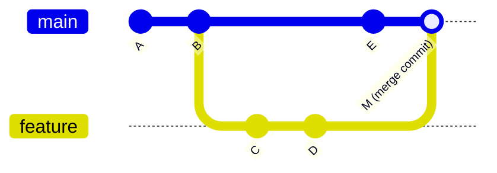
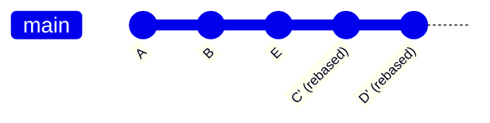
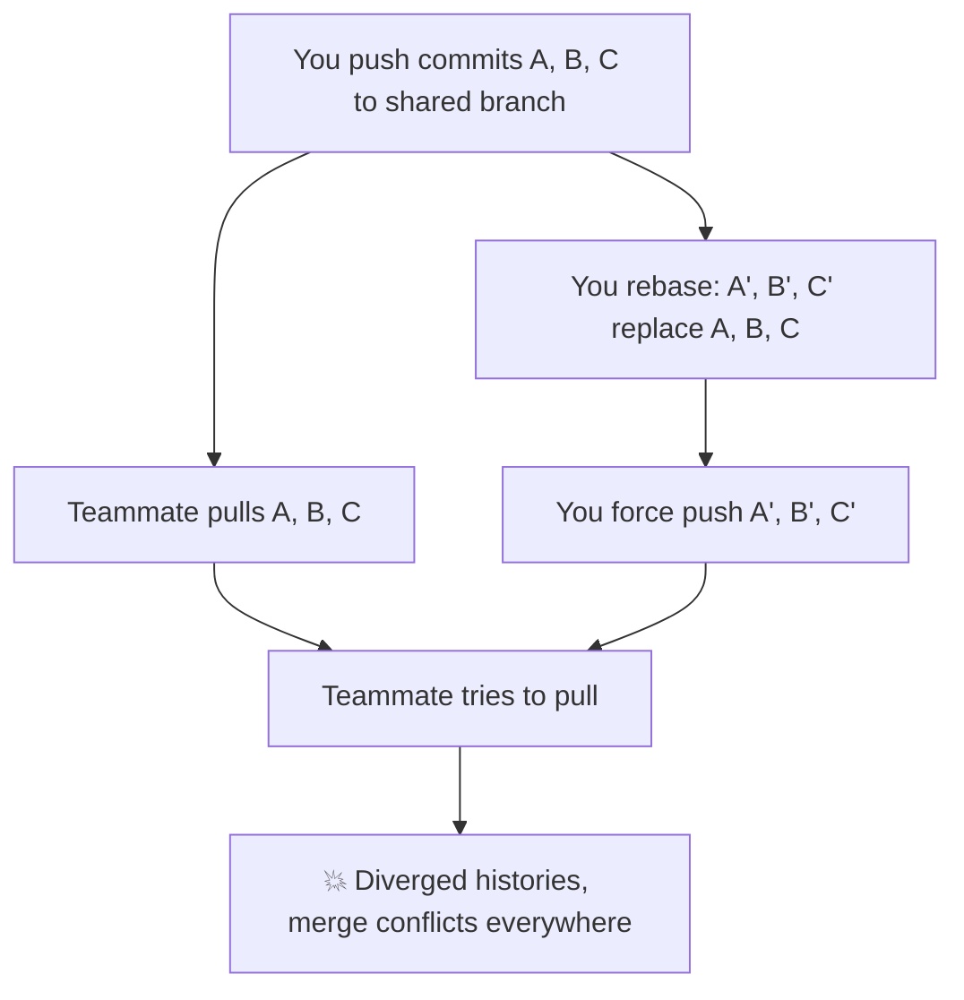

# Git Rebase vs Merge: When to Use Which (With Visual Diagrams)

I remember the first time someone told me to "rebase onto main before merging." I nodded, opened my terminal, and immediately Googled "git rebase what does it actually do." No shame in that  **git rebase vs merge** is one of those topics where most developers have a vague understanding but aren't fully confident in the details.

And honestly, the confusion is justified. Both commands integrate changes from one branch into another. Both get you to the same end result  your code has the updates. But they do it in fundamentally different ways, and picking the wrong one at the wrong time can make your team's Git history look like a bowl of spaghetti.

Let me clear this up once and for all.

## What Git Merge Actually Does

When you merge, Git takes two branch tips and combines them into a new "merge commit." Your branch history stays intact  every commit you made on your feature branch is preserved exactly as-is.

```bash
git checkout main
git merge feature-branch
```

Here's what the commit history looks like after a merge:



See that merge commit `M`? That's the key. It has two parents  one from `main` and one from `feature`. It's a record that says "at this point, these two branches were combined."

### Pros of Merge
- **Non-destructive.** No existing commits are changed. What happened, happened.
- **Complete history.** You can always trace back exactly when a feature branch was integrated.
- **Safe for shared branches.** Nobody's commits get rewritten.

### Cons of Merge
- **Cluttered history.** On active teams, merge commits pile up fast. Your `git log` becomes a web of interleaving branches that's hard to read linearly.
- **Noise.** The merge commit itself carries no meaningful code change  it's just a join point.

## What Git Rebase Actually Does

Rebasing takes a different approach entirely. Instead of creating a merge commit, it replays your feature branch commits *on top of* the target branch. It's like lifting your commits off the old base, and setting them down on the new one.

```bash
git checkout feature-branch
git rebase main
```

Here's the visual:



Notice `C'` and `D'` have primes (apostrophes). That's because they're not the original commits  they're new commits with the same changes but different hashes. The originals (`C` and `D`) still exist in the reflog, but they're no longer part of any branch.

The result is a perfectly linear history. It looks like you wrote your feature commits *after* the latest changes on `main`, even though that's not what actually happened.

### Pros of Rebase
- **Clean, linear history.** `git log --oneline` reads like a story instead of a spider web.
- **No merge commits.** Less noise, easier to bisect and review.
- **Easier to understand.** New team members can read the log and follow the progression naturally.

### Cons of Rebase
- **Rewrites history.** Those new commit hashes mean the branch's history has changed. If anyone else is working on the same branch, this causes problems.
- **Conflict resolution can be repetitive.** If rebasing multiple commits, you might resolve the same conflict for each one. (Though `git rerere` can help here.)
- **Riskier.** If something goes wrong mid-rebase, it can feel confusing to recover  especially for Git beginners.

## Side-by-Side Comparison

| Aspect | Merge | Rebase |
|--------|-------|--------|
| History | Non-linear (branching) | Linear (flat) |
| Creates merge commit | Yes | No |
| Rewrites commit hashes | No | Yes |
| Safe for shared branches | Yes | No (unless you know what you're doing) |
| Conflict resolution | Once (at merge point) | Per commit being replayed |
| `git bisect` friendly | Somewhat | Very |
| Preserves exact branch timeline | Yes | No |

Neither approach is "better." They solve different problems.

## Interactive Rebase: Where It Gets Really Powerful

Basic rebase is useful, but **interactive rebase** is where the real magic happens. It lets you edit, reorder, squash, and drop commits before they land on the target branch.

```bash
git rebase -i HEAD~4
```

This opens your editor with something like:

```
pick abc1234 Add user model
pick def5678 Fix typo in user model
pick ghi9012 Add user controller
pick jkl3456 Add user routes
```

You can change `pick` to other commands:

| Command | What It Does |
|---------|-------------|
| `pick` | Keep the commit as-is |
| `reword` | Keep changes, edit the message |
| `squash` | Combine with previous commit, edit message |
| `fixup` | Combine with previous commit, discard message |
| `edit` | Pause rebase to amend the commit |
| `drop` | Remove the commit entirely |

### Squashing: The Most Common Use Case

Let's say you made five commits on your feature branch, but three of them are "fix lint," "oops forgot file," and "actually fix the thing." Before merging to main, you want to squash those into a single clean commit.

```
pick abc1234 Add user authentication
squash def5678 Fix lint errors
squash ghi9012 Add missing test file
squash jkl3456 Fix failing test
pick mno7890 Add auth middleware
```

After saving, Git combines the squashed commits into one and lets you write a new combined message. The result: your PR history goes from five messy commits to two clean, meaningful ones.

I do this on basically every feature branch before merging. It keeps `main` clean and makes `git log` actually readable. And honestly, nobody needs to see my "fix typo" commits in the permanent record.

> **Tip:** Many teams configure their GitHub/GitLab merge settings to "Squash and Merge" by default. This gives you squashing without needing to do interactive rebase manually. But knowing how to do it yourself is still valuable  especially when you want more control over which commits get combined.

## The Golden Rule of Rebasing

Here it is, the one rule you absolutely must follow:

**Never rebase commits that have been pushed to a shared branch.**

If you rebase a branch that other people have based their work on, their copies of those commits will have different hashes than yours. When they try to push or pull, Git will see conflicting histories and everything falls apart. People lose work. Trust is broken. Slack channels get heated.



The golden rule is simple: rebase your **own local work** before pushing. Once it's been shared, use merge or revert  never rewrite.

## My Recommended Workflow

After working on teams of varying sizes, here's the workflow I've settled on. It's not the only valid approach, but it balances cleanliness with safety:

**1. Work on a feature branch.** Commit as often as you want  messy is fine.

```bash
git checkout -b feature/user-auth
# ... make commits freely ...
```

**2. Before opening a PR, rebase onto main.** This ensures your branch is up to date and your commits sit cleanly on top.

```bash
git fetch origin
git rebase origin/main
```

**3. Optionally squash your commits.** Clean up the history if there's noise.

```bash
git rebase -i origin/main
```

**4. Push your feature branch.**

```bash
git push origin feature/user-auth
# If you've rebased and already pushed before, you may need:
git push --force-with-lease origin feature/user-auth
```

**5. Merge the PR on GitHub/GitLab.** Use a regular merge commit or squash-merge depending on your team's convention.

This approach gives you the best of both worlds: clean feature branches (thanks to rebase) and a preserved merge history on `main` (thanks to merge commits from PRs).

> **Tip:** Use `--force-with-lease` instead of `--force` when pushing a rebased branch. It refuses to overwrite the remote if someone else has pushed to the same branch since your last fetch. It's a safety net that costs you nothing.

## What About `git pull --rebase`?

By default, `git pull` does a fetch + merge. But you can make it fetch + rebase instead:

```bash
git pull --rebase origin main
```

Or set it globally so every `git pull` rebases by default:

```bash
git config --global pull.rebase true
```

I personally have this set globally. It means pulling changes from `main` doesn't create a merge commit in my feature branch  it just replays my local commits on top of whatever's new. Keeps things linear without thinking about it.

## Team Conventions: Pick One and Stick With It

Here's my honest take: the specific strategy matters less than consistency. I've seen teams that exclusively merge, teams that exclusively rebase, and teams that do a hybrid approach. All of them work fine  as long as everyone follows the same rules.

Common team policies:

- **"Always squash-merge PRs"**  Simple, keeps `main` clean, one commit per feature.
- **"Rebase feature branches, merge to main"**  My preferred approach. Clean features, preserved merge points.
- **"Just merge everything"**  Works fine for small teams. Gets messy at scale, but who cares if you can read the log.
- **"Rebase everything, no merge commits ever"**  Pristine linear history. Requires discipline and Git confidence from the whole team.

Whatever you pick, document it. Put it in your `CONTRIBUTING.md`. And if you want to enforce commit message standards as part of this workflow, check out our guide on [conventional commit message formats](/blog/git-commit-message-conventions)  it pairs really well with squash-merge strategies.

If you need to undo something during a rebase gone wrong, we've got you covered: [how to undo a git commit in every scenario](/blog/undo-git-commit-every-scenario).

And for those config file conversions that inevitably come up when you're setting up CI pipelines and Git workflows  like converting a JSON config to YAML  [SnipShift's JSON to YAML converter](https://snipshift.dev/json-to-yaml) handles it instantly without needing to fuss with syntax.

The **git rebase vs merge** debate doesn't have a single right answer. But now you know what each one does, when to use it, and  most importantly  when not to. The golden rule keeps you safe: rebase local work, merge shared work. Everything else is team preference.
