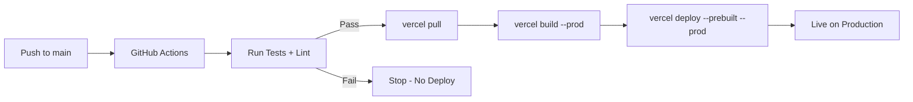

# GitHub Actions: Deploy to Vercel on Push (Without Git Integration)

Vercel's built-in Git integration is convenient  connect your repo, push to main, deployment happens automatically. So why would you want to replace it with **GitHub Actions to deploy to Vercel** manually?

I started down this path after hitting a few walls. We needed to run our test suite before deploying (Vercel's Git integration deploys first, asks questions never). We had a monorepo where Vercel was rebuilding on every push even when the relevant app hadn't changed. And we wanted deployment notifications in Slack that included test results  something Vercel's webhooks don't give you out of the box.

If any of that resonates, here's how to set it up. It takes about 15 minutes and gives you full control over when and how your code gets deployed.

## Why Skip Vercel's Built-in Git Integration?

Before we write any YAML, let's be clear about the tradeoffs:

| Feature | Vercel Git Integration | Manual GitHub Actions |
|---------|----------------------|----------------------|
| Setup time | 2 minutes | 15 minutes |
| Pre-deploy checks | None (deploys immediately) | Full CI pipeline |
| Monorepo support | Basic (path filters) | Full control |
| Deploy notifications | Vercel webhooks | GitHub + any integration |
| Rollback control | Vercel dashboard | Git revert + push |
| Build caching | Vercel's cache | Vercel's cache (same) |
| Preview deploys | Automatic on PR | Configurable per PR |

The manual approach isn't better in every way. It's more work upfront. But if you need CI checks before deploy, monorepo filtering, or custom notifications, it's the way to go.

## Step 1: Get Your Vercel Tokens

You'll need three things from Vercel. Go to your Vercel dashboard:

1. **Vercel Token:** Account Settings → Tokens → Create. Give it a name like "GitHub Actions" and set the scope to your team.
2. **Org ID:** Settings → General → copy your "Team ID" (or "Org ID" for personal accounts)
3. **Project ID:** Select your project → Settings → General → copy the "Project ID"

Now add these as secrets in your GitHub repo: **Settings → Secrets and variables → Actions → New repository secret**

```
VERCEL_TOKEN=your-vercel-token
VERCEL_ORG_ID=your-org-id
VERCEL_PROJECT_ID=your-project-id
```

> **Warning:** Make sure to disable Vercel's built-in Git integration for this project. Otherwise you'll get double deploys  one from Vercel's Git hook and one from your Action. Go to your Vercel project → Settings → Git → Disconnect.

## Step 2: The Production Deploy Workflow

Create `.github/workflows/deploy-production.yml`:

```yaml
name: Deploy to Production

on:
  push:
    branches:
      - main

env:
  VERCEL_ORG_ID: ${{ secrets.VERCEL_ORG_ID }}
  VERCEL_PROJECT_ID: ${{ secrets.VERCEL_PROJECT_ID }}

jobs:
  test:
    runs-on: ubuntu-latest
    steps:
      - uses: actions/checkout@v4

      - uses: actions/setup-node@v4
        with:
          node-version: 20
          cache: "npm"

      - run: npm ci
      - run: npm run lint
      - run: npm test

  deploy:
    needs: test
    runs-on: ubuntu-latest
    steps:
      - uses: actions/checkout@v4

      - name: Install Vercel CLI
        run: npm install -g vercel@latest

      - name: Pull Vercel Environment
        run: vercel pull --yes --environment=production --token=${{ secrets.VERCEL_TOKEN }}

      - name: Build
        run: vercel build --prod --token=${{ secrets.VERCEL_TOKEN }}

      - name: Deploy
        id: deploy
        run: |
          URL=$(vercel deploy --prebuilt --prod --token=${{ secrets.VERCEL_TOKEN }})
          echo "url=$URL" >> "$GITHUB_OUTPUT"

      - name: Output Deploy URL
        run: echo "Deployed to ${{ steps.deploy.outputs.url }}"
```



Let me break down what's happening:

- **`test` job runs first.** Lint, tests, whatever you need. If it fails, the deploy job never runs.
- **`vercel pull`** downloads your project's settings and environment variables from Vercel. This ensures the build uses the same config as a normal Vercel build.
- **`vercel build --prod`** builds the project locally in the Action runner. The `--prod` flag uses production environment variables.
- **`vercel deploy --prebuilt --prod`** uploads the pre-built artifacts to Vercel. Because you already built locally, Vercel just serves the files  no remote build needed.

The `--prebuilt` flag is the key. Without it, Vercel would ignore your local build and rebuild from source on their servers. With it, it uses exactly what you built in CI.

## Step 3: Preview Deploys on Pull Requests

For PRs, you want preview deployments  unique URLs for each PR so reviewers can test changes before merging.

Create `.github/workflows/deploy-preview.yml`:

```yaml
name: Deploy Preview

on:
  pull_request:
    types: [opened, synchronize, reopened]

env:
  VERCEL_ORG_ID: ${{ secrets.VERCEL_ORG_ID }}
  VERCEL_PROJECT_ID: ${{ secrets.VERCEL_PROJECT_ID }}

jobs:
  test:
    runs-on: ubuntu-latest
    steps:
      - uses: actions/checkout@v4

      - uses: actions/setup-node@v4
        with:
          node-version: 20
          cache: "npm"

      - run: npm ci
      - run: npm run lint
      - run: npm test

  deploy-preview:
    needs: test
    runs-on: ubuntu-latest
    permissions:
      pull-requests: write
    steps:
      - uses: actions/checkout@v4

      - name: Install Vercel CLI
        run: npm install -g vercel@latest

      - name: Pull Vercel Environment
        run: vercel pull --yes --environment=preview --token=${{ secrets.VERCEL_TOKEN }}

      - name: Build
        run: vercel build --token=${{ secrets.VERCEL_TOKEN }}

      - name: Deploy Preview
        id: deploy
        run: |
          URL=$(vercel deploy --prebuilt --token=${{ secrets.VERCEL_TOKEN }})
          echo "url=$URL" >> "$GITHUB_OUTPUT"

      - name: Comment on PR
        uses: actions/github-script@v7
        with:
          script: |
            github.rest.issues.createComment({
              issue_number: context.issue.number,
              owner: context.repo.owner,
              repo: context.repo.repo,
              body: `Preview deployed to: ${{ steps.deploy.outputs.url }}`
            })
```

Notice the differences from the production workflow:

- No `--prod` flag on `build` or `deploy`  this creates a preview deployment
- `--environment=preview` when pulling config  uses preview env vars instead of production
- The PR comment step posts the preview URL directly on the PR for easy access

## Step 4: Environment Variables as Secrets

You'll probably have environment variables that your app needs at build time. There are two approaches:

**Option A: Let Vercel manage them.** The `vercel pull` command downloads all env vars configured in your Vercel dashboard. This is the simplest approach and means you manage env vars in one place.

**Option B: Pass them from GitHub Secrets.** If you want GitHub to be the single source of truth:

```yaml
- name: Build
  run: vercel build --prod --token=${{ secrets.VERCEL_TOKEN }}
  env:
    NEXT_PUBLIC_API_URL: ${{ secrets.NEXT_PUBLIC_API_URL }}
    DATABASE_URL: ${{ secrets.DATABASE_URL }}
```

I'd go with Option A for most cases. Managing env vars in two places is a recipe for drift  you update it in Vercel but forget GitHub, or vice versa. If you're working with a lot of environment variables across different stages, [SnipShift's Env to Types converter](https://snipshift.dev/env-to-types) can generate TypeScript types from your `.env` file to help catch missing variables before they cause runtime errors.

## Monorepo Optimization

If you're in a monorepo and only want to deploy when your specific app changes, add path filters:

```yaml
on:
  push:
    branches:
      - main
    paths:
      - "apps/web/**"
      - "packages/shared/**"
      - "package-lock.json"
```

This way, changes to `apps/api/` or `apps/docs/` won't trigger a rebuild of your web app. Vercel's built-in Git integration has basic path ignore rules, but they're less flexible than what GitHub Actions gives you.

## Adding Slack Notifications

One of the main reasons I switched to manual deploys  custom notifications:

```yaml
- name: Notify Slack
  if: always()
  uses: 8398a7/action-slack@v3
  with:
    status: ${{ job.status }}
    text: |
      Deploy ${{ job.status }} for ${{ github.repository }}
      Commit: ${{ github.event.head_commit.message }}
      URL: ${{ steps.deploy.outputs.url }}
  env:
    SLACK_WEBHOOK_URL: ${{ secrets.SLACK_WEBHOOK_URL }}
```

The `if: always()` ensures the notification fires whether the deploy succeeds or fails. You get the commit message, deploy URL, and status  all in one Slack message.

## Common Pitfalls

A few things that have tripped me or my teams up with **GitHub Actions deploying to Vercel**:

1. **Double deploys.** You forgot to disconnect Vercel's Git integration. Now you get two deployments on every push. Disconnect it in Vercel's project settings.
2. **Missing `--prebuilt` flag.** Without it, Vercel ignores your local build and rebuilds from source. Your tests pass in CI, but Vercel's build might fail for a different reason. Always use `--prebuilt`.
3. **Preview env vars in production.** Using `--environment=preview` when you meant `--environment=production` in the `vercel pull` step. Double-check this.
4. **VERCEL_TOKEN scope.** If your token is scoped to a different team than your project, deployments will fail with a cryptic auth error. Make sure the token matches the team/org.

Once it's set up, this workflow is rock solid. Tests run before every deploy, preview URLs appear on PRs automatically, and you have a full audit trail in GitHub Actions. It's a small investment that pays for itself the first time your tests catch a broken deploy.

For more on GitHub Actions fundamentals, check out our [first GitHub Actions workflow guide](/blog/github-actions-first-workflow). And if you're deploying a self-hosted setup instead, our [Coolify deployment guide](/blog/self-host-nextjs-docker-coolify) covers the Docker alternative.
