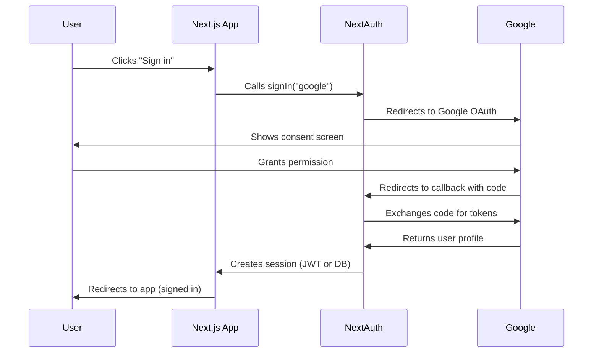

# How to Add Google OAuth to Next.js with NextAuth.js (Step-by-Step)

I've wired up Google OAuth in probably a dozen Next.js apps at this point. The first time took me an embarrassing amount of hours  bouncing between Google Cloud Console docs, NextAuth's API reference, and random Stack Overflow threads that were all slightly outdated. But the process has gotten a lot smoother since NextAuth v4 stabilized, and honestly, once you know where the pieces go, the whole thing takes maybe 20 minutes.

Here's the exact setup I use every time. No fluff, just working code from zero to a protected route with typed sessions.

## Setting Up Google Cloud Console

Before you write any code, you need OAuth credentials from Google. This part trips people up more than the actual code, so I'll be specific.

1. Go to [console.cloud.google.com](https://console.cloud.google.com) and create a new project (or use an existing one)
2. Navigate to **APIs & Services → Credentials**
3. Click **Create Credentials → OAuth client ID**
4. If prompted, configure the **OAuth consent screen** first  choose "External" unless this is an internal company app
5. For application type, select **Web application**
6. Add your authorized redirect URI:

```
http://localhost:3000/api/auth/callback/google
```

> **Tip:** For production, you'll add your real domain here too  something like `https://yourapp.com/api/auth/callback/google`. You can have multiple redirect URIs on the same credential.

Once created, grab your **Client ID** and **Client Secret**. You'll need both in a second.

## Project Setup and Dependencies

If you don't already have a Next.js project, spin one up:

```bash
npx create-next-app@latest my-app --typescript --app
cd my-app
```

Install NextAuth:

```bash
npm install next-auth
```

That's it for dependencies. NextAuth bundles the Google provider  no extra packages needed.

Now create your `.env.local` file in the project root:

```bash
GOOGLE_CLIENT_ID=your-client-id-here.apps.googleusercontent.com
GOOGLE_CLIENT_SECRET=your-client-secret-here
NEXTAUTH_URL=http://localhost:3000
NEXTAUTH_SECRET=your-random-secret-here
```

Generate that `NEXTAUTH_SECRET` with:

```bash
openssl rand -base64 32
```

> **Warning:** Never commit `.env.local` to version control. If you're managing environment variables across multiple environments, our [guide on managing env files](/blog/manage-multiple-env-files) covers patterns that scale well.

## Configuring NextAuth with the Google Provider

Here's where the real setup happens. Create the NextAuth route handler:

```typescript
// app/api/auth/[...nextauth]/route.ts
import NextAuth from "next-auth";
import GoogleProvider from "next-auth/providers/google";

const handler = NextAuth({
  providers: [
    GoogleProvider({
      clientId: process.env.GOOGLE_CLIENT_ID!,
      clientSecret: process.env.GOOGLE_CLIENT_SECRET!,
    }),
  ],
  // We'll add more config here shortly
});

export { handler as GET, handler as POST };
```

That's the minimal working setup. Run `npm run dev`, hit `http://localhost:3000/api/auth/signin`, and you should see a "Sign in with Google" button. But we're not done  there's session typing and route protection to handle.

## Typing Your Session in TypeScript

This is the part that most tutorials skip, and it drives me slightly crazy. NextAuth's default session object gives you `name`, `email`, and `image`. But what if you need the user's ID or other fields? You need to extend the session type.

Create a types file:

```typescript
// types/next-auth.d.ts
import { DefaultSession } from "next-auth";

declare module "next-auth" {
  interface Session {
    user: {
      id: string;
    } & DefaultSession["user"];
  }
}
```

Then update your NextAuth config to pass the ID through callbacks:

```typescript
// app/api/auth/[...nextauth]/route.ts
import NextAuth from "next-auth";
import GoogleProvider from "next-auth/providers/google";

const handler = NextAuth({
  providers: [
    GoogleProvider({
      clientId: process.env.GOOGLE_CLIENT_ID!,
      clientSecret: process.env.GOOGLE_CLIENT_SECRET!,
    }),
  ],
  callbacks: {
    async session({ session, token }) {
      // Attach the user ID from the JWT token
      if (session.user) {
        session.user.id = token.sub!;
      }
      return session;
    },
  },
  pages: {
    signIn: "/auth/signin", // Optional: custom sign-in page
  },
});

export { handler as GET, handler as POST };
```

Now `session.user.id` is typed and available everywhere. No more `any` casts or `as` assertions scattered through your components.

If you're converting an existing JavaScript NextAuth setup to TypeScript, [SnipShift's JS to TypeScript converter](https://snipshift.dev/js-to-ts) can handle the type annotations and interface generation  it's particularly good at inferring the right types for config objects like this.

## The NextAuth Flow: How It All Connects

Here's what's actually happening under the hood when a user clicks "Sign in with Google":



Understanding this flow helps when things go wrong  and they will. The most common issue? Your redirect URI in Google Cloud Console doesn't exactly match what NextAuth sends. Even a trailing slash mismatch will break it.

## Handling Callbacks and Getting User Profile Data

Google sends back a bunch of profile data. By default, NextAuth grabs the basics, but you can access the full profile in the `signIn` callback:

```typescript
callbacks: {
  async signIn({ account, profile }) {
    if (account?.provider === "google") {
      // Only allow sign-in from specific domain
      return profile?.email_verified === true
        && profile?.email?.endsWith("@yourcompany.com");
    }
    return true;
  },
  async session({ session, token }) {
    if (session.user) {
      session.user.id = token.sub!;
    }
    return session;
  },
  async jwt({ token, account, profile }) {
    // Persist additional data on first sign-in
    if (account && profile) {
      token.accessToken = account.access_token;
      token.picture = profile.picture;
    }
    return token;
  },
},
```

That `signIn` callback is great for restricting access. I've used the domain check pattern on three different internal tools  it's simple and effective for company apps where you only want `@yourcompany.com` addresses.

## Protecting Routes with Middleware

Here's where most setups fall short. You need a way to protect pages so unauthenticated users get redirected. NextAuth's middleware makes this clean:

```typescript
// middleware.ts (project root)
export { default } from "next-auth/middleware";

export const config = {
  matcher: ["/dashboard/:path*", "/settings/:path*", "/api/protected/:path*"],
};
```

That's it. Any route matching those patterns now requires authentication. Unauthenticated users get bounced to the sign-in page automatically.

For more granular control inside server components:

```typescript
// app/dashboard/page.tsx
import { getServerSession } from "next-auth";
import { redirect } from "next/navigation";

export default async function DashboardPage() {
  const session = await getServerSession();

  if (!session) {
    redirect("/api/auth/signin");
  }

  return (
    <div>
      <h1>Welcome, {session.user?.name}</h1>
      <p>Email: {session.user?.email}</p>
      
    </div>
  );
}
```

And for client components, use the `useSession` hook:

```typescript
"use client";
import { useSession, signIn, signOut } from "next-auth/react";

export function AuthButton() {
  const { data: session, status } = useSession();

  if (status === "loading") {
    return <div>Loading...</div>;
  }

  if (session) {
    return (
      <div>
        <p>Signed in as {session.user?.email}</p>
        <button onClick={() => signOut()}>Sign out</button>
      </div>
    );
  }

  return <button onClick={() => signIn("google")}>Sign in with Google</button>;
}
```

> **Tip:** Don't forget to wrap your app with `SessionProvider` in your root layout. Without it, `useSession` won't work on the client side.

```typescript
// app/layout.tsx
import { SessionProvider } from "next-auth/react";

export default function RootLayout({
  children,
}: {
  children: React.ReactNode;
}) {
  return (
    <html lang="en">
      <body>
        <SessionProvider>{children}</SessionProvider>
      </body>
    </html>
  );
}
```

## Common Configuration Options at a Glance

Here's a quick reference for the NextAuth options you'll reach for most often:

| Option | Purpose | Default |
|--------|---------|---------|
| `session.strategy` | `"jwt"` or `"database"` | `"jwt"` |
| `session.maxAge` | Session expiry in seconds | `2592000` (30 days) |
| `pages.signIn` | Custom sign-in page path | Built-in page |
| `pages.error` | Custom error page path | Built-in page |
| `debug` | Enable debug logging | `false` |
| `secret` | Encryption secret | `NEXTAUTH_SECRET` env var |

## Gotchas I've Hit (So You Don't Have To)

A few things that have burned me over the years with this exact stack:

**Redirect URI mismatch**  Google is picky. `http://localhost:3000` and `http://localhost:3000/` are different. Copy the exact callback URL from NextAuth's docs: `/api/auth/callback/google`.

**Missing NEXTAUTH_SECRET in production**  NextAuth works fine without it in development but throws cryptic errors in production. Always set it.

**Session not updating after sign-in**  If you're using the App Router, make sure your `SessionProvider` wraps the entire app. I've seen setups where it was nested inside a sub-layout and only some pages had access to the session.

**Google Cloud Console propagation**  After creating credentials, sometimes it takes a few minutes for them to work. If you're getting instant errors, wait five minutes and try again before debugging.

If you're building a more complex auth system and want to compare approaches, our [comprehensive guide on Next.js authentication](/blog/nextjs-authentication-approaches) covers everything from JWT to database sessions to third-party providers.

## Wrapping Up

The Google OAuth + NextAuth.js combo is honestly one of the smoothest auth setups in the React ecosystem right now. The whole thing  Google Cloud Console, provider config, typed sessions, route protection  takes maybe 20 minutes once you've done it before. And because NextAuth handles token refresh and session management for you, there's very little ongoing maintenance.

The key things to remember: type your sessions from the start (don't let `any` creep in), use middleware for route protection instead of checking in every component, and always set `NEXTAUTH_SECRET` in production. Get those three right and you'll save yourself from the most common headaches.

For more on structuring your Next.js projects as they grow, check out our [Node.js project structure guide](/blog/node-js-project-structure) or browse the full set of [developer tools on SnipShift](https://snipshift.dev).
