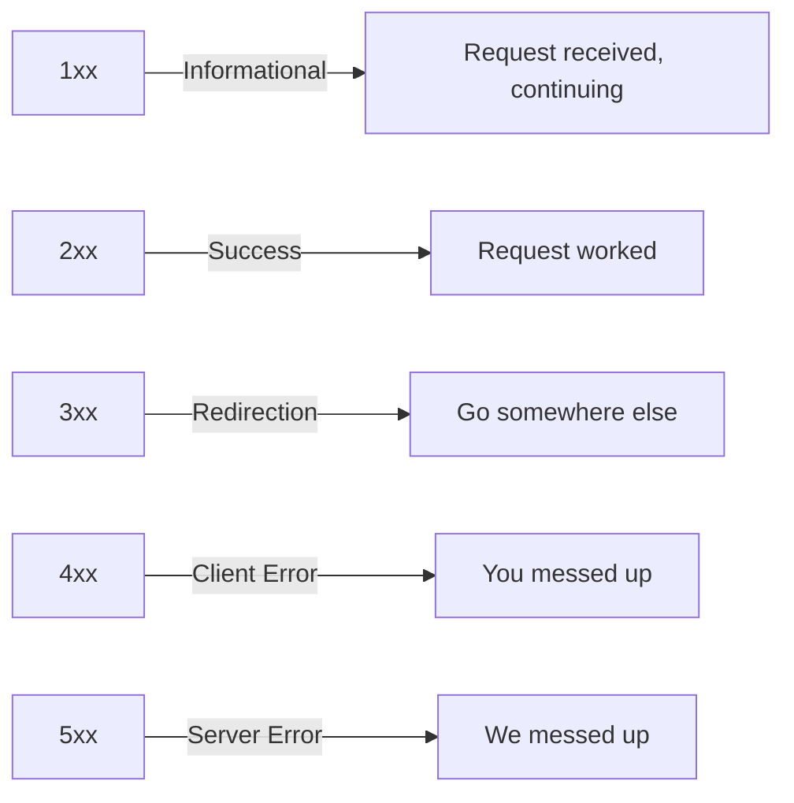

# What Are HTTP Status Codes? (The Ones You Actually Need to Know)

There are over 70 registered HTTP status codes. You'll use maybe 15 of them. The rest are obscure, deprecated, or so niche that you'll never encounter them outside of a trivia night (418 I'm a Teapot, anyone?).

I've been building web applications for a while now, and I can count on one hand the number of times I've needed to know what a 305 Use Proxy means. But a 429? I see that one weekly. A 502? That's a Saturday night at any company running microservices.

So instead of walking you through all 70+ codes, here are the HTTP status codes explained  the ones you'll actually encounter, what they mean in practice, and what you should do when you see them. Consider this your field guide, not an encyclopedia.

## How Status Codes Work

Every HTTP response comes with a three-digit status code. The first digit tells you the category:



That's genuinely all you need to remember. 2xx = good, 4xx = your fault, 5xx = their fault. Everything else is nuance.

## The 2xx Success Codes

### 200 OK

The most common status code on the internet. "Your request worked, here's the data."

**When you see it:** Successful GET requests, successful PUT/PATCH updates that return the updated resource.

```javascript
// GET /api/users/123
// Response: 200 OK
{
  "id": 123,
  "name": "Alex Chen",
  "email": "alex@example.com"
}
```

Nothing fancy here. But a surprising number of APIs return 200 for everything  including errors  and put the actual status in the response body. If you've ever worked with an API that returns `200 OK` with `{ "success": false, "error": "Not found" }` in the body... yeah. That's not great API design, but it's depressingly common. You still need to check the response body, not just the status code.

### 201 Created

"Your request worked, and we created a new resource."

**When you see it:** Successful POST requests that create something  a new user, a new order, a new record.

```javascript
// POST /api/users
// Body: { "name": "Alex", "email": "alex@example.com" }
// Response: 201 Created
{
  "id": 456,
  "name": "Alex",
  "email": "alex@example.com",
  "createdAt": "2026-03-25T10:30:00Z"
}
```

A well-designed API returns 201 (not 200) after creating a resource, and includes a `Location` header pointing to the new resource:

```
HTTP/1.1 201 Created
Location: /api/users/456
```

If you're building an API and using 200 for creation responses, switch to 201. It's a small thing, but it tells the client exactly what happened without needing to inspect the body.

### 204 No Content

"Your request worked, but there's nothing to send back."

**When you see it:** Successful DELETE requests, or PUT/PATCH updates where the server doesn't return the updated resource.

```javascript
// DELETE /api/users/123
// Response: 204 No Content
// (empty body)
```

A gotcha here: if you try to call `response.json()` on a 204 response, it'll throw an error because there's no body to parse. Always check the status first:

```javascript
const response = await fetch('/api/users/123', { method: 'DELETE' });
if (response.status === 204) {
  // Success  don't try to parse the body
  console.log('Deleted successfully');
}
```

## The 3xx Redirection Codes

### 301 Moved Permanently

"This resource has a new permanent URL. Update your bookmarks."

**When you see it:** Domain migrations, URL restructuring, old API versions being retired.

```
HTTP/1.1 301 Moved Permanently
Location: https://api.v2.example.com/users
```

Browsers and most HTTP clients will automatically follow 301 redirects. But here's something worth knowing: `fetch` follows redirects by default, and the final response looks like it came from the original URL. If you need to detect a redirect, check `response.redirected`:

```javascript
const response = await fetch('/old-api/users');
if (response.redirected) {
  console.log('Was redirected to:', response.url);
}
```

### 302 Found (Temporary Redirect)

"This resource is temporarily at a different URL, but keep using the original."

**When you see it:** OAuth2 callback redirects, temporary maintenance redirects, A/B testing.

The key difference from 301: clients should NOT update their saved URL. They should keep hitting the original endpoint, which might redirect differently next time.

## The 4xx Client Error Codes

This is where things get interesting  and where most debugging happens. 4xx means *the client* did something wrong.

### 400 Bad Request

"Your request doesn't make sense."

**When you see it:** Malformed JSON, missing required fields, invalid data types, failed validation.

```javascript
// POST /api/users
// Body: { "email": "not-an-email" }
// Response: 400 Bad Request
{
  "error": {
    "code": "VALIDATION_ERROR",
    "message": "Validation failed",
    "details": [
      { "field": "name", "issue": "is required" },
      { "field": "email", "issue": "must be a valid email" }
    ]
  }
}
```

A good 400 response tells you *exactly* what's wrong. A bad one just says "Bad Request" and leaves you guessing. If you're building an API, return field-level validation errors  your frontend developers will thank you.

### 401 Unauthorized

"I don't know who you are."

**When you see it:** Missing auth token, expired token, invalid credentials.

This is probably the most confusingly named status code. "Unauthorized" actually means *unauthenticated*  the server doesn't know your identity. It doesn't mean you don't have permission (that's 403).

```javascript
// GET /api/me
// (no Authorization header)
// Response: 401 Unauthorized
{
  "error": {
    "code": "UNAUTHENTICATED",
    "message": "Valid authentication credentials are required"
  }
}
```

**What to do:** Redirect to login, or attempt a token refresh. Check out our guide on [API authentication headers](/blog/api-authentication-headers-guide) for the full token refresh pattern.

### 403 Forbidden

"I know who you are, but you can't do this."

**When you see it:** Trying to access admin-only endpoints as a regular user, trying to edit someone else's resource.

```javascript
// DELETE /api/users/456 (as a non-admin user)
// Response: 403 Forbidden
{
  "error": {
    "code": "INSUFFICIENT_PERMISSIONS",
    "message": "Admin role required to delete users"
  }
}
```

The difference between 401 and 403 trips up a lot of developers:

| Code | Meaning | Auth Status | Fix |
|---|---|---|---|
| 401 | "Who are you?" | Not authenticated | Log in / refresh token |
| 403 | "You can't do that" | Authenticated, but not authorized | Get proper permissions |

### 404 Not Found

"That resource doesn't exist."

**When you see it:** Wrong URL, deleted resource, typo in the endpoint.

```javascript
// GET /api/users/99999
// Response: 404 Not Found
{
  "error": {
    "code": "NOT_FOUND",
    "message": "User not found"
  }
}
```

One thing I've seen debate about: should you return 404 or 403 when a user tries to access a resource they're not allowed to see? Security best practice is to return 404  don't even confirm the resource exists. Returning 403 on `/api/users/123` tells an attacker that user 123 exists. Returning 404 reveals nothing.

### 409 Conflict

"Your request conflicts with the current state of the resource."

**When you see it:** Duplicate records, concurrent update conflicts, trying to create something that already exists.

```javascript
// POST /api/users
// Body: { "email": "alex@example.com" }
// Response: 409 Conflict
{
  "error": {
    "code": "DUPLICATE_ENTRY",
    "message": "A user with this email already exists"
  }
}
```

This one doesn't get used enough, in my opinion. A lot of APIs return 400 for conflicts, which is technically wrong. 400 means the request is malformed  409 means the request is valid but can't be applied given the current state. The distinction matters for client-side error handling.

### 422 Unprocessable Entity

"I understand your request, but the data doesn't make sense semantically."

**When you see it:** Valid JSON with values that violate business logic  ordering a negative quantity, setting an end date before a start date.

```javascript
// POST /api/orders
// Body: { "quantity": -5, "productId": 123 }
// Response: 422 Unprocessable Entity
{
  "error": {
    "code": "INVALID_DATA",
    "message": "Quantity must be a positive number"
  }
}
```

The line between 400 and 422 is blurry, and honestly, many APIs just use 400 for everything. Rails and Laravel tend to prefer 422 for validation errors. Both are acceptable  just be consistent.

### 429 Too Many Requests

"Slow down. You're hitting the API too fast."

**When you see it:** Exceeding rate limits. And if you're scraping or doing batch operations, you'll see this a LOT.

```javascript
// Response: 429 Too Many Requests
// Headers:
// Retry-After: 30
// X-RateLimit-Limit: 100
// X-RateLimit-Remaining: 0
// X-RateLimit-Reset: 1711360800
```

The `Retry-After` header tells you exactly how long to wait. Respect it. Hammering the API after getting a 429 is a great way to get your API key revoked.

For a deep look at rate limiting algorithms and how to handle 429s properly in your code, check out our post on [API rate limiting explained](/blog/api-rate-limiting-explained).

> **Tip:** When you're testing rate-limited APIs and need to quickly convert a cURL command to proper fetch or axios code with retry logic, [SnipShift's cURL to Code converter](https://snipshift.dev/curl-to-code) can translate those cURL snippets into clean, typed JavaScript  saving you from manual header wrangling.

## The 5xx Server Error Codes

These mean the server messed up, not you. But you still need to handle them gracefully.

### 500 Internal Server Error

"Something broke on the server."

**When you see it:** Unhandled exceptions, null pointer errors, database connection failures  the generic "everything went wrong" response.

```javascript
// GET /api/reports/generate
// Response: 500 Internal Server Error
{
  "error": {
    "code": "INTERNAL_ERROR",
    "message": "An unexpected error occurred"
  }
}
```

As a client, there's not much you can do except retry (with backoff) and show the user a friendly error message. As a server developer, if your API is returning 500s, check your error tracking tool  Sentry, Datadog, whatever you're using.

### 502 Bad Gateway

"I'm a proxy/load balancer, and the backend server gave me garbage."

**When you see it:** The backend server crashed, returned an invalid response, or timed out. Very common in microservice architectures where an API gateway sits in front of multiple services.

If you've ever seen a plain white page that just says "502 Bad Gateway"  that's usually Nginx or CloudFlare telling you the app server behind it is dead.

### 503 Service Unavailable

"The server is temporarily unable to handle requests."

**When you see it:** Server is overloaded, undergoing maintenance, or doing a rolling deployment.

```
HTTP/1.1 503 Service Unavailable
Retry-After: 120
```

Unlike 500 (which suggests a bug), 503 is often intentional and temporary. It usually comes with a `Retry-After` header. This is the status code your app should return during planned maintenance windows.

## Complete Quick Reference

Here's the full table of status codes you'll actually encounter, in one place:

| Code | Name | Category | What It Means | Your Action |
|---|---|---|---|---|
| 200 | OK | Success | Request succeeded | Use the data |
| 201 | Created | Success | Resource created | Use the new resource |
| 204 | No Content | Success | Success, empty body | Don't parse body |
| 301 | Moved Permanently | Redirect | URL changed forever | Update saved URLs |
| 302 | Found | Redirect | Temporary redirect | Keep using original URL |
| 400 | Bad Request | Client Error | Malformed request | Fix the request |
| 401 | Unauthorized | Client Error | Not authenticated | Log in / refresh token |
| 403 | Forbidden | Client Error | Not authorized | Check permissions |
| 404 | Not Found | Client Error | Resource doesn't exist | Check URL / handle missing |
| 409 | Conflict | Client Error | State conflict | Resolve conflict |
| 422 | Unprocessable | Client Error | Invalid data | Fix the data |
| 429 | Too Many Requests | Client Error | Rate limited | Wait and retry |
| 500 | Internal Error | Server Error | Server bug | Retry with backoff |
| 502 | Bad Gateway | Server Error | Backend is down | Retry with backoff |
| 503 | Service Unavailable | Server Error | Temporarily down | Retry after delay |

## Handling Status Codes in Your Code

Here's a practical pattern for handling these in a JavaScript fetch wrapper:

```typescript
async function handleResponse<T>(response: Response): Promise<T> {
  // Success cases
  if (response.status === 204) {
    return undefined as T; // No body to parse
  }

  if (response.ok) {
    return response.json() as Promise<T>;
  }

  // Error cases  parse the error body
  const errorBody = await response.json().catch(() => ({
    error: { message: response.statusText }
  }));

  // Handle specific status codes
  switch (response.status) {
    case 401:
      // Could trigger a token refresh here
      throw new AuthError('Session expired');
    case 429:
      const retryAfter = response.headers.get('Retry-After');
      throw new RateLimitError(Number(retryAfter) || 60);
    default:
      throw new ApiError(response.status, errorBody);
  }
}
```

For a complete error handling setup including retry logic and user-friendly error messages, check out our guide on [how to handle API errors gracefully in JavaScript](/blog/handle-api-errors-javascript).

The thing about HTTP status codes is that they're simple in isolation but powerful in combination with good error handling. A well-built API client that correctly interprets status codes, retries transient failures, and shows appropriate user messages  that's the difference between an app that "works" and an app that feels solid.

If you're building APIs and want to generate typed response handlers from your spec, [SnipShift's OpenAPI to TypeScript converter](https://snipshift.dev/openapi-to-typescript) can generate TypeScript types for all your response shapes  including error responses  so your frontend knows exactly what to expect for every status code. And for more API fundamentals, our guide on [REST API naming conventions](/blog/rest-api-naming-conventions) covers the structural side of designing APIs that developers love. Explore all our tools at [SnipShift](https://snipshift.dev).
