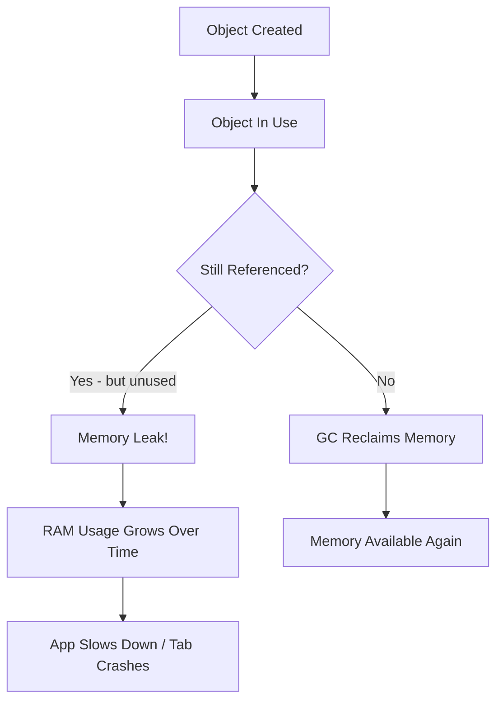

# What Is a Memory Leak in JavaScript? (How to Find and Fix It)

Your app starts fine. Snappy, responsive, everything looks great. Then after 20 minutes of use, the tab is eating 1.2 GB of RAM and the UI feels like it's running through molasses. Sound familiar?

A **javascript memory leak** is one of those bugs that doesn't announce itself. There's no red error in the console, no stack trace pointing you to line 47. The app just slowly gets worse  and by the time a user complains, you're staring at a heap snapshot wondering where 800 MB of detached DOM nodes came from.

I've chased these bugs more times than I'd like to admit. Once spent an entire Friday tracking down a leak that turned out to be a single `addEventListener` call without a corresponding cleanup. Three lines of code, four hours of debugging. So let me save you some time and walk through what actually causes these leaks, how to find them, and  most importantly  how to fix them.

## How JavaScript Garbage Collection Works (The Short Version)

Before we talk about leaks, you need a basic mental model of how JavaScript manages memory. The runtime  V8 in Chrome and Node, SpiderMonkey in Firefox  uses **garbage collection** (GC). The idea is simple: if no live code can reach an object anymore, that object is garbage and its memory gets reclaimed.

The GC uses a "mark and sweep" approach. It starts from root references (the global object, the current call stack, active closures) and walks through every reference it can find. Anything it can't reach? Freed.

A **javascript memory leak** happens when your code keeps a reference to something it doesn't actually need anymore. The GC sees that reference and thinks, "oh, someone still needs this." So the memory never gets freed. The object just sits there, accumulating, eating RAM like a process that forgot to stop.



The tricky part: JavaScript doesn't give you manual control over memory like C or Rust. You can't call `free()`. You just have to make sure you stop referencing things you don't need. And that's where it gets interesting.

## The Four Usual Suspects: What Causes JavaScript Memory Leaks

I've seen dozens of memory leaks across different codebases, and they almost always fall into one of four categories. Let's go through each.

### 1. Detached DOM Nodes

This is probably the most common leak I encounter  and the sneakiest. You remove an element from the DOM, but some JavaScript variable still holds a reference to it. The browser can't garbage-collect the node because your code still points to it.

```javascript
// BAD: This leaks memory
let savedNodes = [];

function createListItem(text) {
  const li = document.createElement('li');
  li.textContent = text;
  document.getElementById('myList').appendChild(li);

  // Storing a reference  even after removing from DOM,
  // the node stays in memory
  savedNodes.push(li);
}

function clearList() {
  document.getElementById('myList').innerHTML = '';
  // savedNodes still holds references to every single li!
  // Those "detached DOM nodes" are now leaked
}
```

The fix? Clear your references when you clear the DOM:

```javascript
// FIXED: Clean up references too
let savedNodes = [];

function createListItem(text) {
  const li = document.createElement('li');
  li.textContent = text;
  document.getElementById('myList').appendChild(li);
  savedNodes.push(li);
}

function clearList() {
  document.getElementById('myList').innerHTML = '';
  savedNodes.length = 0; // Release all references
}
```

**Detached DOM nodes** are especially nasty in single-page applications where you're constantly creating and destroying UI elements. Each route change could be leaking nodes if you're not careful.

> **Tip:** In Chrome DevTools, you can filter heap snapshots for "Detached" to find these. If you see hundreds of detached HTMLDivElements, you've got a leak.

### 2. Closures Holding References

Closures are one of JavaScript's best features. But they can accidentally keep objects alive way longer than you intended. When a function closes over a variable, that variable can't be garbage collected as long as the function exists.

```javascript
// BAD: Closure holds a reference to a huge object
function processData() {
  const hugeDataset = fetchGiantArray(); // 50MB array

  return function formatResult(index) {
    // This closure captures hugeDataset  ALL of it
    // Even though it only needs one element at a time
    return hugeDataset[index].name;
  };
}

const formatter = processData();
// hugeDataset is now stuck in memory forever,
// because formatter's closure references it
```

```javascript
// FIXED: Only capture what you need
function processData() {
  const hugeDataset = fetchGiantArray();

  // Extract just what we need before creating the closure
  const names = hugeDataset.map(item => item.name);
  // hugeDataset can now be GC'd after processData returns

  return function formatResult(index) {
    return names[index];
  };
}
```

I'll be honest  closure leaks are often the hardest to spot because the code looks perfectly reasonable. You have to think about *what's being captured* and *for how long*. A team I worked with had a closure inside a WebSocket handler that was holding onto an entire previous state tree. Took us two days to find it.

### 3. Forgotten Timers and Intervals

This one's embarrassing because it's so preventable. `setInterval` callbacks keep running  and keep their references alive  until you explicitly clear them. Forget to call `clearInterval`, and that callback runs forever.

```javascript
// BAD: Interval never gets cleaned up
function startPolling(url) {
  const data = { results: [] };

  setInterval(async () => {
    const response = await fetch(url);
    const newData = await response.json();
    data.results.push(...newData); // Array grows forever!
  }, 5000);
}

startPolling('/api/updates');
// No way to stop this. No reference to the interval ID.
// data.results grows indefinitely.
```

```javascript
// FIXED: Store the interval ID and provide cleanup
function startPolling(url) {
  const data = { results: [] };

  const intervalId = setInterval(async () => {
    const response = await fetch(url);
    const newData = await response.json();

    // Cap the array size to prevent unbounded growth
    data.results = [...data.results, ...newData].slice(-100);
  }, 5000);

  // Return a cleanup function
  return () => clearInterval(intervalId);
}

const stopPolling = startPolling('/api/updates');
// Later, when you're done:
stopPolling();
```

Same goes for `setTimeout` in recursive patterns and `requestAnimationFrame` loops. If you start it, you need a way to stop it.

### 4. Event Listeners Not Removed

Every time you call `addEventListener`, the browser creates a reference from the target element to your callback function. If that callback closes over other objects  which it almost always does  those objects stay alive too.

```javascript
// BAD: Listeners pile up and never get removed
function setupHandler() {
  const data = getSomeExpensiveData();

  window.addEventListener('resize', () => {
    // This closure holds 'data' alive
    recalculate(data);
  });
}

// Called every time a component mounts...
// Each call adds ANOTHER listener. None get removed.
```

> **Warning:** Adding event listeners without removing them is one of the fastest ways to create a javascript memory leak in SPAs. If your component mounts and unmounts repeatedly, each mount adds a new listener while old ones stick around.

The fix is simple enough  store a reference to the handler and remove it when you're done:

```javascript
// FIXED: Store reference, remove on cleanup
function setupHandler() {
  const data = getSomeExpensiveData();

  const handleResize = () => {
    recalculate(data);
  };

  window.addEventListener('resize', handleResize);

  // Return cleanup function
  return () => {
    window.removeEventListener('resize', handleResize);
  };
}

const cleanup = setupHandler();
// When component unmounts or is no longer needed:
cleanup();
```

You can also use `{ once: true }` as an option if you only need the listener to fire once. And `AbortController` is a newer pattern that works nicely for cleaning up multiple listeners at once  worth looking into if you're managing several.

## Finding Memory Leaks with Chrome DevTools Heap Snapshots

Alright, so you suspect a leak. How do you actually find it? Chrome DevTools has a **heap snapshot** tool that's incredibly powerful once you know how to use it. Here's my workflow.

### Step-by-Step: The Three Snapshot Technique

This is the technique I use every time, and it hasn't let me down yet:

1. **Open DevTools** → go to the **Memory** tab
2. **Take a baseline snapshot**  do this right after a fresh page load, before interacting with anything
3. **Perform the action** you suspect is leaking (navigate to a page and back, open and close a modal, etc.)
4. **Force a garbage collection** by clicking the trash can icon  this is important, otherwise you'll see objects that would've been collected soon anyway
5. **Take a second snapshot**
6. **Repeat the action** a few more times
7. **Force GC again**, then **take a third snapshot**

Now compare snapshot 3 to snapshot 1. If objects keep accumulating between snapshots  especially DOM nodes or specific constructor types  you've found your leak.

| What to Look For | What It Means |
|---|---|
| Growing "Detached HTMLDivElement" count | DOM nodes removed from page but still referenced |
| Increasing "(closure)" entries | Closures capturing and holding references |
| Large "(array)" that keeps growing | An array that's being pushed to without bounds |
| Objects with high "Retained Size" | Something holding onto a big chunk of memory |

In the comparison view, sort by "# New" to see which object types are being created but not freed. The **Retainers** panel at the bottom is your best friend  it shows you exactly *what* is keeping each object alive. Follow the retainer chain back to your code, and you'll find the leak.

> **Tip:** The "Allocation instrumentation on timeline" option in the Memory tab is also great. It shows you exactly *when* allocations happen, so you can correlate them with specific user actions. I find it more useful than raw snapshots when I'm not sure which action is causing the leak.

## React-Specific Memory Leaks: The useEffect Trap

If you're working in React  and let's be real, most of us are  there's a whole category of leaks that come from forgetting **useEffect cleanup**. React gives you a cleanup mechanism, but it's easy to skip it, especially when you're moving fast.

Here's the classic:

```javascript
// BAD: No cleanup in useEffect
function UserStatus({ userId }) {
  const [status, setStatus] = useState('offline');

  useEffect(() => {
    const ws = new WebSocket(`wss://api.example.com/status/${userId}`);

    ws.onmessage = (event) => {
      setStatus(event.data); // Updates state...
    };

    // No cleanup! WebSocket stays open when component unmounts.
    // Worse: setStatus gets called on an unmounted component.
  }, [userId]);

  return <span>{status}</span>;
}
```

Every time that component mounts with a new `userId`, it opens a new WebSocket. And when it unmounts? The old socket stays open, still calling `setStatus` on a component that no longer exists. That's a javascript memory leak *and* a "Can't perform a React state update on an unmounted component" warning all in one.

```javascript
// FIXED: Proper useEffect cleanup
function UserStatus({ userId }) {
  const [status, setStatus] = useState('offline');

  useEffect(() => {
    let isActive = true; // Guard flag
    const ws = new WebSocket(`wss://api.example.com/status/${userId}`);

    ws.onmessage = (event) => {
      if (isActive) {
        setStatus(event.data);
      }
    };

    // Cleanup: close WebSocket and prevent stale updates
    return () => {
      isActive = false;
      ws.close();
    };
  }, [userId]);

  return <span>{status}</span>;
}
```

That cleanup return function is critical. It runs when the component unmounts *or* when the dependency array changes. You need it for:

- WebSocket connections
- `setInterval` / `setTimeout`
- Event listeners on `window` or `document`
- Subscription-based APIs (RxJS observables, Firebase listeners, etc.)
- `AbortController` for in-flight fetch requests

If your `useEffect` sets up anything persistent, it needs a cleanup function. Full stop. And honestly, if you're working with a team where **useEffect cleanup** gets missed regularly, that might be a sign to look at stricter linting rules  `eslint-plugin-react-hooks` catches some of these, but not all.

If you're thinking about migrating your React codebase to TypeScript, stricter typing can actually help here. TypeScript won't catch a missing cleanup function directly, but typed return values and stricter interfaces make it harder to accidentally pass the wrong thing around  which reduces the surface area for bugs like these. [SnipShift's JS to TypeScript converter](https://devshift.dev/js-to-ts) can handle the mechanical conversion part so you can focus on the logic.

## A Quick Comparison: Memory Leak Types at a Glance

Here's a reference table I keep bookmarked. When I suspect a leak, I start with the most common cause and work down:

| Leak Type | How to Detect | Fix | Difficulty |
|---|---|---|---|
| Detached DOM nodes | Heap snapshot → filter "Detached" | Null out references when removing from DOM | Easy |
| Closure references | Heap snapshot → check "(closure)" retainers | Minimize captured scope, extract needed data | Medium |
| Forgotten timers | Search codebase for `setInterval` without `clearInterval` | Always store interval ID, clear on cleanup | Easy |
| Event listeners | DevTools → Elements → Event Listeners count | `removeEventListener` or `AbortController` | Easy |
| React useEffect | Audit effects for missing return functions | Add cleanup return to every effect with side effects | Medium |
| Global variable accumulation | Heap snapshot → check Window retainers | Use local scope, WeakRef, or WeakMap | Medium |

## Beyond the Basics: WeakRef and FinalizationRegistry

ES2021 gave us `WeakRef` and `FinalizationRegistry`, which are worth knowing about even if you don't use them daily. A `WeakRef` holds a reference to an object without preventing garbage collection. And `FinalizationRegistry` lets you register a callback for when an object gets collected.

These are niche tools  you probably don't need them for typical application code. But if you're building a caching layer, an observer system, or anything that holds references to objects it doesn't "own," they're genuinely useful. `WeakMap` and `WeakSet` are the more practical cousins that you should definitely use when you need to associate data with an object without preventing its collection.

If you've been debugging slow React apps more broadly  not just memory leaks  you might find our [debugging checklist for slow React apps](/blog/react-app-slow-debugging-checklist) useful too. Memory leaks are just one piece of the performance puzzle.

## The Debugging Flow I Actually Use

After tracking down maybe 30-40 memory leaks across different projects, I've settled into a pattern that works. Here's my actual process, not the textbook version:

1. **Reproduce the symptoms**  get the app into a state where memory usage is visibly climbing
2. **Take three heap snapshots** using the technique I described above
3. **Look at the diff**  what's growing between snapshots?
4. **Follow the retainer chain**  DevTools tells you exactly what's keeping each object alive
5. **Find the code path**  once you know which object type is leaking, search your codebase for where it's created
6. **Add the cleanup**  usually a `removeEventListener`, `clearInterval`, or useEffect return
7. **Verify**  take new snapshots to confirm the leak is gone

And if you're debugging Node.js backend memory leaks, the approach is similar but with different tooling. The `--inspect` flag with Chrome DevTools works, or you can use `process.memoryUsage()` to track trends. We wrote about [debugging Node.js beyond console.log](/blog/debug-nodejs-beyond-console-log) if that's the world you're dealing with.

> **Tip:** Before you start profiling, make sure you're testing in an incognito window with extensions disabled. Browser extensions can inject their own DOM nodes and event listeners, which muddies your heap snapshots significantly.

## Prevention Is Better Than Debugging

Honestly, the best approach to memory leaks is not letting them happen. A few habits that help:

- **Always write cleanup functions** for useEffect  even if you think you don't need one now. Requirements change.
- **Use `AbortController`** for fetch requests and event listeners. It's cleaner than tracking individual references.
- **Lint for it**  ESLint can catch missing cleanups in React hooks. Turn those rules on and treat them as errors, not warnings.
- **Monitor in production**  `performance.measureUserAgentSpecificMemory()` (available in cross-origin isolated pages) gives you memory usage data you can ship to your analytics.
- **Convert to TypeScript**  this won't prevent memory leaks directly, but stricter typing catches entire categories of bugs that can lead to leaks. Passing the wrong callback, forgetting to handle a nullable reference, accidentally shadowing a variable that holds a cleanup function. TypeScript catches all of these. If you haven't started migrating yet, check out our [guide to converting JavaScript to TypeScript](/blog/convert-javascript-to-typescript).

And if you've got a mixed codebase  some JS, some TS  tools at [SnipShift](https://devshift.dev) can help you convert files incrementally without having to set up a full migration pipeline.

## The Takeaway

A javascript memory leak is just an object the garbage collector can't reach because something still references it. That's it. The concept is simple  the debugging is where it gets tricky. But with the three-snapshot technique, a solid understanding of what causes leaks, and the discipline to write cleanup code every time, you'll catch most leaks before your users ever notice them.

Next time your app starts feeling sluggish after extended use, don't just restart and hope it goes away. Pop open that Memory tab, take some snapshots, and follow the retainer chain. The leak is usually simpler than you expect  and the fix is usually three lines of code you should've written in the first place.

What's the worst memory leak you've tracked down? I'd love to hear about it.
