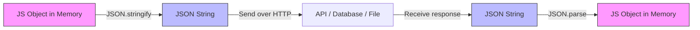

# JavaScript Object vs JSON: What's the Actual Difference?

Every few months, someone on my team gets bitten by this. They copy a JavaScript object from their code, paste it into a `.json` config file, and then spend twenty minutes wondering why their app won't start. Or they grab some JSON from an API response, try to use it as a JS object literal, and hit weird issues.

The javascript object vs json difference is one of those things that seems obvious once you know it  but trips up developers at every level. I've seen seniors make this mistake too. So let's clear it up for good.

## They Look Similar. They're Not the Same Thing.

Here's the source of all the confusion: JavaScript objects and JSON look almost identical at first glance. And that's by design  JSON was literally derived from JavaScript object syntax. Douglas Crockford based the JSON format on a subset of JavaScript, which is why the acronym stands for **JavaScript Object Notation**.

But "based on" and "identical to" are very different things. A JavaScript object is a **living data structure** in your running program. It exists in memory, it can hold functions, it can reference other objects, it can contain `undefined` values. JSON is a **text format**  a string of characters that follows strict rules. It's for storing and transmitting data, nothing more.

Think of it this way: a JavaScript object is like a person. JSON is like that person's passport photo. They're related, sure. But one is alive and dynamic, and the other is a frozen, simplified representation.

## The Syntax Differences That Actually Matter

This is where most of the bugs come from. Let me lay them all out.

### Quotes on Keys

In a JavaScript object, you can write keys without quotes:

```javascript
// Totally valid JavaScript object
const user = {
  name: "Alice",
  age: 30,
  isAdmin: true
};
```

In JSON, **every key must be in double quotes**. Not single quotes. Not backticks. Double quotes.

```json
{
  "name": "Alice",
  "age": 30,
  "isAdmin": true
}
```

This one catches people constantly. You paste a JS object into a JSON file, the keys aren't quoted, and your parser throws a fit. And even if you do quote them, using single quotes will fail  JSON is strict about double quotes for both keys and string values.

### Here's the Full Breakdown

| Feature | JavaScript Object | JSON |
|---|---|---|
| Key quotes | Optional (required only for special chars) | **Required**  must be double quotes |
| String quotes | Single, double, or backticks | **Double quotes only** |
| Trailing commas | Allowed | **Not allowed** |
| Functions as values | Yes (`greet: function() {}`) | **No** |
| `undefined` | Allowed | **No**  not a valid value |
| Comments | Yes (in source code) | **No** |
| `NaN` / `Infinity` | Allowed | **No** |
| Computed keys | Yes (`[myVar]: value`) | **No** |
| Methods | Yes (`greet() {}`) | **No** |
| Date objects | Yes | **No**  stored as strings |

That trailing comma one is sort of a silent killer. You're working in your JavaScript code, you've got trailing commas everywhere (as you should  they make git diffs cleaner), and then you paste that into a JSON file. Your linter might catch it. Your runtime definitely won't be forgiving about it.

## JSON.parse and JSON.stringify  The Bridge Between Worlds

These two methods are how you convert back and forth between JavaScript objects and JSON strings. They're probably the most-used JSON methods in all of JavaScript, and understanding what they do (and don't do) will save you a lot of headaches.

### JSON.stringify: Object to JSON String

`JSON.stringify()` takes a JavaScript object and turns it into a JSON-formatted string:

```javascript
const config = {
  database: "postgres",
  port: 5432,
  ssl: true,
  retry: undefined,       // will be DROPPED
  connect: function() {}, // will be DROPPED
  createdAt: new Date()   // will become a string
};

const jsonString = JSON.stringify(config, null, 2);
console.log(jsonString);
// Output:
// {
//   "database": "postgres",
//   "port": 5432,
//   "ssl": true,
//   "createdAt": "2026-03-25T00:00:00.000Z"
// }
```

Notice what happened there. The `retry` property with `undefined`? Gone. The `connect` function? Gone. The `Date` object? Converted to an ISO string. JSON can't represent these things, so `JSON.stringify` either drops them or converts them to something it can handle.

This is kind of a big deal if you're not expecting it. I once spent an embarrassing amount of time debugging why a config object was "losing" properties after being sent to an API. Turns out, half the values were `undefined` and got silently stripped during serialization.

> **Tip:** If you need to preserve `undefined` values or other non-JSON types, you'll need a custom replacer function or a different serialization format entirely.

### JSON.parse: JSON String to Object

Going the other direction, `JSON.parse()` takes a JSON string and creates a JavaScript object:

```javascript
const raw = '{"name": "Bob", "scores": [95, 87, 92], "active": true}';
const parsed = JSON.parse(raw);

console.log(parsed.name);      // "Bob"
console.log(parsed.scores[0]); // 95
console.log(typeof parsed);    // "object"
```

One thing that gets people: `JSON.parse` will throw a `SyntaxError` if you feed it invalid JSON. And by "invalid" I mean anything that doesn't follow JSON's strict rules  single-quoted strings, trailing commas, unquoted keys, comments. All of it will blow up.

```javascript
// All of these will throw SyntaxError:
JSON.parse("{ name: 'Bob' }");        // unquoted key + single quotes
JSON.parse('{ "name": "Bob", }');     // trailing comma
JSON.parse('{ "name": undefined }');  // undefined isn't valid JSON
```

## The Flow: How Data Moves Between Formats

Here's a quick visual of how JavaScript objects and JSON interact in a typical web application:



Your JavaScript objects live in memory while your code runs. When you need to send data somewhere  an API call, localStorage, a file on disk  you convert to JSON. When data comes back, you parse it back into an object. That's the cycle.

## Common Confusion Points (And How to Fix Them)

### "But I Can Write JSON in My JavaScript File..."

Yeah, because a valid JSON object is also a valid JavaScript object literal (mostly). The reverse isn't true. JavaScript objects are a superset  they allow more syntax than JSON does. So when people say they "write JSON in JavaScript," what they usually mean is they're writing a JavaScript object that happens to look like JSON.

### "Why Can't I Put Comments in JSON?"

Because JSON is a data format, not a programming language. Douglas Crockford intentionally left comments out of the spec. If you need comments in your config files, use `.jsonc` (JSON with Comments  supported by VS Code and TypeScript's `tsconfig.json`) or switch to YAML or TOML.

But honestly? I think the lack of comments in JSON is one of its biggest design flaws. Almost every project I've worked on ends up needing commented config files, and we end up using workarounds like `"_comment"` keys. It's not great.

### "Is JSON Faster Than a JavaScript Object?"

This question doesn't quite make sense, but I hear it a lot. JSON is a text format. A JavaScript object is a runtime data structure. You don't "use" them in the same situations. But if you're asking about `JSON.parse` vs object literals for large data  there are actually some edge cases where `JSON.parse` of a big string can be faster than a large object literal, because the JSON parser is highly optimized. V8 (Chrome's engine) can parse JSON faster than it can parse equivalent JavaScript in certain scenarios.

## When to Use Which

This part is sort of obvious once you understand the javascript object vs json difference, but let me spell it out:

**Use JavaScript objects when:**
- You're working with data in your running code
- You need methods, functions, or computed properties
- You need values like `undefined`, `Symbol`, or `RegExp`
- You're defining configuration within a `.js` or `.ts` file

**Use JSON when:**
- You're sending data over HTTP (API requests/responses)
- You're storing data in `localStorage` or `sessionStorage`
- You're writing config files (`.json`)
- You're exchanging data between different languages or systems
- You need a human-readable data interchange format

The key insight: JSON is for **transport and storage**. JavaScript objects are for **computation and logic**. They work together, but they serve different purposes.

## Converting Between Them (Without the Headaches)

If you've got a JavaScript object you need to quickly convert to valid JSON, [SnipShift's JS Object to JSON converter](https://snipshift.dev/js-object-to-json) handles all the edge cases  quotes, trailing commas, functions  so you don't have to clean it up by hand. It's especially useful when you're pulling object literals out of source code and need them in a `.json` file.

For the programmatic approach, here's a pattern I use all the time when I need to sanitize an object before serialization:

```javascript
function safeStringify(obj) {
  return JSON.stringify(obj, (key, value) => {
    // Convert functions to a descriptive string (or remove them)
    if (typeof value === 'function') return undefined;
    // Handle BigInt
    if (typeof value === 'bigint') return value.toString();
    // Handle RegExp
    if (value instanceof RegExp) return value.toString();
    return value;
  }, 2);
}

const messyObj = {
  id: 1,
  name: "test",
  handler: () => console.log("hi"),
  pattern: /^foo$/gi,
  bigNum: 9007199254740991n
};

console.log(safeStringify(messyObj));
// {
//   "id": 1,
//   "name": "test",
//   "pattern": "/^foo$/gi",
//   "bigNum": "9007199254740991"
// }
```

That `replacer` function (the second argument to `JSON.stringify`) is incredibly powerful and sort of underused. Most developers only ever pass `null` there. But it lets you intercept every value during serialization and decide what to do with it.

## Deep Cloning: A Bonus Trick

One popular use of the JSON round-trip is creating deep clones of objects:

```javascript
const original = { a: 1, b: { c: 2 } };
const clone = JSON.parse(JSON.stringify(original));

clone.b.c = 99;
console.log(original.b.c); // Still 2  it's a true deep copy
```

This works, but it has the same limitations we already talked about  it'll drop functions, `undefined`, and anything else that isn't valid JSON. For a proper deep clone, you're better off using `structuredClone()` (available in all modern browsers and Node 17+) or a library. We wrote more about this in our [deep clone guide](/blog/deep-clone-object-javascript) if you want the full picture.

And if you're working with JavaScript objects more broadly  especially around [destructuring patterns](/blog/javascript-destructuring-explained) or [converting JS codebases to TypeScript](/blog/convert-javascript-to-typescript)  understanding the javascript object vs json difference becomes even more important. These concepts are foundational.

## The Short Version

A JavaScript object is a live data structure in your code. JSON is a strict text format for moving data around. They look similar because JSON was born from JavaScript syntax, but JSON has much tighter rules: double-quoted keys, no functions, no `undefined`, no trailing commas, no comments.

Use `JSON.stringify()` to go from object to JSON string. Use `JSON.parse()` to go back. And when you're converting messy JS objects to clean JSON by hand, save yourself the trouble and use a [tool that does it for you](https://snipshift.dev/js-object-to-json).

That's it. Not complicated once you see it laid out  but the kind of thing that'll keep biting you if you don't. Check out more developer tools on [SnipShift](https://snipshift.dev) if you want to speed up your workflow.
