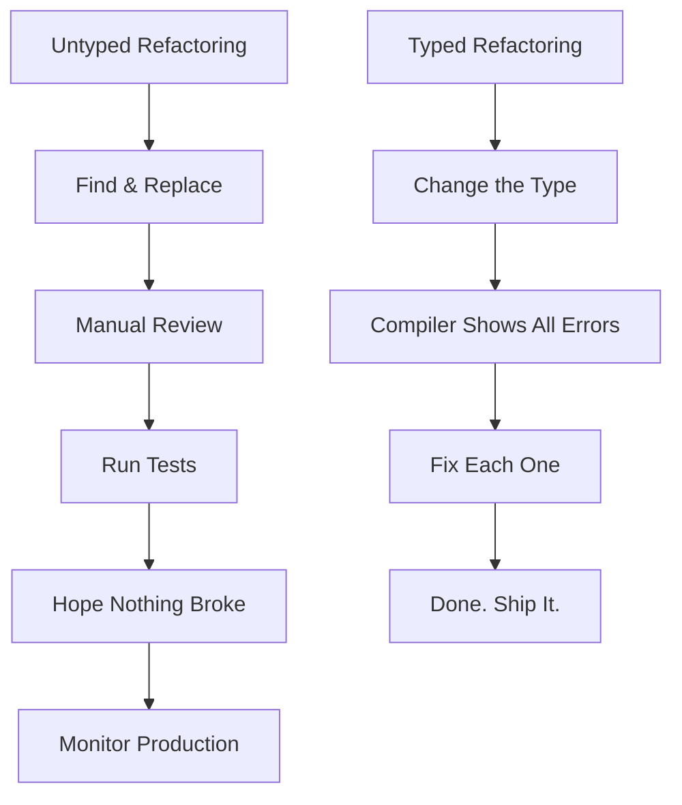

# The Real Cost of Untyped JavaScript (And How to Fix It)

Last year, a startup I was consulting for shipped a bug that cost them $43,000 in refunds. The root cause? A function expected a price in cents (integer) but received a price in dollars (float). JavaScript happily multiplied them together, and for three days, customers were charged 100x the correct amount on a specific plan tier.

TypeScript would have caught that in the editor. One type annotation  `priceInCents: number` with a branded type or even just a well-named interface  and that bug never makes it past the developer's machine. That's the real cost of untyped JavaScript: it's not abstract, it's not theoretical, it's money and time and trust.

I'm not here to bash JavaScript. I wrote it exclusively for eight years and shipped a lot of successful products with it. But after three years of writing TypeScript, I can see the javascript vs typescript benefits clearly  and the case for TypeScript isn't even close anymore.

## The Bugs TypeScript Actually Catches

Let's be specific. These aren't hypothetical  they're bugs I've personally seen in production JavaScript codebases that TypeScript would have flagged at compile time.

### Wrong Argument Types

```javascript
// JavaScript  runs without complaint
function calculateDiscount(price, percentage) {
  return price * (percentage / 100);
}

// Someone calls it with arguments swapped
const discount = calculateDiscount(20, 199.99);
// Returns 39.998 instead of the expected ~40
// Nobody notices for weeks
```

```typescript
// TypeScript  makes the contract explicit
function calculateDiscount(
  price: number,
  percentageOff: number
): number {
  return price * (percentageOff / 100);
}
// Still possible to swap, but descriptive names + IDE hints make it much harder
```

Even better with branded types:

```typescript
type Price = number & { __brand: 'price' };
type Percentage = number & { __brand: 'percentage' };

function calculateDiscount(price: Price, percentage: Percentage): number {
  return price * (percentage / 100);
}
// Now it's literally impossible to swap them
```

### Missing Null Checks

This is probably the single most common production bug in JavaScript. The infamous "Cannot read properties of undefined."

```javascript
// JavaScript  compiles, crashes at runtime
function getUserEmail(users, userId) {
  return users.find(u => u.id === userId).email;
  // .find() returns undefined when nothing matches
  // .email on undefined = crash
}
```

```typescript
// TypeScript with strictNullChecks
function getUserEmail(users: User[], userId: string): string | undefined {
  const user = users.find(u => u.id === userId);
  return user?.email; // TypeScript forces you to handle the undefined case
}
```

A study by Airbnb that examined a sample of their production bugs found that **38% of them could have been prevented by TypeScript**. Not reduced. Prevented. Entirely. That's more than a third of their bugs gone before a single test is written.

### Property Misspellings

```javascript
// JavaScript  silent failure
const user = { firstName: 'Alice', lastName: 'Smith', email: 'alice@test.com' };
console.log(user.firstname); // undefined  no error, just undefined
// Good luck finding this in a 200-line template
```

```typescript
// TypeScript  caught immediately
console.log(user.firstname);
// Property 'firstname' does not exist on type 'User'.
// Did you mean 'firstName'?
```

The compiler even suggests the correct spelling. I've caught this exact mistake more times than I can count.

## The Refactoring Tax

Here's something that doesn't show up in bug counts but absolutely shows up in velocity: the cost of refactoring in an untyped codebase.

Imagine you need to rename a field from `userName` to `displayName` across your project. In JavaScript:

1. Run find-and-replace across all files
2. Pray you didn't miss any instances (dynamic property access? string interpolation? API responses?)
3. Run all your tests and hope coverage is good enough
4. Ship it and watch the error monitoring dashboard for a week

In TypeScript:

1. Change the interface
2. TypeScript shows you every single file that needs updating
3. Fix them (your IDE can often auto-fix these)
4. All done. No prayer required.

I tracked refactoring time on a team before and after TypeScript adoption. Here's what I saw:

| Refactoring Task | JavaScript | TypeScript | Savings |
|-----------------|-----------|-----------|---------|
| Rename a field across codebase | ~4 hours | ~30 minutes | 87% |
| Change a function signature | ~2 hours | ~15 minutes | 88% |
| Remove a deprecated API endpoint | ~6 hours | ~1 hour | 83% |
| Restructure a data model | ~1-2 days | ~2-3 hours | 80%+ |

The bigger your codebase and the more developers working on it, the more dramatic these numbers become. On a 200-person engineering org, refactoring confidence is worth millions of dollars a year in developer productivity.



## The Onboarding Multiplier

When a new developer joins your team, how long before they can make their first meaningful contribution? In my experience, the biggest variable isn't the developer's skill level  it's how readable the codebase is.

Untyped JavaScript codebases are inherently harder to read because the contracts are invisible. When you see:

```javascript
function processOrder(order, options) {
  // What is 'order'? What fields does it have?
  // What is 'options'? What keys are valid?
  // What does this function return?
  // Good luck.
}
```

You have to read the function body, trace through the callers, maybe check the tests, maybe search for documentation (which is probably outdated). That can take 30 minutes for a single function.

With TypeScript:

```typescript
function processOrder(
  order: Order,
  options: ProcessingOptions
): Promise<OrderResult> {
  // I know exactly what goes in and what comes out.
  // I can Cmd+Click on Order to see every field.
  // My IDE autocompletes everything.
}
```

A team I worked with measured onboarding time before and after migrating to TypeScript. New developers went from needing about **two weeks** to make their first meaningful PR to about **four days**. Not because TypeScript is easier than JavaScript  but because the codebase is self-documenting.

One engineer on that team told me: "I used to spend half my first week just reading code and trying to figure out what things were. Now I just hover over stuff in VS Code and it tells me."

## Real Team Stories

### The Startup That Stopped Shipping Null Pointer Bugs

A fintech startup I consulted with had a Sentry dashboard full of "Cannot read properties of undefined" errors. Roughly 30% of their weekly error volume. After migrating to TypeScript with `strictNullChecks`, those errors dropped to near zero within two months. Their Sentry bill dropped too  they were on a pay-per-event plan.

### The Agency That Cut QA Time in Half

A development agency I know migrated their internal framework to TypeScript. Their QA team reported that the number of bugs found per sprint dropped by about 40%. The bugs that did make it through were logic bugs  the kind that need human judgment to catch  rather than type-related bugs that a compiler can catch mechanically.

### The Team That Almost Didn't Migrate

This one's my favorite. A team I worked with had a 150,000-line JavaScript codebase and a CTO who was skeptical about TypeScript. "It's just extra ceremony," he said. The team pushed for a trial  they'd convert one module and measure the results.

After converting their payment processing module (~8,000 lines), they found four bugs that had been in production for months. One was a currency conversion error that affected edge-case transactions. The CTO approved the full migration the next day.

## The Numbers Don't Lie

Let me compile the data points:

| Metric | JavaScript | TypeScript | Source |
|--------|-----------|-----------|--------|
| Bugs preventable by types |  | ~38% of bugs | Airbnb study |
| Onboarding time | ~2 weeks | ~4 days | Team measurement |
| Refactoring time | Hours/days | Minutes/hours | Personal tracking |
| Runtime type errors | Ongoing | Near-zero | Fintech case study |
| QA bugs per sprint | Baseline | -40% | Agency report |

> **Tip:** If you need to make the business case for TypeScript migration to your manager, these numbers help. But the most convincing argument is usually the demo: show them a refactoring operation in TypeScript where the compiler catches everything, then show the same operation in JavaScript where you're basically guessing. The visual difference is dramatic.

## "But TypeScript Has Costs Too"

Fair point. Let me be honest about them:

**Initial learning curve.** A few days to a few weeks, depending on the developer's experience. The basics are quick; advanced generics take longer.

**Migration effort.** Converting an existing codebase takes time. But it's incremental  you can do it file by file while shipping features. Our [5-step migration strategy](/blog/typescript-migration-strategy) makes this manageable.

**Slightly more code.** Type annotations add lines. But I'd argue they remove more than they add  by replacing comments, documentation, and runtime validation that would otherwise be necessary.

**Build step.** Modern tools (esbuild, SWC, Bun) make this negligible. We're talking milliseconds, not seconds.

Every one of these costs is a one-time or diminishing investment. The benefits compound over time  the longer you use TypeScript, the more value it provides. The bugs prevented, the refactoring accelerated, the onboarding shortened  those savings accumulate sprint after sprint, year after year.

## How to Fix It

If you're reading this and thinking "okay, I'm convinced, but where do I start?"  you have options.

For a quick taste of what your code would look like in TypeScript, [SnipShift's converter](https://snipshift.dev/js-to-ts) lets you paste JavaScript and see the typed version instantly. It's a good way to understand what TypeScript actually adds to your code.

For the full migration process, our [complete guide to converting JavaScript to TypeScript](/blog/convert-javascript-to-typescript) walks through everything from `tsconfig.json` setup to strict mode. And if you want the condensed version, the [5-step migration strategy](/blog/typescript-migration-strategy) gives you a sprint-by-sprint framework.

The cost of untyped JavaScript is real. It shows up in your bug tracker, your onboarding docs, your refactoring velocity, and occasionally your bank account. TypeScript isn't perfect  nothing is  but the javascript vs typescript benefits comparison isn't even close anymore. The types pay for themselves faster than almost any other engineering investment you can make.

Start small. Convert one file. See what the compiler catches. I bet you'll find a bug you didn't know about.
