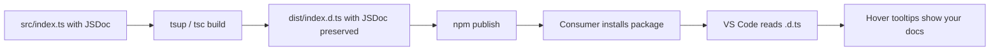

# How to Add JSDoc Comments to Your TypeScript Library (For Better IDE Support)

You know what separates a library that developers love from one they tolerate? It's not the API design (though that matters). It's not the bundle size. It's the moment they hover over your function in VS Code and see... nothing. No description, no parameter hints, no examples. Just the raw type signature.

Compare that to hovering over a function from a well-documented library like Zod or date-fns, where you get a paragraph of context, usage examples, and links to docs  all without leaving the editor. That's the DX difference JSDoc comments make.

I started taking JSDoc seriously about two years ago when I noticed that my own teammates were reading the source code of my internal libraries instead of using the hover tooltips. Because the tooltips were empty. The types were there, but the *intent* was missing.

Here's how to add JSDoc comments that actually flow through to your consumers' IDEs.

## The Basics: @param, @returns, and Descriptions

Every exported function in your library should have at minimum a description, `@param` tags, and a `@returns` tag:

```typescript
/**
 * Retries an async function with exponential backoff.
 * Useful for flaky network calls or rate-limited APIs.
 *
 * @param fn - The async function to retry
 * @param options - Configuration for retry behavior
 * @param options.maxRetries - Maximum number of retry attempts (default: 3)
 * @param options.baseDelay - Initial delay in ms before first retry (default: 1000)
 * @returns The resolved value from the first successful call
 * @throws {Error} When all retry attempts are exhausted
 */
export async function retry<T>(
  fn: () => Promise<T>,
  options?: { maxRetries?: number; baseDelay?: number }
): Promise<T> {
  // implementation
}
```

When a consumer hovers over `retry` in VS Code, they see all of this  the description, every parameter, the return type, and what errors to expect. That's infinitely more useful than just seeing `retry<T>(fn: () => Promise<T>, options?: { ... }): Promise<T>`.

A few style notes:
- The first line of the comment becomes the "summary" in IDE tooltips. Keep it short and descriptive.
- Use `@param name - description` format (with the dash). TypeScript/JSDoc both support it, and it reads cleanly.
- For object parameters, you can document nested properties with dot notation: `@param options.maxRetries`.

## @example: The Most Underrated Tag

Of all the JSDoc tags, `@example` is the one that has the highest impact on developer experience and the one most library authors skip. A type signature tells you *what* a function accepts. An example tells you *how* to use it.

```typescript
/**
 * Deeply freezes an object, making it and all nested objects immutable.
 *
 * @param obj - The object to freeze
 * @returns A deeply frozen copy of the object
 *
 * @example
 * ```typescript
 * const config = deepFreeze({
 *   api: { url: "https://example.com", timeout: 5000 },
 *   features: { darkMode: true }
 * });
 *
 * config.api.timeout = 3000; // TypeError: Cannot assign to read only property
 * ```
 */
export function deepFreeze<T extends object>(obj: T): Readonly<T> {
  // implementation
}
```

VS Code renders the `@example` block in the hover tooltip with syntax highlighting. It's like having inline documentation that follows the consumer everywhere without them having to open a browser.

> **Tip:** You can have multiple `@example` blocks on a single function. Use this for showing different usage patterns  the happy path, edge cases, and integration with other parts of your API.

## @deprecated and @see: Guiding Users Forward

When you deprecate a function, don't just remove it  mark it and tell users what to use instead:

```typescript
/**
 * @deprecated Use {@link formatDate} instead. Will be removed in v3.0.
 *
 * Formats a timestamp into a human-readable string.
 *
 * @param timestamp - Unix timestamp in milliseconds
 */
export function formatTimestamp(timestamp: number): string {
  // old implementation
}
```

The `@deprecated` tag does two things: VS Code shows the function with a ~~strikethrough~~ in autocomplete, and it adds a warning to the hover tooltip. The `{@link formatDate}` creates a clickable reference to the replacement function.

The `@see` tag is useful for pointing to related functions:

```typescript
/**
 * Parses a JSON string with type validation using a Zod schema.
 *
 * @see {@link safeParse} for a version that returns an error instead of throwing
 * @see {@link https://zod.dev | Zod documentation} for schema syntax
 */
export function parse<T>(input: string, schema: ZodSchema<T>): T {
  // implementation
}
```

## How Comments Flow Through .d.ts Files

This is the part that makes JSDoc comments particularly valuable for library authors. When you build your TypeScript package (whether with tsup, tsc, or any other tool), your JSDoc comments are **preserved in the generated `.d.ts` declaration files**.

```typescript
// Your source: src/index.ts
/**
 * Slugifies a string for use in URLs.
 *
 * @param input - The string to slugify
 * @returns A URL-safe slug
 *
 * @example
 * ```typescript
 * slugify("Hello World!") // "hello-world"
 * ```
 */
export function slugify(input: string): string {
  return input.toLowerCase().replace(/[^a-z0-9]+/g, "-").replace(/(^-|-$)/g, "");
}
```

After building, your `dist/index.d.ts` contains:

```typescript
/**
 * Slugifies a string for use in URLs.
 *
 * @param input - The string to slugify
 * @returns A URL-safe slug
 *
 * @example
 * ```typescript
 * slugify("Hello World!") // "hello-world"
 * ```
 */
declare function slugify(input: string): string;
```

The comments are right there in the declaration file. So when a consumer installs your package from npm and hovers over `slugify` in their editor, they see the full documentation  even though they never touched your source code. The `.d.ts` file carries the documentation to them.

This is why JSDoc matters for libraries specifically. For application code, comments are nice. For library code, comments are the primary documentation surface for most users.



## TSDoc vs JSDoc: Which Standard?

You might come across [TSDoc](https://tsdoc.org/)  a spec by Microsoft that standardizes JSDoc-style comments specifically for TypeScript. The syntax is almost identical to JSDoc, with a few additions:

| Tag | JSDoc | TSDoc |
|-----|-------|-------|
| `@param` | Supported | Supported |
| `@returns` | Supported | Supported |
| `@example` | Supported | Supported |
| `@deprecated` | Supported | Supported |
| `@link` | `{@link Foo}` | `{@link Foo}` |
| `@remarks` | Not standard | Supported  longer description section |
| `@defaultValue` | Not standard | Supported  documents default values |
| `@typeParam` | Not standard | Supported  documents generic type params |
| `@sealed` / `@virtual` / `@override` | Not standard | Supported  class member modifiers |

In practice? Use TSDoc syntax if you want to be precise, but don't stress about it. VS Code and TypeScript understand both. The core tags (`@param`, `@returns`, `@example`, `@deprecated`, `@see`) are the same in both standards and cover 95% of what you need.

If you're using [API Extractor](https://api-extractor.com/) to generate docs from your types, TSDoc is required since that's what it parses. Otherwise, standard JSDoc is fine.

## Documenting Generics

Generic type parameters deserve documentation too, especially when the generic isn't obvious:

```typescript
/**
 * Creates a type-safe event bus for component communication.
 *
 * @typeParam EventMap - A record mapping event names to their payload types.
 *   Each key is an event name, and the value is an array of argument types
 *   that listeners will receive.
 *
 * @example
 * ```typescript
 * type AppEvents = {
 *   "user:login": [userId: string, timestamp: number];
 *   "cart:update": [items: CartItem[]];
 * };
 *
 * const bus = createEventBus<AppEvents>();
 * bus.on("user:login", (userId, timestamp) => {
 *   // userId is string, timestamp is number  fully typed
 * });
 * ```
 */
export function createEventBus<
  EventMap extends Record<string, unknown[]>
>(): EventBus<EventMap> {
  // implementation
}
```

That `@typeParam` tag tells the consumer exactly what `EventMap` expects. Without it, they'd have to read the constraint (`Record<string, unknown[]>`) and figure it out themselves.

## What to Document (and What to Skip)

Not every function needs a novel. Here's my rule of thumb:

**Always document:**
- Every exported function, class, and type
- Generic type parameters that aren't self-evident
- Functions with non-obvious behavior or side effects
- Deprecated APIs (with migration path)

**Skip documentation for:**
- Internal/private functions (they're not in `.d.ts` anyway)
- Getters/setters with self-explanatory names
- Type aliases that are literally just renaming a primitive

Don't write `/** Gets the name */` on a function called `getName()`. That adds noise without value. But do write `/** Returns the display name, falling back to email if no name is set */`  that's actually useful.

> **Warning:** Over-documenting is almost as bad as under-documenting. If every single line has a JSDoc comment, the useful documentation drowns in noise. Focus on exported APIs and non-obvious behavior.

## A Real-World Pattern: Documenting Config Objects

Libraries often accept configuration objects. Document the type, not just the function:

```typescript
/**
 * Configuration for the HTTP client.
 */
export interface HttpClientConfig {
  /** Base URL prepended to all requests. Must include protocol. */
  baseUrl: string;

  /**
   * Request timeout in milliseconds.
   * @defaultValue 30000
   */
  timeout?: number;

  /**
   * Custom headers applied to every request.
   * Authorization headers should use the `auth` option instead.
   */
  headers?: Record<string, string>;

  /**
   * Retry configuration for failed requests.
   * Set to `false` to disable retries entirely.
   * @defaultValue `{ maxRetries: 3, backoff: "exponential" }`
   */
  retry?: RetryConfig | false;
}
```

When a consumer creates an object of type `HttpClientConfig`, they get property-level documentation in autocomplete. Each field has its own hover tooltip. That's a massive DX win.

If you're converting a JavaScript library to TypeScript and need to add types alongside your JSDoc comments, [SnipShift's JS to TypeScript converter](https://snipshift.dev/js-to-ts) can generate the initial type annotations  then you layer the JSDoc on top. The types tell the compiler what's valid; the comments tell the developer what's *intended*.

For the complete workflow of building and publishing the TypeScript library that these comments will ship with, check out our guide on [publishing a TypeScript npm package in 2026](/blog/publish-typescript-npm-package-2026). And if you're adding JSDoc `@example` blocks that show JSON structures, [SnipShift's JSON to TypeScript converter](https://snipshift.dev/json-to-typescript) is useful for double-checking that your example types match.

Good JSDoc won't make a bad API good. But it makes a good API feel effortless to use. And for a library, that feeling is what gets you adoption over the alternative that's "probably fine but I couldn't figure out the API."
