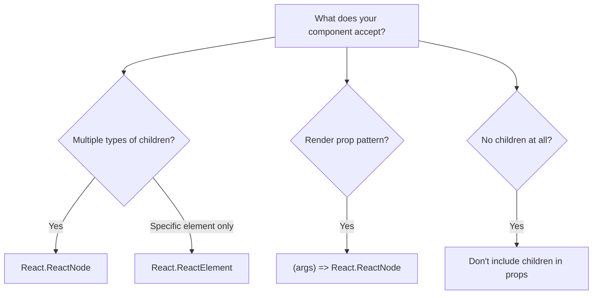

# JSX to TSX: How to Add TypeScript to Your React Components

If you've ever opened a React component file and seen thirty props being destructured with zero indication of what any of them actually are  yeah, same. That's the moment most developers realize it's time for the JSX to TSX conversion.

I've been writing React with TypeScript for about five years now, and honestly, I can't imagine going back. The autocomplete alone saves me probably 30 minutes a day. But the conversion process itself? It's got a few gotchas that catch people off guard, especially around event handlers and children typing.

Here's everything you need to know about converting your React components from JSX to TSX  with actual code examples, not just theory.

## The Basics: Renaming .jsx to .tsx

The mechanical part is simple. Rename your file from `.jsx` to `.tsx`. That's literally it for step one.

```bash
git mv src/components/UserCard.jsx src/components/UserCard.tsx
```

But here's where it gets interesting  the moment you rename that file, TypeScript starts analyzing it, and every untyped prop, every untyped event handler, and every implicit `any` becomes a compile error (assuming you have `noImplicitAny` enabled).

The fix isn't to add `any` everywhere. The fix is to add real types. And in React, that means props interfaces.

## Typing Props: The Foundation of Every TSX Component

In JSX, props are just... whatever you pass in. Nobody checks them at compile time (PropTypes only check at runtime, and honestly, half the teams I've worked with had incomplete PropTypes anyway).

In TSX, you define an interface for your props and TypeScript enforces it everywhere.

### Functional Components

```typescript
// Before: UserCard.jsx
function UserCard({ name, email, avatar, onEdit }) {
  return (
    <div className="user-card">
      
      <h3>{name}</h3>
      <p>{email}</p>
      <button onClick={() => onEdit(email)}>Edit</button>
    </div>
  );
}
```

```typescript
// After: UserCard.tsx
interface UserCardProps {
  name: string;
  email: string;
  avatar: string;
  onEdit: (email: string) => void;
}

function UserCard({ name, email, avatar, onEdit }: UserCardProps) {
  return (
    <div className="user-card">
      
      <h3>{name}</h3>
      <p>{email}</p>
      <button onClick={() => onEdit(email)}>Edit</button>
    </div>
  );
}
```

Notice I'm defining the props interface right above the component. Some people put all their interfaces in a separate `types.ts` file  that's fine for shared types, but for component-specific props, I prefer keeping them colocated. When you open the file, you see the contract right there.

### Optional Props and Defaults

In JavaScript, you'd handle optional props with default parameter values or `defaultProps`. In TypeScript, use the `?` modifier:

```typescript
interface NotificationBannerProps {
  message: string;
  type?: 'info' | 'warning' | 'error';  // optional
  dismissible?: boolean;                  // optional
  onDismiss?: () => void;                // optional callback
}

function NotificationBanner({
  message,
  type = 'info',
  dismissible = true,
  onDismiss,
}: NotificationBannerProps) {
  return (
    <div className={`banner banner--${type}`}>
      <p>{message}</p>
      {dismissible && onDismiss && (
        <button onClick={onDismiss}>Dismiss</button>
      )}
    </div>
  );
}
```

Default values work exactly like they do in JavaScript  destructure with `= defaultValue`. TypeScript infers that `type` is `'info' | 'warning' | 'error'` even inside the function body, even though it's optional in the props interface. Pretty smart.

> **Tip:** Don't use `React.FC` (or `React.FunctionComponent`). It used to add implicit `children` typing that caused confusion, and the React team themselves have moved away from recommending it. Just type your props directly as I'm showing here.

## Typing Event Handlers

This is where most people get stuck during the JSX to TSX conversion. React has its own event types  they're not the same as the native DOM event types.

### The Quick Reference

```typescript
// onClick
const handleClick = (event: React.MouseEvent<HTMLButtonElement>) => {
  console.log(event.currentTarget.name);
};

// onChange for inputs
const handleChange = (event: React.ChangeEvent<HTMLInputElement>) => {
  console.log(event.target.value);
};

// onChange for select
const handleSelect = (event: React.ChangeEvent<HTMLSelectElement>) => {
  console.log(event.target.value);
};

// onSubmit
const handleSubmit = (event: React.FormEvent<HTMLFormElement>) => {
  event.preventDefault();
  // form logic
};

// onKeyDown
const handleKeyDown = (event: React.KeyboardEvent<HTMLInputElement>) => {
  if (event.key === 'Enter') {
    // submit logic
  }
};
```

The pattern is always `React.[EventType]<HTMLElementType>`. Once you memorize the common ones, it becomes second nature. But until then, here's a handy table:

| Event | Type | Element |
|-------|------|---------|
| `onClick` | `React.MouseEvent` | `HTMLButtonElement`, `HTMLDivElement`, etc. |
| `onChange` | `React.ChangeEvent` | `HTMLInputElement`, `HTMLSelectElement`, `HTMLTextAreaElement` |
| `onSubmit` | `React.FormEvent` | `HTMLFormElement` |
| `onKeyDown` / `onKeyUp` | `React.KeyboardEvent` | `HTMLInputElement`, `HTMLDivElement`, etc. |
| `onFocus` / `onBlur` | `React.FocusEvent` | `HTMLInputElement`, etc. |
| `onDrag` | `React.DragEvent` | `HTMLDivElement`, etc. |
| `onScroll` | `React.UIEvent` | `HTMLDivElement`, etc. |

For a deeper reference with more examples for each event type, check out our dedicated guide on [typing React event handlers in TypeScript](/blog/react-typescript-event-handlers).

> **Tip:** If you can't remember the event type, hover over the `onWhatever` prop in your IDE. TypeScript will tell you exactly what type the handler expects. That's the whole point of this migration  your editor becomes your documentation.

## Typing Hooks: useState, useRef, useEffect

React hooks are where TypeScript really shines. The type inference is excellent for most cases, but sometimes you need to help it along.

### useState

Most of the time, TypeScript infers the type from the initial value:

```typescript
const [count, setCount] = useState(0);           // inferred as number
const [name, setName] = useState('');             // inferred as string
const [isOpen, setIsOpen] = useState(false);      // inferred as boolean
```

But when the initial value is `null` or when the type can be multiple things, you need a generic:

```typescript
// User or null  common pattern for data that loads async
const [user, setUser] = useState<User | null>(null);

// Array that starts empty  TypeScript can't infer the element type from []
const [items, setItems] = useState<CartItem[]>([]);

// String literal union
const [status, setStatus] = useState<'idle' | 'loading' | 'error'>('idle');
```

### useRef

This one trips people up more than any other hook. There are two patterns:

```typescript
// DOM ref  for accessing DOM elements
// Note the null initial value and null in the type
const inputRef = useRef<HTMLInputElement>(null);

// Later: inputRef.current is HTMLInputElement | null
// So you need to null-check:
const focusInput = () => {
  inputRef.current?.focus();
};

// Mutable ref  for storing values between renders
// No null in the type, pass initial value
const renderCount = useRef<number>(0);
renderCount.current += 1; // No null check needed
```

The distinction matters. When you pass `null` as the initial value and include it in the type (`useRef<HTMLInputElement>(null)`), TypeScript knows this is a DOM ref managed by React, and `current` is read-only. When you don't include `null` in the type, `current` is mutable.

### useEffect

`useEffect` itself doesn't need type annotations  it always returns `void` (or a cleanup function). But the async pattern catches people:

```typescript
// WRONG  useEffect can't return a Promise
useEffect(async () => {
  const data = await fetchData();
  setData(data);
}, []);

// RIGHT  define the async function inside
useEffect(() => {
  const loadData = async () => {
    const data = await fetchData();
    setData(data);
  };
  loadData();
}, []);
```

This isn't really a TypeScript thing  it's a React thing  but TypeScript will actually catch this mistake for you. The return type of an async function is `Promise<void>`, not `void`, and `useEffect` expects `void`. One of those cases where TypeScript prevents a subtle bug.

For a complete reference on typing every React hook, check our guide on [how to type useState, useRef, and useEffect in TypeScript](/blog/typescript-react-hooks-types).

## Typing Children

The `children` prop is one of the most common things you'll need to type. There are several options:

```typescript
// Most common  accepts anything React can render
interface LayoutProps {
  children: React.ReactNode;
}

// Only accepts a single element (not text, not fragments)
interface WrapperProps {
  children: React.ReactElement;
}

// Render prop pattern
interface DataFetcherProps<T> {
  url: string;
  children: (data: T, loading: boolean) => React.ReactNode;
}
```

`React.ReactNode` is the right choice 90% of the time. It accepts strings, numbers, elements, arrays, fragments, and null. Unless you have a specific reason to restrict children, use `ReactNode`.



## Converting a Real Component: Before and After

Let's convert a realistic component  a search form with debounced input, results display, and error handling.

```javascript
// SearchForm.jsx (before)
import { useState, useEffect, useRef, useCallback } from 'react';

function SearchForm({ onSearch, placeholder, initialQuery, debounceMs }) {
  const [query, setQuery] = useState(initialQuery || '');
  const [results, setResults] = useState([]);
  const [error, setError] = useState(null);
  const [isSearching, setIsSearching] = useState(false);
  const timerRef = useRef(null);

  const debouncedSearch = useCallback((searchTerm) => {
    if (timerRef.current) clearTimeout(timerRef.current);

    timerRef.current = setTimeout(async () => {
      setIsSearching(true);
      try {
        const data = await onSearch(searchTerm);
        setResults(data);
        setError(null);
      } catch (err) {
        setError(err.message);
        setResults([]);
      } finally {
        setIsSearching(false);
      }
    }, debounceMs || 300);
  }, [onSearch, debounceMs]);

  const handleChange = (e) => {
    const value = e.target.value;
    setQuery(value);
    if (value.length > 2) debouncedSearch(value);
  };

  return (
    <div>
      <input
        value={query}
        onChange={handleChange}
        placeholder={placeholder}
      />
      {isSearching && <p>Searching...</p>}
      {error && <p className="error">{error}</p>}
      {results.map((item) => (
        <div key={item.id}>{item.title}</div>
      ))}
    </div>
  );
}
```

Now here's the typed version:

```typescript
// SearchForm.tsx (after)
import { useState, useEffect, useRef, useCallback } from 'react';

interface SearchResult {
  id: string;
  title: string;
}

interface SearchFormProps {
  onSearch: (query: string) => Promise<SearchResult[]>;
  placeholder?: string;
  initialQuery?: string;
  debounceMs?: number;
}

function SearchForm({
  onSearch,
  placeholder = 'Search...',
  initialQuery = '',
  debounceMs = 300,
}: SearchFormProps) {
  const [query, setQuery] = useState<string>(initialQuery);
  const [results, setResults] = useState<SearchResult[]>([]);
  const [error, setError] = useState<string | null>(null);
  const [isSearching, setIsSearching] = useState(false);
  const timerRef = useRef<ReturnType<typeof setTimeout> | null>(null);

  const debouncedSearch = useCallback((searchTerm: string) => {
    if (timerRef.current) clearTimeout(timerRef.current);

    timerRef.current = setTimeout(async () => {
      setIsSearching(true);
      try {
        const data = await onSearch(searchTerm);
        setResults(data);
        setError(null);
      } catch (err) {
        setError(err instanceof Error ? err.message : 'Search failed');
        setResults([]);
      } finally {
        setIsSearching(false);
      }
    }, debounceMs);
  }, [onSearch, debounceMs]);

  const handleChange = (e: React.ChangeEvent<HTMLInputElement>) => {
    const value = e.target.value;
    setQuery(value);
    if (value.length > 2) debouncedSearch(value);
  };

  return (
    <div>
      <input
        value={query}
        onChange={handleChange}
        placeholder={placeholder}
      />
      {isSearching && <p>Searching...</p>}
      {error && <p className="error">{error}</p>}
      {results.map((item) => (
        <div key={item.id}>{item.title}</div>
      ))}
    </div>
  );
}
```

Notice the key changes:
- **Props interface** defines every prop with its type, including the callback signature
- **useState generics** where TypeScript can't infer from the initial value
- **Event handler** has the full React event type
- **Error handling** uses `instanceof Error` instead of assuming `err.message` exists
- **Timer ref** uses `ReturnType<typeof setTimeout>`  a common pattern because `setTimeout` returns different types in Node vs browser

That last one  `ReturnType<typeof setTimeout>`  is one of those TypeScript patterns that looks weird the first time you see it, but it's actually the right way to handle it. If you just put `number`, it breaks in Node environments. If you put `NodeJS.Timeout`, it breaks in browser environments. The `ReturnType` approach works everywhere.

## Quick Conversion Tips

After converting dozens of React components, here are the patterns I reach for most:

**For component libraries**, extend HTML attributes:

```typescript
interface ButtonProps extends React.ButtonHTMLAttributes<HTMLButtonElement> {
  variant: 'primary' | 'secondary' | 'ghost';
  isLoading?: boolean;
}

// Now your button accepts all standard HTML button props PLUS your custom ones
function Button({ variant, isLoading, children, ...rest }: ButtonProps) {
  return (
    <button className={`btn btn--${variant}`} disabled={isLoading} {...rest}>
      {isLoading ? 'Loading...' : children}
    </button>
  );
}
```

**For context providers**, type the context value:

```typescript
interface AuthContextValue {
  user: User | null;
  login: (email: string, password: string) => Promise<void>;
  logout: () => void;
  isAuthenticated: boolean;
}

const AuthContext = React.createContext<AuthContextValue | null>(null);

function useAuth(): AuthContextValue {
  const context = React.useContext(AuthContext);
  if (!context) {
    throw new Error('useAuth must be used within an AuthProvider');
  }
  return context;
}
```

**For forwarded refs**, use `forwardRef` with generics:

```typescript
interface InputProps extends React.InputHTMLAttributes<HTMLInputElement> {
  label: string;
  error?: string;
}

const Input = React.forwardRef<HTMLInputElement, InputProps>(
  ({ label, error, ...rest }, ref) => (
    <div>
      <label>{label}</label>
      <input ref={ref} {...rest} />
      {error && <span className="error">{error}</span>}
    </div>
  )
);
```

## Don't Do It All by Hand

If you've got a lot of components to convert, doing the JSX to TSX conversion manually for every single one gets tedious fast. For quick conversions  especially when you just need to see what the typed version of a component should look like  [SnipShift's converter](https://snipshift.dev/js-to-ts) handles JSX to TSX really well. It infers prop types from usage and generates proper interfaces.

But whether you use a tool or do it by hand, the patterns are the same: props interfaces, React event types, hook generics, and explicit `children` typing. Get these four things down and you can convert any React component.

If you're migrating a full React project  not just individual components  our guide on [adding TypeScript to an existing React project](/blog/add-typescript-to-react-project) covers the full setup process from `npm install` to CI configuration. And for the broader JavaScript-to-TypeScript migration strategy, including non-React files, check out the [complete conversion guide](/blog/convert-javascript-to-typescript).
