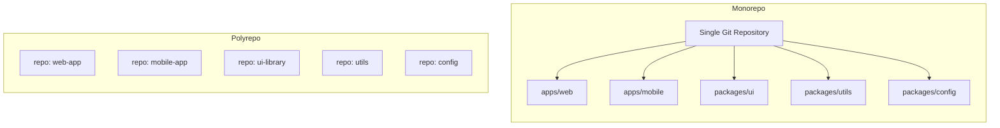
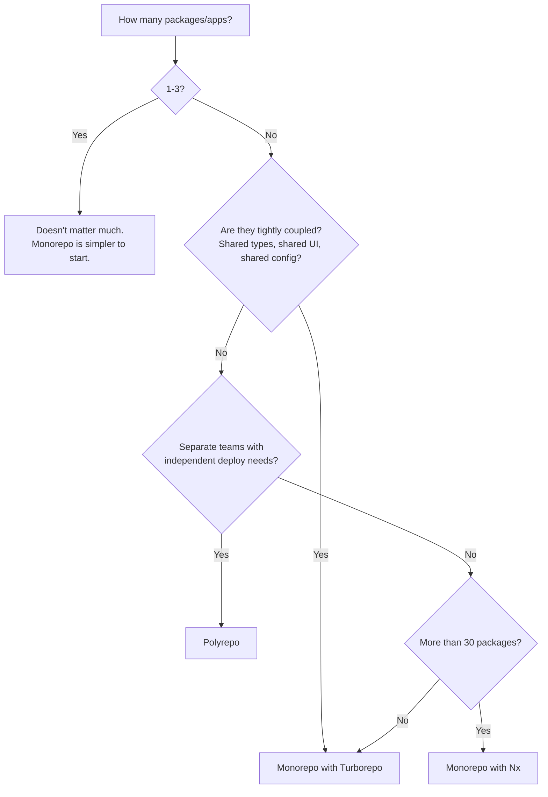

# Monorepo vs Polyrepo: Which Repository Strategy Is Right for Your Team?

A few years ago, I joined a team that had 14 npm packages spread across 14 separate GitHub repositories. Updating a shared utility meant opening PRs in 14 repos, waiting for 14 CI pipelines, and hoping nobody merged something incompatible while you were still updating repo number 7. Version pinning was a nightmare. The team spent more time managing dependencies between their own packages than actually writing features.

We consolidated into a monorepo over the course of about three weeks. It wasn't painless  migrating git history, reconfiguring CI, rewriting import paths  but within a month, the same cross-cutting change that used to take a week took an hour.

That said, I've also seen monorepos go wrong. A 200-person engineering org with a 10GB monorepo where `git status` takes 8 seconds and CI runs for 45 minutes because there's no task caching. The monorepo vs polyrepo choice isn't one-size-fits-all. It depends on your team size, your dependency graph, and how much you're willing to invest in tooling.

## What We're Actually Comparing

**Monorepo**: Multiple projects (apps, packages, libraries) live in a single Git repository. They share tooling, can reference each other directly, and are versioned together.

**Polyrepo**: Each project gets its own repository. They communicate through published packages (npm, PyPI, etc.) and are versioned independently.



Neither is inherently better. They optimize for different things.

## The Case for Monorepos

### 1. Atomic Cross-Cutting Changes

This is the killer feature. When your UI library, your web app, and your API types all live in the same repo, you can change them in a single commit. Rename a type in `packages/types`, update every consumer in `apps/web` and `apps/api`, and ship it as one PR.

In a polyrepo, the same change requires:
1. Update the types package, bump version, publish to npm
2. Update the web app to use the new version, fix all usages
3. Update the API to use the new version, fix all usages
4. Coordinate deployments so nothing breaks in between

That's three PRs, three reviews, three CI runs, and a deployment order that matters. In a monorepo, it's one PR.

### 2. Shared Tooling and Configuration

ESLint, TypeScript, Prettier, testing  in a monorepo, you configure these once and share them across all packages. In a polyrepo, each repo has its own config files, and they inevitably drift out of sync.

```json
// packages/config/tsconfig.base.json  shared across all packages
{
  "compilerOptions": {
    "target": "ES2022",
    "module": "ESNext",
    "moduleResolution": "bundler",
    "strict": true,
    "skipLibCheck": true,
    "declaration": true,
    "declarationMap": true,
    "sourceMap": true
  }
}
```

```json
// apps/web/tsconfig.json  extends the shared config
{
  "extends": "../../packages/config/tsconfig.base.json",
  "compilerOptions": {
    "jsx": "react-jsx",
    "outDir": "dist"
  },
  "include": ["src"]
}
```

One base config. Every project inherits from it. When you update the TypeScript target, every project updates with it.

### 3. Code Sharing Without Publishing

In a monorepo, sharing code between packages is just an import path. No publishing to npm. No version numbers. No waiting for a registry.

```typescript
// apps/web/src/components/Button.tsx
import { cn } from '@repo/utils'  // Direct import, no npm publish needed
import type { ButtonVariant } from '@repo/types'  // Shared types, always in sync
```

This is especially powerful for TypeScript types. When your frontend and backend share type definitions from a common package, you get end-to-end type safety without code generation.

If you're managing environment variables across multiple apps in a monorepo, [SnipShift's Env to Types tool](https://snipshift.dev/env-to-types) can generate TypeScript types or Zod schemas from your `.env` files  handy when each app in your monorepo has its own env config that needs to stay typed. For more on managing env files across environments, check out our [multi-environment .env guide](/blog/manage-multiple-env-files).

## The Case for Polyrepos

### 1. Simpler Git Operations

Monorepos get big. As the codebase grows, `git clone`, `git log`, and `git blame` all slow down. A 5GB monorepo with 200,000 commits is a genuinely painful development experience if you haven't invested in partial cloning and sparse checkouts.

Polyrepos keep each repository lean. Cloning is fast. Git operations are instant. You don't need special tooling just to make Git usable.

### 2. Clear Ownership Boundaries

When each team owns their own repository, the boundaries are obvious. Team A has full control over their repo  their CI, their deploy pipeline, their merge process. Nobody from Team B accidentally breaks Team A's build.

In a monorepo, a change to a shared package can break five apps at once. That requires more discipline, better testing, and clearer ownership rules.

### 3. Independent Release Cycles

If your UI library ships weekly but your API ships daily, polyrepos make this natural. Each repo has its own version, its own changelog, its own release process.

In a monorepo, you *can* do independent releases, but it requires tooling like Changesets or Lerna to manage versioning across packages. It's doable, but it's not free.

### 4. Simpler CI/CD

A polyrepo's CI pipeline is simple: run tests for this repo, deploy this repo. A monorepo's CI needs to figure out *which* packages changed and only test and deploy those. Without proper task caching and dependency graph analysis, you end up running every test for every change.

## The Comparison

| Factor | Monorepo | Polyrepo |
|--------|----------|----------|
| Cross-cutting changes | One PR, atomic | Multiple PRs, coordinated |
| Code sharing | Direct imports | Publish packages |
| Tooling config | Shared, centralized | Per-repo, may drift |
| Git performance | Degrades at scale | Always fast |
| CI complexity | Needs smart caching | Simple per-repo |
| Team autonomy | Shared rules, shared builds | Full independence |
| Dependency management | Internal: always in sync<br/>External: shared lockfile | Internal: version pinning<br/>External: per-repo lockfile |
| Onboarding | Clone once, see everything | Clone only what you need |
| Best for | Tightly coupled packages,<br/>small-medium teams | Loosely coupled services,<br/>large distributed teams |

## Tooling: What Makes Monorepos Work

A monorepo without good tooling is just a big mess. Here's what the ecosystem looks like in 2026:

### Turborepo

Turborepo is my default recommendation for JavaScript/TypeScript monorepos. It's fast, simple to set up, and does one thing well: smart task running with caching.

```json
// turbo.json
{
  "tasks": {
    "build": {
      "dependsOn": ["^build"],
      "outputs": ["dist/**", ".next/**"]
    },
    "test": {
      "dependsOn": ["build"]
    },
    "lint": {},
    "dev": {
      "cache": false,
      "persistent": true
    }
  }
}
```

Run `turbo build` and it:
1. Analyzes the dependency graph between packages
2. Builds packages in the correct order (dependencies first)
3. Parallelizes independent builds
4. Caches results  if a package hasn't changed, it skips the build entirely

That caching is the magic. On a monorepo with 15 packages, `turbo build` after changing one package takes 3 seconds instead of 2 minutes because 14 packages are cache hits.

### Nx

Nx is the heavyweight option. It does everything Turborepo does plus code generation, project graph visualization, and affected-based testing. If Turborepo is a sharp knife, Nx is a Swiss Army knife.

```bash
# Only test packages affected by your changes
npx nx affected --target=test

# Visualize your dependency graph
npx nx graph
```

Nx is more opinionated and has a steeper learning curve, but for large monorepos (30+ packages), the extra features pay for themselves. The `affected` command alone saves enormous CI time.

### pnpm Workspaces

Both Turborepo and Nx need a workspace manager underneath. pnpm workspaces is my preferred choice  it's faster than npm/yarn workspaces and uses a content-addressable store that saves disk space.

```yaml
# pnpm-workspace.yaml
packages:
  - 'apps/*'
  - 'packages/*'
```

```json
// package.json (root)
{
  "private": true,
  "scripts": {
    "build": "turbo build",
    "dev": "turbo dev",
    "lint": "turbo lint",
    "test": "turbo test"
  }
}
```

Then each package references siblings by name:

```json
// apps/web/package.json
{
  "name": "@repo/web",
  "dependencies": {
    "@repo/ui": "workspace:*",
    "@repo/utils": "workspace:*"
  }
}
```

The `workspace:*` protocol tells pnpm to link directly to the local package instead of looking it up on npm. Changes to `@repo/ui` are immediately available in `@repo/web`  no publishing step.

## When the Monorepo Becomes Painful

I'd be dishonest if I didn't mention the failure modes. Monorepos start to strain when:

- **The repo exceeds ~5GB** and Git operations slow to a crawl. You'll need `git sparse-checkout` and partial clones, which add complexity.
- **CI takes over 30 minutes** because you haven't set up proper caching or affected-based testing. Every PR rebuilds the world.
- **Teams step on each other's toes.** Without clear CODEOWNERS files and branch protection rules, a change to a shared package can break something unrelated.
- **The dependency graph becomes circular.** Package A depends on B, B depends on C, C depends on A. This is a design problem, not a monorepo problem, but monorepos make it easier to create accidentally.

These are all solvable, but they require investment. If you don't have a team willing to maintain the monorepo infrastructure, you'll end up with the worst of both worlds.

> **Tip:** Start every monorepo with a CODEOWNERS file, task caching (Turborepo or Nx), and a CI pipeline that only builds affected packages. Don't add these later  they're essential from day one.

## My Recommendation: A Decision Framework

Here's how I think about the monorepo vs polyrepo decision:



**For small teams (2-8 developers):** Monorepo, almost always. The overhead is minimal and the benefits of shared tooling and atomic changes are immediate.

**For medium teams (8-25 developers):** Monorepo with Turborepo. Invest in CI caching early. Set up CODEOWNERS. Use pnpm workspaces.

**For large teams (25+ developers, multiple autonomous teams):** This is where it actually gets nuanced. If teams share a lot of code and types, monorepo with Nx. If teams are truly independent  different languages, different deployment targets, different release cycles  polyrepo is fine.

**For microservices in different languages:** Polyrepo. A monorepo makes less sense when packages can't share a toolchain. You're not going to run a Go service and a Python ML pipeline through the same build system.

One thing I've learned: the worst choice is splitting too early. Starting with a monorepo and extracting packages into separate repos later is much easier than the reverse. Consolidating 14 repos into one monorepo? I've done it. It's not fun. Starting with one repo and splitting out a package when a team genuinely needs independence? That's a Tuesday afternoon task.

For setting up CI/CD in your monorepo, our [GitHub Actions guide](/blog/github-actions-first-workflow) covers workflows with matrix builds and caching. And if you're containerizing apps from your monorepo, our [Docker Compose guide](/blog/docker-compose-beginners-guide) shows multi-service setups that map well to monorepo package structures.

Whatever you pick, be intentional about it. The repo structure shapes how your team works every single day  how they share code, how they review PRs, how they deploy. Get it right early. Find more tools to help your workflow at [SnipShift.dev](https://snipshift.dev).
