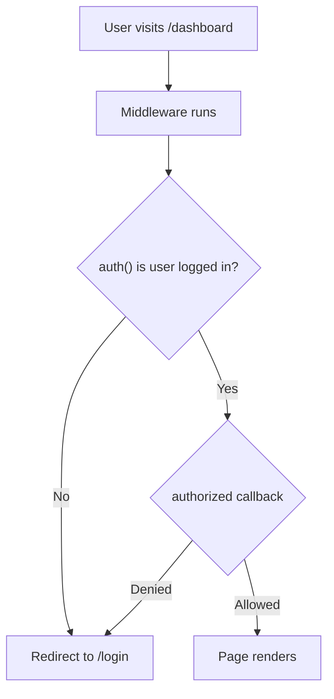
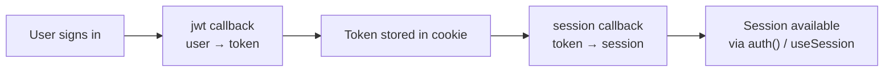

# How to Set Up NextAuth v5 (Auth.js) with Next.js App Router

NextAuth v5  now officially called Auth.js  is one of those libraries where the migration from v4 felt like learning a completely new tool. The API surface changed significantly, the docs are spread across two different websites (nextauth.js.org and authjs.dev), and most tutorials you'll find online are still written for v4 with the Pages Router.

I've set this up from scratch three times now and stumbled through the same confusing parts each time until I finally nailed down a clean setup. This is the guide I wish existed when I started. We'll go from zero to working auth  with Google OAuth as the example provider  covering the config file, route handler, middleware, and session access in both server and client components.

## Step 1: Install the Packages

```bash
npm install next-auth@beta @auth/core
```

As of early 2026, NextAuth v5 is still technically in beta, but it's stable enough that most production apps I've seen are running it. The `@auth/core` package is the framework-agnostic core that `next-auth` wraps.

You'll also need environment variables. Create or update your `.env.local`:

```bash
AUTH_SECRET=your-random-secret-here  # Run `npx auth secret` to generate
AUTH_GOOGLE_ID=your-google-client-id
AUTH_GOOGLE_SECRET=your-google-client-secret
```

> **Tip:** `AUTH_SECRET` is required in production. In development, NextAuth v5 can auto-generate one, but don't rely on that. Run `npx auth secret` and save it now.

## Step 2: The Auth Config File

This is the central config file. Everything flows from here  route handlers, middleware, and session access all import from this file.

```tsx
// auth.ts (project root)
import NextAuth from 'next-auth'
import Google from 'next-auth/providers/google'

export const { handlers, signIn, signOut, auth } = NextAuth({
  providers: [
    Google({
      clientId: process.env.AUTH_GOOGLE_ID!,
      clientSecret: process.env.AUTH_GOOGLE_SECRET!,
    }),
  ],
  pages: {
    signIn: '/login', // Custom sign-in page (optional)
  },
  callbacks: {
    authorized({ auth, request: { nextUrl } }) {
      const isLoggedIn = !!auth?.user
      const isOnDashboard = nextUrl.pathname.startsWith('/dashboard')

      if (isOnDashboard) {
        if (isLoggedIn) return true
        return false // Redirect unauthenticated users to login
      }

      return true
    },
  },
})
```

The key export here is the destructured object: `handlers`, `signIn`, `signOut`, and `auth`. Each serves a different purpose:

| Export | Purpose | Where You Use It |
|--------|---------|-----------------|
| `handlers` | GET/POST route handlers for OAuth flow | `app/api/auth/[...nextauth]/route.ts` |
| `signIn` | Trigger sign-in programmatically | Server Actions, server components |
| `signOut` | Trigger sign-out programmatically | Server Actions, server components |
| `auth` | Get the current session | Server components, middleware, route handlers |

## Step 3: Route Handler Setup

NextAuth needs an API route to handle the OAuth callback flow. In the App Router, that's a route handler:

```tsx
// app/api/auth/[...nextauth]/route.ts
import { handlers } from '@/auth'

export const { GET, POST } = handlers
```

That's it. Two lines. The `handlers` export from your config file provides the GET and POST handlers that manage the entire OAuth flow  redirect to Google, receive the callback, create the session, set the cookie.

The route path must be `app/api/auth/[...nextauth]/route.ts`. The `[...nextauth]` catch-all segment is required  it handles multiple sub-routes like `/api/auth/signin`, `/api/auth/callback/google`, etc.

## Step 4: Middleware for Protected Routes

Middleware is the best place to protect routes because it runs *before* any page renders. If a user isn't authenticated, they get redirected before your page component even executes  no flash of protected content.

```tsx
// middleware.ts (project root)
export { auth as middleware } from '@/auth'

export const config = {
  matcher: ['/dashboard/:path*', '/settings/:path*', '/api/protected/:path*'],
}
```

Wait  that's suspiciously simple. And it is. The `auth` export from your config already includes the `authorized` callback we defined earlier, so when used as middleware it automatically checks authentication and redirects unauthorized users.

But if you need more control  say, role-based access or custom redirect logic  you can wrap it:

```tsx
// middleware.ts
import { auth } from '@/auth'
import { NextResponse } from 'next/server'

export default auth((req) => {
  const { nextUrl } = req
  const isLoggedIn = !!req.auth

  // Redirect logged-in users away from login page
  if (nextUrl.pathname === '/login' && isLoggedIn) {
    return NextResponse.redirect(new URL('/dashboard', nextUrl))
  }

  // Protect admin routes
  if (nextUrl.pathname.startsWith('/admin')) {
    if (!isLoggedIn || req.auth?.user?.role !== 'admin') {
      return NextResponse.redirect(new URL('/unauthorized', nextUrl))
    }
  }
})

export const config = {
  matcher: ['/dashboard/:path*', '/admin/:path*', '/login', '/settings/:path*'],
}
```

For a broader look at what middleware can and can't do, including performance implications, see [Next.js middleware capabilities and limitations](/blog/nextjs-middleware-capabilities-limitations). And if you need to understand the different redirect methods available, [every redirect method in Next.js App Router](/blog/nextjs-app-router-redirect-every-method) breaks that down.



## Step 5: Session in Server Components

Getting the session in a Server Component is clean  just call `auth()`:

```tsx
// app/dashboard/page.tsx
import { auth } from '@/auth'
import { redirect } from 'next/navigation'

export default async function DashboardPage() {
  const session = await auth()

  // Double-check auth (middleware should handle this, but belt-and-suspenders)
  if (!session?.user) {
    redirect('/login')
  }

  return (
    <div>
      <h1>Dashboard</h1>
      <p>Welcome, {session.user.name}</p>
      <p>Email: {session.user.email}</p>
      {session.user.image && (
        
      )}
    </div>
  )
}
```

`auth()` returns the session or `null`. It works in any Server Component, route handler, or Server Action. No hooks, no providers  just a function call.

## Step 6: Session in Client Components

Client Components can't call `auth()` directly  it's a server-side function. Instead, you use `SessionProvider` and the `useSession` hook:

```tsx
// app/providers.tsx
'use client'

import { SessionProvider } from 'next-auth/react'
import type { ReactNode } from 'react'

export function Providers({ children }: { children: ReactNode }) {
  return <SessionProvider>{children}</SessionProvider>
}
```

```tsx
// app/layout.tsx
import { Providers } from './providers'

export default function RootLayout({ children }: { children: React.ReactNode }) {
  return (
    <html>
      <body>
        <Providers>{children}</Providers>
      </body>
    </html>
  )
}
```

Now any Client Component can access the session:

```tsx
// components/user-menu.tsx
'use client'

import { useSession, signIn, signOut } from 'next-auth/react'

export function UserMenu() {
  const { data: session, status } = useSession()

  if (status === 'loading') {
    return <div>Loading...</div>
  }

  if (!session) {
    return <button onClick={() => signIn('google')}>Sign in</button>
  }

  return (
    <div>
      <span>{session.user?.name}</span>
      <button onClick={() => signOut()}>Sign out</button>
    </div>
  )
}
```

The `status` field is key  it tells you whether the session is still loading (`'loading'`), authenticated (`'authenticated'`), or unauthenticated (`'unauthenticated'`). Always handle the loading state to avoid flickering UIs.

## Step 7: TypeScript Module Augmentation

Out of the box, the session type only includes `name`, `email`, and `image`. If you've added custom fields  like `role` or `id`  you need to tell TypeScript about them using module augmentation:

```tsx
// types/next-auth.d.ts
import type { DefaultSession } from 'next-auth'

declare module 'next-auth' {
  interface Session {
    user: {
      id: string
      role: 'admin' | 'user'
    } & DefaultSession['user']
  }

  interface User {
    role: 'admin' | 'user'
  }
}
```

And then in your auth config, use the `jwt` and `session` callbacks to populate these fields:

```tsx
// auth.ts (add to the NextAuth config)
export const { handlers, signIn, signOut, auth } = NextAuth({
  providers: [Google({ /* ... */ })],
  callbacks: {
    authorized({ auth, request: { nextUrl } }) {
      // ... same as before
    },
    jwt({ token, user }) {
      // First sign-in: copy user data to token
      if (user) {
        token.id = user.id
        token.role = user.role
      }
      return token
    },
    session({ session, token }) {
      // Copy token data to session (sent to client)
      session.user.id = token.id as string
      session.user.role = token.role as 'admin' | 'user'
      return session
    },
  },
})
```

This callback chain is important to understand:



The `jwt` callback fires on every request but only receives the `user` object on the initial sign-in. The `session` callback shapes what the client sees. If you add a field to the token but don't pass it through the `session` callback, it won't be available in `useSession()`.

If you're converting your auth setup from JavaScript to TypeScript and want help generating these type definitions, [SnipShift's JS to TypeScript converter](https://snipshift.dev/js-to-ts) can handle the module augmentation syntax  which is one of those TypeScript features that's hard to get right from memory.

## The Sign-In and Sign-Out Flow

For server-side sign-in (e.g., in a Server Action):

```tsx
// app/actions.ts
'use server'

import { signIn, signOut } from '@/auth'

export async function handleSignIn() {
  await signIn('google', { redirectTo: '/dashboard' })
}

export async function handleSignOut() {
  await signOut({ redirectTo: '/' })
}
```

For client-side sign-in (e.g., in a button):

```tsx
'use client'

import { signIn, signOut } from 'next-auth/react'

// In your component:
<button onClick={() => signIn('google')}>Sign in with Google</button>
<button onClick={() => signOut()}>Sign out</button>
```

Note the different imports: server-side uses `@/auth` (your config file), client-side uses `next-auth/react`. This is one of the more confusing aspects of the v5 API  same function names, different imports depending on context.

## Common Gotchas

**1. `AUTH_SECRET` missing in production:** You'll get cryptic JWT errors. Always set this env var.

**2. Callback URL mismatch:** In your Google Cloud Console, the authorized redirect URI must be `https://yourdomain.com/api/auth/callback/google`. Locally it's `http://localhost:3000/api/auth/callback/google`. Mismatches cause silent failures.

**3. `session.user.id` is undefined:** You added `id` to the type declaration but forgot to pass it through the `jwt` → `session` callback chain.

**4. Middleware matching too many routes:** Don't match `/_next/` or `/api/auth/` routes in your middleware config  it'll break the auth flow itself. The `matcher` should only include routes you want to protect.

> **Warning:** Never block `/api/auth/` routes in middleware. NextAuth needs these routes to handle sign-in, callbacks, and session management. Blocking them creates a redirect loop.

If you've been using NextAuth v4 with the Pages Router and Google OAuth, the [Google OAuth with NextAuth guide](/blog/google-oauth-nextjs-nextauth-guide) covers the provider setup in more detail. And for a broader comparison of auth approaches in Next.js  including Clerk, Lucia, and rolling your own  check out [authentication approaches in Next.js compared](/blog/nextjs-authentication-approaches).

Setting up NextAuth v5 with the App Router has more moving parts than I'd like  the split between server and client imports, the callback chain for custom session data, the middleware integration. But once it's wired up, the actual developer experience is genuinely good. `auth()` in server components is clean. `useSession()` in client components is familiar. And middleware-based route protection means no flashing of protected content. It just takes getting through the setup to appreciate it.
