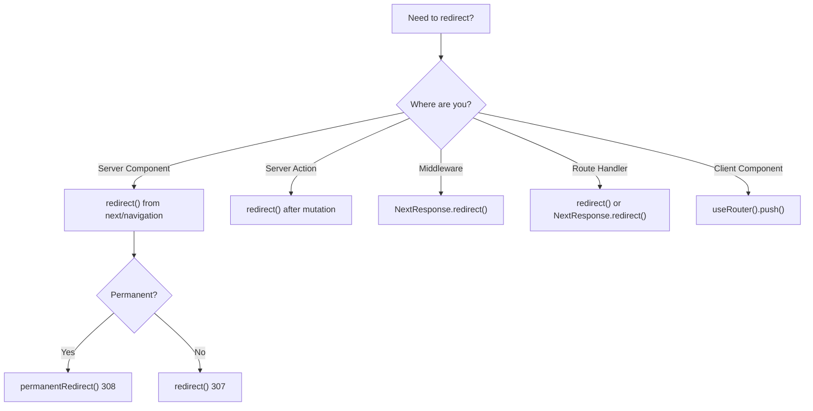

# How to Redirect in Next.js App Router (Every Method Explained)

If you've ever searched "how to redirect in Next.js" and felt more confused after reading the docs than before  you're not alone. The App Router gives you *five* different ways to redirect, each suited to a different context. And if you pick the wrong one, you get anything from a cryptic error to a redirect that silently does nothing.

I've worked on enough App Router projects at this point to have hit every variation of "why isn't my redirect working?" Let me save you the debugging sessions and just lay out every method, when to use it, and the gotchas you'll hit.

## Method 1: `redirect()` in a Server Component

This is the most common case. You're in a `page.tsx` or a Server Component, and you want to redirect the user  maybe because they're not authenticated, or because the page has moved.

```tsx
// app/old-page/page.tsx
import { redirect } from 'next/navigation'

export default function OldPage() {
  redirect('/new-page')
  // Nothing after this line executes
}
```

```tsx
// app/dashboard/page.tsx
import { redirect } from 'next/navigation'
import { getUser } from '@/lib/auth'

export default async function DashboardPage() {
  const user = await getUser()

  if (!user) {
    redirect('/login')
  }

  return <div>Welcome, {user.name}</div>
}
```

Key things to know:
- `redirect()` throws an error internally (a `NEXT_REDIRECT` error)  it's not a return statement, but nothing after it runs
- It defaults to a **307 temporary redirect**
- For permanent redirects, use `permanentRedirect()` from the same import (returns 308)
- It only works during server rendering  not in event handlers or `useEffect`

> **Warning:** Don't wrap `redirect()` in a try/catch block. Since it throws internally, catching the error will prevent the redirect from happening. This bit me on a project where we had a global error boundary catching everything.

## Method 2: `redirect()` in a Server Action

Server Actions can also redirect. This is how you redirect after a form submission or mutation:

```tsx
// app/actions.ts
'use server'

import { redirect } from 'next/navigation'
import { db } from '@/lib/db'

export async function createPost(formData: FormData) {
  const title = formData.get('title') as string
  const post = await db.posts.create({ data: { title } })

  redirect(`/posts/${post.id}`)
}
```

```tsx
// app/posts/new/page.tsx
import { createPost } from '@/app/actions'

export default function NewPostPage() {
  return (
    <form action={createPost}>
      <input name="title" placeholder="Post title" />
      <button type="submit">Create</button>
    </form>
  )
}
```

The redirect happens after the Server Action completes. The client receives the redirect instruction and navigates. This pattern works great for create/update/delete flows.

## Method 3: `NextResponse.redirect()` in Middleware

Middleware runs *before* any page renders, which makes it perfect for auth checks, locale detection, and URL rewrites. It's the only redirect method that intercepts the request before it even hits your page components.

```tsx
// middleware.ts
import { NextResponse } from 'next/server'
import type { NextRequest } from 'next/server'

export function middleware(request: NextRequest) {
  const token = request.cookies.get('auth-token')?.value

  // Redirect unauthenticated users to login
  if (!token && request.nextUrl.pathname.startsWith('/dashboard')) {
    const loginUrl = new URL('/login', request.url)
    loginUrl.searchParams.set('from', request.nextUrl.pathname)
    return NextResponse.redirect(loginUrl)
  }

  // Redirect old URLs
  if (request.nextUrl.pathname === '/blog') {
    return NextResponse.redirect(new URL('/posts', request.url))
  }

  return NextResponse.next()
}

export const config = {
  matcher: ['/dashboard/:path*', '/blog'],
}
```

The critical difference: `NextResponse.redirect()` requires a full URL object, not just a path string. This trips up a lot of developers coming from Server Components where `redirect('/path')` takes a simple string.

For more on what middleware can and can't do, check out [Next.js middleware capabilities and limitations](/blog/nextjs-middleware-capabilities-limitations)  there are some surprising constraints around database access and Node.js APIs.

## Method 4: `redirect()` / `NextResponse.redirect()` in Route Handlers

Route handlers (`route.ts`) support both styles:

```tsx
// app/api/legacy/route.ts
import { redirect } from 'next/navigation'

export async function GET() {
  redirect('/api/v2')
}
```

Or with more control over the response:

```tsx
// app/api/oauth/callback/route.ts
import { NextResponse } from 'next/server'

export async function GET(request: Request) {
  const { searchParams } = new URL(request.url)
  const code = searchParams.get('code')

  // Exchange code for token...
  const token = await exchangeCode(code!)

  // Redirect to dashboard with cookie set
  const response = NextResponse.redirect(new URL('/dashboard', request.url))
  response.cookies.set('auth-token', token, {
    httpOnly: true,
    secure: true,
    sameSite: 'lax',
  })

  return response
}
```

The `NextResponse.redirect()` approach gives you access to set cookies, headers, and other response properties before the redirect. That's why it's preferred for OAuth callbacks and similar flows where you need to set state during the redirect.

## Method 5: `useRouter().push()` in Client Components

For client-side navigation  after a button click, a timer, or some client-side condition:

```tsx
'use client'

import { useRouter } from 'next/navigation'

export function LogoutButton() {
  const router = useRouter()

  async function handleLogout() {
    await fetch('/api/logout', { method: 'POST' })
    router.push('/login')
  }

  return <button onClick={handleLogout}>Logout</button>
}
```

This is a **client-side navigation**, not an HTTP redirect. The browser doesn't send a new request  Next.js handles the route transition via its client-side router. That means:
- No 301/302/307/308 status codes  search engines don't see this as a redirect
- It's faster because it uses the client-side router
- It won't work if JavaScript is disabled

For programmatic redirects after user actions in the browser, `router.push()` is the right choice. For anything involving SEO or auth, use a server-side method.

## When to Use Which: The Decision Tree



And here's the comparison table for quick reference:

| Method | Where It Works | HTTP Status | SEO-Visible | Runs Before Render |
|--------|---------------|:-----------:|:-----------:|:------------------:|
| `redirect()` | Server Component | 307 | Yes | During render |
| `permanentRedirect()` | Server Component | 308 | Yes | During render |
| `redirect()` | Server Action | 303 | No | After mutation |
| `NextResponse.redirect()` | Middleware | 307 (default) | Yes | Before render |
| `NextResponse.redirect()` | Route Handler | 307 (default) | Yes | N/A |
| `router.push()` | Client Component | None | No | After interaction |

## Permanent vs. Temporary: 307 vs. 308

A quick note on status codes since people always ask:

- **307 (Temporary Redirect):** "This page is temporarily somewhere else." Browsers and crawlers will check the original URL again next time. Use this for auth redirects, temporary maintenance, A/B tests.
- **308 (Permanent Redirect):** "This page has permanently moved." Search engines will update their index. Use this for URL restructuring, domain changes, slug updates.

```tsx
import { redirect, permanentRedirect } from 'next/navigation'

// User not logged in → temporary, they might come back when logged in
redirect('/login')

// Old URL structure → permanent, update your bookmarks
permanentRedirect('/blog/posts/my-article')
```

## Common Mistakes

**1. Redirecting in `layout.tsx`:**
Layouts persist across navigations. A redirect in a layout will fire on the initial render but may not re-evaluate on soft navigations. Put auth redirects in `page.tsx` or middleware instead.

**2. Redirect inside try/catch:**
`redirect()` throws internally. If you catch it, the redirect won't happen. Use it *outside* try/catch blocks, or re-throw `NEXT_REDIRECT` errors.

**3. Using `router.push()` for SEO redirects:**
Client-side navigation isn't visible to search engines. If you're redirecting for SEO purposes (old URL → new URL), use middleware or server-side `redirect()`.

**4. Forgetting `new URL()` in middleware:**
`NextResponse.redirect()` needs a full URL, not a path string. Always use `new URL('/path', request.url)`.

If you're building an auth system and need to decide where to put your redirects, the [NextAuth v5 setup guide](/blog/nextauth-v5-auth-js-app-router-setup) covers how middleware and server-side auth redirects work together. And for a broader look at authentication patterns in Next.js, check out [authentication approaches compared](/blog/nextjs-authentication-approaches).

If you're typing up these redirect patterns and want proper TypeScript types for your route handlers and middleware, [SnipShift's JS to TypeScript converter](https://snipshift.dev/js-to-ts) can generate the right types for `NextRequest`, `NextResponse`, and your custom redirect helpers.

Five redirect methods is a lot. But each one exists for a reason  different execution contexts need different approaches. Pick the one that matches where your code runs, and you'll never fight the framework on this again.
