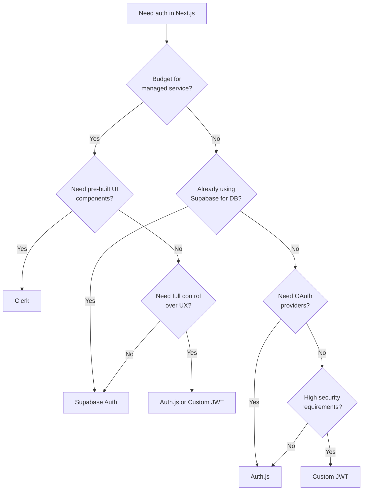

# How to Implement Authentication in Next.js (4 Approaches Compared)

Authentication is one of those things that sounds simple until you actually have to build it. "Just add a login page"  right, and then you need session management, token refresh, protected routes, OAuth providers, email verification, password reset, CSRF protection, and a dozen other things that turn a "one-sprint feature" into a month-long project.

I've shipped nextjs authentication using four different approaches across various projects. Each time, I wished someone had written a honest comparison that told me which one to pick *before* I spent a week integrating the wrong solution. So here it is. No fluff, no sponsored takes  just what I've learned from actually building with each of these.

## The Four Contenders

We're comparing:

1. **Auth.js (NextAuth.js)**  the open-source, self-hosted standard
2. **Clerk**  managed auth-as-a-service with pre-built UI
3. **Supabase Auth**  auth bundled with your database
4. **Custom JWT**  roll it yourself with jose or jsonwebtoken

Each has a sweet spot. The trick is matching the approach to your project's constraints  team size, budget, timeline, and how much control you actually need.



## 1. Auth.js (NextAuth.js)

Auth.js  formerly NextAuth.js  is the most popular open-source authentication library for Next.js. It handles OAuth providers (Google, GitHub, etc.), email/password, magic links, and session management. You host everything yourself, which means no per-user pricing.

### Setup

The setup has gotten significantly better since the v5 rewrite, but it's still the most hands-on of the managed options.

```bash
npm install next-auth@beta
```

```typescript
// auth.ts (root of project)
import NextAuth from 'next-auth'
import GitHub from 'next-auth/providers/github'
import Google from 'next-auth/providers/google'
import Credentials from 'next-auth/providers/credentials'
import { PrismaAdapter } from '@auth/prisma-adapter'
import { prisma } from '@/lib/db'

export const { handlers, signIn, signOut, auth } = NextAuth({
  adapter: PrismaAdapter(prisma),
  providers: [
    GitHub,
    Google,
    Credentials({
      credentials: {
        email: { label: 'Email', type: 'email' },
        password: { label: 'Password', type: 'password' },
      },
      async authorize(credentials) {
        // Your custom validation logic here
        const user = await prisma.user.findUnique({
          where: { email: credentials.email as string },
        })
        if (!user || !await verifyPassword(credentials.password as string, user.passwordHash)) {
          return null
        }
        return user
      },
    }),
  ],
  session: { strategy: 'jwt' },
})
```

```typescript
// app/api/auth/[...nextauth]/route.ts
import { handlers } from '@/auth'
export const { GET, POST } = handlers
```

Then protecting a page:

```tsx
// app/dashboard/page.tsx
import { auth } from '@/auth'
import { redirect } from 'next/navigation'

export default async function DashboardPage() {
  const session = await auth()

  if (!session) {
    redirect('/api/auth/signin')
  }

  return <div>Welcome, {session.user?.name}</div>
}
```

And protecting API routes:

```typescript
// app/api/protected/route.ts
import { auth } from '@/auth'
import { NextResponse } from 'next/server'

export const GET = auth(function GET(req) {
  if (!req.auth) {
    return NextResponse.json({ error: 'Unauthorized' }, { status: 401 })
  }
  return NextResponse.json({ data: 'secret stuff' })
})
```

### The Good

- **Free and open source**  no per-user fees, no vendor lock-in
- **50+ OAuth providers** out of the box  Google, GitHub, Discord, Apple, you name it
- **Database adapters** for Prisma, Drizzle, MongoDB, and more
- **Full control** over the auth flow, callbacks, and session shape
- **Active community**  big ecosystem, lots of tutorials and examples

### The Not-So-Good

- **Configuration complexity**  the config file can get gnarly, especially with custom callbacks and session types
- **TypeScript types** require manual extension if you add custom fields to the session
- **The Credentials provider** is deliberately limited (no session persistence by default)  Auth.js really wants you using OAuth
- **Migrations between versions** have historically been painful (v3 → v4 → v5 each had breaking changes)

### When to Pick Auth.js

You want OAuth integration, you don't want to pay per user, and you're comfortable with some configuration overhead. Best for: indie developers, open-source projects, and teams that want full control without building from scratch.

## 2. Clerk

Clerk is the "it just works" option. It's a fully managed authentication service with pre-built UI components  sign-in forms, user profile pages, organization management  that drop directly into your Next.js app. You don't build the auth UI. You don't manage sessions. You just... use it.

### Setup

```bash
npm install @clerk/nextjs
```

```typescript
// middleware.ts
import { clerkMiddleware, createRouteMatcher } from '@clerk/nextjs/server'

const isProtectedRoute = createRouteMatcher(['/dashboard(.*)'])

export default clerkMiddleware(async (auth, req) => {
  if (isProtectedRoute(req)) {
    await auth.protect()
  }
})

export const config = {
  matcher: ['/((?!.*\\..*|_next).*)', '/', '/(api|trpc)(.*)'],
}
```

```tsx
// app/layout.tsx
import { ClerkProvider } from '@clerk/nextjs'

export default function RootLayout({ children }) {
  return (
    <ClerkProvider>
      <html lang="en">
        <body>{children}</body>
      </html>
    </ClerkProvider>
  )
}
```

Adding a sign-in button  this is where Clerk really shines:

```tsx
import { SignInButton, SignedIn, SignedOut, UserButton } from '@clerk/nextjs'

export function Header() {
  return (
    <header>
      <SignedOut>
        <SignInButton />
      </SignedOut>
      <SignedIn>
        <UserButton />
      </SignedIn>
    </header>
  )
}
```

That `UserButton` component? It renders a full user menu with profile management, sign out, and account switching. Zero custom code.

### The Good

- **Fastest time-to-ship**  you can have working auth in under 30 minutes
- **Beautiful pre-built UI** that's customizable with your brand colors
- **Organization management**  multi-tenant auth built in (huge for B2B SaaS)
- **Webhooks** for syncing user data to your database
- **Edge-compatible**  works with middleware and edge functions

### The Not-So-Good

- **Pricing**  free up to 10,000 monthly active users, then $0.02/MAU. For a consumer app with 100K users, that's $2,000/month
- **Vendor lock-in**  your auth lives on Clerk's servers, migration is non-trivial
- **Limited customization** of the auth flow itself  you can style the components, but the flow is largely fixed
- **Not open source**  if Clerk goes down or changes pricing, you're dependent

### When to Pick Clerk

You're building a B2B SaaS, you need organizations/teams, and you'd rather ship features than build auth UI. The pricing is a non-issue if your product charges per seat anyway. Best for: startups that need to move fast, B2B products, and teams that don't want to think about auth.

## 3. Supabase Auth

If you're already using Supabase for your database (or considering it), Supabase Auth is a no-brainer. It's built into the platform  same dashboard, same project, same SDK. Row-Level Security (RLS) policies can reference the authenticated user directly, which means your database authorization is tightly coupled to your auth.

### Setup

```bash
npm install @supabase/supabase-js @supabase/ssr
```

```typescript
// lib/supabase/server.ts
import { createServerClient } from '@supabase/ssr'
import { cookies } from 'next/headers'

export async function createClient() {
  const cookieStore = await cookies()

  return createServerClient(
    process.env.NEXT_PUBLIC_SUPABASE_URL!,
    process.env.NEXT_PUBLIC_SUPABASE_ANON_KEY!,
    {
      cookies: {
        getAll() {
          return cookieStore.getAll()
        },
        setAll(cookiesToSet) {
          cookiesToSet.forEach(({ name, value, options }) =>
            cookieStore.set(name, value, options)
          )
        },
      },
    }
  )
}
```

Sign up and sign in:

```tsx
'use client'

import { createClient } from '@/lib/supabase/client'

export function LoginForm() {
  const supabase = createClient()

  async function handleLogin(formData: FormData) {
    const { error } = await supabase.auth.signInWithPassword({
      email: formData.get('email') as string,
      password: formData.get('password') as string,
    })
    if (error) console.error(error)
  }

  async function handleGoogleLogin() {
    await supabase.auth.signInWithOAuth({
      provider: 'google',
      options: { redirectTo: `${window.location.origin}/auth/callback` },
    })
  }

  return (
    <form action={handleLogin}>
      <input name="email" type="email" required />
      <input name="password" type="password" required />
      <button type="submit">Sign In</button>
      <button type="button" onClick={handleGoogleLogin}>
        Sign In with Google
      </button>
    </form>
  )
}
```

Protecting a Server Component:

```tsx
// app/dashboard/page.tsx
import { createClient } from '@/lib/supabase/server'
import { redirect } from 'next/navigation'

export default async function Dashboard() {
  const supabase = await createClient()
  const { data: { user } } = await supabase.auth.getUser()

  if (!user) redirect('/login')

  // RLS automatically scopes this query to the authenticated user
  const { data: orders } = await supabase
    .from('orders')
    .select('*')
    .order('created_at', { ascending: false })

  return <OrderList orders={orders} />
}
```

### The Good

- **Integrated with your database**  RLS policies reference `auth.uid()` directly
- **Generous free tier**  50,000 MAUs on the free plan
- **OAuth, magic links, phone auth, and email/password** all included
- **Self-hostable**  Supabase is open source, so you can run it yourself
- **Edge Functions** for custom auth logic

### The Not-So-Good

- **Tightly coupled to Supabase**  if you're not using Supabase for your database, this adds complexity
- **Cookie handling in Next.js** requires careful setup with `@supabase/ssr`  the server/client split is fiddly
- **No pre-built UI components**  you build your own login forms
- **RLS policies** have a learning curve and can be tricky to debug

### When to Pick Supabase Auth

You're already using (or planning to use) Supabase for your database. The auth-database integration via RLS is genuinely powerful. Best for: full-stack apps built on Supabase, projects that need generous free tiers, and teams that want auth + database in one platform.

If you're managing environment variables for your Supabase setup across different environments, [SnipShift's Env to Types tool](https://snipshift.dev/env-to-types) can generate TypeScript types or Zod schemas from your `.env` files  so your `NEXT_PUBLIC_SUPABASE_URL` and `SUPABASE_SERVICE_ROLE_KEY` are properly typed instead of casting everything as `string`. For more on managing env files across environments, check out our guide on [managing multiple .env files](/blog/manage-multiple-env-files).

## 4. Custom JWT (Roll Your Own)

Sometimes you need full control. Maybe you have specific security requirements, an existing user database with its own password hashing scheme, or compliance constraints that rule out third-party services. Custom JWT auth gives you that control  at the cost of building everything yourself.

### Setup

```bash
npm install jose bcryptjs
npm install -D @types/bcryptjs
```

```typescript
// lib/auth.ts
import { SignJWT, jwtVerify } from 'jose'
import { cookies } from 'next/headers'

const secret = new TextEncoder().encode(process.env.JWT_SECRET!)

interface TokenPayload {
  userId: string
  email: string
}

export async function createToken(payload: TokenPayload) {
  return new SignJWT(payload)
    .setProtectedHeader({ alg: 'HS256' })
    .setIssuedAt()
    .setExpirationTime('7d')
    .sign(secret)
}

export async function verifyToken(token: string): Promise<TokenPayload | null> {
  try {
    const { payload } = await jwtVerify(token, secret)
    return payload as unknown as TokenPayload
  } catch {
    return null
  }
}

export async function getSession() {
  const cookieStore = await cookies()
  const token = cookieStore.get('auth-token')?.value
  if (!token) return null
  return verifyToken(token)
}
```

Login API route:

```typescript
// app/api/auth/login/route.ts
import { NextResponse } from 'next/server'
import { compare } from 'bcryptjs'
import { createToken } from '@/lib/auth'
import { db } from '@/lib/db'
import { cookies } from 'next/headers'

export async function POST(req: Request) {
  const { email, password } = await req.json()

  const user = await db.user.findUnique({ where: { email } })
  if (!user || !await compare(password, user.passwordHash)) {
    return NextResponse.json(
      { error: 'Invalid credentials' },
      { status: 401 }
    )
  }

  const token = await createToken({ userId: user.id, email: user.email })

  const cookieStore = await cookies()
  cookieStore.set('auth-token', token, {
    httpOnly: true,
    secure: process.env.NODE_ENV === 'production',
    sameSite: 'lax',
    maxAge: 60 * 60 * 24 * 7, // 7 days
    path: '/',
  })

  return NextResponse.json({ user: { id: user.id, name: user.name, email: user.email } })
}
```

Middleware for route protection:

```typescript
// middleware.ts
import { NextResponse } from 'next/server'
import type { NextRequest } from 'next/server'
import { verifyToken } from '@/lib/auth'

export async function middleware(req: NextRequest) {
  const token = req.cookies.get('auth-token')?.value

  if (!token) {
    return NextResponse.redirect(new URL('/login', req.url))
  }

  const payload = await verifyToken(token)
  if (!payload) {
    return NextResponse.redirect(new URL('/login', req.url))
  }

  return NextResponse.next()
}

export const config = {
  matcher: ['/dashboard/:path*', '/api/protected/:path*'],
}
```

### The Good

- **Total control**  every aspect of auth is yours to customize
- **No vendor dependencies**  no third-party services, no per-user pricing
- **Edge-compatible**  `jose` works in Edge Runtime, `jsonwebtoken` doesn't
- **Compliance-friendly**  data never leaves your infrastructure

### The Not-So-Good

- **You own the security**  and security is hard. Token refresh, CSRF, XSS protection, rate limiting, brute force protection... you're building all of this
- **No built-in OAuth**  integrating Google/GitHub login means implementing the OAuth flow yourself (or using a library like `arctic`)
- **Session management** is your responsibility  token rotation, revocation, multi-device support
- **It takes time**  what takes 30 minutes with Clerk takes a week with custom JWT

> **Warning:** If you're rolling custom JWT auth, please use `httpOnly` cookies  not `localStorage`. Storing JWTs in `localStorage` exposes them to XSS attacks. This isn't a theoretical risk  I've seen it exploited in production.

### When to Pick Custom JWT

You have specific security or compliance requirements, an existing auth system to integrate with, or you genuinely enjoy building auth (no judgment). Best for: enterprise apps with strict data residency requirements, apps integrating with legacy auth systems, and teams with dedicated security engineers.

For testing your auth endpoints during development, [SnipShift's cURL to Code converter](https://snipshift.dev/curl-to-code) is handy  paste your curl command and get typed fetch calls in TypeScript, Python, or Go. Check out our guide on [authentication headers for API calls](/blog/api-authentication-headers-guide) for the patterns that work with JWT, API keys, and OAuth bearer tokens.

## The Comparison Table

| Feature | Auth.js | Clerk | Supabase Auth | Custom JWT |
|---------|---------|-------|---------------|------------|
| **Setup time** | ~2 hours | ~30 min | ~1 hour | ~1 week |
| **Pricing** | Free (self-hosted) | Free to 10K MAU, then $0.02/MAU | Free to 50K MAU | Free (self-hosted) |
| **OAuth providers** | 50+ built-in | 20+ built-in | 15+ built-in | DIY (use arctic) |
| **Pre-built UI** | Basic (unstyled) | Beautiful, customizable | None | None |
| **Database integration** | Adapters (Prisma, etc.) | Webhooks to sync | Native (RLS) | Direct |
| **Multi-tenancy** | DIY | Built-in orgs | RLS-based | DIY |
| **Edge Runtime** | Yes (v5) | Yes | Yes | Yes (with jose) |
| **Self-hostable** | Yes | No | Yes | Yes |
| **Vendor lock-in** | None | High | Medium | None |
| **Best for** | OAuth-heavy apps | B2B SaaS, speed | Supabase apps | Compliance, control |

## My Honest Recommendation

If I'm starting a new Next.js project tomorrow and someone asks me about nextjs authentication, here's what I'd say:

**For most projects:** Start with Auth.js. It's free, flexible, and handles 90% of use cases. The configuration can be annoying, but you learn it once and reuse it across projects.

**For B2B SaaS that charges per seat:** Clerk. The organization management alone saves you weeks of development. The per-user cost is negligible if your customers are paying you per user anyway.

**For apps already on Supabase:** Supabase Auth. Don't overthink it  the RLS integration is too good to pass up.

**For enterprise with compliance requirements:** Custom JWT with a security review. Just make sure you have someone on the team who knows what they're doing with token management.

And whatever you pick  please, *please*  enable rate limiting on your auth endpoints from day one. I've done incident response for a brute-force attack on a login endpoint with no rate limiting. It's not fun. Check out our guide on [API rate limiting](/blog/api-rate-limiting-explained) if you want the implementation patterns.

One more thing: whichever approach you choose, type your environment variables properly. A mistyped `NEXTAUTH_SECRET` or missing `CLERK_SECRET_KEY` will cost you hours of debugging. [SnipShift's tools hub](https://snipshift.dev) has converters that can help you maintain type-safe configs across your entire stack.
