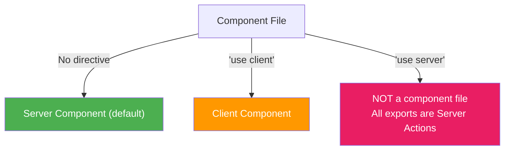

# Next.js 'use server' vs 'use client': When to Use Each Directive

I'll start with the misconception that trips up almost every developer I've mentored on the App Router: **`'use server'` does NOT make a component a Server Component.** I know. The name is misleading. But once you understand what each directive actually does, the whole App Router model makes a lot more sense.

Let me break down what `'use server'` and `'use client'` actually do, when to use each, and  maybe more importantly  when you don't need either.

## The Baseline: No Directive = Server Component

This is the first thing to internalize. In the App Router, every component is a Server Component by default. You don't need to add anything to make it run on the server.

```tsx
// app/about/page.tsx
// No directive at all  this is a Server Component

export default async function AboutPage() {
  const team = await getTeamMembers() // Direct database access

  return (
    <div>
      <h1>About Us</h1>
      {team.map(member => (
        <p key={member.id}>{member.name}  {member.role}</p>
      ))}
    </div>
  )
}
```

No `'use server'` needed. No import. It just *is* a Server Component. This is the default, and it's one of the things I genuinely like about the App Router design  the common case requires zero ceremony.

## What `'use client'` Actually Does

`'use client'` marks a **client boundary**. It tells Next.js: "this component  and everything it imports  needs to be included in the client JavaScript bundle."

```tsx
'use client'

import { useState } from 'react'

export function LikeButton({ postId }: { postId: string }) {
  const [liked, setLiked] = useState(false)

  return (
    <button onClick={() => setLiked(!liked)}>
      {liked ? '❤️' : '🤍'}
    </button>
  )
}
```

You need `'use client'` when your component uses:
- **React hooks**  `useState`, `useEffect`, `useRef`, `useContext`, etc.
- **Browser APIs**  `window`, `document`, `localStorage`, `IntersectionObserver`
- **Event handlers**  `onClick`, `onChange`, `onSubmit`

But here's the subtle part: `'use client'` creates a **boundary**, not a label. Every component *imported into* a `'use client'` file becomes a Client Component too, even if those files don't have the directive.

```tsx
// components/dashboard.tsx
'use client'

// Both of these become Client Components because they're
// imported into a 'use client' file
import { Chart } from './chart'       // ← Client Component now
import { StatsCard } from './stats'   // ← Client Component now
```

That's why the advice is always: push the `'use client'` boundary as low in the tree as possible. Don't put it on your layout. Don't put it on your page. Put it on the smallest component that actually needs client-side interactivity.

## What `'use server'` Actually Does

Here's where the confusion lives. `'use server'` does NOT make a component a Server Component. It marks **Server Actions**  functions that run on the server but can be called from the client.

There are two ways to use it:

### 1. At the top of a file (marks all exports as Server Actions)

```tsx
// app/actions.ts
'use server'

import { db } from '@/lib/db'
import { revalidatePath } from 'next/cache'

export async function createPost(formData: FormData) {
  const title = formData.get('title') as string
  const content = formData.get('content') as string

  await db.posts.create({ data: { title, content } })
  revalidatePath('/posts')
}

export async function deletePost(postId: string) {
  await db.posts.delete({ where: { id: postId } })
  revalidatePath('/posts')
}
```

### 2. Inline within a Server Component function

```tsx
// app/posts/page.tsx (Server Component)
export default async function PostsPage() {
  const posts = await getPosts()

  async function handleDelete(postId: string) {
    'use server'
    await db.posts.delete({ where: { id: postId } })
    revalidatePath('/posts')
  }

  return (
    <div>
      {posts.map(post => (
        <PostCard key={post.id} post={post} onDelete={handleDelete} />
      ))}
    </div>
  )
}
```

In both cases, `'use server'` is saying: "this function is a server-side endpoint that can be called from the client." Behind the scenes, Next.js generates an HTTP endpoint for each Server Action. When a Client Component calls it, it's making a network request.

## The Big Misconception: `'use server'` on Components

I've seen this in codebases more times than I can count:

```tsx
// ❌ WRONG  This does NOT make a Server Component
'use server'

export default function MyServerComponent() {
  return <div>I thought I was making this run on the server</div>
}
```

This is wrong. If you put `'use server'` at the top of a component file, you're saying "every exported function in this file is a Server Action." Your component is exported, so Next.js tries to treat it as a Server Action  and you'll either get confusing errors or broken behavior.

**Components don't need `'use server'`.** They're Server Components by default. Full stop.



## Serialization Rules: What Can Cross the Boundary

When data moves between server and client, it must be serializable. This applies to both directions:

**Server → Client (props to Client Components):**

| Can Pass | Cannot Pass |
|----------|-------------|
| Strings, numbers, booleans | Functions (except Server Actions) |
| Plain objects and arrays | Class instances |
| `null` and `undefined` | `Date` objects (use `.toISOString()`) |
| Server Actions (via `'use server'`) | Symbols, Maps, Sets |

**Client → Server (Server Action arguments):**

Server Action arguments also must be serializable. Form data (`FormData`) works natively. For other data, stick to plain objects and primitives.

```tsx
// ✅ This works  Server Action passed as a prop
import { submitForm } from '@/app/actions'

export default function Page() {
  return <ContactForm action={submitForm} />
}
```

```tsx
// ❌ This breaks  regular function passed as a prop
export default function Page() {
  function handleClick() {
    console.log('clicked')
  }
  return <Button onClick={handleClick} /> // Error if Button is a Client Component
}
```

The second example fails because `handleClick` is a regular function, not a Server Action. It can't be serialized and sent to the client. If you need an event handler, it must live inside the Client Component itself.

If you're migrating a JavaScript codebase to TypeScript and want help generating proper types for your Server Actions and component props, [SnipShift's JS to TypeScript converter](https://snipshift.dev/js-to-ts) can help  especially with complex function signatures and form data types.

## The Decision Cheat Sheet

When you're staring at a file and wondering which directive to use:

1. **It's a component that fetches data or accesses server resources?** → No directive needed. It's a Server Component by default.

2. **It's a component that uses hooks, browser APIs, or event handlers?** → Add `'use client'` at the top.

3. **It's a function that mutates data and should be callable from the client?** → That's a Server Action. Use `'use server'`.

4. **It's a component and you're tempted to add `'use server'`?** → Don't. Components are Server Components by default. You never need this directive on a component.

> **Tip:** A good pattern is to keep your Server Actions in dedicated files like `app/actions.ts` or `lib/actions/` with `'use server'` at the top. It keeps the boundaries clean and makes it obvious which functions are network-callable endpoints.

For a deeper look at how Server Actions work with forms  including validation with Zod and handling pending states  check out [handling form submissions with Next.js Server Actions](/blog/nextjs-server-actions-form-validation). And if you're still getting your bearings on the component model itself, the post on [server vs client components mental model](/blog/server-vs-client-components-nextjs) is a solid foundation.

The naming is honestly the hardest part of this whole system. Once you stop thinking of `'use server'` as the opposite of `'use client'` and start thinking of it as "this function is a server endpoint," everything falls into place. No directive means server. `'use client'` means client. `'use server'` means Server Action. Three rules, and you're done.
