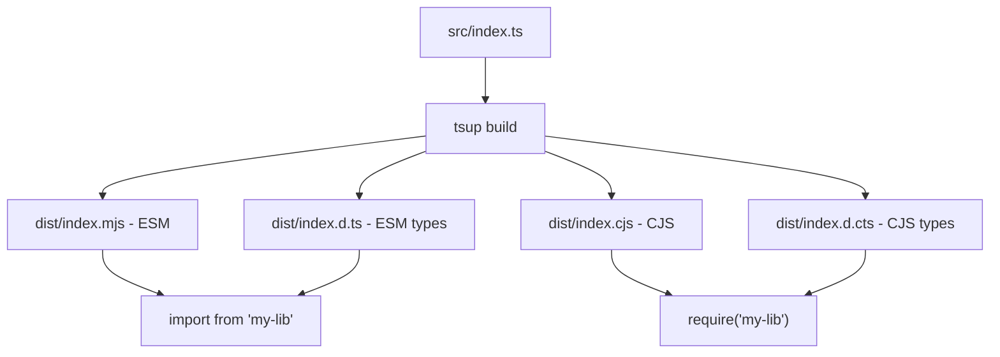

# How to Set Up Dual ESM and CJS Output for Your npm Package

"Just ship ESM, it's 2026."

I hear this a lot. And sure  if every consumer of your package is running Node.js 18+ with ESM, using modern bundlers, and never touching anything legacy, then yes, ESM-only works. But that's not the world most library authors live in.

The reality is that a surprising number of projects still use CommonJS. Enterprise codebases, older test frameworks, scripts that use `require()`, tools like Jest (which only recently got stable ESM support), and Node.js scripts without `"type": "module"`  they all need CJS. If you ship ESM-only, you'll get GitHub issues from frustrated users within the first week.

So you ship both. Here's exactly how to do it with tsup, and the pitfalls I've hit along the way.

## Why You Still Need Both in 2026

Before we get into the config, let me be blunt about why dual output still matters:

- **Jest**  While Jest 30 supports ESM, many projects are still on Jest 29 with CJS transform pipelines. Your ESM-only package breaks their tests.
- **Older Node.js scripts**  Plenty of `node script.js` files without `"type": "module"`. They use `require()`. They're not getting rewritten.
- **Build tools and plugins**  Some Webpack/Rollup plugins still consume CJS internally.
- **Gradual migration**  Teams migrating from CJS to ESM don't flip a switch. They need packages that work in both modes during the transition.

The cost of shipping both is almost zero  tsup makes it trivial. The cost of *not* shipping both is angry users and "doesn't work with require()" issues.

## The tsup Config

Install tsup if you haven't:

```bash
npm install --save-dev tsup typescript
```

Create `tsup.config.ts`:

```typescript
import { defineConfig } from "tsup";

export default defineConfig({
  entry: ["src/index.ts"],
  format: ["esm", "cjs"],
  dts: true,
  splitting: false,
  sourcemap: true,
  clean: true,
  outDir: "dist",
  target: "es2022",
});
```

Run `npx tsup` and you'll get:

```
dist/
├── index.mjs      # ESM output
├── index.cjs      # CJS output
├── index.d.ts     # ESM type declarations
├── index.d.cts    # CJS type declarations
├── index.mjs.map  # ESM source map
└── index.cjs.map  # CJS source map
```

That's it. Two lines in the config  `format: ["esm", "cjs"]` and `dts: true`  and tsup handles everything. No Rollup plugins, no Babel presets, no custom scripts.

> **Tip:** The `dts: true` flag in tsup uses the TypeScript compiler under the hood to generate declaration files. If you have complex types or generics, this is significantly more reliable than trying to generate `.d.ts` files separately with `tsc`.

## The package.json Exports Map

This is the part that wires everything together. Your `package.json` needs to tell Node.js and TypeScript which file to load depending on whether someone uses `import` or `require`:

```json
{
  "name": "my-lib",
  "version": "1.0.0",
  "type": "module",
  "exports": {
    ".": {
      "import": {
        "types": "./dist/index.d.ts",
        "default": "./dist/index.mjs"
      },
      "require": {
        "types": "./dist/index.d.cts",
        "default": "./dist/index.cjs"
      }
    }
  },
  "main": "./dist/index.cjs",
  "module": "./dist/index.mjs",
  "types": "./dist/index.d.ts",
  "files": ["dist"]
}
```

Let me walk through the key decisions:

**`"type": "module"`**  This tells Node.js that your package is ESM by default. Files with `.mjs` are always ESM, files with `.cjs` are always CJS, regardless of this setting. But having `"type": "module"` is the modern convention.

**Separate `types` for import vs require**  This is the part people miss. ESM consumers need `.d.ts`, CJS consumers need `.d.cts`. If you only provide `.d.ts`, TypeScript consumers using `require()` might not resolve your types correctly. tsup generates both when you use `dts: true`.

**`types` before `default`**  Inside each condition block, the `types` entry must come before `default`. TypeScript resolves top-to-bottom and stops at the first match. If `default` is first, TypeScript grabs the `.mjs` file and can't find your types.

For a deeper explanation of how `exports`, `main`, and `module` interact, check out our guide on [package.json exports vs main vs module](/blog/package-json-exports-main-module).

## The Declaration File Situation (.d.ts vs .d.cts)

This trips up a lot of people, so let me be specific.

When your package has `"type": "module"`, Node.js and TypeScript interpret files like this:

| File Extension | Interpreted As |
|---------------|---------------|
| `.mjs` | Always ESM |
| `.cjs` | Always CJS |
| `.js` | ESM (because `"type": "module"`) |
| `.d.ts` | ESM type declarations |
| `.d.cts` | CJS type declarations |
| `.d.mts` | ESM type declarations (explicit) |

So when a CJS consumer does `const lib = require("my-lib")`, TypeScript needs to find a `.d.cts` file to understand the types. If you only ship `.d.ts`, it might work in some setups but fail in others  particularly when consumers have `"moduleResolution": "node16"` or `"bundler"` in their tsconfig.

tsup generates `.d.cts` automatically. If you're using `tsc` directly, you'd need to run it twice with different configs, which is exactly why I recommend tsup instead.

## Testing Both Outputs

Don't trust that "it works on my machine." Actually test both entry points. Here's how I do it:

```bash
# Build the package
npm run build

# Create a tarball
npm pack
```

Then create two test scripts in a temporary directory:

**test-esm.mjs:**
```javascript
import { myFunction } from "my-lib";

const result = myFunction("test");
console.log("ESM import works:", result);
```

**test-cjs.cjs:**
```javascript
const { myFunction } = require("my-lib");

const result = myFunction("test");
console.log("CJS require works:", result);
```

Install the tarball and run both:

```bash
mkdir /tmp/test-dual && cd /tmp/test-dual
npm init -y
npm install /path/to/my-lib-1.0.0.tgz
node test-esm.mjs
node test-cjs.cjs
```

Both should output successfully. If the ESM one fails with "Cannot use import statement," you've got a CJS-only build. If the CJS one fails with "require() of ES Module," your exports map is wrong.

For more testing strategies  including yalc, verdaccio, and npm link  see our guide on [testing npm packages locally before publishing](/blog/test-npm-package-locally-before-publish).

## Common Pitfalls

### 1. Default Export Asymmetry

This is the nastiest gotcha. In ESM:

```typescript
export default function greet() {
  return "hello";
}
```

```javascript
// ESM consumer
import greet from "my-lib";
greet(); // works
```

But in CJS, `default` exports behave differently:

```javascript
// CJS consumer
const greet = require("my-lib");
greet(); // ERROR: greet is not a function
greet.default(); // works, but ugly
```

The `require()` call returns an object with a `default` property, not the default export itself. This is one of the fundamental incompatibilities between the two module systems.

**The fix:** Avoid default exports in libraries. Use named exports instead:

```typescript
// Good  works identically in ESM and CJS
export function greet() {
  return "hello";
}
```

```javascript
// ESM
import { greet } from "my-lib";

// CJS
const { greet } = require("my-lib");
```

Both work. No asymmetry. No confused users.

### 2. Forgetting `"type": "module"` in package.json

Without this, Node.js treats `.js` files as CJS. If tsup outputs `.mjs` and `.cjs` files (which it does by default for dual format), this usually isn't an issue. But if something in your setup generates `.js` files, they'll be misinterpreted.

### 3. Dynamic Imports in CJS Output

If your library uses `await import()` for lazy loading, that works fine in ESM. But in the CJS output, tsup might transform it into `require()`, which is synchronous. This can cause subtle behavior differences. Be cautious with dynamic imports in dual-output packages.

### 4. Not Running `npm pack --dry-run`

Always check what actually gets published:

```bash
npm pack --dry-run
```

Verify that:
- Both `.mjs` and `.cjs` files are included
- Both `.d.ts` and `.d.cts` files are included
- No `src/` or test files leaked in
- The total package size is reasonable



## Multiple Entry Points

If your package has multiple subpath exports, update tsup's `entry` accordingly:

```typescript
import { defineConfig } from "tsup";

export default defineConfig({
  entry: {
    index: "src/index.ts",
    utils: "src/utils.ts",
    types: "src/types.ts",
  },
  format: ["esm", "cjs"],
  dts: true,
  clean: true,
});
```

And mirror that in `package.json` exports:

```json
{
  "exports": {
    ".": {
      "import": { "types": "./dist/index.d.ts", "default": "./dist/index.mjs" },
      "require": { "types": "./dist/index.d.cts", "default": "./dist/index.cjs" }
    },
    "./utils": {
      "import": { "types": "./dist/utils.d.ts", "default": "./dist/utils.mjs" },
      "require": { "types": "./dist/utils.d.cts", "default": "./dist/utils.cjs" }
    }
  }
}
```

Each subpath gets its own ESM + CJS + types mapping. It's a bit verbose, but it's explicit and doesn't break.

If you're converting an existing JavaScript library to TypeScript before setting up dual output, [SnipShift's JS to TypeScript converter](https://snipshift.dev/js-to-ts) can handle the initial type generation  especially useful for utility functions where the types are inferrable from usage patterns.

## The Short Version

1. Use `tsup` with `format: ["esm", "cjs"]` and `dts: true`
2. Set up `exports` in `package.json` with separate `import`/`require` conditions
3. Put `types` before `default` in each condition block
4. Ship `.d.cts` alongside `.d.ts` for CJS type resolution
5. Prefer named exports over default exports to avoid asymmetry
6. Test both `import` and `require` before every publish

The tooling has gotten so much better that dual output is basically free now. There's really no reason not to support both  and your users will thank you for it.

For the complete build-to-publish workflow including CI/CD automation, see our guide on [publishing a TypeScript npm package in 2026](/blog/publish-typescript-npm-package-2026). And for all your code conversion needs, check out [SnipShift's free developer tools](https://snipshift.dev).
