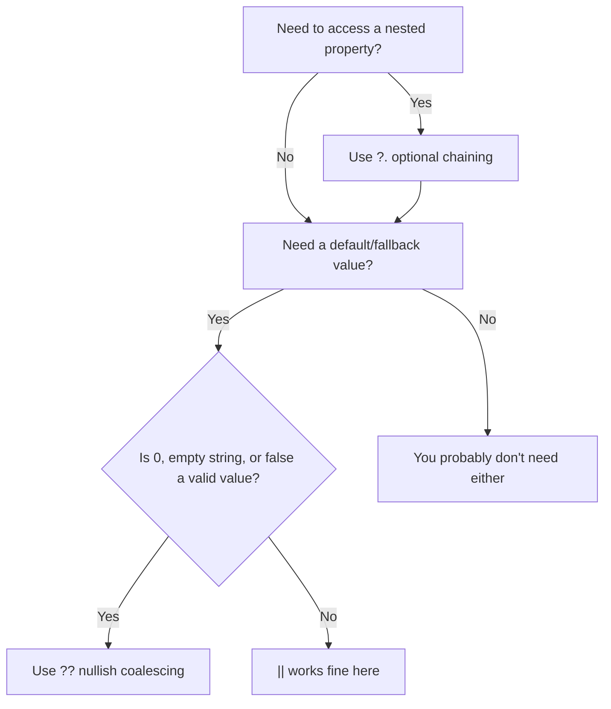

# JavaScript Optional Chaining (?.) and Nullish Coalescing (??) Explained

If you've ever written three nested `if` checks just to safely access a deeply nested property, you already know the pain these two operators were built to fix. The `?.` and `??` operators landed in ES2020, and honestly  they've changed the way I write JavaScript more than almost any other feature in the last five years.

Understanding **javascript optional chaining nullish coalescing** is one of those things that separates code that's pleasant to read from code that makes you squint at your screen during code review. Let me walk you through both, because they're sort of a package deal.

## The Problem: Death by Nested Property Access

Before we get into syntax, let's talk about why these operators exist. Every developer has written something like this at some point:

```javascript
// The old way  defensive programming gone wild
let city;
if (user && user.address && user.address.city) {
  city = user.address.city;
} else {
  city = "Unknown";
}
```

That's six lines to safely grab a single property. And you know what? It gets worse. If `user` comes from an API response, there might be four or five levels of nesting. I worked on an e-commerce app a few years back where the product data from a third-party API was nested seven layers deep. The safety checks looked ridiculous.

The logical OR (`||`) approach was slightly better, but it had its own problems  we'll get to that.

## Optional Chaining (`?.`)  The Basics

Optional chaining lets you read a property deep within a chain of objects without having to check every intermediate value. If anything along the chain is `null` or `undefined`, the whole expression short-circuits and returns `undefined`.

```javascript
// Clean, readable, and safe
const city = user?.address?.city;

// That's it. That's the whole thing.
// If user is null/undefined → returns undefined
// If user.address is null/undefined → returns undefined
// If both exist → returns user.address.city
```

Short. Readable. No cognitive overhead. And it doesn't just work with properties  it works with method calls and bracket notation too.

### Chaining Methods

This is the part that I think a lot of people miss. You can use `?.` to call methods that might not exist:

```javascript
// Call .toString() only if the value exists
const result = response.data?.toString();

// Call a method on an object that might not have it
const length = myArray?.filter(x => x.active)?.length;
```

This comes up all the time when you're working with optional callbacks. I can't count how many times I've seen this pattern in React codebases:

```javascript
// Before: awkward guard clause
if (props.onChange) {
  props.onChange(newValue);
}

// After: one clean line
props.onChange?.(newValue);
```

That `?.(` syntax looks a bit odd the first time you see it. But once you're used to it, going back to the explicit `if` check feels clunky.

### Bracket Notation and Dynamic Keys

Optional chaining works with bracket notation too  useful when your keys are dynamic:

```javascript
const key = "email";
const email = user?.contacts?.[key];

// Array access
const firstItem = apiResponse?.data?.items?.[0];
```

This is particularly handy when you're dealing with arrays that might be empty or missing entirely. Instead of checking if the array exists AND has at least one element, `?.[0]` handles both cases.

## Nullish Coalescing (`??`)  The Default Value Operator That Actually Works

Here's where things get interesting. For years, we've used `||` to provide default values:

```javascript
const port = config.port || 3000;
const name = user.name || "Anonymous";
```

And for years, this has been a source of subtle bugs. Why? Because `||` treats **all falsy values** as "nope, use the default." That includes `0`, `""` (empty string), `false`, and `NaN`  values that are often perfectly valid.

The nullish coalescing operator `??` only kicks in for `null` and `undefined`. Nothing else.

```javascript
const port = config.port ?? 3000;

// If config.port is 0 → port is 0 (correct!)
// If config.port is null → port is 3000
// If config.port is undefined → port is 3000
```

This matters more than you might think. I once spent an embarrassingly long time debugging a form component where a numeric input was "resetting" whenever someone typed `0`. The culprit? `value || defaultValue` was treating `0` as falsy and replacing it with the default. Switching to `??` fixed it instantly.

## `||` vs `??`  The Comparison That Actually Matters

This table is worth bookmarking. It shows exactly how `||` and `??` behave differently with various falsy values:

| Expression | `value \|\| "default"` | `value ?? "default"` |
|---|---|---|
| `value = "hello"` | `"hello"` | `"hello"` |
| `value = 42` | `42` | `42` |
| `value = 0` | `"default"` | `0` |
| `value = ""` | `"default"` | `""` |
| `value = false` | `"default"` | `false` |
| `value = NaN` | `"default"` | `NaN` |
| `value = null` | `"default"` | `"default"` |
| `value = undefined` | `"default"` | `"default"` |

See the difference? With `||`, you lose `0`, empty strings, `false`, and `NaN`. With `??`, you only lose `null` and `undefined`  which is almost always what you actually want when you're providing fallback values.

**My rule of thumb:** use `??` by default, and only reach for `||` when you genuinely want to treat all falsy values as "missing." That second case comes up way less often than you'd expect.

## Combining `?.` and `??`  The Real Power Move

These two operators were designed to work together. Optional chaining gives you `undefined` when a property is missing, and nullish coalescing catches that `undefined` and provides a default. It's kind of elegant, honestly.

```javascript
// Get the user's city, or fall back to "Not specified"
const city = user?.address?.city ?? "Not specified";

// Get the first item's price, or default to 0
const price = order?.items?.[0]?.price ?? 0;

// Get the response message, or a fallback
const message = apiResponse?.data?.message ?? "Something went wrong";
```

Compare that to the old way:

```javascript
// The 2018 approach
const city = user && user.address && user.address.city
  ? user.address.city
  : "Not specified";
```

Night and day. And the new version is easier to scan during code review too  you can read it left to right and immediately understand the intent.

## Real-World Example: Handling API Responses

Let's put this together with something realistic. Say you're fetching user profile data from an API, and the response shape isn't always consistent  because that's just how third-party APIs work.

```javascript
async function getUserDisplay(userId) {
  const response = await fetch(`/api/users/${userId}`);
  const data = await response.json();

  return {
    // Name with fallback
    displayName: data?.user?.profile?.displayName
      ?? data?.user?.name
      ?? "Unknown User",

    // Avatar URL  might be nested differently
    avatar: data?.user?.profile?.avatarUrl
      ?? data?.user?.avatar
      ?? "/images/default-avatar.png",

    // Numeric value where 0 is valid
    followerCount: data?.user?.stats?.followers ?? 0,

    // Boolean where false is a valid value
    isVerified: data?.user?.verification?.status ?? false,

    // Safely call a method if it exists
    formattedDate: data?.user?.createdAt?.toLocaleDateString?.()
      ?? "Date unavailable",
  };
}
```

Notice how `??` preserves `0` for `followerCount` and `false` for `isVerified`. If we'd used `||` there, a user with zero followers would show some default number, and an unverified user might accidentally appear verified. Those are the bugs that slip through QA and show up in production at 2am.

## How This Plays with TypeScript

If you're working with TypeScript  and honestly, in 2026, most teams are  optional chaining and nullish coalescing integrate beautifully with the type system. TypeScript narrows types automatically based on these operators.

```typescript
interface User {
  name: string;
  address?: {
    city?: string;
    zip?: string;
  };
  settings?: {
    theme?: "light" | "dark";
    notifications?: boolean;
  };
}

function getTheme(user: User): "light" | "dark" {
  // TypeScript knows this returns "light" | "dark", not undefined
  return user.settings?.theme ?? "light";
}

function getCityUpper(user: User): string {
  // Without ?., TypeScript would complain that address might be undefined
  // With it, TS knows the whole expression might be undefined
  // And ?? catches that undefined
  return user.address?.city?.toUpperCase() ?? "NO CITY";
}
```

The type inference just works. TypeScript understands that `user.settings?.theme` could be `"light" | "dark" | undefined`, and that adding `?? "light"` narrows it back to `"light" | "dark"`. No extra type assertions needed.

If you're converting JavaScript to TypeScript and want to see how your existing code can use these patterns with proper types, [SnipShift's JS to TypeScript converter](https://snipshift.dev/js-to-ts) can help. Paste your JS code in and it'll generate typed output  including suggesting where optional chaining and proper nullish defaults fit.

## Decision Flow: When to Use What

Here's a quick mental model for choosing between `?.`, `??`, and `||`:



## Common Gotchas

A few things that trip people up:

**You can't use `?.` on the left side of an assignment.** This doesn't work:

```javascript
// ❌ SyntaxError
user?.name = "Alice";

// ✅ You need a guard
if (user) {
  user.name = "Alice";
}
```

**You can't mix `??` with `||` or `&&` without parentheses.** JavaScript requires explicit grouping to avoid ambiguity:

```javascript
// ❌ SyntaxError
const value = a || b ?? c;

// ✅ Add parentheses
const value = (a || b) ?? c;
const value = a || (b ?? c);
```

**Optional chaining short-circuits the entire chain**, not just the next property. So `user?.address.city` won't throw if `user` is null  but it WILL throw if `user` exists and `user.address` is null. You need `user?.address?.city` if both could be missing.

> **Tip:** When you're dealing with deeply nested data from external APIs, it's usually safer to chain `?.` at every level. The performance cost is negligible, and you'll save yourself from surprise `TypeError: Cannot read properties of undefined` crashes.

## Browser Support and Compatibility

Both operators have been supported in all major browsers since 2020. Node.js has had them since v14. At this point, unless you're targeting Internet Explorer  and please don't  you can use them freely. If you're curious about broader JavaScript-to-TypeScript conversion patterns, check out our post on [how to convert JavaScript to TypeScript](/blog/convert-javascript-to-typescript).

And if you want to go deeper on modern JS syntax, our guide on [JavaScript destructuring](/blog/javascript-destructuring-explained) covers another feature that pairs really well with optional chaining. Understanding the [difference between JavaScript objects and JSON](/blog/javascript-object-vs-json) is also worth your time  especially when you're handling API responses where these operators shine.

## Wrapping Up

Optional chaining and nullish coalescing aren't flashy features. They don't get the conference talks or the Twitter hype. But they're the kind of operators that quietly make your codebase better every single day. Less defensive boilerplate, fewer default-value bugs, more readable code.

My advice? Go through a file in your project right now and look for nested `if` checks and `||` default patterns. Refactor a few of them to use `?.` and `??`. You'll feel the difference immediately  and your teammates will appreciate it in the next code review.

If you want to experiment with converting JavaScript code that uses these patterns into properly typed TypeScript, give [SnipShift](https://snipshift.dev) a spin. It handles the type inference so you can focus on the logic.
