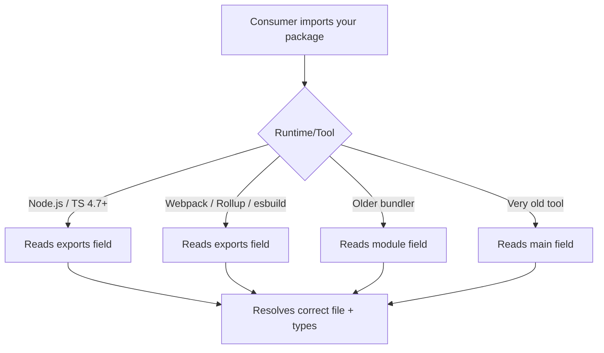

# package.json 'exports' vs 'main' vs 'module': Which Fields Do You Need?

If you've ever opened a `package.json` and seen `main`, `module`, `types`, `exports`, `typings`, and `typesVersions` all sitting there together  yeah, I get it. It's confusing. Some of these fields have been around since npm's earliest days, some were invented by bundlers, and one of them (`exports`) essentially replaced all the others. But not really. Because backwards compatibility.

I'm going to walk you through the history, what each field actually does, who reads it, and what the minimum viable `package.json` looks like in 2026. By the end, you'll know exactly which fields your package needs and which ones you can drop.

## A Brief History: How We Got Here

### The `main` Field (The OG)

`main` has been around since the beginning of npm. It tells Node.js: "when someone does `require('your-package')`, load this file."

```json
{
  "main": "index.js"
}
```

That's it. One field, one entry point, CommonJS only. For years, this was all you needed.

### The `module` Field (The Bundler Invention)

Around 2015-2016, bundlers like Webpack and Rollup wanted to consume ES modules for better tree-shaking. But Node.js didn't support ESM yet, so they couldn't use `main` (which pointed to CJS).

The solution? Bundlers informally agreed on a `module` field:

```json
{
  "main": "dist/index.cjs",
  "module": "dist/index.mjs"
}
```

Node.js completely ignores `module`. It's not part of any spec. Webpack, Rollup, and esbuild read it, but Node.js itself pretends it doesn't exist.

> **Tip:** The `module` field was never standardized by Node.js or npm. It's a community convention that bundlers chose to support. This is why you'll find mixed advice about whether to include it.

### The `exports` Field (The Modern Standard)

Node.js 12.7 introduced the `exports` field, and by Node.js 16 it was stable. This is the official, spec-backed way to define your package's entry points. And it's significantly more powerful than `main`.

```json
{
  "exports": {
    ".": {
      "import": "./dist/index.mjs",
      "require": "./dist/index.cjs"
    }
  }
}
```

With `exports`, you can:
- Define different files for ESM vs CJS consumers
- Expose multiple subpath entry points
- Restrict which files consumers can import (encapsulation)
- Provide TypeScript type declarations per condition

The `exports` field **takes precedence** over `main` and `module` when present. Modern Node.js, TypeScript (4.7+), and all major bundlers respect it.

## How Each Tool Resolves Your Package

This is the part that actually matters. Different tools read different fields, and the resolution order varies:

| Tool / Runtime | Resolution Order |
|---------------|-----------------|
| **Node.js (ESM)** | `exports` → `main` |
| **Node.js (CJS)** | `exports` → `main` |
| **TypeScript** | `exports.types` → `types` → `typings` → inferred from `main` |
| **Webpack 5+** | `exports` → `module` → `main` |
| **Rollup** | `exports` → `module` → `main` |
| **esbuild** | `exports` → `module` → `main` |
| **Vite** | `exports` → `module` → `main` (uses esbuild + Rollup) |
| **Older bundlers** | `module` → `main` |

The key insight: **`exports` wins everywhere modern**. `main` is the universal fallback. `module` is only relevant for bundlers, and even they prefer `exports` now.

## Conditional Exports Explained

The real power of `exports` is conditional resolution. You can serve different files based on how consumers import your package:

```json
{
  "exports": {
    ".": {
      "import": {
        "types": "./dist/index.d.ts",
        "default": "./dist/index.mjs"
      },
      "require": {
        "types": "./dist/index.d.cts",
        "default": "./dist/index.cjs"
      }
    }
  }
}
```

Node.js matches conditions top-to-bottom and uses the first match. This ordering matters  especially for TypeScript.

### The `types` Condition Must Come First

This is a gotcha that bites a lot of people. TypeScript resolves the `types` condition inside `exports`, but it uses the **first matching condition**. So if you write this:

```json
{
  "exports": {
    ".": {
      "import": {
        "default": "./dist/index.mjs",
        "types": "./dist/index.d.ts"
      }
    }
  }
}
```

TypeScript might not find your types because `default` matches first and doesn't point to a `.d.ts` file. Always put `types` before `default`:

```json
{
  "exports": {
    ".": {
      "import": {
        "types": "./dist/index.d.ts",
        "default": "./dist/index.mjs"
      }
    }
  }
}
```

> **Warning:** This ordering issue is the single most common cause of "I can't find types for this package" errors when the types clearly exist. If someone reports missing types, check the condition order first.

## Subpath Exports

Want to let users import specific modules from your package? Subpath exports:

```json
{
  "exports": {
    ".": {
      "import": "./dist/index.mjs",
      "require": "./dist/index.cjs"
    },
    "./utils": {
      "import": "./dist/utils.mjs",
      "require": "./dist/utils.cjs"
    },
    "./types": {
      "types": "./dist/types.d.ts"
    }
  }
}
```

Now consumers can do:

```typescript
import { deepMerge } from "my-lib";        // main entry
import { slugify } from "my-lib/utils";     // subpath
import type { Config } from "my-lib/types"; // types-only subpath
```

One thing to be aware of: when you define `exports`, you're also defining **what consumers can't import**. Any path not listed in `exports` is blocked. So `import something from "my-lib/dist/internal"` would throw an error. This is actually a feature  it prevents people from depending on your internal file structure.

## TypeScript's `typesVersions` (The Legacy Escape Hatch)

Before TypeScript supported the `exports` field (pre-4.7), the only way to map subpath imports to declaration files was `typesVersions`:

```json
{
  "typesVersions": {
    "*": {
      "utils": ["dist/utils.d.ts"],
      "types": ["dist/types.d.ts"]
    }
  }
}
```

You only need this if you're supporting TypeScript versions older than 4.7. For new packages in 2026, skip it entirely. The `types` condition inside `exports` handles everything.

## The Minimum Viable package.json for 2026

Here's what I'd recommend for a new TypeScript package today. Not the maximum  the minimum that works correctly everywhere:

```json
{
  "name": "my-package",
  "version": "1.0.0",
  "type": "module",
  "exports": {
    ".": {
      "import": {
        "types": "./dist/index.d.ts",
        "default": "./dist/index.mjs"
      },
      "require": {
        "types": "./dist/index.d.cts",
        "default": "./dist/index.cjs"
      }
    }
  },
  "main": "./dist/index.cjs",
  "types": "./dist/index.d.ts",
  "files": ["dist"]
}
```

That's 20 lines. Here's why each part is there:

- **`exports`**  The primary resolution mechanism for Node.js, TypeScript, and bundlers
- **`main`**  Fallback for older tools that don't read `exports`
- **`types`**  Fallback for older TypeScript versions that don't read `exports`
- **`files`**  Controls what gets published to npm

And here's what you can probably drop:

- **`module`**  Every modern bundler reads `exports` now. Include it if you want maximum compatibility, but it's not required.
- **`typings`**  Alias for `types`. Pick one. `types` is the standard.
- **`typesVersions`**  Only needed if supporting TypeScript < 4.7. In 2026, that's ancient history.



## Should You Include `module` in 2026?

Honestly? It doesn't hurt. It's one extra line, and it helps if someone's using an older version of Webpack or a niche bundler. My rule: include it if your build tool generates both `.mjs` and `.cjs` anyway (tsup does), drop it if you're trying to keep things absolutely minimal.

```json
{
  "main": "./dist/index.cjs",
  "module": "./dist/index.mjs",
  "exports": { "...": "..." }
}
```

That extra `module` line is free insurance. But `exports` is the one that actually matters.

## Quick Reference: Which Fields to Use When

| Scenario | Fields Needed |
|----------|--------------|
| ESM-only package (Node 18+) | `exports`, `type: "module"` |
| Dual ESM + CJS | `exports` (with import/require), `main`, `types` |
| Library consumed by bundlers | `exports`, `main`, optionally `module` |
| TypeScript library | `exports` with `types` conditions, top-level `types` |
| Monorepo internal package | `exports` is usually enough |

If you're building a TypeScript npm package from scratch and want the full setup  build tooling, versioning, CI/CD  check out our complete guide on [publishing a TypeScript npm package in 2026](/blog/publish-typescript-npm-package-2026).

And if you're working with JSON data that needs TypeScript types  API responses, config files, that sort of thing  [SnipShift's JSON to TypeScript converter](https://snipshift.dev/json-to-typescript) can generate interfaces automatically. Useful when you're defining the types your package will export.

The bottom line: `exports` is the only field that matters for modern consumers. Keep `main` and `types` as fallbacks, add `module` if you want, and forget `typesVersions` ever existed. Your package.json will thank you.
