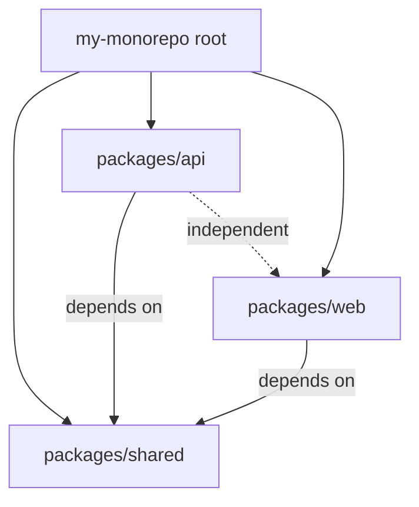

# How to Set Up Monorepo with pnpm Workspaces and TypeScript

Monorepos are one of those things that sound great in theory and then punish you with obscure build errors for weeks. I've set up probably five or six monorepos over the years using different tools  Lerna, Nx, Turborepo, yarn workspaces  and the setup I keep coming back to is pnpm workspaces with TypeScript. It's the simplest one that actually works without pulling in a massive build orchestration framework.

If you're starting a new pnpm workspaces TypeScript monorepo or converting an existing multi-repo setup, here's the approach that's worked for me  including the gotchas that took me way too long to figure out the first time.

## Why pnpm Workspaces?

Quick pitch: pnpm is fast, disk-efficient (it uses a content-addressable store instead of copying node_modules everywhere), and its workspace support is built-in. You don't need Lerna or any additional tooling. It just works.

| Feature | npm Workspaces | Yarn Workspaces | pnpm Workspaces |
|---------|---------------|----------------|-----------------|
| Speed | Slowest | Medium | Fastest |
| Disk usage | High (hoisted) | High (hoisted) | Low (symlinked) |
| Strictness | Loose | Loose | Strict by default |
| Phantom deps | Allowed | Allowed | Blocked |
| Built-in | npm 7+ | Yarn 1.x+ | pnpm 1.x+ |
| Peer deps | Auto-installed | Auto-installed | Must be explicit |

That "strict by default" bit is important. pnpm doesn't hoist packages the way npm and yarn do, which means a package can only import dependencies it explicitly declares in its own `package.json`. This prevents the "phantom dependency" problem where Package A accidentally imports something that only Package B declared as a dependency  and it works locally because of hoisting, then breaks in production.

## Project Structure

Here's the structure I use. Nothing revolutionary  just a `packages/` directory with each package as a subdirectory:

```
my-monorepo/
├── package.json
├── pnpm-workspace.yaml
├── tsconfig.base.json
├── packages/
│   ├── shared/
│   │   ├── package.json
│   │   ├── tsconfig.json
│   │   └── src/
│   │       └── index.ts
│   ├── api/
│   │   ├── package.json
│   │   ├── tsconfig.json
│   │   └── src/
│   │       └── index.ts
│   └── web/
│       ├── package.json
│       ├── tsconfig.json
│       └── src/
│           └── index.ts
```



The `shared` package contains utilities, types, and constants used by both `api` and `web`. The `api` and `web` packages are independent of each other but both depend on `shared`.

## Step 1: Initialize the Root

```bash
mkdir my-monorepo && cd my-monorepo
pnpm init
```

Create `pnpm-workspace.yaml` at the root:

```yaml
# pnpm-workspace.yaml
packages:
  - "packages/*"
```

This tells pnpm that every directory inside `packages/` is a workspace package. You can also add `apps/*` if you want to separate libraries and applications:

```yaml
packages:
  - "packages/*"
  - "apps/*"
```

## Step 2: Create the Shared Package

```bash
mkdir -p packages/shared/src
cd packages/shared
pnpm init
```

Edit `packages/shared/package.json`:

```json
{
  "name": "@myorg/shared",
  "version": "1.0.0",
  "main": "./src/index.ts",
  "types": "./src/index.ts",
  "scripts": {
    "build": "tsc --build",
    "dev": "tsc --build --watch"
  }
}
```

Notice `main` and `types` both point to the TypeScript source directly. This is the "internal packages" pattern  during development, other packages import the raw `.ts` files instead of compiled `.js`. This means you get instant type checking across packages without building first.

> **Tip:** For packages you publish to npm, you'd point `main` to `./dist/index.js` and `types` to `./dist/index.d.ts`. But for internal workspace packages, pointing to source is simpler and faster.

Create a simple module:

```typescript
// packages/shared/src/index.ts
export function formatCurrency(amount: number, currency = "USD"): string {
  return new Intl.NumberFormat("en-US", {
    style: "currency",
    currency,
  }).format(amount);
}

export interface User {
  id: string;
  name: string;
  email: string;
  role: "admin" | "user" | "viewer";
}
```

## Step 3: Set Up Shared TypeScript Config

Create `tsconfig.base.json` at the monorepo root:

```json
{
  "compilerOptions": {
    "target": "ES2022",
    "module": "ESNext",
    "moduleResolution": "bundler",
    "strict": true,
    "esModuleInterop": true,
    "resolveJsonModule": true,
    "isolatedModules": true,
    "declaration": true,
    "declarationMap": true,
    "sourceMap": true,
    "composite": true,
    "skipLibCheck": true
  }
}
```

Two options to note here: `composite: true` and `declarationMap: true`. The `composite` flag enables TypeScript project references, which lets the compiler understand dependencies between packages and build them in the right order. `declarationMap` ensures "Go to Definition" in your editor jumps to the actual `.ts` source, not a `.d.ts` file.

Each package extends this base:

```json
// packages/shared/tsconfig.json
{
  "extends": "../../tsconfig.base.json",
  "compilerOptions": {
    "outDir": "./dist",
    "rootDir": "./src"
  },
  "include": ["src/**/*"]
}
```

```json
// packages/api/tsconfig.json
{
  "extends": "../../tsconfig.base.json",
  "compilerOptions": {
    "outDir": "./dist",
    "rootDir": "./src"
  },
  "include": ["src/**/*"],
  "references": [
    { "path": "../shared" }
  ]
}
```

The `references` array tells TypeScript that `api` depends on `shared`. When you run `tsc --build` in the api package, TypeScript builds `shared` first if it's out of date.

For a deeper look at every tsconfig option in this setup, check out our [complete tsconfig.json reference](/blog/tsconfig-json-every-option-explained).

## Step 4: Wire Up Cross-Package Dependencies

In the `api` package, add `shared` as a workspace dependency:

```bash
cd packages/api
pnpm add @myorg/shared --workspace
```

This adds the following to `packages/api/package.json`:

```json
{
  "dependencies": {
    "@myorg/shared": "workspace:*"
  }
}
```

The `workspace:*` protocol tells pnpm to resolve this package from the workspace, not from npm. Now you can import from it:

```typescript
// packages/api/src/index.ts
import { formatCurrency, type User } from "@myorg/shared";

const user: User = {
  id: "1",
  name: "Sarah",
  email: "sarah@example.com",
  role: "admin",
};

console.log(`User: ${user.name}`);
console.log(`Balance: ${formatCurrency(1234.56)}`);
```

Full type checking, auto-complete, go-to-definition  all working across packages. No build step needed for the dev experience.

## Step 5: Root-Level Scripts

Add convenience scripts to the root `package.json`:

```json
{
  "scripts": {
    "build": "pnpm -r run build",
    "dev": "pnpm -r --parallel run dev",
    "lint": "pnpm -r run lint",
    "test": "pnpm -r run test",
    "typecheck": "tsc --build packages/*/tsconfig.json"
  }
}
```

The `-r` flag runs the script in all workspace packages. `--parallel` runs them concurrently (useful for `dev` scripts). And `tsc --build` with multiple tsconfig paths type-checks all packages respecting their dependency order.

## Build Order

This is where people get tripped up. In a monorepo, packages have dependencies on each other, so they need to build in the right order. If `api` depends on `shared`, then `shared` must build first.

pnpm handles this automatically with `pnpm -r run build`  it resolves the dependency graph and runs builds in topological order. But if you want more control (parallel builds, caching, selective rebuilds), consider adding Turborepo:

```bash
pnpm add -D turbo -w
```

```json
// turbo.json
{
  "tasks": {
    "build": {
      "dependsOn": ["^build"],
      "outputs": ["dist/**"]
    },
    "dev": {
      "persistent": true,
      "cache": false
    },
    "test": {
      "dependsOn": ["build"]
    }
  }
}
```

The `^build` syntax means "build my dependencies first." Turborepo caches outputs, so if `shared` hasn't changed, it skips the build entirely. On a monorepo with 10+ packages, this makes a huge difference.

## Common Gotchas

**"Cannot find module '@myorg/shared'"**  Make sure you ran `pnpm install` at the root after adding the workspace dependency. Also check that the package name in `shared/package.json` matches what you're importing.

**Declaration files not generated**  You need `composite: true` and `declaration: true` in your tsconfig. The `composite` flag is what enables `.d.ts` generation as part of project references. Without it, `tsc --build` won't produce declaration files.

**Module resolution issues**  If you're pointing `main` to TypeScript source files (`./src/index.ts`), your consuming bundler needs to support this. Next.js, Vite, and esbuild handle it fine. But if you're using a tool that only understands `.js`, you'll need to build first and point `main` to `./dist/index.js`.

**Phantom dependency errors**  This is pnpm being strict, which is a good thing. If Package A tries to import something that only Package B declares as a dependency, pnpm blocks it. Fix: add the dependency explicitly to Package A's `package.json`.

**TypeScript version mismatch**  Install TypeScript once at the root and let all packages use it:

```bash
pnpm add -D typescript -w
```

The `-w` flag installs it at the workspace root. All packages share this version. Having different TypeScript versions across packages is a recipe for bizarre type errors.

**Peer dependency warnings**  pnpm is strict about peer deps. If a package expects `react` as a peer dependency, you need to install it in each package that uses it, or configure `pnpm` to hoist it:

```yaml
# .npmrc
public-hoist-pattern[]=*react*
```

But be selective about what you hoist. The whole point of pnpm's strictness is preventing the dependency chaos that npm and yarn allow.

## When Not to Use a Monorepo

I should mention  monorepos aren't always the answer. If your packages are independently versioned, deployed to npm, and don't share much code, separate repos with clear API contracts might be simpler. A monorepo shines when you have tightly coupled packages that change together and benefit from shared tooling and atomic commits.

For converting JavaScript packages to TypeScript within your monorepo, [SnipShift's JS to TS converter](https://snipshift.dev/js-to-ts) can handle individual files while you set up the shared tsconfig. And if your packages exchange JSON data, the [JSON to TypeScript generator](https://snipshift.dev/json-to-typescript) is handy for creating shared interfaces from API responses.

For more on the TypeScript configuration side, our [tsconfig.json reference](/blog/tsconfig-json-every-option-explained) covers `composite`, `references`, and everything else you'll need. And check out our guide on [absolute imports with tsconfig paths](/blog/absolute-imports-nextjs-tsconfig) for cleaner imports within each package. All our tools are free at [snipshift.dev](https://snipshift.dev).
