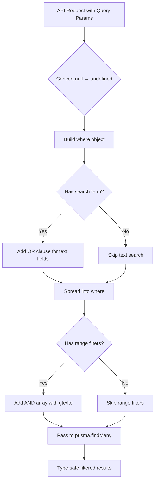

# How to Do Conditional Where Clauses in Prisma (Dynamic Filtering)

Every API endpoint I've ever built eventually needs some kind of filtering. Users want to search by name, filter by status, maybe narrow down by date range  and they want all of these to be optional. The first time you try to build a **prisma conditional where clause**, it feels like it should be simple. And it is, once you know the trick.

But I've seen teams write some truly horrific if/else chains trying to build dynamic queries with Prisma. Nested ternaries, manual string concatenation (please don't), entire utility classes that do what Prisma already handles natively. So let me save you the trouble.

## The Key Insight: Prisma Ignores `undefined`

Here's the thing nobody tells you upfront about Prisma's where clause  if you pass `undefined` as a field value, Prisma just skips that filter entirely. It doesn't throw an error. It doesn't filter for null. It simply pretends that field isn't there.

This is the foundation of every dynamic filtering pattern in Prisma.

```typescript
const users = await prisma.user.findMany({
  where: {
    name: nameFilter,       // if nameFilter is undefined, this is ignored
    status: statusFilter,   // same here
    role: roleFilter,       // and here
  },
});
```

If `nameFilter` is `"Alice"`, Prisma filters by name. If it's `undefined`, Prisma ignores it entirely. No conditionals needed.

This means you can take query parameters straight from a request and spread them into a where object without worrying about which ones the user actually provided.

## Building a Dynamic Where Object from API Query Params

Let's say you've got a typical REST endpoint that accepts optional filters. Here's how I'd actually write it in a real project:

```typescript
// GET /api/users?status=active&role=admin&search=alice
export async function getUsers(req: Request) {
  const { searchParams } = new URL(req.url);

  const status = searchParams.get("status") || undefined;
  const role = searchParams.get("role") || undefined;
  const search = searchParams.get("search") || undefined;

  const users = await prisma.user.findMany({
    where: {
      status,
      role,
      // Only add the name search if `search` is provided
      ...(search && {
        name: {
          contains: search,
          mode: "insensitive" as const,
        },
      }),
    },
  });

  return users;
}
```

Notice the `|| undefined` pattern. Query params come back as `string | null`, and Prisma treats `null` differently from `undefined`  `null` means "filter for records where this field IS null", which is probably not what you want. Converting `null` to `undefined` makes the filter opt-in.

> **Tip:** Always convert `null` query params to `undefined` before passing them to Prisma. The difference between `null` and `undefined` in a Prisma where clause is the difference between "find records where status is null" and "don't filter by status at all."

## Composing Filters with AND, OR, and NOT

For more complex filtering  say you want users who match a search term across multiple fields  Prisma's `AND`, `OR`, and `NOT` operators work exactly how you'd expect, and they also respect the `undefined`-skipping behavior.

### OR: Match Across Multiple Fields

```typescript
const where: Prisma.UserWhereInput = {
  ...(search && {
    OR: [
      { name: { contains: search, mode: "insensitive" } },
      { email: { contains: search, mode: "insensitive" } },
      { bio: { contains: search, mode: "insensitive" } },
    ],
  }),
  status: status || undefined,
};

const users = await prisma.user.findMany({ where });
```

The spread pattern with `&&` is your best friend here. If `search` is falsy, the entire `OR` block gets skipped. Clean and readable.

### AND: Combine Multiple Conditions

Sometimes you need to stack conditions that all must be true, especially when you're building up filters from different sources:

```typescript
const filters: Prisma.UserWhereInput[] = [];

if (minAge) {
  filters.push({ age: { gte: parseInt(minAge) } });
}
if (maxAge) {
  filters.push({ age: { lte: parseInt(maxAge) } });
}
if (department) {
  filters.push({ department: { name: department } });
}

const users = await prisma.user.findMany({
  where: {
    AND: filters.length > 0 ? filters : undefined,
    status: "active",
  },
});
```

Pushing conditions into an array and passing them to `AND` is cleaner than nesting ternaries  I've done both, and the array approach wins every time when you have more than two or three optional filters.

### NOT: Exclude Results

`NOT` follows the same pattern. Want to let users exclude certain statuses?

```typescript
const excludeStatus = searchParams.get("exclude") || undefined;

const users = await prisma.user.findMany({
  where: {
    NOT: excludeStatus ? { status: excludeStatus } : undefined,
  },
});
```

## A Reusable Filter Builder Pattern

On projects with a lot of list endpoints, I've found it useful to extract the filter-building logic into a small helper. Nothing fancy  just a function that takes query params and returns a typed `WhereInput`:

```typescript
import { Prisma } from "@prisma/client";

type UserFilters = {
  search?: string;
  status?: string;
  role?: string;
  createdAfter?: string;
  createdBefore?: string;
};

function buildUserWhere(filters: UserFilters): Prisma.UserWhereInput {
  const { search, status, role, createdAfter, createdBefore } = filters;

  return {
    status: status || undefined,
    role: role || undefined,
    ...(search && {
      OR: [
        { name: { contains: search, mode: "insensitive" } },
        { email: { contains: search, mode: "insensitive" } },
      ],
    }),
    ...(createdAfter || createdBefore
      ? {
          createdAt: {
            ...(createdAfter && { gte: new Date(createdAfter) }),
            ...(createdBefore && { lte: new Date(createdBefore) }),
          },
        }
      : {}),
  };
}
```

Now every route handler that lists users just calls `buildUserWhere(params)` and passes it to `findMany`. If your filtering requirements change, there's one place to update.

If you're working with SQL schemas and want to generate TypeScript types from them, [SnipShift's SQL to TypeScript converter](https://snipshift.dev/sql-to-typescript) can save you a lot of manual type-writing  paste your schema, get typed interfaces back.

## Quick Reference: Dynamic Where Patterns

| Pattern | When to Use | Example |
|---|---|---|
| `field: value \|\| undefined` | Simple optional equality filter | `status: status \|\| undefined` |
| `...(val && { field: { contains: val } })` | Conditional partial match | Searching by name |
| `OR: [...]` with spread | Search across multiple fields | Name OR email match |
| `AND: filters` array | Stacking multiple optional conditions | Age range + department |
| `NOT: condition \|\| undefined` | Optional exclusion | Excluding a status |
| Null to undefined conversion | Query params from HTTP requests | `param \|\| undefined` |

## Common Mistakes to Avoid

**Don't use `null` when you mean `undefined`.** I see this constantly. Someone writes `status: params.status ?? null` thinking it means "no filter." But Prisma interprets `null` as "where status IS NULL in the database." That's a completely different query.

**Don't build where clauses with string concatenation.** If you're coming from raw SQL habits, you might be tempted to build query strings. Prisma's type-safe query builder exists for a reason  use it. You get autocomplete, type checking, and protection against injection all for free.

**Don't forget `mode: "insensitive"` for text search.** By default, Prisma's `contains` is case-sensitive on PostgreSQL. Your users probably expect case-insensitive search. Add `mode: "insensitive"` to any text filter, or your support inbox will fill up with "search is broken" tickets.



## Wrapping Up

The **prisma conditional where clause** pattern comes down to one thing: Prisma ignores `undefined`. Once that clicks, building dynamic filters is just spreading objects conditionally. No if/else chains, no query builders, no third-party libraries.

For the majority of filtering use cases  optional search, multi-field OR queries, date ranges, status exclusions  the patterns above cover it. And they're all type-safe out of the box, which means your IDE catches filter typos before your users do.

If you're also building typed API endpoints, you might find our guide on [building REST APIs with TypeScript and Express](/blog/rest-api-typescript-express-guide) useful. And if you're running into connection issues after adding all these queries, check out [how to fix the "too many connections" error with Prisma and Next.js](/blog/prisma-nextjs-too-many-connections-fix).

For more developer tools and converters, check out [SnipShift's full toolkit](https://snipshift.dev)  we've got 20+ free converters for TypeScript, JSON, CSS, and more.
