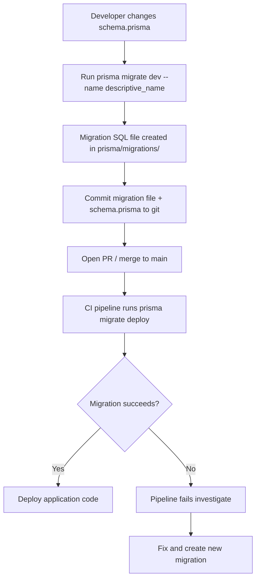
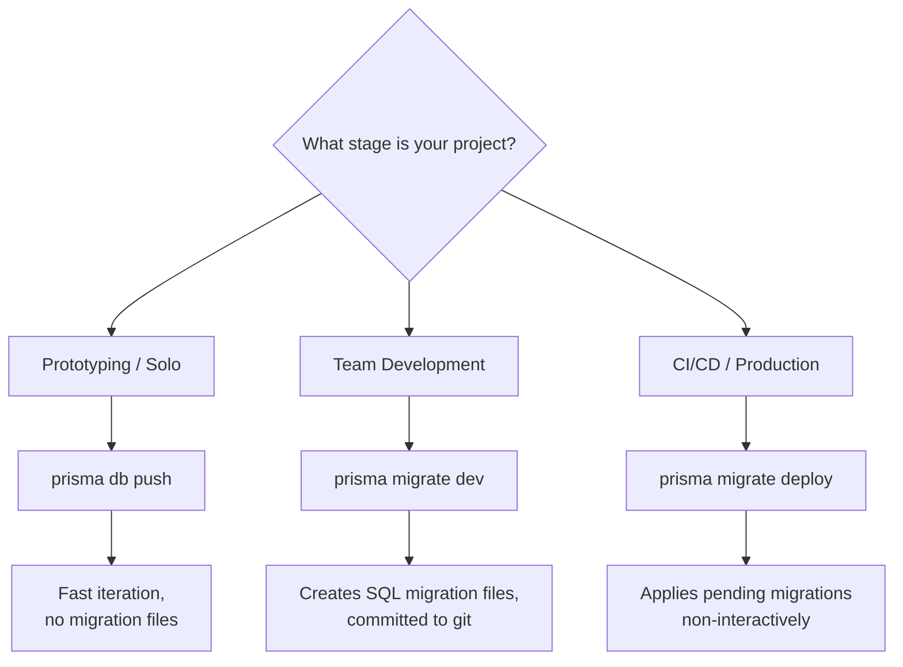

# How to Handle Prisma Migrations in Production (Without Breaking Things)

There's a moment in every project's life where someone on the team says, "Okay, how do we actually deploy this schema change?" And then everyone goes quiet because nobody's thought about the **Prisma migrations production** workflow yet.

I've been through this exact scenario more times than I'd like to admit. Local development with Prisma is a breeze  you run `prisma migrate dev`, it creates a migration file, applies it, and life is good. But production is a different beast. One wrong move and you're staring at a locked database at 2am trying to figure out why your deploy rolled back.

This guide is the one I wish I'd had the first time I shipped Prisma to production.

## Dev vs Production: Two Different Commands

This is the first thing that trips people up. Prisma has two separate migration commands, and using the wrong one in the wrong environment will ruin your day.

| Command | Environment | What It Does |
|---|---|---|
| `prisma migrate dev` | Development | Creates migration files, applies them, re-generates client, seeds (optional) |
| `prisma migrate deploy` | Production / CI | Applies pending migration files. That's it. No generation, no prompts. |
| `prisma db push` | Prototyping | Pushes schema changes directly. No migration files created. |

**`prisma migrate dev`** is interactive. It might prompt you to reset the database if it detects drift. It creates new migration files in `prisma/migrations/`. It's the command you use while building features locally.

**`prisma migrate deploy`** is non-interactive. It looks at the `prisma/migrations/` folder, compares it with the `_prisma_migrations` table in your database, and applies any pending migrations in order. It never creates files, never prompts, never resets anything. This is the one you run in production.

> **Warning:** Never run `prisma migrate dev` in production. It can reset your database if it detects schema drift. I've seen this happen. It's exactly as bad as it sounds.

## The Migration Workflow for Teams

Here's the workflow that's worked well for me across multiple teams. It's not the only way to do it, but it avoids the most common pitfalls.



The key insight: **migration files are source code**. They go in git, they get reviewed in PRs, and they deploy through your CI pipeline like everything else. Don't treat them as throwaway artifacts.

### Step by Step

1. **Developer modifies `schema.prisma`**  adds a field, changes a relation, whatever the feature requires.

2. **Run `prisma migrate dev --name add_user_avatar`**  this generates a timestamped SQL migration file and applies it locally. Always use descriptive names. Your future self will thank you when scrolling through 50 migration folders.

3. **Review the generated SQL**  yes, actually read it. Prisma generates the SQL for you, but you should verify it makes sense. Especially for destructive changes like dropping columns.

4. **Commit both `schema.prisma` and the migration folder**  these must stay in sync. If you commit the schema without the migration, other developers won't be able to apply the change.

5. **In CI/CD, run `prisma migrate deploy`**  this applies all pending migrations to the target database before deploying the new application code.

## Setting Up Migrations in CI/CD

Here's a practical GitHub Actions example for deploying Prisma migrations. The migration runs as a separate step before the application deploy:

```yaml
name: Deploy
on:
  push:
    branches: [main]

jobs:
  deploy:
    runs-on: ubuntu-latest
    steps:
      - uses: actions/checkout@v4

      - uses: actions/setup-node@v4
        with:
          node-version: "20"

      - run: npm ci

      - name: Run Prisma migrations
        run: npx prisma migrate deploy
        env:
          DATABASE_URL: ${{ secrets.DATABASE_URL }}

      - name: Deploy application
        run: npm run deploy
        env:
          DATABASE_URL: ${{ secrets.DATABASE_URL }}
```

The migration step has to complete successfully before the application deploys. If the migration fails, the pipeline stops  you don't want new application code running against an old schema.

> **Tip:** If you're using a platform like Vercel or Railway, you can add `prisma migrate deploy` as a build command or pre-deploy hook. Check your platform's docs for the specific syntax  it varies, but the principle is the same: migrate before deploying code.

For more on setting up CI pipelines, our guide on [getting started with GitHub Actions](/blog/github-actions-first-workflow) covers the basics.

## Handling Failed Migrations

This is where things get real. A migration fails in production. Maybe there's a constraint violation, maybe the SQL has an error, maybe the database timed out. What now?

### Check the Migration Status

```bash
npx prisma migrate status
```

This shows you which migrations have been applied, which are pending, and whether any failed. A failed migration will show up as "failed" in the `_prisma_migrations` table.

### The Problem with Failed Migrations

When a migration fails partway through, you're in a tricky state. The `_prisma_migrations` table has recorded the migration as "failed," but some of the SQL statements might have already executed. Prisma won't re-run a failed migration automatically, and it won't run subsequent migrations until the failure is resolved.

### Option 1: Fix and Roll Forward

This is almost always the right approach. Don't try to manually undo the partial migration. Instead:

1. **Fix the underlying issue** in the database manually (add the missing data, fix the constraint, whatever caused the failure).

2. **Mark the migration as applied:**

```bash
npx prisma migrate resolve --applied "20260315120000_add_user_avatar"
```

This tells Prisma "trust me, this migration is done" and clears the failure state. Future migrations will proceed normally.

### Option 2: Roll Back and Retry

If the migration was completely wrong and you can't fix it forward:

1. **Manually undo whatever SQL was partially applied.** There's no automatic rollback  you need to know what the migration did and reverse it.

2. **Mark the migration as rolled back:**

```bash
npx prisma migrate resolve --rolled-back "20260315120000_add_user_avatar"
```

3. **Fix the migration SQL** (or delete it and create a new one), then re-deploy.

> **Warning:** Prisma does not have automatic rollback support. Each migration file contains forward-only SQL. If you need rollback scripts, you'll have to write and maintain them yourself. Some teams keep a `down.sql` file alongside each migration for this purpose  Prisma doesn't use it, but it's there for emergencies.

### Prevention Is Better

Most production migration failures I've seen fall into a few categories:

- **Adding a NOT NULL column without a default**  this fails if the table has existing rows. Always add a default value, or make the column nullable first, backfill data, then alter to NOT NULL in a separate migration.

- **Creating a unique constraint on data that isn't unique**  check your data before adding the constraint. Run a quick query to find duplicates first.

- **Long-running migrations on large tables**  adding an index on a table with millions of rows can lock the table. Consider using `CREATE INDEX CONCURRENTLY` (PostgreSQL) in a custom migration.

## The Shadow Database

Prisma uses a "shadow database" during `prisma migrate dev` to detect schema drift and verify that the migration history is clean. This is a temporary database that Prisma creates, applies all migrations to, and then drops.

You need the shadow database when:
- Running `prisma migrate dev` locally
- Running `prisma migrate diff` to check for drift

You do NOT need it when:
- Running `prisma migrate deploy` in production
- Running `prisma db push`

If you're using a hosted database that doesn't allow creating new databases (some managed PostgreSQL services restrict this), you can specify a separate shadow database URL:

```prisma
datasource db {
  provider          = "postgresql"
  url               = env("DATABASE_URL")
  shadowDatabaseUrl = env("SHADOW_DATABASE_URL")
}
```

For local development with Docker, this usually isn't an issue  your local PostgreSQL can create databases freely. If you're using Docker Compose for your dev environment, our [Docker Compose beginner's guide](/blog/docker-compose-beginners-guide) covers the setup.

## `db push` vs `migrate`: When to Use Which

This is a common source of confusion. Here's how I think about it:

**Use `prisma db push` when:**
- You're prototyping and the schema is changing constantly
- You don't care about migration history yet
- You're working alone on a throwaway database
- You want to quickly sync your schema without creating migration files

**Use `prisma migrate dev` when:**
- You're working on a feature that will be deployed
- You're on a team and need reproducible schema changes
- You need the migration history for auditing or rollback
- You're past the prototyping phase

**Use `prisma migrate deploy` when:**
- You're deploying to staging, production, or any shared environment
- You're running migrations in CI/CD



My personal rule: once a project has its first PR, switch to `migrate dev`. The overhead is minimal, and you'll be glad you have the migration history when something goes wrong in production.

## Team Workflow Tips

A few things I've learned from managing Prisma migrations across teams of 5-15 developers:

**Merge conflicts in migrations are fine.** If two developers create migrations at the same time, you'll get a merge conflict in `schema.prisma` but the migration folders themselves won't conflict (they're timestamped). Resolve the schema conflict, then run `prisma migrate dev` to create a new migration that captures the combined state.

**Never edit a deployed migration.** Once a migration has been applied to any shared environment (staging, production), treat it as immutable. If you need to change something, create a new migration. Editing an applied migration will cause drift and Prisma will complain loudly.

**Name your migrations well.** `20260315120000_migration` tells you nothing. `20260315120000_add_avatar_url_to_user` tells you everything. Your team will read these names in PRs and deployment logs  make them count.

**Review migration SQL in PRs.** Add `prisma/migrations/` to your PR review checklist. I've caught several destructive changes  accidental column drops, missing defaults  just by reading the generated SQL during code review.

If you're also generating TypeScript types from your SQL schemas, [SnipShift's SQL to TypeScript converter](https://snipshift.dev/sql-to-typescript) can generate interfaces from your CREATE TABLE statements  handy for keeping your API types in sync with your database.

## Wrapping Up

**Prisma migrations in production** come down to a simple workflow: generate locally with `migrate dev`, commit the files, deploy with `migrate deploy` in CI. The tricky parts  failed migrations, team coordination, the shadow database  all have well-defined solutions once you know the patterns.

The biggest mistake teams make is treating migrations casually in dev and then panicking when something breaks in production. Set up the CI pipeline early, review migration SQL in PRs, and always test destructive changes on a staging environment first.

For related topics, check out our guide on [seeding your database with Prisma](/blog/prisma-seed-database-typescript) for setting up test data, or [conditional where clauses in Prisma](/blog/prisma-conditional-where-clause) for building dynamic queries. And for more developer tools, visit [SnipShift](https://snipshift.dev).
