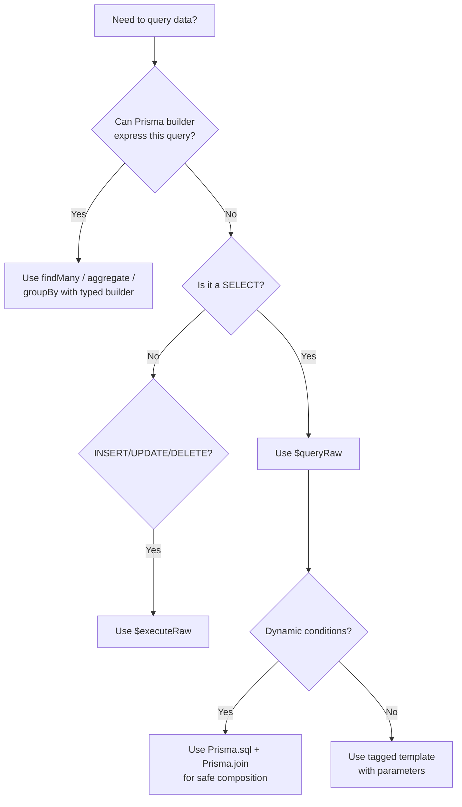

# Prisma vs Raw SQL: When to Drop Down to $queryRaw

I'm a big fan of Prisma. The type safety, the auto-generated client, the migration system  it's genuinely great for 80% of database work. But that other 20%? That's where you start wrestling with the ORM instead of your actual problem.

If you've ever spent 30 minutes trying to figure out how to do a `ROW_NUMBER()` window function in Prisma's query builder, only to realize it's just... not supported, you know exactly what I'm talking about. Prisma's abstraction is excellent until it isn't, and knowing when to reach for **prisma raw sql** with `$queryRaw` is a skill every backend dev needs.

## When Prisma's Query Builder Isn't Enough

Let me be clear: you should use Prisma's typed query builder for the vast majority of your queries. It's safer, it's more maintainable, and your IDE actually helps you. But there are specific patterns where the abstraction breaks down.

Here's a quick reference for when to drop down to raw SQL:

| Query Pattern | Prisma Builder | Raw SQL Needed? |
|---|---|---|
| Simple CRUD | Yes | No |
| Filtering with AND/OR | Yes | No |
| Basic aggregations (count, sum) | Yes | No |
| Relations and nested selects | Yes | No |
| Window functions (ROW_NUMBER, RANK) | No | **Yes** |
| Common Table Expressions (CTEs) | No | **Yes** |
| Complex aggregations (HAVING, GROUP BY with expressions) | Partial | **Usually** |
| Full-text search (ts_vector) | No | **Yes** |
| Recursive queries | No | **Yes** |
| EXPLAIN ANALYZE | No | **Yes** |
| Bulk upserts with ON CONFLICT | Limited | **Often** |
| Database-specific functions | No | **Yes** |

If your query fits in the left column's "Yes" rows, stick with the builder. For everything else, `$queryRaw` is your escape hatch  and it's a perfectly good one.

## How `$queryRaw` Works

The `$queryRaw` method returns typed results from a SELECT query. The most important thing to know: it uses tagged template literals, which means parameterized queries by default. No SQL injection risk if you use it correctly.

```typescript
const users = await prisma.$queryRaw<User[]>`
  SELECT id, name, email
  FROM "User"
  WHERE status = ${"active"}
`;
```

That `${"active"}` isn't string interpolation  Prisma converts it to a parameterized query under the hood. The actual SQL sent to your database is `SELECT id, name, email FROM "User" WHERE status = $1` with `"active"` as a bound parameter.

> **Warning:** Never use regular string interpolation with `$queryRaw`. If you write `` $queryRaw`SELECT * FROM users WHERE name = '${userInput}'` `` with direct string embedding, you've just opened up a SQL injection vulnerability. Always use the `${}` syntax inside the tagged template, which Prisma safely parameterizes.

### Typing Your Results

One of the annoying things about `$queryRaw` is that Prisma can't infer return types from raw SQL. You have to tell it what shape the data is. I usually define a type for each raw query:

```typescript
type UserWithRank = {
  id: string;
  name: string;
  email: string;
  order_count: bigint;
  rank: bigint;
};

const rankedUsers = await prisma.$queryRaw<UserWithRank[]>`
  SELECT
    u.id,
    u.name,
    u.email,
    COUNT(o.id) as order_count,
    RANK() OVER (ORDER BY COUNT(o.id) DESC) as rank
  FROM "User" u
  LEFT JOIN "Order" o ON o."userId" = u.id
  GROUP BY u.id
  ORDER BY rank
`;
```

One gotcha  PostgreSQL returns `bigint` for COUNT and window function results, not regular numbers. Prisma maps these to JavaScript `BigInt`, which can surprise you if you try to serialize them to JSON directly. You'll need to convert them:

```typescript
const serializable = rankedUsers.map((u) => ({
  ...u,
  order_count: Number(u.order_count),
  rank: Number(u.rank),
}));
```

If you're working with SQL schemas and want to generate TypeScript types for your raw query results automatically, [SnipShift's SQL to TypeScript converter](https://snipshift.dev/sql-to-typescript) can help  paste your table definitions, get typed interfaces back.

## Using `Prisma.sql` for Dynamic Raw Queries

Sometimes you need to build raw queries dynamically  adding conditions based on filters, for example. The `Prisma.sql` helper lets you compose query fragments safely:

```typescript
import { Prisma } from "@prisma/client";

function buildUserReport(filters: {
  department?: string;
  minOrders?: number;
}) {
  const conditions: Prisma.Sql[] = [];

  if (filters.department) {
    conditions.push(
      Prisma.sql`u.department = ${filters.department}`
    );
  }
  if (filters.minOrders) {
    conditions.push(
      Prisma.sql`order_count >= ${filters.minOrders}`
    );
  }

  const whereClause =
    conditions.length > 0
      ? Prisma.sql`WHERE ${Prisma.join(conditions, " AND ")}`
      : Prisma.empty;

  return prisma.$queryRaw<UserReport[]>`
    WITH user_orders AS (
      SELECT
        u.id,
        u.name,
        u.department,
        COUNT(o.id) as order_count,
        SUM(o.total) as total_spent
      FROM "User" u
      LEFT JOIN "Order" o ON o."userId" = u.id
      GROUP BY u.id
    )
    SELECT *,
      RANK() OVER (ORDER BY total_spent DESC) as spending_rank
    FROM user_orders
    ${whereClause}
    ORDER BY spending_rank
  `;
}
```

The key helpers here:
- **`Prisma.sql`**  creates a parameterized SQL fragment
- **`Prisma.join`**  joins multiple fragments with a separator (like `AND`)
- **`Prisma.empty`**  a no-op fragment, useful for conditional clauses

This keeps everything parameterized even when building queries dynamically. Much safer than concatenating strings.

## `$executeRaw` for Mutations

`$queryRaw` is for SELECT queries. For INSERT, UPDATE, DELETE, or DDL statements, use `$executeRaw`. It returns the number of affected rows instead of result data:

```typescript
// Bulk update with a complex condition
const updatedCount = await prisma.$executeRaw`
  UPDATE "Product"
  SET price = price * 1.1
  WHERE category_id IN (
    SELECT id FROM "Category"
    WHERE name = ${"Electronics"}
  )
  AND last_price_update < NOW() - INTERVAL '6 months'
`;

console.log(`Updated ${updatedCount} product prices`);
```

This is particularly useful for bulk operations that would be painfully slow with Prisma's `updateMany`  especially when you need subqueries or database-specific date functions.

### Bulk Upserts with ON CONFLICT

One of the most common reasons I reach for `$executeRaw` is bulk upserts. Prisma's `upsert` works on single records. If you need to upsert thousands of rows efficiently, raw SQL with `ON CONFLICT` is the way:

```typescript
const values = products.map(
  (p) => Prisma.sql`(${p.sku}, ${p.name}, ${p.price})`
);

await prisma.$executeRaw`
  INSERT INTO "Product" (sku, name, price)
  VALUES ${Prisma.join(values)}
  ON CONFLICT (sku)
  DO UPDATE SET
    name = EXCLUDED.name,
    price = EXCLUDED.price,
    updated_at = NOW()
`;
```

This runs as a single query regardless of how many products you're upserting. Compare that to calling `prisma.product.upsert()` in a loop  the difference in performance is massive once you're past a few hundred records.

## Real-World Example: CTE with Window Function

Here's a query I actually wrote for a dashboard analytics endpoint. It calculates monthly revenue with month-over-month growth percentage. Good luck doing this with Prisma's query builder alone:

```typescript
type MonthlyRevenue = {
  month: Date;
  revenue: number;
  growth_pct: number | null;
};

const revenue = await prisma.$queryRaw<MonthlyRevenue[]>`
  WITH monthly AS (
    SELECT
      DATE_TRUNC('month', created_at) as month,
      SUM(total)::numeric as revenue
    FROM "Order"
    WHERE created_at >= NOW() - INTERVAL '12 months'
    GROUP BY DATE_TRUNC('month', created_at)
  )
  SELECT
    month,
    revenue,
    ROUND(
      (revenue - LAG(revenue) OVER (ORDER BY month))
      / NULLIF(LAG(revenue) OVER (ORDER BY month), 0) * 100,
      2
    ) as growth_pct
  FROM monthly
  ORDER BY month
`;
```

A CTE, window functions, date truncation, and percentage calculation  all in one query. This would require multiple Prisma calls and JavaScript post-processing if you tried to avoid raw SQL. Sometimes the database is just better at this stuff.



## Best Practices for Raw Queries in Prisma

**Keep raw queries contained.** Don't scatter `$queryRaw` calls throughout your codebase. Put them in a repository or service layer so they're easy to find, test, and update when your schema changes.

**Always type your results.** Yes, it's extra work. But untyped raw queries defeat the whole purpose of using Prisma in a TypeScript project. Define a type for every raw query.

**Test with real data.** Raw queries bypass Prisma's type-checking, so your TypeScript compiler won't catch column name typos. Integration tests are essential here  something we discussed in our guide on [connecting PostgreSQL to Node.js](/blog/connect-postgresql-nodejs).

**Don't reach for raw SQL prematurely.** I've seen developers default to `$queryRaw` because they're more comfortable with SQL than Prisma's API. Fight that urge. The typed builder is better for maintenance. Only go raw when the builder genuinely can't express what you need.

If you want to understand more about building dynamic filters with Prisma's typed builder before reaching for raw SQL, check out our guide on [conditional where clauses in Prisma](/blog/prisma-conditional-where-clause). And for full-text search specifically  one of the most common reasons to use raw SQL  we've got a dedicated post on [adding full-text search to Prisma](/blog/prisma-full-text-search-postgresql).

For more developer tools, visit [SnipShift's homepage](https://snipshift.dev)  we've got converters for SQL, JSON, TypeScript, and more.
