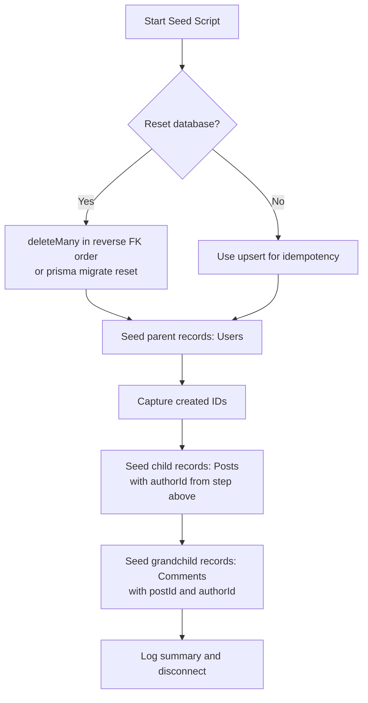

# How to Seed a Database with Prisma (Typed, Repeatable, Fast)

Every project needs seed data. Whether it's for local development, demo environments, or onboarding new teammates, having a reliable way to **seed your database with Prisma** is one of those things you set up once and use forever.

And yet, I see teams skip this step constantly. They share SQL dumps over Slack, manually create test records through the UI, or  my personal favorite  just tell new developers to "run the app and click around to create some data." That's not a workflow. That's chaos.

Prisma makes seeding surprisingly painless. Here's how to set it up properly  with TypeScript, so everything stays typed and your seed script doesn't quietly break when the schema changes.

## Setting Up the Seed Script

First, you need to tell Prisma where your seed script lives. Add this to your `package.json`:

```json
{
  "prisma": {
    "seed": "tsx prisma/seed.ts"
  }
}
```

I'm using `tsx` here because it runs TypeScript directly without a separate compilation step. You could also use `ts-node`  just make sure your `tsconfig.json` is configured for it. Install it as a dev dependency if you haven't already:

```bash
npm install -D tsx
```

Now create the seed file at `prisma/seed.ts`:

```typescript
import { PrismaClient } from "@prisma/client";

const prisma = new PrismaClient();

async function main() {
  console.log("Seeding database...");

  // Your seed logic goes here

  console.log("Seeding complete.");
}

main()
  .catch((e) => {
    console.error(e);
    process.exit(1);
  })
  .finally(async () => {
    await prisma.$disconnect();
  });
```

Run it with:

```bash
npx prisma db seed
```

Prisma also runs this automatically after `prisma migrate reset`, which is handy when you want to wipe and rebuild your local database from scratch.

## `createMany` vs `upsert`: Choosing the Right Approach

This is the first decision you'll make when writing seed logic, and it matters more than you'd think.

### `createMany`  Fast, Simple, Fails on Duplicates

```typescript
await prisma.user.createMany({
  data: [
    { email: "alice@example.com", name: "Alice", role: "ADMIN" },
    { email: "bob@example.com", name: "Bob", role: "USER" },
    { email: "carol@example.com", name: "Carol", role: "USER" },
  ],
  skipDuplicates: true, // silently skips if email already exists
});
```

`createMany` is the fastest option for bulk inserts. It sends a single INSERT statement. The `skipDuplicates` flag is important  without it, running the seed twice will throw a unique constraint error.

But `skipDuplicates` only skips, it doesn't update. If you change Alice's role from `ADMIN` to `EDITOR` in the seed file and re-run, she'll keep the old role because the record already exists.

### `upsert`  Slower, But Idempotent

```typescript
await prisma.user.upsert({
  where: { email: "alice@example.com" },
  update: { name: "Alice", role: "ADMIN" },
  create: { email: "alice@example.com", name: "Alice", role: "ADMIN" },
});
```

`upsert` creates the record if it doesn't exist, or updates it if it does. This makes your seed truly idempotent  run it once, run it ten times, same result.

The downside? It's one query per record. For a seed file with 20-30 records, that's fine. For thousands, it's slow.

| Method | Speed | Idempotent | Updates existing? |
|---|---|---|---|
| `createMany` | Fast (single INSERT) | Partial (with `skipDuplicates`) | No |
| `upsert` | Slow (one query per record) | Yes | Yes |
| `createMany` + reset | Fast | Yes (by resetting first) | N/A |

My recommendation: use `upsert` for small datasets (under 100 records) and `createMany` with `skipDuplicates` for larger ones. Or combine both approaches  reset the database first, then use `createMany`.

## Generating Realistic Data with Faker.js

Hard-coding 5 users in a seed file works for a while. But eventually you want a dataset that actually looks like production  varied names, realistic emails, timestamps spread across months. That's where `@faker-js/faker` comes in.

```bash
npm install -D @faker-js/faker
```

```typescript
import { faker } from "@faker-js/faker";

async function seedUsers(count: number) {
  const users = Array.from({ length: count }, () => ({
    email: faker.internet.email(),
    name: faker.person.fullName(),
    role: faker.helpers.arrayElement(["USER", "ADMIN", "EDITOR"]),
    bio: faker.lorem.sentence(),
    createdAt: faker.date.past({ years: 2 }),
  }));

  await prisma.user.createMany({
    data: users,
    skipDuplicates: true,
  });

  console.log(`Seeded ${count} users`);
}
```

One thing I like about faker is the `seed` method  set it to a fixed number and you get the same "random" data every time. Deterministic seeds are way easier to debug:

```typescript
faker.seed(42);
// Now every faker call produces the same result on every run
```

This is especially useful when your seed data needs to match test expectations. No more flaky tests because faker generated a different email.

## Resetting Before Seeding

For local development, I usually want a completely fresh database when I run the seed. There are two ways to do this:

### Option 1: Use `prisma migrate reset`

```bash
npx prisma migrate reset
```

This drops the database, re-runs all migrations, and then runs your seed script. It's the nuclear option but it guarantees a clean state. One command, everything fresh.

### Option 2: Delete Records in the Seed Script

If you don't want to re-run all migrations (maybe they're slow on a large schema), you can clean the tables manually at the top of the seed:

```typescript
async function main() {
  // Delete in reverse dependency order to avoid FK constraint errors
  await prisma.comment.deleteMany();
  await prisma.post.deleteMany();
  await prisma.user.deleteMany();

  console.log("Cleared existing data");

  // Now seed fresh data
  await seedUsers(50);
  await seedPosts(200);
  await seedComments(500);
}
```

The order matters here. If `Comment` has a foreign key to `Post`, you need to delete comments before posts. Get this wrong and Prisma will throw a foreign key constraint error.

> **Tip:** For complex schemas with many relations, consider using `prisma migrate reset` instead of manually ordering deletions. It's less error-prone and handles cascade rules correctly.

## Referencing Related Records

This is where seeding gets a little tricky  and where a lot of seed scripts turn into spaghetti. If your posts need to reference users, and your comments need to reference both posts and users, you need to create records in the right order and hold onto their IDs.

Here's the pattern that works best:

```typescript
async function main() {
  // 1. Seed users and capture references
  const alice = await prisma.user.upsert({
    where: { email: "alice@example.com" },
    update: {},
    create: {
      email: "alice@example.com",
      name: "Alice",
      role: "ADMIN",
    },
  });

  const bob = await prisma.user.upsert({
    where: { email: "bob@example.com" },
    update: {},
    create: {
      email: "bob@example.com",
      name: "Bob",
      role: "USER",
    },
  });

  // 2. Seed posts referencing users
  const post1 = await prisma.post.create({
    data: {
      title: "Getting Started with Prisma",
      content: "Prisma is an ORM for Node.js and TypeScript...",
      authorId: alice.id,
      published: true,
    },
  });

  // 3. Seed comments referencing both
  await prisma.comment.createMany({
    data: [
      {
        text: "Great post!",
        postId: post1.id,
        authorId: bob.id,
      },
      {
        text: "Thanks for writing this.",
        postId: post1.id,
        authorId: alice.id,
      },
    ],
  });

  console.log("Seeded users, posts, and comments");
}
```

The key: use `upsert` or `create` (not `createMany`) for parent records so you get the created object back with its generated ID. Then pass those IDs to child records.

For larger seed scripts with faker, store the created records in an array:

```typescript
const users = await Promise.all(
  Array.from({ length: 10 }, () =>
    prisma.user.create({
      data: {
        email: faker.internet.email(),
        name: faker.person.fullName(),
        role: faker.helpers.arrayElement(["USER", "ADMIN"]),
      },
    })
  )
);

// Now seed posts with random authors
await Promise.all(
  Array.from({ length: 50 }, () =>
    prisma.post.create({
      data: {
        title: faker.lorem.sentence(),
        content: faker.lorem.paragraphs(3),
        authorId: faker.helpers.arrayElement(users).id,
        published: faker.datatype.boolean(),
      },
    })
  )
);
```



## A Complete Seed Script Example

Putting it all together  here's a production-ready seed file that covers all the patterns:

```typescript
import { PrismaClient } from "@prisma/client";
import { faker } from "@faker-js/faker";

const prisma = new PrismaClient();

// Deterministic randomness for reproducible seeds
faker.seed(42);

async function main() {
  // Clean slate
  await prisma.comment.deleteMany();
  await prisma.post.deleteMany();
  await prisma.user.deleteMany();

  // Seed users
  const users = await Promise.all(
    Array.from({ length: 20 }, () =>
      prisma.user.create({
        data: {
          email: faker.internet.email(),
          name: faker.person.fullName(),
          role: faker.helpers.arrayElement(["USER", "USER", "USER", "ADMIN"]),
        },
      })
    )
  );

  // Seed posts with random authors
  const posts = await Promise.all(
    Array.from({ length: 100 }, () =>
      prisma.post.create({
        data: {
          title: faker.lorem.sentence(),
          content: faker.lorem.paragraphs(3),
          authorId: faker.helpers.arrayElement(users).id,
          published: faker.datatype.boolean(),
          createdAt: faker.date.past({ years: 1 }),
        },
      })
    )
  );

  // Seed comments
  await prisma.comment.createMany({
    data: Array.from({ length: 300 }, () => ({
      text: faker.lorem.sentence(),
      postId: faker.helpers.arrayElement(posts).id,
      authorId: faker.helpers.arrayElement(users).id,
      createdAt: faker.date.recent({ days: 90 }),
    })),
  });

  console.log(`Seeded: ${users.length} users, ${posts.length} posts, 300 comments`);
}

main()
  .catch((e) => {
    console.error(e);
    process.exit(1);
  })
  .finally(() => prisma.$disconnect());
```

If you're converting existing JavaScript seed scripts to TypeScript, [SnipShift's JS to TypeScript converter](https://snipshift.dev/js-to-ts) can handle the conversion  including adding proper type annotations to your faker data.

## Wrapping Up

A good **Prisma seed database** setup with TypeScript gives you reproducible data, type safety that catches schema changes immediately, and a one-command workflow for fresh environments. Use `upsert` when you need idempotency, `createMany` when you need speed, faker for realistic data, and always seed in dependency order.

Once your seed script is dialed in, getting a new developer up and running is just `npm install`, `prisma migrate dev`, and they've got a full dataset to work with.

For the next step in your Prisma workflow, check out our guide on [handling Prisma migrations in production](/blog/prisma-migrations-production-guide)  seeding is for dev, but you'll need a solid migration strategy for everything else. And if you're building API endpoints on top of this seeded data, our post on [building REST APIs with TypeScript](/blog/rest-api-typescript-express-guide) covers the full stack.

More tools at [SnipShift](https://snipshift.dev).
