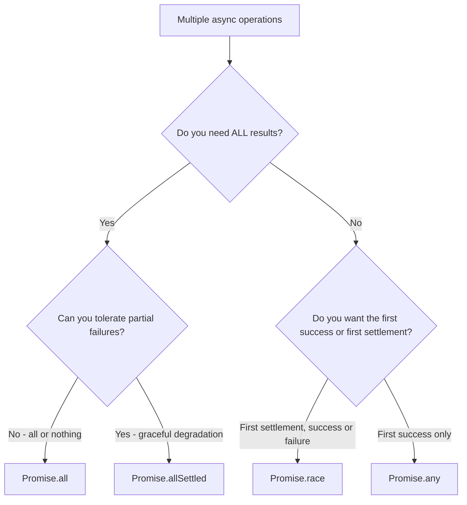

# Promise.all vs Promise.allSettled vs Promise.race: When to Use Which

You've got three API calls to make. They don't depend on each other. So you reach for `Promise.all`  and then the first one fails and suddenly *all three* blow up. Your loading spinner never stops. The user sees nothing.

I've been there. More than once. And it took me an embarrassingly long time to realize that **promise all vs allSettled vs race** isn't just a trivia question for interviews  it's a decision that directly affects how your app handles failure. Pick the wrong one and you're either swallowing errors silently or crashing on things that shouldn't be fatal.

Let me walk you through each of these Promise combinators, when to actually reach for them, and the real-world patterns I keep coming back to.

## The Four Promise Combinators at a Glance

Before we get into examples, here's the quick mental model. JavaScript gives you four static methods on `Promise` for handling multiple concurrent operations:

| Method | Resolves when... | Rejects when... | Returns |
|--------|-----------------|-----------------|---------|
| `Promise.all` | All promises fulfill | **Any** promise rejects | Array of values |
| `Promise.allSettled` | All promises settle (fulfill or reject) | Never rejects | Array of `{status, value/reason}` objects |
| `Promise.race` | First promise settles (fulfill or reject) | First promise rejects | Single value/reason |
| `Promise.any` | First promise fulfills | **All** promises reject | Single value (or `AggregateError`) |

That table looks simple enough. But the devil is in the details  especially around error handling.

## Promise.all  The "All or Nothing" Approach

`Promise.all` is the one everyone learns first, and honestly it's the right default for a lot of cases. It runs multiple promises in parallel and gives you all the results once they're done. But here's the catch that bites people: **if even one promise rejects, the whole thing rejects**.

```javascript
// Fetching data for a dashboard  all pieces are required
async function loadDashboard(userId) {
  try {
    const [profile, transactions, settings] = await Promise.all([
      fetchUserProfile(userId),
      fetchTransactions(userId),
      fetchUserSettings(userId),
    ]);

    // All three succeeded  render the dashboard
    return { profile, transactions, settings };
  } catch (error) {
    // If ANY of the three fails, we land here.
    // We don't know which one failed without extra work.
    console.error("Dashboard load failed:", error.message);
    throw error;
  }
}
```

This is perfect when all the data is required. If you can't show the dashboard without the user profile, there's no point handling a partial success. Fail fast, show an error, let the user retry.

But here's where people get tripped up. The other promises don't get *cancelled* when one fails. They're still running  you just don't get their results. JavaScript doesn't have built-in promise cancellation (AbortController helps, but that's a separate topic). So if you fire off three fetch calls and the first one rejects in 50ms, the other two are still in flight. You're just ignoring whatever they return.

### When to use Promise.all

- Every result is required for the next step
- A single failure should be treated as a total failure
- You want the simplest possible API  just an array of values

## Promise.allSettled  The "I Want Everything" Approach

This is the one I wish I'd known about years earlier. `Promise.allSettled` waits for *every* promise to either fulfill or reject, and then gives you a report card for each one. It never rejects itself.

```typescript
// Loading a dashboard where some widgets are optional
async function loadDashboardWithOptionalWidgets(userId: string) {
  const results = await Promise.allSettled([
    fetchUserProfile(userId),        // critical
    fetchNotifications(userId),      // nice to have
    fetchRecommendations(userId),    // nice to have
    fetchActivityFeed(userId),       // nice to have
  ]);

  // Each result has a `status` of "fulfilled" or "rejected"
  const [profileResult, notifResult, recsResult, feedResult] = results;

  // The profile is critical  if it failed, we can't continue
  if (profileResult.status === "rejected") {
    throw new Error("Cannot load dashboard without user profile");
  }

  return {
    profile: profileResult.value,
    // For optional data, use it if available, fall back to defaults
    notifications:
      notifResult.status === "fulfilled" ? notifResult.value : [],
    recommendations:
      recsResult.status === "fulfilled" ? recsResult.value : [],
    activityFeed:
      feedResult.status === "fulfilled" ? feedResult.value : [],
  };
}
```

See how much more control you get? You decide which failures are fatal and which ones you can recover from. The recommendations service being down shouldn't prevent someone from seeing their profile.

I worked on an e-commerce app where the product page fetched the product details, reviews, related items, and shipping estimates all in parallel. Using `Promise.all` meant that if the reviews service had a hiccup  which it did, regularly  the entire product page would error out. Switching to `Promise.allSettled` and treating reviews as optional fixed a whole class of production incidents. Took about 20 minutes to implement. Should've done it months earlier.

> **Tip:** If you're working with TypeScript, the return types from `Promise.allSettled` are `PromiseSettledResult<T>[]`, which is a union of `PromiseFulfilledResult<T>` and `PromiseRejectedResult`. The type narrowing works great with status checks. And if you're converting your promise-heavy JS code to TypeScript, [SnipShift's JS to TS converter](https://snipshift.dev/js-to-ts) handles async function signatures really well.

### When to use Promise.allSettled

- Some results are optional and you want graceful degradation
- You need to know the outcome of *every* promise, not just the first failure
- You want to log or report which operations failed without short-circuiting

## Promise.race  First One Wins (or Loses)

`Promise.race` resolves or rejects as soon as the *first* promise settles. Whatever happens first  success or failure  that's what you get. The other promises keep running, but their results are ignored.

The most common real-world use case I've seen for `Promise.race` is implementing timeouts:

```javascript
// Adding a timeout to any async operation
function withTimeout(promise, ms) {
  const timeout = new Promise((_, reject) =>
    setTimeout(() => reject(new Error(`Timed out after ${ms}ms`)), ms)
  );

  return Promise.race([promise, timeout]);
}

// Usage
try {
  const data = await withTimeout(fetchSlowAPI(), 5000);
  console.log("Got data:", data);
} catch (err) {
  console.log(err.message); // "Timed out after 5000ms"
}
```

Simple and effective. The fetch call and the timeout are racing  whoever settles first wins.

But be careful with `Promise.race`. It sort of has a gotcha that isn't immediately obvious: if the first promise to settle is a *rejection*, the race rejects. That's the intended behavior, but it means `Promise.race` is not "first successful result"  it's "first result, period." If you want the first *successful* result, you want `Promise.any`.

### When to use Promise.race

- Implementing timeouts
- "Use whichever responds first" patterns (e.g., multiple CDN endpoints)
- Scenarios where you truly only care about the very first settlement

## Promise.any  First Success Wins

`Promise.any` was added in ES2021 and it's kind of the optimistic sibling of `Promise.race`. It resolves with the first promise that *fulfills*. Rejections are ignored  unless every single promise rejects, in which case you get an `AggregateError` containing all the rejection reasons.

```javascript
// Try multiple API mirrors, use whichever responds first
async function fetchFromFastestMirror(endpoint) {
  try {
    const data = await Promise.any([
      fetch(`https://api-us.example.com${endpoint}`).then((r) => r.json()),
      fetch(`https://api-eu.example.com${endpoint}`).then((r) => r.json()),
      fetch(`https://api-asia.example.com${endpoint}`).then((r) => r.json()),
    ]);
    return data;
  } catch (err) {
    // AggregateError  ALL mirrors failed
    console.error("All mirrors failed:", err.errors);
    throw err;
  }
}
```

This is great for redundancy. If one mirror is down or slow, you still get a result from another one. The key difference from `Promise.race`: a single rejection doesn't kill the whole operation.

### When to use Promise.any

- Redundant data sources (mirrors, fallback APIs)
- When you only need one successful result out of many attempts
- Feature detection  "which of these methods works in this environment?"

## How They Actually Behave: A Comparison

Here's a decision flowchart to help you pick the right combinator:



And here's what happens in each scenario  this is the table I wish someone had shown me when I was first learning this stuff:

| Scenario | `Promise.all` | `Promise.allSettled` | `Promise.race` | `Promise.any` |
|----------|--------------|---------------------|----------------|---------------|
| All succeed | Resolves with all values | Resolves with all `{fulfilled}` | Resolves with first value | Resolves with first value |
| One fails early | **Rejects immediately** | Waits, returns mix of fulfilled/rejected | Depends on order  rejects if failure is first | Ignores the failure, resolves with first success |
| All fail | Rejects with first error | Resolves with all `{rejected}` | Rejects with first error | Rejects with `AggregateError` |
| First to settle is a rejection | Rejects | Waits for all | **Rejects** | Keeps waiting for a fulfillment |

That last row is the one that really separates `Promise.race` from `Promise.any`. If the fastest response is an error, `race` gives you that error immediately. `any` says "okay, but maybe the others will work" and keeps going.

## Real-World Pattern: Parallel API Calls with Mixed Criticality

Let me show you a pattern I use constantly. Most real apps don't fit neatly into "all required" or "all optional." You usually have a mix  some data is critical and some is nice-to-have.

```typescript
interface DashboardData {
  user: UserProfile;
  orders: Order[];
  recommendations: Product[];
  notifications: Notification[];
}

async function loadDashboard(userId: string): Promise<DashboardData> {
  // Group by criticality
  const [criticalResults, optionalResults] = await Promise.all([
    // Critical data  if either fails, we can't render
    Promise.all([
      fetchUserProfile(userId),
      fetchOrders(userId),
    ]),
    // Optional data  failures are okay
    Promise.allSettled([
      fetchRecommendations(userId),
      fetchNotifications(userId),
    ]),
  ]);

  const [user, orders] = criticalResults;
  const [recsResult, notifsResult] = optionalResults;

  return {
    user,
    orders,
    recommendations:
      recsResult.status === "fulfilled" ? recsResult.value : [],
    notifications:
      notifsResult.status === "fulfilled" ? notifsResult.value : [],
  };
}
```

This is the best of both worlds. The outer `Promise.all` runs the critical and optional groups in parallel. The critical group uses `Promise.all` internally  if the user profile or orders fail, the whole thing fails (which is what you want). The optional group uses `Promise.allSettled`  recommendations being down doesn't take out the page.

I've been using this nested pattern for a couple of years now and it's held up really well. The typing also works out cleanly if you're in TypeScript  which is worth the effort for async code, since the type system catches a lot of the "forgot to check the status field" bugs. If you've been meaning to [convert your JavaScript to TypeScript](/blog/convert-javascript-to-typescript), async-heavy code is actually a great place to start because the type safety around promise results is immediately valuable.

## Common Mistakes I've Seen

**Mistake #1: Using `Promise.all` when some failures are recoverable.** This is the most common one. Your app crashes because a non-essential service is flaky. Switch to `Promise.allSettled` or the nested pattern above.

**Mistake #2: Forgetting that `Promise.race` can reject.** People use it expecting "first successful result" and then their timeout races end up swallowing real data because an error came in first. If that's what you want, use `Promise.any`.

**Mistake #3: Not handling the `AggregateError` from `Promise.any`.** When *all* promises in a `Promise.any` call fail, you get an `AggregateError` with an `errors` array  not a single error. Catch blocks that expect `error.message` to be useful will show something generic. Check `error.errors` for the individual failures.

**Mistake #4: Thinking `await` inside a loop is the same as `Promise.all`.** It's not  `await` in a loop runs things sequentially. `Promise.all` runs them in parallel. Huge performance difference when you're making multiple network calls. I wrote about [similar JavaScript patterns](/blog/optional-chaining-nullish-coalescing) that people often get subtly wrong.

> **Warning:** None of these methods cancel the other promises when they settle. If you're using `Promise.race` for timeouts, the original fetch call is still in flight. Use `AbortController` if you need actual cancellation.

## Performance Considerations

One thing worth mentioning  all four combinators start all promises immediately. There's no built-in concurrency limit. If you fire off 100 fetch calls inside `Promise.all`, all 100 go out at once. That can overwhelm your API, trigger rate limits, or just eat up the user's bandwidth.

For large batches, you'll want a concurrency limiter  something like `p-limit` or a simple chunking approach. But that's a separate problem from choosing the right combinator.

Also, if you're dealing with complex data transformations after your API calls resolve  like [deep cloning objects](/blog/deep-clone-object-javascript) or reshaping nested responses  keep that logic outside the promise chain when possible. It keeps things readable and easier to debug.

## Quick Reference

Here's my personal cheat sheet:

- **Need all results, fail on any error** → `Promise.all`
- **Need all results, handle failures individually** → `Promise.allSettled`
- **Need the fastest result (success or failure)** → `Promise.race`
- **Need the fastest success, ignore failures** → `Promise.any`

And when reality is more nuanced than a single method can handle  which it usually is  combine them. The nested `Promise.all` + `Promise.allSettled` pattern covers most real-world dashboard and page-load scenarios.

The promise combinators are one of those things in JavaScript that seem basic until you actually think about the edge cases. Getting them right means fewer silent failures, better error messages, and pages that degrade gracefully instead of blowing up because some recommendation engine is having a bad day.

If you're refactoring async code and want to tighten up the types while you're at it, check out [SnipShift](https://snipshift.dev)  it handles the mechanical parts of JS-to-TS conversion so you can focus on the architectural decisions that actually matter.

What's your go-to pattern for handling parallel async operations? I'm always curious what approaches other teams have landed on.
