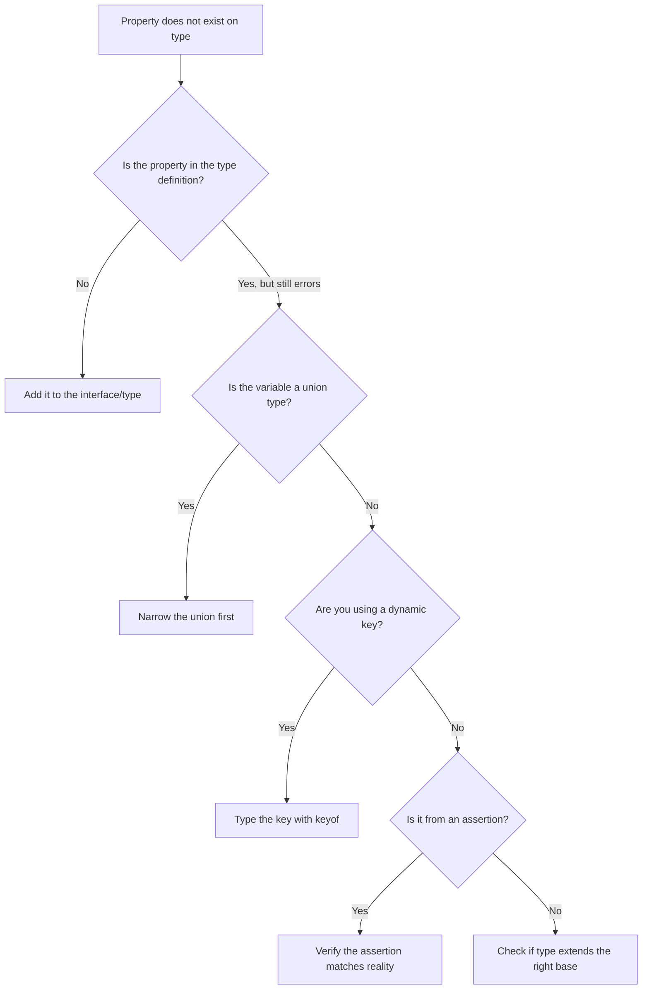

# How to Fix 'Property Does Not Exist on Type' in TypeScript

You're accessing a property you *know* is there. You can see it in the data. You might even have `console.log`'d it. But TypeScript is showing you this:

```
Property 'email' does not exist on type 'User'.
```

This is one of the most common TypeScript errors, and it can mean about five different things depending on the context. The good news is that each cause has a specific fix, and once you know the pattern, you can diagnose it in seconds.

The "property does not exist on type" error in TypeScript always means the same thing at its core: you're trying to access a property that the *type* doesn't know about. The property might exist at runtime  TypeScript doesn't care. It only knows what the type says.

## Cause 1: The Property Is Missing from the Interface

The most obvious case. You added a field to your data but forgot to update the type definition.

```typescript
interface User {
  id: string;
  name: string;
}

const user: User = { id: "1", name: "Alice" };

// Error: Property 'email' does not exist on type 'User'
console.log(user.email);
```

**The fix:** Add the property to the interface.

```typescript
interface User {
  id: string;
  name: string;
  email: string; // Added
}
```

If the property doesn't always exist, make it optional:

```typescript
interface User {
  id: string;
  name: string;
  email?: string;
}
```

This one feels too simple to even mention, but it's genuinely the most common cause. Especially during refactors where the data shape changes before the types get updated.

> **Tip:** When converting a JavaScript codebase, these errors flood in because your JS objects have properties that were never formally defined anywhere. [SnipShift's JS to TypeScript converter](https://snipshift.dev/js-to-ts) analyzes your actual code to generate interfaces that match how your objects are really used  catching properties you might miss if you wrote the types by hand.

## Cause 2: Wrong Type Assertion

You fetched data from an API or external source and asserted a type  but the assertion doesn't match the actual data shape.

```typescript
interface Product {
  name: string;
  price: number;
}

const data = JSON.parse(response) as Product;

// Error: Property 'description' does not exist on type 'Product'
console.log(data.description);
```

The `as Product` assertion told TypeScript this object is a `Product`. But `Product` doesn't have `description`. TypeScript only knows what you told it.

**The fix:** Update the type to match reality, or validate the data properly.

```typescript
interface Product {
  name: string;
  price: number;
  description: string; // Now it's in the type
}
```

Better yet, validate with a runtime check instead of blindly asserting:

```typescript
function isProduct(data: unknown): data is Product {
  return (
    typeof data === "object" &&
    data !== null &&
    "name" in data &&
    "price" in data
  );
}

const data = JSON.parse(response);
if (isProduct(data)) {
  console.log(data.name); // Safe  validated
}
```

I'd rather write a type guard than use `as` in most cases. The `as` keyword tells TypeScript to trust you. A type guard actually verifies at runtime. One of those approaches catches bugs. The other hides them.

## Cause 3: Accessing Properties on a Union Type

This trips people up constantly. When you have a union type, you can only access properties that exist on *all* members of the union.

```typescript
type Shape =
  | { kind: "circle"; radius: number }
  | { kind: "square"; side: number };

function getSize(shape: Shape) {
  // Error: Property 'radius' does not exist on type 'Shape'
  // Property 'radius' does not exist on type '{ kind: "square"; side: number }'
  return shape.radius;
}
```

TypeScript can't guarantee that `shape` is a circle  it might be a square. And squares don't have `radius`.

**The fix:** Narrow the union first using a type guard or discriminant check.

```typescript
function getSize(shape: Shape) {
  if (shape.kind === "circle") {
    return shape.radius; // Works  narrowed to circle
  }
  return shape.side; // Works  narrowed to square
}
```

Or use a `switch` for exhaustive handling:

```typescript
function getSize(shape: Shape): number {
  switch (shape.kind) {
    case "circle":
      return shape.radius;
    case "square":
      return shape.side;
  }
}
```

If you're working a lot with union types, check out our guide on [discriminated unions](/blog/typescript-discriminated-unions-pattern)  it's the pattern that makes union narrowing feel natural instead of tedious.

## Cause 4: Dynamic Properties Without an Index Signature

Sometimes you're working with objects that have dynamic keys  like a cache, a lookup table, or config parsed from a file. TypeScript doesn't allow arbitrary property access unless the type explicitly permits it.

```typescript
interface Config {
  apiUrl: string;
  timeout: number;
}

const config: Config = { apiUrl: "https://api.example.com", timeout: 5000 };

const key = "apiUrl";
// Error: Element implicitly has an 'any' type because expression of type 'string'
// can't be used to index type 'Config'
const value = config[key];
```

This is related to the "property does not exist" family. TypeScript knows `key` is a `string`, but `Config` doesn't accept arbitrary string keys.

**The fix:** Use a proper type for the key, or add an index signature.

```typescript
// Option 1: Type the key properly
const key: keyof Config = "apiUrl";
const value = config[key]; // Works  string | number

// Option 2: Index signature (if truly dynamic)
interface Config {
  apiUrl: string;
  timeout: number;
  [key: string]: string | number; // Allow any string key
}
```

Option 1 is usually better  it keeps things type-safe. Only use index signatures if the object genuinely has arbitrary keys. Otherwise you're loosening your types for no reason.

For a deeper look at dynamic property access, our guide on [the keyof operator](/blog/typescript-keyof-explained) covers exactly this pattern.

## Cause 5: Extending or Intersecting Types Incorrectly

Sometimes you have a base type and you want to add properties. If you do it wrong, the new properties won't be recognized.

```typescript
interface Animal {
  name: string;
  species: string;
}

// Wrong: this creates a new standalone type, doesn't extend Animal
interface Pet {
  owner: string;
  vaccinated: boolean;
}

const myPet: Pet = { owner: "Alice", vaccinated: true };
// Error: Property 'name' does not exist on type 'Pet'
console.log(myPet.name);
```

**The fix:** Use `extends` to build on the base type:

```typescript
interface Pet extends Animal {
  owner: string;
  vaccinated: boolean;
}

const myPet: Pet = {
  name: "Buddy",
  species: "Dog",
  owner: "Alice",
  vaccinated: true,
};

console.log(myPet.name); // Works  inherited from Animal
```

Or use an intersection type:

```typescript
type Pet = Animal & {
  owner: string;
  vaccinated: boolean;
};
```

Both work. If you're using interfaces, `extends` is idiomatic. If you're using type aliases, `&` is the way. For a deeper comparison, see our [interface vs type guide](/blog/typescript-interface-vs-type).

## Quick Reference

| Cause | Symptom | Fix |
|-------|---------|-----|
| Missing property | Property not in interface | Add it to the type definition |
| Wrong assertion | `as Type` doesn't match data | Update type or use a type guard |
| Union type | Property only on some members | Narrow with discriminant check |
| Dynamic keys | String can't index the type | Use `keyof` or add index signature |
| Missing extends | New type doesn't inherit base | Use `extends` or intersection `&` |



## The Pattern Behind All Five Causes

Every cause boils down to the same thing: TypeScript's type doesn't match what exists at runtime. The question is always  should you update the type to match the data, or fix the code to match the type?

My rule: if the type represents a real contract (an API schema, a database model, a shared interface), update your code. If the type is just wrong or incomplete, update the type. Don't fight the type system  work with it.

And if you're getting buried in these errors during a JavaScript migration, don't write all the types by hand. Start with [SnipShift's converter](https://snipshift.dev/js-to-ts) to generate types from your actual code, then refine from there. It's a much better starting point than an empty `.d.ts` file and a lot of guessing.

For more on TypeScript errors you'll hit during migration, check out our guides on ["type is not assignable"](/blog/type-not-assignable-typescript) and ["object is possibly undefined"](/blog/object-possibly-undefined-fix).
