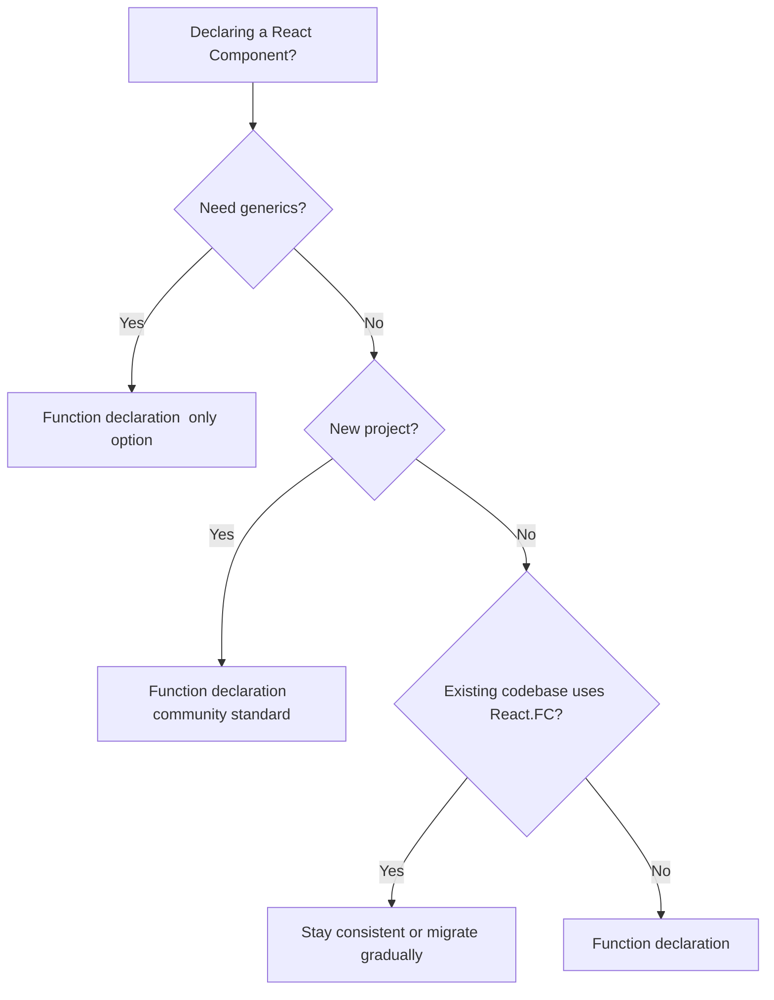

# React.FC vs Function Declaration: Which Should You Use in TypeScript?

This is one of those debates that's been going on since React added TypeScript support, and by now the community has largely settled on an answer. But I still see teams arguing about it in PR reviews, so let's break it down once and for all.

The question: when you write a React component in TypeScript, should you use `React.FC` (or `React.FunctionComponent`) or a regular function declaration? And does it actually matter?

Short answer: **use function declarations.** Long answer: keep reading.

## What Each Looks Like

Here's the same component both ways:

```typescript
// React.FC approach
interface GreetingProps {
  name: string;
}

const Greeting: React.FC<GreetingProps> = ({ name }) => {
  return <h1>Hello, {name}</h1>;
};
```

```typescript
// Function declaration approach
interface GreetingProps {
  name: string;
}

function Greeting({ name }: GreetingProps) {
  return <h1>Hello, {name}</h1>;
}

// Or as an arrow function (same thing, different syntax)
const Greeting = ({ name }: GreetingProps) => {
  return <h1>Hello, {name}</h1>;
};
```

At first glance, they look pretty similar. The `React.FC` version annotates the entire function, while the function declaration annotates the props parameter directly. But the differences matter more than you'd expect.

## The Children Problem (The Reason React.FC Fell Out of Favor)

For a long time, `React.FC` automatically included `children` in the props type. That meant any component declared with `React.FC` would accept children  whether you wanted it to or not:

```typescript
// With old React.FC  children was always allowed
const Button: React.FC<ButtonProps> = ({ label }) => {
  return <button>{label}</button>;
};

// This would compile even though Button doesn't render children
<Button label="Click me">
  <span>Wait, this shouldn't be here</span>
</Button>
```

This was fixed in React 18's type definitions  `React.FC` no longer includes `children` implicitly. You now have to explicitly add `children` to your props if your component accepts them. So the historical argument against `React.FC` is kind of... resolved.

But the damage was done. The community had already moved away from it, and the other differences still matter.

## React.FC vs Function Declaration: The Real Differences

Here's what actually differs between the two approaches in 2026:

| Feature | `React.FC<Props>` | Function Declaration |
|---------|-------------------|---------------------|
| Children typing | Must be explicit (since React 18) | Must be explicit |
| Return type | Enforced as `React.ReactElement \| null` | Inferred (can return strings, numbers, etc.) |
| Generic components | Not supported | Fully supported |
| `displayName` | Has `displayName` property | No built-in `displayName` |
| Default props | Awkward with `React.FC` | Works naturally with destructuring defaults |
| Hoisting | Not hoisted (const) | Hoisted (function declarations only) |

### Return Type

`React.FC` enforces a return type of `React.ReactElement | null`. Regular functions infer the return type, which in React 18+ can include `string`, `number`, `boolean`, arrays, and fragments. In practice, this rarely matters  but it can surprise you:

```typescript
// ❌ React.FC won't let you return a string directly
const Label: React.FC<{ text: string }> = ({ text }) => {
  return text; // Error: Type 'string' is not assignable to type 'ReactElement'
};

// ✅ Function declaration is fine with it
function Label({ text }: { text: string }) {
  return text; // Works  React can render strings
}
```

### Generics

This is the big one. `React.FC` doesn't support generic components:

```typescript
// ❌ Can't do this
const List: React.FC<ListProps<T>> = // ... T isn't in scope

// ✅ This works
function List<T>({ items, renderItem }: ListProps<T>) {
  // T is inferred from usage
}
```

If you're building [generic React components](/blog/generic-react-component-typescript)  lists, tables, dropdowns that work with different data types  you can't use `React.FC`. Period. This alone is reason enough for most teams to standardize on function declarations.

### Default Props

Default values are more natural with destructuring:

```typescript
// With React.FC  defaults are kind of awkward
const Card: React.FC<CardProps> = ({ title, variant = "primary" }) => {
  // This works, but the default is invisible to the type
};

// Function declaration  same thing, but feels more natural
function Card({ title, variant = "primary" }: CardProps) {
  // Identical behavior
}
```

Both work. But with function declarations, the defaults are right next to the type annotation, which makes the code slightly easier to scan.

## What Major Projects Use in 2026

I spent some time looking at what popular open-source projects actually use. Here's what I found:

- **Next.js examples and docs**  function declarations
- **React official docs**  function declarations (they explicitly moved away from React.FC)
- **Chakra UI / Radix / shadcn**  function declarations
- **Redux Toolkit templates**  function declarations
- **Create React App** (when it was still maintained)  used to use React.FC, switched to function declarations

The React team themselves stopped recommending `React.FC` in the official documentation. That's about as clear a signal as you'll get.

> **Tip:** If you're migrating an existing codebase from `React.FC` to function declarations, it's mostly a find-and-replace job. Remove the `React.FC<Props>` annotation, move the props type to the function parameter, and you're done. [SnipShift's JS to TypeScript converter](https://snipshift.dev/js-to-ts) handles this automatically if you're also converting from JavaScript.

## When React.FC Actually Makes Sense

I'm not going to pretend there's zero reason to use it. There are a couple of edge cases:

**1. You want enforced return types.** If your team has had bugs from components accidentally returning `undefined` or other non-renderable values, `React.FC`'s strict return type catches that. Though you could also achieve this with an ESLint rule or explicit return type annotations.

**2. You want `displayName` on the type.** `React.FC` includes `displayName` as a known property. This is useful if you're programmatically setting display names in component factories. But honestly, this comes up very rarely.

**3. Team consistency in legacy codebases.** If your existing codebase uses `React.FC` everywhere and the team is comfortable with it, switching just for the sake of switching might not be worth the churn. Consistency within a project matters more than following the latest community trend.

## My Recommendation

Use function declarations. Here's why, in order of importance:

1. **Generics work.** You'll eventually need a generic component, and you don't want two different patterns for generic vs non-generic components.
2. **Less ceremony.** `function Greeting({ name }: Props)` is cleaner than `const Greeting: React.FC<Props> = ({ name }) =>`.
3. **Community standard.** New React projects, documentation, and examples all use function declarations. Going with the grain makes onboarding easier.
4. **Simpler mental model.** Your component is just a function that takes props and returns JSX. No wrapper type needed.

If you're converting a JavaScript React codebase and need to add TypeScript types to your components, the [PropTypes to TypeScript converter](https://snipshift.dev/proptypes-to-typescript) on SnipShift can extract types from your existing PropTypes and generate proper interfaces  using function declarations, naturally.



## The Debate Is Kind of Over

Look, I know some people still have strong feelings about this. And that's fine. Both approaches produce working components, and neither introduces bugs. But if you're starting a new project or establishing team conventions  go with function declarations. The React ecosystem has spoken.

For more on how component declaration style interacts with other TypeScript patterns, check out our guide on [React forwardRef with TypeScript](/blog/react-forwardref-typescript) and [how to type React Context](/blog/type-react-context-typescript). Both assume function declarations, because that's what you'll encounter in most modern codebases.

Hot take: the most productive choice is whichever one your team agrees on and sticks with. But if you're asking me? Function declarations. Every time.
