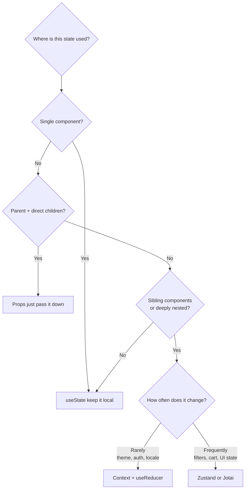

# How to Manage Global State in React Without Redux (2026)

I'm going to say something that might've been controversial in 2020 but is basically consensus now: you probably don't need Redux. Not because Redux is bad  it's a well-designed library that solved real problems. But the React ecosystem has moved on, and in 2026, there are simpler options that handle global state without the boilerplate avalanche that Redux is famous for.

I've used Redux on three production apps. Wrote the reducers, the action creators, the selectors, the middleware. Connected all the components. And then I switched a project to Zustand and realized I'd been writing five files to do what one file could handle. That experience kind of ruined Redux for me.

So if you're starting a new React project  or looking to rip out Redux from an existing one  here are the approaches that actually work for managing react global state without Redux.

## But First: Do You Even Need Global State?

Before we get into solutions, let me push back on the premise for a second. I've seen too many codebases where *everything* lives in global state  form values, modal open/close flags, temporary UI states that belong in a single component.

Here's my rule of thumb: **if a piece of state is only used by one component or a parent-child pair, it doesn't belong in global state.** Full stop.

Global state is for:
- User authentication / session data
- Theme preferences (dark mode, language)
- Shopping cart or other cross-page persistent data
- Feature flags
- Notifications / toast messages that can be triggered from anywhere

Everything else? `useState` and prop drilling are perfectly fine. Seriously. Prop drilling gets a bad reputation, but passing props two or three levels deep is not a problem. It's explicit, it's traceable, and it doesn't add any abstraction.



OK, now that we've established you actually need global state, let's look at the options.

## Option 1: Context + useReducer (Built-In, No Dependencies)

This is the zero-dependency option. React ships with everything you need for basic global state management.

The pattern: create a Context, wrap your app in a Provider, and use `useReducer` for state transitions. It works. It's fine. But it has sharp edges that you need to know about.

```tsx
// store/auth-context.tsx
import { createContext, useContext, useReducer, type ReactNode } from 'react'

interface AuthState {
  user: User | null
  isAuthenticated: boolean
  isLoading: boolean
}

type AuthAction =
  | { type: 'LOGIN_START' }
  | { type: 'LOGIN_SUCCESS'; user: User }
  | { type: 'LOGIN_FAILURE' }
  | { type: 'LOGOUT' }

const initialState: AuthState = {
  user: null,
  isAuthenticated: false,
  isLoading: false,
}

function authReducer(state: AuthState, action: AuthAction): AuthState {
  switch (action.type) {
    case 'LOGIN_START':
      return { ...state, isLoading: true }
    case 'LOGIN_SUCCESS':
      return { user: action.user, isAuthenticated: true, isLoading: false }
    case 'LOGIN_FAILURE':
      return { ...state, isLoading: false }
    case 'LOGOUT':
      return initialState
    default:
      return state
  }
}

const AuthContext = createContext<{
  state: AuthState
  dispatch: React.Dispatch<AuthAction>
} | null>(null)

export function AuthProvider({ children }: { children: ReactNode }) {
  const [state, dispatch] = useReducer(authReducer, initialState)
  return (
    <AuthContext.Provider value={{ state, dispatch }}>
      {children}
    </AuthContext.Provider>
  )
}

export function useAuth() {
  const context = useContext(AuthContext)
  if (!context) throw new Error('useAuth must be used within AuthProvider')
  return context
}
```

Then in your components:

```tsx
function UserMenu() {
  const { state, dispatch } = useAuth()

  if (!state.isAuthenticated) {
    return <LoginButton />
  }

  return (
    <div>
      <span>{state.user?.name}</span>
      <button onClick={() => dispatch({ type: 'LOGOUT' })}>
        Sign Out
      </button>
    </div>
  )
}
```

This works great for **infrequently changing state** like auth, theme, or locale. But here's the catch that bites people:

> **Warning:** Every component that consumes a Context re-renders when *any* value in that Context changes. If you put your entire app state in one Context, you'll get unnecessary re-renders everywhere. Split your contexts by domain  one for auth, one for theme, one for cart.

If you're typing `useReducer` with discriminated unions like the example above, check out our deep-dive on [how to type useReducer in TypeScript](/blog/type-usereducer-typescript)  it covers the edge cases that the React docs don't.

### When to choose Context + useReducer

- You have simple global state (auth, theme, locale)
- You don't want external dependencies
- State changes are infrequent (not every keystroke or mouse move)
- You're OK with the re-render behavior (or willing to split contexts)

## Option 2: Zustand (My Personal Pick)

Zustand has become my default for state management. It's tiny (1.1kB gzipped), has zero boilerplate compared to Redux, and it just *works*. No providers, no context wrapping, no HOCs.

Here's the same auth state from above, but with Zustand:

```tsx
// store/auth-store.ts
import { create } from 'zustand'

interface User {
  id: string
  name: string
  email: string
}

interface AuthStore {
  user: User | null
  isAuthenticated: boolean
  isLoading: boolean
  login: (email: string, password: string) => Promise<void>
  logout: () => void
}

export const useAuthStore = create<AuthStore>((set) => ({
  user: null,
  isAuthenticated: false,
  isLoading: false,

  login: async (email, password) => {
    set({ isLoading: true })
    try {
      const res = await fetch('/api/auth/login', {
        method: 'POST',
        body: JSON.stringify({ email, password }),
      })
      const user = await res.json()
      set({ user, isAuthenticated: true, isLoading: false })
    } catch {
      set({ isLoading: false })
    }
  },

  logout: () => set({ user: null, isAuthenticated: false }),
}))
```

Using it in a component  notice there's no provider wrapping:

```tsx
function UserMenu() {
  const { user, isAuthenticated, logout } = useAuthStore()

  if (!isAuthenticated) return <LoginButton />

  return (
    <div>
      <span>{user?.name}</span>
      <button onClick={logout}>Sign Out</button>
    </div>
  )
}
```

That's roughly half the code of the Context version. And Zustand has a killer feature that Context doesn't: **selector-based subscriptions**. You can subscribe to only the slice of state you need, so components only re-render when their specific slice changes:

```tsx
// Only re-renders when `user` changes, not when `isLoading` changes
const user = useAuthStore((state) => state.user)
```

Zustand also plays nicely with middleware. Need to persist state to localStorage? There's a middleware for that. Need devtools integration? One line:

```tsx
import { create } from 'zustand'
import { devtools, persist } from 'zustand/middleware'

export const useCartStore = create<CartStore>()(
  devtools(
    persist(
      (set) => ({
        items: [],
        addItem: (item) => set((state) => ({
          items: [...state.items, item]
        })),
        removeItem: (id) => set((state) => ({
          items: state.items.filter(item => item.id !== id)
        })),
        total: 0,
      }),
      { name: 'cart-storage' }  // persists to localStorage
    )
  )
)
```

### When to choose Zustand

- You want simple global state with minimal boilerplate
- You need fine-grained re-render control (selectors)
- You're building a medium to large app
- You want easy persistence, devtools, or middleware support
- You just want something that works without ceremony

## Option 3: Jotai (Atomic State)

Jotai takes a fundamentally different approach. Instead of one big store, you create individual **atoms**  tiny independent pieces of state. Think of it like `useState`, but the state is global and any component can access any atom.

```tsx
// atoms/auth.ts
import { atom } from 'jotai'

interface User {
  id: string
  name: string
  email: string
}

export const userAtom = atom<User | null>(null)
export const isAuthenticatedAtom = atom((get) => get(userAtom) !== null)
```

```tsx
// Derived atom  computes from other atoms, like a selector
export const userDisplayNameAtom = atom((get) => {
  const user = get(userAtom)
  return user ? user.name : 'Guest'
})
```

Using atoms in components:

```tsx
import { useAtom, useAtomValue } from 'jotai'
import { userAtom, isAuthenticatedAtom } from '@/atoms/auth'

function UserMenu() {
  const [user, setUser] = useAtom(userAtom)
  const isAuthenticated = useAtomValue(isAuthenticatedAtom)

  if (!isAuthenticated) return <LoginButton />

  return (
    <div>
      <span>{user?.name}</span>
      <button onClick={() => setUser(null)}>Sign Out</button>
    </div>
  )
}
```

The beauty of Jotai is that re-renders are automatically scoped. If component A reads `userAtom` and component B reads `cartAtom`, updating the cart won't re-render component A. No selectors needed  it just works.

Jotai really shines when you have lots of small, independent pieces of state that different parts of your app need. Think: a complex form builder, a dashboard with dozens of independent widgets, or an app with many user preferences.

### When to choose Jotai

- You have many independent pieces of state
- You want the simplest possible API (`useState`-like)
- You're building something with lots of derived/computed state
- You prefer bottom-up state design over top-down stores

## Option 4: Signals (The New Kid)

Signals have been gaining traction thanks to Preact Signals and the TC39 proposal. The idea is reactive primitives that automatically track dependencies  when a signal's value changes, only the components that read that signal re-render.

As of 2026, the signals ecosystem in React is still maturing. `@preact/signals-react` works, but it's not officially supported by the React team and there are edge cases with concurrent features. My honest take: signals are the future, but today I'd still reach for Zustand or Jotai unless you're on Preact or Solid.

```tsx
// With @preact/signals-react
import { signal, computed } from '@preact/signals-react'

const count = signal(0)
const doubled = computed(() => count.value * 2)

function Counter() {
  return (
    <div>
      <p>Count: {count}</p>
      <p>Doubled: {doubled}</p>
      <button onClick={() => count.value++}>Increment</button>
    </div>
  )
}
```

The DX is minimal  almost no boilerplate. But the React compatibility story isn't fully baked yet. Keep an eye on this space.

## The Comparison Table

Here's how all four approaches stack up:

| Feature | Context + useReducer | Zustand | Jotai | Signals |
|---------|---------------------|---------|-------|---------|
| Bundle size | 0 (built-in) | ~1.1kB | ~2.4kB | ~1.5kB |
| Boilerplate | High | Low | Very low | Very low |
| Re-render control | Manual (split contexts) | Selectors | Automatic (atomic) | Automatic |
| DevTools | React DevTools | Redux DevTools | Custom devtools | Limited |
| Persistence | DIY | Built-in middleware | Plugin (jotai-effect) | DIY |
| SSR support | Yes | Yes | Yes | Experimental |
| TypeScript support | Good | Excellent | Excellent | Good |
| Learning curve | Low | Low | Low | Medium |
| Provider required | Yes | No | Optional | No |
| Best for | Simple, infrequent state | General purpose | Atomic/derived state | Fine-grained reactivity |

## What I'd Actually Pick (Opinionated Take)

For most apps I start in 2026, here's my decision process:

1. **Just auth and theme?** Context + useReducer. No reason to add a dependency.
2. **Medium app with a shopping cart, filters, or dashboards?** Zustand. It's the sweet spot of simplicity and power.
3. **Complex app with lots of independent, derived state?** Jotai. The atomic model handles complexity gracefully.
4. **Greenfield project on Preact or Solid?** Signals. They're native to those frameworks.

And honestly? For most projects, Zustand is the answer. It's the tool I reach for by default, and I've never once regretted that choice.

If you're migrating a Redux-based codebase to one of these alternatives and working in TypeScript, [SnipShift's JS to TS converter](https://snipshift.dev/js-to-ts) can help you add proper types to your store files. And for typing the React Context approach, check out our guide on [how to type React Context in TypeScript](/blog/type-react-context-typescript)  it covers the patterns that prevent the "context might be null" headache.

## The Mistake Everyone Makes

Here's the pattern I see in almost every React codebase that's more than a year old: global state creep. It starts with a user store. Then someone adds the selected tab to the store because they need it in two places. Then form state goes in. Then someone adds UI flags  `isSidebarOpen`, `isModalVisible`, `isTooltipShown`.

Before you know it, you have 47 pieces of global state, 30 of which are used by exactly one component.

Fight this aggressively. Every time you're about to add something to global state, ask: "Would `useState` in the right component work here?" If the answer is yes, don't put it in the store. Your future self will thank you.

For more on building forms with proper state management in React, check out our [React forms with TypeScript guide](/blog/react-forms-typescript-guide). And if you want to explore all our developer tools, head over to [SnipShift.dev](https://snipshift.dev)  we've got 20+ free converters for your daily workflow.
