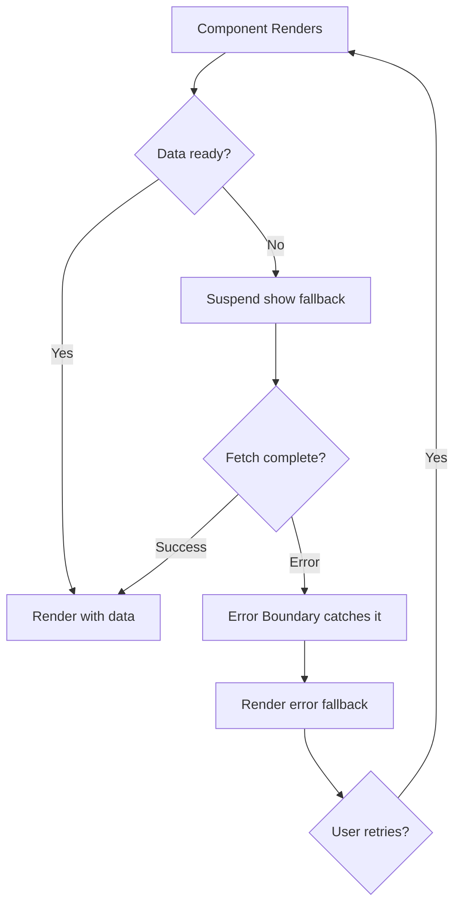

# How to Handle Loading and Error States in React (Without Spaghetti Code)

Every React developer has written this code at some point:

```tsx
const [data, setData] = useState(null)
const [loading, setLoading] = useState(true)
const [error, setError] = useState(null)
```

Three separate booleans, loosely related, and  if you're not careful  capable of representing impossible states. Can you have `loading: true` and `error: "something went wrong"` at the same time? Technically yes. Should you? Absolutely not. But there's nothing in this pattern that prevents it.

I've debugged more loading-state bugs than I care to admit. Spinners that never stop spinning. Error messages that flash for a frame before disappearing. Components that somehow show stale data *and* a loading indicator simultaneously. All of these stem from the same root cause: unstructured state management for async operations.

Let's fix that. Here are the patterns I use to handle react loading error states without the code turning into spaghetti.

## The Problem With Boolean Flags

The classic three-variable approach creates what I call "state soup." You have independent booleans that are supposed to represent a single process (loading data), but they can drift out of sync:

```tsx
// ❌ This represents 8 possible states (2³), but only 3 are valid
const [data, setData] = useState<User | null>(null)
const [loading, setLoading] = useState(true)
const [error, setError] = useState<string | null>(null)

// Valid states:
// loading=true,  error=null,    data=null     → Loading
// loading=false, error=null,    data=User     → Success
// loading=false, error=string,  data=null     → Error

// Invalid but possible states:
// loading=true,  error=string,  data=null     → Loading AND error?
// loading=false, error=null,    data=null     → Not loading, no error, no data?
// loading=true,  error=null,    data=User     → Loading but already have data?
// ... and more
```

When your state can represent impossible states, bugs are just a matter of time.

## Pattern 1: The Status Enum

The simplest fix is replacing multiple booleans with a single status enum. Instead of three variables that might contradict each other, you have one variable that clearly says where you are:

```tsx
type Status = 'idle' | 'loading' | 'success' | 'error'

function useUsers() {
  const [status, setStatus] = useState<Status>('idle')
  const [data, setData] = useState<User[]>([])
  const [error, setError] = useState<string>('')

  async function fetchUsers() {
    setStatus('loading')
    try {
      const res = await fetch('/api/users')
      if (!res.ok) throw new Error(`HTTP ${res.status}`)
      const users = await res.json()
      setData(users)
      setStatus('success')
    } catch (err) {
      setError(err instanceof Error ? err.message : 'Unknown error')
      setStatus('error')
    }
  }

  return { status, data, error, fetchUsers }
}
```

```tsx
function UserList() {
  const { status, data, error, fetchUsers } = useUsers()

  useEffect(() => { fetchUsers() }, [])

  switch (status) {
    case 'idle':
    case 'loading':
      return <UserListSkeleton />
    case 'error':
      return <ErrorMessage message={error} onRetry={fetchUsers} />
    case 'success':
      return (
        <ul>
          {data.map(user => <UserCard key={user.id} user={user} />)}
        </ul>
      )
  }
}
```

This is already a massive improvement. The `switch` statement covers every case, and TypeScript will yell at you if you miss one. No impossible states. No ambiguity.

But we can do better.

## Pattern 2: Discriminated Unions (The TypeScript Way)

If you're using TypeScript  and you should be  discriminated unions are the gold standard for modeling async state. Instead of separate variables that might not agree, you create a single state object where the `status` field determines which other fields exist:

```typescript
type AsyncState<T> =
  | { status: 'idle' }
  | { status: 'loading' }
  | { status: 'success'; data: T }
  | { status: 'error'; error: string }
```

This is beautiful because TypeScript *narrows* the type based on the status check:

```tsx
function UserList() {
  const [state, setState] = useState<AsyncState<User[]>>({ status: 'idle' })

  useEffect(() => {
    setState({ status: 'loading' })

    fetch('/api/users')
      .then(res => {
        if (!res.ok) throw new Error(`HTTP ${res.status}`)
        return res.json()
      })
      .then(data => setState({ status: 'success', data }))
      .catch(err => setState({
        status: 'error',
        error: err instanceof Error ? err.message : 'Unknown error',
      }))
  }, [])

  switch (state.status) {
    case 'idle':
    case 'loading':
      return <UserListSkeleton />
    case 'error':
      // TypeScript knows state.error exists here
      return <ErrorMessage message={state.error} />
    case 'success':
      // TypeScript knows state.data exists here
      return (
        <ul>
          {state.data.map(user => <UserCard key={user.id} user={user} />)}
        </ul>
      )
  }
}
```

When `state.status` is `'success'`, TypeScript knows `state.data` is `T`. When it's `'error'`, TypeScript knows `state.error` is a string. You literally *cannot* access `state.data` in the error branch  the compiler won't let you.

This pattern eliminates an entire category of bugs. I've used it on every project for the past three years and I'm not going back.

> **Tip:** If you're converting a JavaScript codebase to TypeScript and want to type your loading states properly, [SnipShift's JS to TypeScript converter](https://snipshift.dev/js-to-ts) can help you add discriminated union types to your existing async patterns. It's faster than typing them by hand when you've got dozens of data-fetching hooks.

For more on discriminated unions with `useReducer`  which pairs perfectly with this pattern  check out our guide on [typing useReducer in TypeScript](/blog/type-usereducer-typescript).

## Pattern 3: React Suspense + Error Boundaries

Suspense is React's built-in answer to loading states. Instead of managing loading booleans yourself, you let React handle it declaratively:

```tsx
// app/users/page.tsx
import { Suspense } from 'react'
import { ErrorBoundary } from 'react-error-boundary'

export default function UsersPage() {
  return (
    <ErrorBoundary fallback={<ErrorFallback />}>
      <Suspense fallback={<UserListSkeleton />}>
        <UserList />
      </Suspense>
    </ErrorBoundary>
  )
}
```

```tsx
// UserList.tsx  no loading state management at all
async function UserList() {
  const users = await fetchUsers() // throws on error, suspends while loading

  return (
    <ul>
      {users.map(user => <UserCard key={user.id} user={user} />)}
    </ul>
  )
}
```

The `UserList` component doesn't know about loading or error states. It just fetches and renders. Suspense handles the loading fallback. ErrorBoundary handles the error fallback. The component itself is beautifully simple.



The power of this pattern is **composition**. You can wrap different parts of your page in different Suspense boundaries:

```tsx
export default function DashboardPage() {
  return (
    <div className="grid grid-cols-2 gap-4">
      <Suspense fallback={<StatsSkeleton />}>
        <StatsWidget />  {/* Loads independently */}
      </Suspense>

      <Suspense fallback={<ChartSkeleton />}>
        <RevenueChart />  {/* Loads independently */}
      </Suspense>

      <Suspense fallback={<TableSkeleton />}>
        <RecentOrders />  {/* Loads independently */}
      </Suspense>
    </div>
  )
}
```

Each widget shows its own skeleton while loading, and renders independently when its data arrives. No orchestration code. No "wait for all three to finish." The fastest widget renders first.

### Error Boundaries with Recovery

The `react-error-boundary` package gives you a much better error boundary than writing your own class component:

```tsx
import { ErrorBoundary } from 'react-error-boundary'

function ErrorFallback({
  error,
  resetErrorBoundary,
}: {
  error: Error
  resetErrorBoundary: () => void
}) {
  return (
    <div role="alert" className="p-4 bg-red-50 rounded-lg">
      <h3 className="font-semibold text-red-800">Something went wrong</h3>
      <p className="text-red-600 text-sm mt-1">{error.message}</p>
      <button
        onClick={resetErrorBoundary}
        className="mt-3 px-4 py-2 bg-red-100 text-red-700 rounded"
      >
        Try Again
      </button>
    </div>
  )
}

// Usage
<ErrorBoundary
  FallbackComponent={ErrorFallback}
  onReset={() => {
    // Clear any cached data or state that might cause the error to recur
  }}
>
  <Suspense fallback={<Skeleton />}>
    <DataComponent />
  </Suspense>
</ErrorBoundary>
```

For more on handling API errors gracefully  including retry strategies and user-friendly error messages  check out our guide on [handling API errors in JavaScript](/blog/handle-api-errors-javascript).

## Pattern 4: React Query / TanStack Query (The Practical Choice)

If you're fetching data on the client side, TanStack Query (formerly React Query) is basically the industry standard at this point. It handles loading, error, and success states out of the box  plus caching, retries, background refetching, and pagination.

```tsx
import { useQuery } from '@tanstack/react-query'

function UserList() {
  const {
    data: users,
    isLoading,
    isError,
    error,
    refetch,
  } = useQuery({
    queryKey: ['users'],
    queryFn: () => fetch('/api/users').then(res => {
      if (!res.ok) throw new Error(`HTTP ${res.status}`)
      return res.json() as Promise<User[]>
    }),
    retry: 2,                    // Retry failed requests twice
    staleTime: 5 * 60 * 1000,   // Consider data fresh for 5 minutes
  })

  if (isLoading) return <UserListSkeleton />
  if (isError) return <ErrorMessage message={error.message} onRetry={refetch} />

  return (
    <ul>
      {users.map(user => <UserCard key={user.id} user={user} />)}
    </ul>
  )
}
```

What I love about React Query is that it handles the edge cases you forget about:

- **Stale data**: Shows cached data immediately while refetching in the background
- **Window focus refetching**: Automatically refetches when the user tabs back to your app
- **Retry with backoff**: Failed requests are retried with exponential backoff
- **Deduplication**: Multiple components requesting the same data only trigger one fetch
- **Optimistic updates**: Update the UI before the server confirms

And React Query integrates with Suspense too, so you can use both patterns together:

```tsx
const { data } = useSuspenseQuery({
  queryKey: ['users'],
  queryFn: fetchUsers,
})
// No need to check isLoading or isError  Suspense handles it
```

## Skeleton UI: The Loading State That Doesn't Suck

One more thing before we wrap up. Spinners are fine for short waits, but for anything over 300ms, skeleton screens are a much better UX. They give the user a sense of the page layout before data loads, which reduces perceived loading time.

```tsx
function UserCardSkeleton() {
  return (
    <div className="animate-pulse flex items-center gap-3 p-4">
      <div className="rounded-full bg-gray-200 h-10 w-10" />
      <div className="flex-1 space-y-2">
        <div className="h-4 bg-gray-200 rounded w-3/4" />
        <div className="h-3 bg-gray-200 rounded w-1/2" />
      </div>
    </div>
  )
}

function UserListSkeleton() {
  return (
    <div className="space-y-2">
      {Array.from({ length: 5 }).map((_, i) => (
        <UserCardSkeleton key={i} />
      ))}
    </div>
  )
}
```

The skeleton should match the layout of the actual content as closely as possible. When the real data loads, the transition should feel seamless  shapes in the same positions, same spacing, same sizing.

## Which Pattern Should You Use?

| Approach | Best For | Complexity |
|----------|----------|------------|
| Status enum | Simple components, learning | Low |
| Discriminated unions | TypeScript projects, custom hooks | Medium |
| Suspense + Error Boundaries | Next.js Server Components, declarative style | Medium |
| React Query + Suspense | Client-side data fetching, caching needs | Low (with library) |

My recommendation: **use React Query for client-side fetching and Suspense for server-side**. Both handle loading and error states elegantly, and you don't need to write the boilerplate yourself.

For one-off cases where a library feels heavy, discriminated unions give you the best type safety for the least code. And they're a pattern, not a dependency  no npm install needed.

If you're typing these patterns in a TypeScript project, our guide on [TypeScript generics](/blog/typescript-generics-explained) covers how to make `AsyncState<T>` and similar utilities fully generic and reusable. And for the form-specific version of this problem  managing submission states, validation errors, and field-level loading  check out our [React forms with TypeScript guide](/blog/react-forms-typescript-guide).

The key takeaway: your UI has exactly four states  idle, loading, success, error. Model them explicitly. Don't let boolean flags create impossible combinations. Your future self will thank you when the 3am production bug is a clear state transition issue instead of a mystery. Explore more tools at [SnipShift.dev](https://snipshift.dev).
