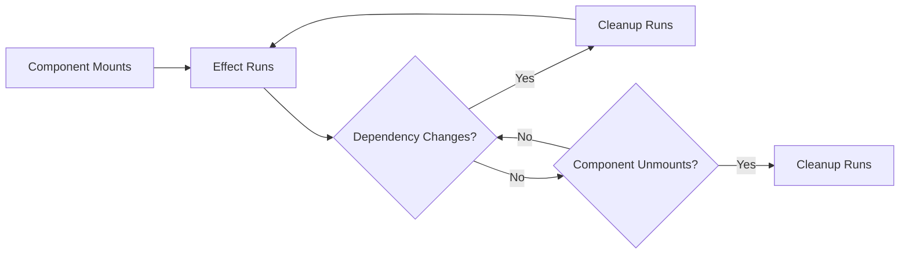

# React useEffect Cleanup: Why It Matters and How to Do It Right

Most memory leaks in React apps come from the same place: a missing cleanup function in `useEffect`. You set up a subscription, start an interval, or fire off a fetch  and when the component unmounts, that thing keeps running in the background, updating state that no longer exists and slowly eating memory.

I've debugged this exact issue more times than I'd like to admit. A user navigates away from a page, the component unmounts, but a WebSocket listener is still firing, trying to call `setState` on a component that's gone. React gives you a warning in dev mode. In production, you just get a slow, leaky app.

The fix is always the same: return a cleanup function from your `useEffect`. But the specifics depend on what you're cleaning up.

## How useEffect Cleanup Works

The return value of your `useEffect` callback is the cleanup function. React calls it in two situations:

1. **Before the effect re-runs** (when dependencies change)
2. **When the component unmounts**

```typescript
useEffect(() => {
  // Setup: runs on mount and when deps change
  console.log('Effect running');

  return () => {
    // Cleanup: runs before re-run and on unmount
    console.log('Cleaning up');
  };
}, [someDependency]);
```



Think of it like a setup/teardown pair. Whatever you create in the effect, you destroy in the cleanup. Here's every common scenario.

## 1. AbortController for Fetch Requests

This is the most common one. You fire a fetch request, the user navigates away, and the fetch completes after the component is gone.

```typescript
import { useState, useEffect } from 'react';

interface UserData {
  id: string;
  name: string;
  email: string;
}

function UserProfile({ userId }: { userId: string }) {
  const [user, setUser] = useState<UserData | null>(null);

  useEffect(() => {
    const controller = new AbortController();

    async function loadUser() {
      try {
        const res = await fetch(`/api/users/${userId}`, {
          signal: controller.signal,
        });
        const data: UserData = await res.json();
        setUser(data);
      } catch (err) {
        // AbortError is expected when we cancel  don't treat it as an error
        if (err instanceof Error && err.name !== 'AbortError') {
          console.error('Failed to fetch user:', err);
        }
      }
    }

    loadUser();

    return () => controller.abort();
  }, [userId]);

  return user ? <div>{user.name}</div> : <div>Loading...</div>;
}
```

Without the AbortController, here's what happens: user clicks to a different page, the component unmounts, the fetch completes, `setUser` gets called on an unmounted component. In older React versions, this threw a warning. In current React, it's silently ignored  but the network request still wastes bandwidth, and if you're doing anything else in the `.then()` chain, that logic still executes.

The AbortController tells the browser to cancel the request entirely. The `fetch` promise rejects with an `AbortError`, which we catch and ignore. Clean.

## 2. Clearing Intervals and Timeouts

`setInterval` and `setTimeout` keep running even after your component is gone. This is one of those bugs that's easy to miss in development but shows up in production as gradually increasing memory usage.

```typescript
function LiveClock() {
  const [time, setTime] = useState(new Date());

  useEffect(() => {
    const intervalId = setInterval(() => {
      setTime(new Date());
    }, 1000);

    return () => clearInterval(intervalId);
  }, []);

  return <span>{time.toLocaleTimeString()}</span>;
}
```

```typescript
function DelayedNotification({ message }: { message: string }) {
  const [visible, setVisible] = useState(false);

  useEffect(() => {
    const timeoutId = setTimeout(() => {
      setVisible(true);
    }, 3000);

    return () => clearTimeout(timeoutId);
  }, [message]);

  return visible ? <div className="notification">{message}</div> : null;
}
```

The pattern is always the same: save the ID returned by `setInterval`/`setTimeout`, then call `clearInterval`/`clearTimeout` in cleanup.

> **Warning:** Forgetting to clear an interval is one of the most common sources of memory leaks in React. If your app gets slower over time as users navigate between pages, check for uncleaned intervals first.

## 3. Removing Event Listeners

When you attach event listeners to `window`, `document`, or other DOM elements inside a `useEffect`, you need to remove them on cleanup. Otherwise, every time the component mounts, you add another listener  and they stack up.

```typescript
function useWindowResize(callback: (width: number, height: number) => void) {
  useEffect(() => {
    function handleResize() {
      callback(window.innerWidth, window.innerHeight);
    }

    window.addEventListener('resize', handleResize);

    return () => window.removeEventListener('resize', handleResize);
  }, [callback]);
}
```

```typescript
function useKeyboardShortcut(key: string, handler: () => void) {
  useEffect(() => {
    function handleKeyDown(event: KeyboardEvent) {
      if (event.key === key) {
        event.preventDefault();
        handler();
      }
    }

    document.addEventListener('keydown', handleKeyDown);

    return () => document.removeEventListener('keydown', handleKeyDown);
  }, [key, handler]);
}
```

One critical detail: the function you pass to `removeEventListener` must be the **exact same reference** as the one you passed to `addEventListener`. That's why we define `handleResize` and `handleKeyDown` as named functions inside the effect  so the cleanup can reference the same function object.

This won't work:

```typescript
// BUG: anonymous functions create new references
useEffect(() => {
  window.addEventListener('resize', () => doSomething()); // Reference A

  return () => {
    window.removeEventListener('resize', () => doSomething()); // Reference B (different!)
    // This doesn't actually remove anything  the references don't match
  };
}, []);
```

## 4. Unsubscribing from WebSockets

WebSocket connections stay open until you explicitly close them. If a component that manages a WebSocket unmounts without closing the connection, you'll have a zombie socket consuming resources and potentially calling `setState` on a dead component.

```typescript
interface ChatMessage {
  id: string;
  user: string;
  text: string;
  timestamp: number;
}

function useChatMessages(roomId: string) {
  const [messages, setMessages] = useState<ChatMessage[]>([]);

  useEffect(() => {
    const ws = new WebSocket(`wss://chat.example.com/rooms/${roomId}`);

    ws.addEventListener('message', (event: MessageEvent) => {
      const message: ChatMessage = JSON.parse(event.data);
      setMessages((prev) => [...prev, message]);
    });

    ws.addEventListener('error', (event) => {
      console.error('WebSocket error:', event);
    });

    return () => {
      // Close the connection cleanly on unmount
      ws.close();
    };
  }, [roomId]);

  return messages;
}
```

The same applies to any subscription-based API  Firebase listeners, Supabase real-time, RxJS observables, or custom event emitters. Whatever you subscribe to, unsubscribe in the cleanup.

```typescript
// Supabase real-time example
useEffect(() => {
  const channel = supabase
    .channel('room-updates')
    .on('postgres_changes', { event: 'INSERT', schema: 'public', table: 'messages' },
      (payload) => {
        setMessages((prev) => [...prev, payload.new as ChatMessage]);
      }
    )
    .subscribe();

  return () => {
    supabase.removeChannel(channel);
  };
}, []);
```

## 5. The Strict Mode Double-Mount Trap

Here's one that catches a lot of developers off guard. In React 18+, when `StrictMode` is enabled (which it is by default in most setups), React **mounts your component twice** in development  mount, unmount, mount again. It does this to surface missing cleanup functions.

So if you have this:

```typescript
useEffect(() => {
  console.log('Connecting to WebSocket...');
  const ws = new WebSocket('wss://example.com');

  // No cleanup!
}, []);
```

In development with StrictMode, you'll see:
1. "Connecting to WebSocket..." (first mount)
2. Component unmounts (no cleanup runs  there is none)
3. "Connecting to WebSocket..." (second mount)

Now you have two WebSocket connections. In production (where StrictMode doesn't double-mount), you'd have one. But the bug is real  if something else causes a remount (like a parent re-rendering with a new key), you'd get the same leak.

The fix is simple  add cleanup:

```typescript
useEffect(() => {
  console.log('Connecting to WebSocket...');
  const ws = new WebSocket('wss://example.com');

  return () => {
    console.log('Disconnecting...');
    ws.close();
  };
}, []);
```

Now the double-mount looks like: connect → disconnect → connect. One connection, as expected. StrictMode did its job  it exposed the missing cleanup.

> **Tip:** If you're seeing double API calls, double connections, or double log messages in development  check if StrictMode is wrapping your app. The solution is NOT to remove StrictMode. The solution is to add proper cleanup. StrictMode is helping you.

## A Quick Cleanup Reference

| What You Set Up | How to Clean Up | What Happens Without Cleanup |
|----------------|-----------------|------------------------------|
| `fetch()` | `AbortController.abort()` | Wasted network request, stale state update |
| `setInterval()` | `clearInterval(id)` | Interval runs forever, memory leak |
| `setTimeout()` | `clearTimeout(id)` | Timeout fires after unmount |
| `addEventListener()` | `removeEventListener()` | Listeners stack up on each mount |
| `WebSocket` | `ws.close()` | Zombie connection, stale updates |
| `IntersectionObserver` | `observer.disconnect()` | Observer keeps firing callbacks |
| `MutationObserver` | `observer.disconnect()` | Observer keeps firing callbacks |
| `ResizeObserver` | `observer.disconnect()` | Observer keeps firing callbacks |

## Putting It All Together: A Real Component

Here's a component that does several things  fetches data, listens for keyboard shortcuts, and runs a polling interval. Each one needs its own cleanup:

```typescript
function Dashboard({ teamId }: { teamId: string }) {
  const [stats, setStats] = useState<TeamStats | null>(null);
  const [isFullscreen, setIsFullscreen] = useState(false);

  // Fetch initial data
  useEffect(() => {
    const controller = new AbortController();

    fetch(`/api/teams/${teamId}/stats`, { signal: controller.signal })
      .then((res) => res.json())
      .then((data: TeamStats) => setStats(data))
      .catch((err) => {
        if (err.name !== 'AbortError') console.error(err);
      });

    return () => controller.abort();
  }, [teamId]);

  // Poll for updates every 30 seconds
  useEffect(() => {
    const intervalId = setInterval(async () => {
      try {
        const res = await fetch(`/api/teams/${teamId}/stats`);
        const data: TeamStats = await res.json();
        setStats(data);
      } catch (err) {
        console.error('Polling failed:', err);
      }
    }, 30_000);

    return () => clearInterval(intervalId);
  }, [teamId]);

  // Keyboard shortcut for fullscreen
  useEffect(() => {
    function handleKeyDown(e: KeyboardEvent) {
      if (e.key === 'f' && e.metaKey) {
        e.preventDefault();
        setIsFullscreen((prev) => !prev);
      }
    }

    document.addEventListener('keydown', handleKeyDown);
    return () => document.removeEventListener('keydown', handleKeyDown);
  }, []);

  return (
    <div className={isFullscreen ? 'fullscreen' : ''}>
      {stats ? <StatsGrid data={stats} /> : <Spinner />}
    </div>
  );
}
```

Three effects, three cleanups. The component mounts, everything starts. It unmounts, everything stops. No leaks, no zombie processes, no stale updates.

## The One Rule

Here's the mental model that'll save you from 90% of useEffect bugs: **if your effect creates something, your cleanup should destroy it.** Open a connection  close it. Add a listener  remove it. Start a timer  clear it. Start a request  abort it.

If you can internalize that one rule, you'll avoid the most common source of memory leaks in React applications. And when StrictMode double-mounts your component in development and everything still works correctly, you'll know your cleanups are solid.

For more on typing hooks properly  including useEffect patterns  check out our guide on [TypeScript React hooks types](/blog/typescript-react-hooks-types). And if you're building custom hooks that use timers or event listeners internally, our post on [debounce input with React TypeScript](/blog/debounce-input-react-typescript-hook) shows a production-quality example with full cleanup.

If you're tracking down a memory leak that's already happening, our post on [finding and fixing JavaScript memory leaks](/blog/javascript-memory-leak-find-fix) walks through the Chrome DevTools profiling workflow step by step.
