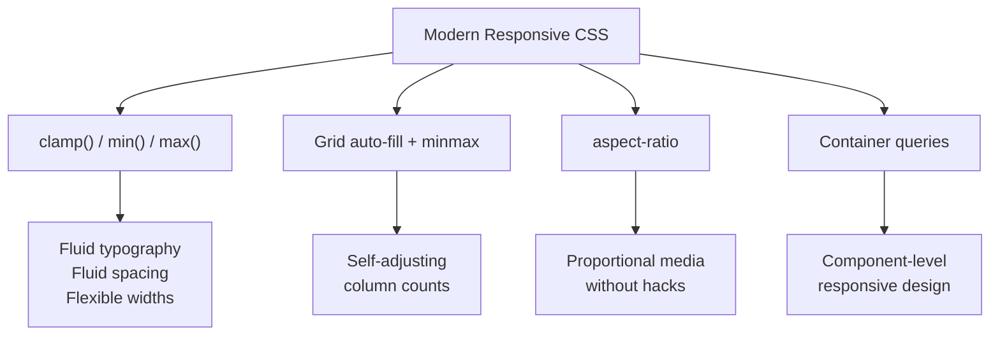

# How to Write Responsive CSS Without Media Queries

I used to have media queries scattered across every stylesheet in my projects. Tablet breakpoint here, desktop breakpoint there, some weird 1024px query that nobody remembered why it existed. It worked, but it was messy, brittle, and every new component meant another set of breakpoints to maintain.

Then I started using modern CSS  `clamp()`, `min()`, `max()`, intrinsic sizing with Grid  and I realized I could delete most of those media queries. Not all of them. But the majority. And the layouts actually became *more* responsive, because they respond to available space continuously instead of snapping at arbitrary pixel breakpoints.

Here's every technique I use to write responsive CSS without media queries.

## clamp(): The Single Most Useful CSS Function

If you learn one thing from this post, make it `clamp()`. It takes three values: a minimum, a preferred value, and a maximum.

```css
.title {
  font-size: clamp(1.5rem, 4vw, 3rem);
}
```

This says: "I'd like the font size to be 4% of the viewport width, but never smaller than 1.5rem and never bigger than 3rem." The font scales smoothly between those bounds as the viewport changes. No breakpoints. No jumping. Just fluid sizing.

```
Viewport: 320px  →  font-size: 1.5rem (minimum kicks in)
Viewport: 768px  →  font-size: 2.3rem (4vw preferred)
Viewport: 1200px →  font-size: 3rem (maximum kicks in)
```

I use `clamp()` for:

- **Font sizes**  fluid typography without a type scale library
- **Padding/margins**  spacing that breathes with the viewport
- **Widths**  content containers that don't need `max-width` + `margin: auto`

```css
.container {
  /* Replaces: width: 100%; max-width: 1200px; margin: 0 auto; padding: 0 1rem; */
  width: clamp(320px, 90%, 1200px);
  margin-inline: auto;
}

.section {
  padding: clamp(2rem, 5vw, 6rem) clamp(1rem, 3vw, 3rem);
}
```

That `.container` rule does what used to take three or four properties  and it handles the narrow viewport padding naturally because 90% of a small screen is already less than 1200px.

## min() and max(): Conditional Sizing

`min()` picks the smallest value. `max()` picks the largest. They're sort of like `clamp()` split in half.

```css
.sidebar {
  width: min(300px, 100%);
  /* On wide screens: 300px. On narrow screens: 100% (which is less than 300px) */
}

.hero-image {
  height: max(400px, 50vh);
  /* At least 400px tall, but grows to 50vh on tall viewports */
}
```

I find myself reaching for `min()` more than `max()`. The `min(fixed, 100%)` pattern is incredibly handy  it's basically saying "this wide, but never wider than its container."

```css
.dialog {
  width: min(600px, 100% - 2rem);
  /* 600px on desktop, full width minus padding on mobile */
}
```

No media query, handles every screen size, and the `- 2rem` gives you breathing room on small screens.

## Fluid Typography System

Combine `clamp()` with CSS custom properties and you get a full responsive type scale:

```css
:root {
  --text-sm: clamp(0.8rem, 0.17vw + 0.76rem, 0.89rem);
  --text-base: clamp(1rem, 0.34vw + 0.91rem, 1.19rem);
  --text-lg: clamp(1.25rem, 0.61vw + 1.1rem, 1.58rem);
  --text-xl: clamp(1.56rem, 1vw + 1.31rem, 2.11rem);
  --text-2xl: clamp(1.95rem, 1.56vw + 1.56rem, 2.81rem);
  --text-3xl: clamp(2.44rem, 2.38vw + 1.85rem, 3.75rem);
}

h1 { font-size: var(--text-3xl); }
h2 { font-size: var(--text-2xl); }
h3 { font-size: var(--text-xl); }
p  { font-size: var(--text-base); }
```

Every heading scales continuously from mobile to desktop. No breakpoints, no jumps, just smooth scaling. For more on building theming systems with CSS variables, see our [CSS custom properties guide](/blog/css-custom-properties-guide).

> **Tip:** Generating those `clamp()` values by hand is tedious. Use a tool like Utopia (utopia.fyi) to generate fluid type scales  you define the min/max viewport and font sizes, and it gives you the `clamp()` formulas.

## CSS Grid: auto-fill and auto-fit

This is my favorite responsive pattern in all of CSS:

```css
.grid {
  display: grid;
  grid-template-columns: repeat(auto-fill, minmax(280px, 1fr));
  gap: 1.5rem;
}
```

One line. Responsive grid. Cards are at least 280px wide, fill available space, and the column count adjusts automatically. No media queries.

```
Wide viewport (1200px):
┌────────┐ ┌────────┐ ┌────────┐ ┌────────┐
│  Card  │ │  Card  │ │  Card  │ │  Card  │
└────────┘ └────────┘ └────────┘ └────────┘

Medium viewport (800px):
┌───────────┐ ┌───────────┐
│   Card    │ │   Card    │
├───────────┤ ├───────────┤
│   Card    │ │   Card    │
└───────────┘ └───────────┘

Narrow viewport (400px):
┌─────────────────────┐
│        Card         │
├─────────────────────┤
│        Card         │
├─────────────────────┤
│        Card         │
└─────────────────────┘
```

**auto-fill vs auto-fit:** The difference matters when you have fewer items than could fill a row.

```css
/* auto-fill: creates empty columns to fill the row */
grid-template-columns: repeat(auto-fill, minmax(200px, 1fr));

/* auto-fit: collapses empty columns, items stretch to fill */
grid-template-columns: repeat(auto-fit, minmax(200px, 1fr));
```

With 2 items in a wide container:
- `auto-fill` keeps the items at ~200px with empty space
- `auto-fit` stretches the 2 items to fill the entire width

I default to `auto-fill` for card grids (consistent card sizes) and `auto-fit` when I have a small number of items that should fill the space. For a deeper comparison of Grid layouts, check out [CSS Grid vs Flexbox](/blog/css-grid-vs-flexbox-when-to-use).

## aspect-ratio: Responsive Media

The `aspect-ratio` property replaced the padding-top hack that we used for years:

```css
/* Old way (the hack) */
.video-wrapper {
  position: relative;
  padding-top: 56.25%; /* 16:9 ratio */
}

/* Modern way */
.video-wrapper {
  aspect-ratio: 16 / 9;
  width: 100%;
}

.thumbnail {
  aspect-ratio: 4 / 3;
  width: 100%;
  object-fit: cover;
}
```

The element maintains its ratio at any width. Combine with `width: min(100%, 800px)` for a responsive video container that maxes out at 800px:

```css
.video {
  width: min(100%, 800px);
  aspect-ratio: 16 / 9;
  margin-inline: auto;
}
```

Responsive, centered, correct aspect ratio, zero media queries.

## Container Queries: Component-Level Responsiveness

This one is technically not "without queries"  but it's without *media* queries, which is the point. Container queries let components respond to their own container's size:

```css
.card-container {
  container-type: inline-size;
}

.card {
  display: flex;
  flex-direction: column;
}

@container (min-width: 500px) {
  .card {
    flex-direction: row;
  }
}
```

The card adapts based on where it's placed, not the viewport. We have a [full guide on container queries](/blog/css-container-queries-guide) if you want to go deeper  they're a game changer for component libraries.

## Putting It All Together

Here's a real layout using every technique above  zero media queries:

```css
.page {
  --content-width: clamp(320px, 90%, 1200px);

  display: grid;
  grid-template-columns: 1fr min(var(--content-width), 100%);
  justify-content: center;
}

.hero {
  padding: clamp(3rem, 8vw, 8rem) 0;
}

.hero h1 {
  font-size: clamp(2rem, 5vw + 1rem, 4rem);
  line-height: 1.1;
}

.cards {
  display: grid;
  grid-template-columns: repeat(auto-fill, minmax(min(300px, 100%), 1fr));
  gap: clamp(1rem, 2vw, 2rem);
}

.card img {
  aspect-ratio: 3 / 2;
  width: 100%;
  object-fit: cover;
}
```



The whole page is responsive from 320px phones to 4K monitors. Everything scales continuously. No awkward snapping at breakpoints.

If you're converting responsive CSS like this to Tailwind utilities, [SnipShift's CSS to Tailwind converter](https://snipshift.dev/css-to-tailwind) handles `clamp()`, `minmax()`, and custom properties  it'll generate the equivalent Tailwind classes or flag when you need arbitrary values.

## When You Still Need Media Queries

I'm not saying never use media queries. They're still the right tool for:

- **Layout shifts**  sidebar collapsing to a hamburger menu
- **Showing/hiding elements**  mobile nav vs desktop nav
- **User preference queries**  `prefers-reduced-motion`, `prefers-color-scheme`
- **Print styles**  `@media print`

But for sizing, spacing, and grid column counts? Modern CSS functions handle it better. The code is simpler, the behavior is smoother, and you spend less time picking arbitrary breakpoint numbers.

The tools keep getting better too. Combine these techniques with the [`:has()` selector](/blog/css-has-selector-guide) for state-driven styles and you've got a CSS toolkit that handles most of what we used to need JavaScript for.

For more CSS converters and developer tools, check out [SnipShift.dev](https://snipshift.dev).
