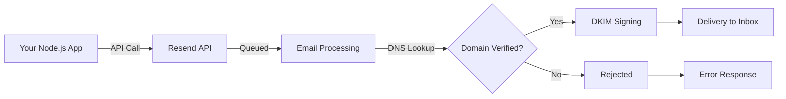

# How to Send Emails from Node.js with Resend (TypeScript Guide)

I used to dread the email-sending part of any project. SendGrid's docs felt like they were written for a different decade, AWS SES required a PhD in IAM policies, and Nodemailer  bless its heart  meant managing SMTP credentials and dealing with deliverability yourself. Then I found Resend, and I genuinely haven't looked back.

Resend is what email APIs should've been from the start: clean SDK, great TypeScript support, and you can use React components as email templates. That last part is wild, and we'll get to it.

## Getting Started with Resend

First, sign up at [resend.com](https://resend.com) and grab your API key from the dashboard. The free tier gives you 100 emails/day and 3,000/month  enough for development and small production apps.

Install the SDK:

```bash
npm install resend
```

Create a simple send function:

```typescript
// lib/email.ts
import { Resend } from "resend";

const resend = new Resend(process.env.RESEND_API_KEY);

async function sendWelcomeEmail(to: string, name: string) {
  const { data, error } = await resend.emails.send({
    from: "Your App <hello@yourapp.com>",
    to,
    subject: `Welcome, ${name}!`,
    html: `<h1>Hey ${name}, glad you're here.</h1><p>Get started by...</p>`,
  });

  if (error) {
    console.error("Failed to send email:", error);
    throw error;
  }

  return data; // { id: "email_abc123..." }
}
```

That's a working email sender in about 15 lines. The SDK returns either `data` or `error`  no try/catch gymnastics needed for expected failures.

## How the Resend Email Flow Works

Here's what happens when you call `resend.emails.send()`:



The important bit: Resend handles DKIM signing, SPF, and DMARC for you once your domain is verified. That's the stuff that used to take a full afternoon to configure with other providers.

## React Email Templates (The Good Part)

This is where Resend really shines. Instead of writing raw HTML with inline styles  which, let's be honest, feels like building websites in 2003  you write React components:

```bash
npm install @react-email/components
```

```tsx
// emails/welcome.tsx
import {
  Html,
  Head,
  Body,
  Container,
  Section,
  Text,
  Button,
  Heading,
} from "@react-email/components";

interface WelcomeEmailProps {
  name: string;
  dashboardUrl: string;
}

export function WelcomeEmail({ name, dashboardUrl }: WelcomeEmailProps) {
  return (
    <Html>
      <Head />
      <Body style={{ backgroundColor: "#f6f9fc", fontFamily: "sans-serif" }}>
        <Container style={{ maxWidth: "560px", margin: "0 auto", padding: "20px" }}>
          <Heading style={{ fontSize: "24px", color: "#1a1a1a" }}>
            Hey {name}, welcome aboard!
          </Heading>
          <Text style={{ fontSize: "16px", color: "#4a4a4a", lineHeight: "1.6" }}>
            Your account is ready. Here's what I'd suggest doing first:
          </Text>
          <Section>
            <Text style={{ color: "#4a4a4a" }}>1. Set up your profile</Text>
            <Text style={{ color: "#4a4a4a" }}>2. Connect your first integration</Text>
            <Text style={{ color: "#4a4a4a" }}>3. Invite your team</Text>
          </Section>
          <Button
            href={dashboardUrl}
            style={{
              backgroundColor: "#3b82f6",
              color: "#fff",
              padding: "12px 24px",
              borderRadius: "6px",
              textDecoration: "none",
              fontSize: "14px",
            }}
          >
            Go to Dashboard
          </Button>
        </Container>
      </Body>
    </Html>
  );
}
```

Now use it with Resend:

```typescript
import { Resend } from "resend";
import { WelcomeEmail } from "@/emails/welcome";

const resend = new Resend(process.env.RESEND_API_KEY);

async function sendWelcomeEmail(to: string, name: string) {
  const { data, error } = await resend.emails.send({
    from: "Your App <hello@yourapp.com>",
    to,
    subject: `Welcome, ${name}!`,
    react: WelcomeEmail({ name, dashboardUrl: "https://app.yoursite.com" }),
  });

  if (error) {
    throw new Error(`Email send failed: ${error.message}`);
  }

  return data;
}
```

Notice the `react` property instead of `html`. Resend renders the React component to email-compatible HTML server-side. You get full TypeScript type safety on your template props  try passing a wrong prop and your editor catches it instantly.

If you're migrating email code from JavaScript to TypeScript and want to get proper types on your template props and API responses, [SnipShift's JS to TypeScript converter](https://snipshift.dev/js-to-ts) can generate the interfaces for you.

## Error Handling and Rate Limits

Resend's error responses are typed and predictable:

```typescript
import { Resend } from "resend";

const resend = new Resend(process.env.RESEND_API_KEY);

async function sendEmailSafely(to: string, subject: string, html: string) {
  const { data, error } = await resend.emails.send({
    from: "App <hello@yourapp.com>",
    to,
    subject,
    html,
  });

  if (error) {
    // error.name tells you the category
    switch (error.name) {
      case "validation_error":
        console.error("Invalid input:", error.message);
        break;
      case "rate_limit_exceeded":
        console.error("Rate limited  retry after delay");
        break;
      default:
        console.error("Email error:", error.message);
    }
    return null;
  }

  return data;
}
```

Here's a quick reference for the limits:

| Plan | Daily Limit | Monthly Limit | Rate Limit |
|------|-------------|---------------|------------|
| Free | 100 emails | 3,000 emails | 2/second |
| Pro | 50,000 emails | Based on plan | 50/second |
| Enterprise | Custom | Custom | Custom |

> **Tip:** For batch sends (like a newsletter), use `resend.batch.send()` instead of looping over individual sends. It's faster, more efficient, and counts as a single API call for rate limiting purposes.

## Domain Verification

Sending from `onboarding@resend.dev` works for testing, but for production you need to verify your domain. In the Resend dashboard:

1. Go to **Domains → Add Domain**
2. Add your domain (e.g., `yourapp.com`)
3. Add the DNS records Resend gives you  typically one MX record, one SPF (TXT), and one DKIM (TXT)
4. Wait for verification (usually under 5 minutes, sometimes up to 72 hours for DNS propagation)

Once verified, you can send from any address on that domain: `hello@yourapp.com`, `noreply@yourapp.com`, `support@yourapp.com`  whatever you need.

> **Warning:** Don't skip domain verification for production. Emails sent from `@resend.dev` have much lower deliverability and will often land in spam. It's worth the 10 minutes to set up DNS records.

## Using Resend in a Next.js API Route

If you're building with Next.js, here's how the whole thing looks in a route handler:

```typescript
// app/api/contact/route.ts
import { Resend } from "resend";
import { NextResponse } from "next/server";

const resend = new Resend(process.env.RESEND_API_KEY);

export async function POST(request: Request) {
  const { name, email, message } = await request.json();

  const { data, error } = await resend.emails.send({
    from: "Contact Form <hello@yourapp.com>",
    to: "you@yourapp.com",
    replyTo: email,
    subject: `Contact form: ${name}`,
    html: `<p><strong>From:</strong> ${name} (${email})</p><p>${message}</p>`,
  });

  if (error) {
    return NextResponse.json({ error: error.message }, { status: 500 });
  }

  return NextResponse.json({ id: data?.id });
}
```

For building full REST APIs with TypeScript, our [REST API with TypeScript and Express guide](/blog/rest-api-typescript-express-guide) covers patterns that apply here too  proper error handling, validation, and response typing.

## Why Resend Over the Alternatives

I'm not going to pretend I've done an exhaustive comparison, but after using SendGrid, SES, Postmark, and now Resend across different projects, here's my honest take: Resend's DX is the best of the bunch by a wide margin. The TypeScript SDK is genuinely well-typed (not just `any` everywhere), the React Email integration removes an entire class of templating pain, and the pricing is fair.

The main downside? It's newer, so the ecosystem of community templates and third-party integrations is smaller than SendGrid's. But for most apps  transactional emails, notifications, contact forms  it does everything you need.

If you're building Node.js services and want more tools to speed up your workflow, check out [SnipShift's developer tools](https://snipshift.dev)  we've got converters for JSON, TypeScript, CSS, and more that pair nicely with the kind of API-driven work Resend is built for.
