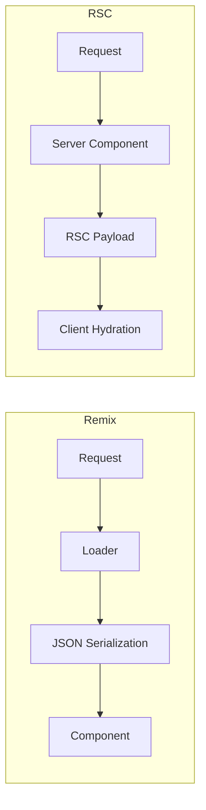

# React Server Components vs Remix Loaders: Two Approaches to Server Data

Two years ago, "fetch data on the server in React" meant one thing  `getServerSideProps` in Next.js or a loader in Remix. Today, React Server Components (RSC) have fundamentally changed the picture, and the mental model difference between RSC and Remix loaders trips up even experienced developers.

I've built apps with both patterns extensively. And while they can both achieve similar outcomes, the way you *think* about your code is dramatically different. That matters more than any benchmark.

## The Mental Model Difference

This is the part that nobody explains well, so let me try.

**Remix loaders** follow a request/response model. A route has a loader function that runs on the server, fetches data, and returns it. The component receives that data as props. There's a clear boundary: loader runs on the server, component renders on the client (or server for initial HTML, but the mental model is client).

```typescript
// Remix  loader is separate from the component
// app/routes/users.$id.tsx

import type { LoaderFunctionArgs } from '@remix-run/node';
import { json } from '@remix-run/node';
import { useLoaderData } from '@remix-run/react';

// This runs on the server
export async function loader({ params }: LoaderFunctionArgs) {
  const user = await db.user.findUnique({
    where: { id: params.id },
  });

  if (!user) throw new Response('Not found', { status: 404 });

  return json({ user });
}

// This renders on the client (after initial SSR)
export default function UserPage() {
  const { user } = useLoaderData<typeof loader>();

  return (
    <div>
      <h1>{user.name}</h1>
      <p>{user.email}</p>
    </div>
  );
}
```

The data flows in one direction: loader → serialization → component. You can look at any Remix route and immediately know what data it needs and where it comes from.

**React Server Components** blur that boundary. A server component IS the data fetching. There's no separate loader  the component itself runs on the server, awaits async operations, and returns JSX. The component never ships to the client browser.

```typescript
// Next.js RSC  the component IS the data fetcher
// app/users/[id]/page.tsx

// This entire component runs on the server
// It never ships JavaScript to the browser
export default async function UserPage({
  params,
}: {
  params: { id: string };
}) {
  const user = await db.user.findUnique({
    where: { id: params.id },
  });

  if (!user) notFound();

  return (
    <div>
      <h1>{user.name}</h1>
      <p>{user.email}</p>
      <UserActions userId={user.id} /> {/* This can be a client component */}
    </div>
  );
}
```

No loader, no `useLoaderData`, no serialization boundary. You just... use the data. Import your database client directly into the component file. Call `await` at the top level. It feels weird at first  "am I really querying Postgres inside a React component?"  but yes, you are, and it works.

## Data Flow Comparison



The Remix model is always: fetch → serialize → render. The RSC model is: render on server → stream result. This has practical implications.

With Remix loaders, everything you return must be JSON-serializable. Dates become strings. Class instances lose their methods. You can't pass a React component from a loader.

With RSC, the server component can render anything  including other server components, client components with props, or async generators. The serialization happens at the RSC protocol level, not JSON, so you have more flexibility.

## Streaming: Where RSC Gets Interesting

Both approaches support streaming, but RSC makes it more granular.

In Remix, you can defer specific data with `defer()`, which streams in after the initial page shell:

```typescript
// Remix  defer slow data
export async function loader({ params }: LoaderFunctionArgs) {
  const user = await db.user.findUnique({ where: { id: params.id } });

  // Don't await  let it stream in later
  const orderHistory = db.order.findMany({
    where: { userId: params.id },
    orderBy: { createdAt: 'desc' },
  });

  return defer({
    user,  // available immediately
    orderHistory,  // streams in when ready
  });
}
```

With RSC, streaming is built into the component tree itself. Wrap a slow component in `<Suspense>` and it streams in automatically:

```typescript
// Next.js RSC  streaming via Suspense
export default async function UserPage({ params }: { params: { id: string } }) {
  const user = await db.user.findUnique({ where: { id: params.id } });

  if (!user) notFound();

  return (
    <div>
      <h1>{user.name}</h1>
      <p>{user.email}</p>

      {/* This streams in when the data is ready */}
      <Suspense fallback={<OrdersSkeleton />}>
        <OrderHistory userId={user.id} />
      </Suspense>
    </div>
  );
}

// This is a separate server component  it can be slow
async function OrderHistory({ userId }: { userId: string }) {
  const orders = await db.order.findMany({
    where: { userId },
    orderBy: { createdAt: 'desc' },
  });

  return (
    <ul>
      {orders.map(order => (
        <li key={order.id}>${order.total}  {order.status}</li>
      ))}
    </ul>
  );
}
```

The RSC approach is more composable. Each component handles its own data, and Suspense boundaries control the streaming granularity. In Remix, you make streaming decisions at the route loader level, which is coarser.

## Progressive Enhancement

Remix was built from the ground up with progressive enhancement in mind. Forms work without JavaScript. Navigation works without JavaScript. Loaders run regardless of client-side hydration state.

RSC in Next.js is... not really about progressive enhancement. Server components reduce the JavaScript you ship, which is great, but the framework still assumes JavaScript is available for client interactions. If you care about no-JS scenarios  and some teams genuinely do  Remix's approach is cleaner.

## When Each Pattern Is Cleaner

| Scenario | Better Pattern | Why |
|----------|---------------|-----|
| Simple page with one data source | RSC | Less boilerplate, just await in the component |
| Page with 5+ independent data needs | RSC | Compose server components with Suspense |
| Form-heavy CRUD app | Remix loaders/actions | Progressive enhancement, form revalidation |
| Complex data transformations | Either | Both run on server, both can transform freely |
| Shared layout data | Remix | `loader` at layout level, automatic inheritance |
| Deeply nested async data | RSC | Each component fetches its own data |
| Public-facing, SEO-critical pages | Either | Both SSR properly |

> **Tip:** If you're migrating components between these patterns and need to convert JavaScript to TypeScript along the way, [DevShift's JS to TypeScript converter](https://devshift.dev/js-to-ts) handles the type annotations  useful when you're rewriting loader logic as server component code.

## The Honest Trade-offs

RSC is more powerful but harder to debug. When something goes wrong in a server component, the error boundaries and stack traces are still rougher than Remix's clean loader → action → component cycle. Remix is more predictable  you always know what runs where.

RSC also introduces a new cognitive burden: which components are server vs client? That `'use client'` directive creates a boundary that confuses developers, especially when passing props between server and client components. A team I worked with spent a full sprint just getting their mental model right.

Remix, on the other hand, is kind of stagnating. Since the React Router v7 merge, the framework's future is more about "React Router with server features" than a distinct full-stack framework. If you're choosing today, that trajectory matters.

## My Take

For new Next.js projects, RSC is the default. You don't really choose it  it's how Next.js works now. And once you internalize the mental model, it's genuinely nice. Writing `async function Page()` and just fetching data feels more natural than maintaining separate loader functions.

But if I'm building a form-heavy application where progressive enhancement matters  admin dashboards, data-entry tools, anything where reliability trumps fancy streaming  I'd still seriously consider Remix. Its loader/action pattern is battle-tested and predictable.

The two patterns aren't really competing anymore. They represent different philosophies about the same problem, and the React ecosystem is big enough for both.

For a deeper look at the server/client boundary in Next.js, check out our [Server vs Client Components guide](/blog/server-vs-client-components-nextjs). And if you're generating TypeScript types for your data layer regardless of which pattern you choose, [DevShift's JSON to TypeScript converter](https://devshift.dev/json-to-typescript) can bootstrap your interfaces from API responses.
