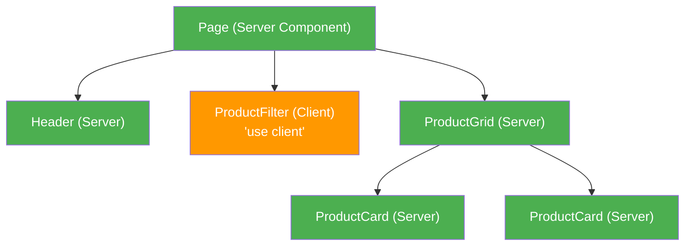

# How to Share State Between Server and Client Components in Next.js

There's a moment in every Next.js App Router project where you hit a wall. You've got data in a Server Component  maybe a user object, some feature flags, or a list fetched from your database  and you need to get it into a Client Component that handles interactivity. Your first instinct is to reach for React Context or some global state manager, and then you realize: **Context doesn't work in Server Components.**

I remember the first time this hit me. I'd just migrated a project from the Pages Router to App Router, and my carefully constructed React Context setup  the one that provided theme, auth, and locale data to the entire app  just stopped working. Not because Context is broken, but because the mental model is fundamentally different.

Here's the thing: sharing state between server and client components in Next.js isn't one technique  it's five different patterns, each suited to a different situation. Let me walk through all of them.

## Pattern 1: Props Drilling (The Default and Usually Best)

The simplest approach. Your Server Component fetches data and passes it down as props to a Client Component. I know "props drilling" has a bad reputation in the React world, but in the App Router it's genuinely the right call most of the time.

```tsx
// app/dashboard/page.tsx (Server Component)
import { getUser } from '@/lib/auth'
import { DashboardClient } from './dashboard-client'

export default async function DashboardPage() {
  const user = await getUser()
  const stats = await getDashboardStats(user.id)

  // Pass server data as props to the Client Component
  return <DashboardClient user={user} stats={stats} />
}
```

```tsx
// app/dashboard/dashboard-client.tsx (Client Component)
'use client'

import { useState } from 'react'

type Props = {
  user: { name: string; email: string; role: string }
  stats: { totalOrders: number; revenue: number }
}

export function DashboardClient({ user, stats }: Props) {
  const [activeTab, setActiveTab] = useState('overview')

  return (
    <div>
      <h1>Welcome back, {user.name}</h1>
      <TabBar active={activeTab} onChange={setActiveTab} />
      {activeTab === 'overview' && <StatsView stats={stats} />}
      {activeTab === 'orders' && <OrdersView userId={user.id} />}
    </div>
  )
}
```

There's one important constraint here: **everything you pass as props must be serializable**. That means plain objects, arrays, strings, numbers, booleans. No functions, no class instances, no Dates (pass them as ISO strings instead), and definitely no React elements with event handlers.

> **Tip:** If you're getting a "Props must be serializable" error, 90% of the time it's because you're passing a function or a Date object. Convert Dates to strings and move functions into the Client Component.

## Pattern 2: The Composition Pattern (Server Wraps Client)

This is my favorite pattern  and honestly, the one the App Router was designed around. Instead of making an entire page a Client Component just because one piece needs interactivity, you compose: the Server Component fetches data and wraps Client Components, passing data as props.

```tsx
// app/products/page.tsx (Server Component)
import { getProducts, getCategories } from '@/lib/db'
import { ProductFilter } from '@/components/product-filter'
import { ProductGrid } from '@/components/product-grid'

export default async function ProductsPage() {
  const [products, categories] = await Promise.all([
    getProducts(),
    getCategories(),
  ])

  return (
    <main>
      <h1>Our Products</h1>
      {/* Client Component for interactivity */}
      <ProductFilter categories={categories} />
      {/* This can stay as a Server Component  no interactivity needed */}
      <ProductGrid products={products} />
    </main>
  )
}
```

The key insight: **push the `'use client'` boundary as far down the tree as possible.** Don't make the page a Client Component  make just the interactive bits Client Components and keep everything else on the server.



The orange node is the only part that ships JavaScript to the browser. Everything green renders on the server. That's significant for bundle size.

## Pattern 3: URL State (Shareable and Server-Readable)

URL search params are an underrated way to share state between server and client components. The beauty is that the URL is readable by both:

- **Server Components** read it via the `searchParams` prop on `page.tsx`
- **Client Components** read and write it via `useSearchParams()` and `useRouter()`

```tsx
// app/shop/page.tsx (Server Component)
export default async function ShopPage({
  searchParams,
}: {
  searchParams: Promise<{ sort?: string; category?: string }>
}) {
  const { sort = 'newest', category } = await searchParams
  const products = await getProducts({ sort, category })

  return (
    <div>
      <SortDropdown currentSort={sort} />
      <ProductList products={products} />
    </div>
  )
}
```

```tsx
// components/sort-dropdown.tsx (Client Component)
'use client'

import { useRouter, usePathname, useSearchParams } from 'next/navigation'

export function SortDropdown({ currentSort }: { currentSort: string }) {
  const router = useRouter()
  const pathname = usePathname()
  const searchParams = useSearchParams()

  function handleSort(value: string) {
    const params = new URLSearchParams(searchParams.toString())
    params.set('sort', value)
    router.push(`${pathname}?${params.toString()}`)
  }

  return (
    <select value={currentSort} onChange={(e) => handleSort(e.target.value)}>
      <option value="newest">Newest</option>
      <option value="price-asc">Price: Low to High</option>
      <option value="price-desc">Price: High to Low</option>
    </select>
  )
}
```

When the user changes the sort, the URL updates, which triggers a new server render of the page with the updated `searchParams`. The Server Component fetches fresh data, and the cycle repeats.

I covered this pattern in more detail in [how to use URL search params in Next.js server components](/blog/nextjs-server-component-search-params) if you want the full breakdown including TypeScript typing and dynamic rendering implications.

## Pattern 4: Cookies (Server-Readable Persistent State)

Sometimes you need state that persists across page navigations and is readable on the server  think theme preference, locale, sidebar collapsed state. Cookies are great for this because they're sent with every request, so Server Components can read them.

```tsx
// app/layout.tsx (Server Component)
import { cookies } from 'next/headers'

export default async function RootLayout({ children }: { children: React.ReactNode }) {
  const cookieStore = await cookies()
  const theme = cookieStore.get('theme')?.value || 'light'

  return (
    <html className={theme}>
      <body>
        <ThemeToggle currentTheme={theme} />
        {children}
      </body>
    </html>
  )
}
```

```tsx
// components/theme-toggle.tsx (Client Component)
'use client'

export function ThemeToggle({ currentTheme }: { currentTheme: string }) {
  function toggleTheme() {
    const next = currentTheme === 'light' ? 'dark' : 'light'
    document.cookie = `theme=${next}; path=/; max-age=31536000`
    // Force a refresh so the Server Component re-reads the cookie
    window.location.reload()
  }

  return <button onClick={toggleTheme}>Toggle theme</button>
}
```

The downside is that setting a cookie from the client and having the Server Component pick it up requires a navigation or refresh. For something like theme that only changes occasionally, that's fine. For rapidly changing state, it's not ideal.

> **Warning:** Don't store sensitive data in cookies set from JavaScript  they won't be `HttpOnly`. For auth tokens and sensitive data, set cookies from the server side (e.g., in a Server Action or route handler).

## Pattern 5: React Context (Client-Side Only)

React Context still works in the App Router  but only within the Client Component boundary. You can't use `useContext` in a Server Component. The trick is to create a Client Component provider and wrap your tree with it.

```tsx
// providers/cart-provider.tsx (Client Component)
'use client'

import { createContext, useContext, useState, ReactNode } from 'react'

type CartItem = { id: string; name: string; quantity: number }
type CartContextType = {
  items: CartItem[]
  addItem: (item: CartItem) => void
  removeItem: (id: string) => void
}

const CartContext = createContext<CartContextType | null>(null)

export function CartProvider({ children }: { children: ReactNode }) {
  const [items, setItems] = useState<CartItem[]>([])

  const addItem = (item: CartItem) =>
    setItems(prev => [...prev, item])

  const removeItem = (id: string) =>
    setItems(prev => prev.filter(i => i.id !== id))

  return (
    <CartContext.Provider value={{ items, addItem, removeItem }}>
      {children}
    </CartContext.Provider>
  )
}

export function useCart() {
  const ctx = useContext(CartContext)
  if (!ctx) throw new Error('useCart must be used within CartProvider')
  return ctx
}
```

```tsx
// app/layout.tsx (Server Component)
import { CartProvider } from '@/providers/cart-provider'

export default function RootLayout({ children }: { children: React.ReactNode }) {
  return (
    <html>
      <body>
        <CartProvider>{children}</CartProvider>
      </body>
    </html>
  )
}
```

Wait  a Server Component rendering a Client Component? Yes, and this is the part that confuses people. A Server Component *can* render a Client Component  it just can't *be* a Client Component. The `children` prop passes through as a React node, so `CartProvider` hydrates on the client while the Server Component children inside it stay server-rendered.

For a deeper look at how Context typing works in TypeScript, check out [typing React Context without 'any'](/blog/type-react-context-typescript).

## Which Pattern Should You Use?

| Pattern | Best For | Server-Readable? | Persistent? |
|---------|----------|:-:|:-:|
| Props | Most cases  initial page data | N/A (originates on server) | No |
| Composition | Mixing static and interactive UI | N/A | No |
| URL State | Filters, sorting, pagination | Yes | Shareable via link |
| Cookies | Theme, locale, preferences | Yes | Yes |
| Context | Shopping cart, modals, UI state | No | No (resets on refresh) |

My general advice: **start with props and the composition pattern.** They cover 80% of cases. Reach for URL state when you want shareability. Use cookies for server-readable persistence. And save Context for purely client-side UI state like shopping carts, modals, and form wizards.

If you want to convert your existing JavaScript components to TypeScript while refactoring these patterns, [SnipShift's JS to TypeScript converter](https://snipshift.dev/js-to-ts) can help generate proper prop types and interfaces  especially useful when you're creating those typed props for the Server-to-Client handoff.

## The Mental Model

Here's what helped it click for me: **Server Components are data fetchers. Client Components are interaction handlers.** The boundary between them is the props interface.

Think of it like a restaurant. The kitchen (server) prepares the food (data). The waiter (props) carries it to the table (client). The customer (user) interacts with what's on the table. The kitchen doesn't need to know that the customer is cutting their steak with a knife  it just needs to deliver the steak.

If you're also trying to sort out when to use `'use server'` vs `'use client'` directives  which is closely related to this whole topic  I covered that in [understanding 'use server' vs 'use client' directives](/blog/nextjs-use-server-vs-use-client). And for the foundational breakdown of the component model, [server vs client components mental model](/blog/server-vs-client-components-nextjs) has you covered.

Once these patterns click, sharing state between server and client components stops being a pain point and starts being one of the App Router's genuine strengths. The explicit boundary forces you to think about what data goes where  and your apps end up faster and cleaner because of it.
