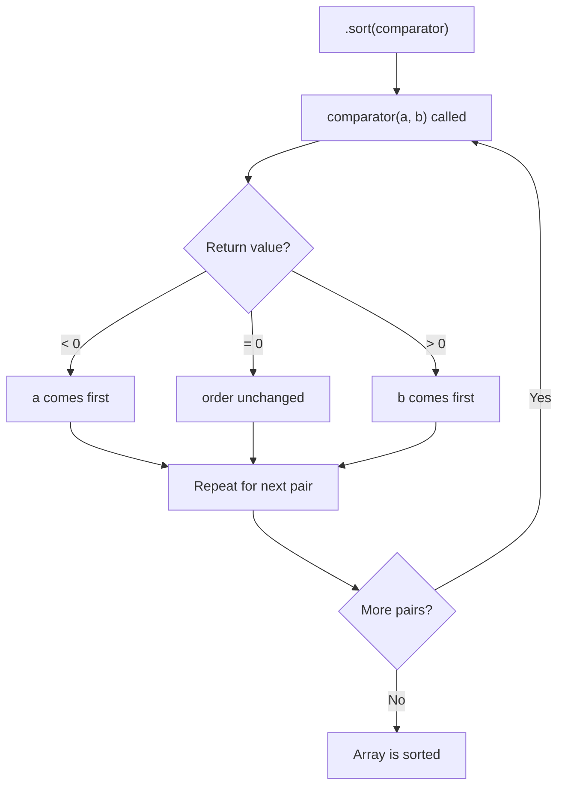

# How to Sort an Array of Objects by Property in JavaScript

Sorting an array of objects by a specific property is one of those things you'd think JavaScript would have a clean, built-in method for. It doesn't. Instead, you get `.sort()` with a comparator function, and it's on you to write the comparison logic correctly for whatever data type you're sorting by.

I've been writing JavaScript for years now, and I still occasionally mess up the comparator for date sorting. It's not that it's hard  it's that the API is just generic enough to let you write something that *looks* right but produces wrong results silently. No errors, no warnings, just a list that's sorted in some order that isn't the one you wanted.

So here's the complete reference for sorting arrays of objects  numbers, strings, dates, multiple properties, and how to type all of it in TypeScript.

## The Basics: How .sort() Works

The `.sort()` method sorts an array in place and takes an optional comparator function. That function receives two elements and should return:

- A **negative number** if `a` should come before `b`
- A **positive number** if `a` should come after `b`
- **Zero** if they're equal

```javascript
const users = [
  { name: "Charlie", age: 30 },
  { name: "Alice", age: 25 },
  { name: "Bob", age: 35 },
];

users.sort((a, b) => a.age - b.age);
// [{ name: "Alice", age: 25 }, { name: "Charlie", age: 30 }, { name: "Bob", age: 35 }]
```

That `a.age - b.age` pattern is the classic numeric sort. For descending order, flip it: `b.age - a.age`. Simple enough.

But **do not** try to use subtraction for strings. `"Alice" - "Bob"` gives you `NaN`, and `.sort()` will do something unpredictable with that.

## Sorting by String Properties

For strings, use `.localeCompare()`. It handles Unicode correctly, respects locale-specific ordering, and returns the negative/zero/positive number that `.sort()` expects:

```javascript
const users = [
  { name: "Charlie", role: "admin" },
  { name: "Alice", role: "editor" },
  { name: "Bob", role: "admin" },
];

// Alphabetical by name
users.sort((a, b) => a.name.localeCompare(b.name));
// Alice, Bob, Charlie
```

For case-insensitive sorting, `localeCompare` handles it by default in most locales. But if you want to be explicit:

```javascript
users.sort((a, b) =>
  a.name.localeCompare(b.name, undefined, { sensitivity: "base" })
);
```

The `sensitivity: "base"` option ignores both case and accents, so "café" and "Cafe" would sort together.

> **Tip:** If you're sorting data that came from a JavaScript API response and want to add proper TypeScript types to it, [SnipShift's JS to TypeScript converter](https://snipshift.dev/js-to-ts) can infer interfaces from your data structures  including nested objects and arrays.

## Sorting by Date Properties

Dates are numbers under the hood, so subtraction works  but you need actual `Date` objects, not date strings:

```javascript
const events = [
  { title: "Launch", date: new Date("2026-06-15") },
  { title: "Beta", date: new Date("2026-03-01") },
  { title: "Alpha", date: new Date("2026-01-10") },
];

// Chronological order (earliest first)
events.sort((a, b) => a.date.getTime() - b.date.getTime());
```

If your dates are ISO strings instead of `Date` objects, you can either convert them first or compare them directly  ISO 8601 strings sort lexicographically in the correct order:

```javascript
const logs = [
  { msg: "deployed", at: "2026-03-25T14:30:00Z" },
  { msg: "started", at: "2026-03-25T08:00:00Z" },
  { msg: "tested", at: "2026-03-25T12:15:00Z" },
];

// This works because ISO strings are lexicographically sortable
logs.sort((a, b) => a.at.localeCompare(b.at));
```

That ISO string trick has saved me more than once. But be careful  it only works if all your date strings are in the same format and timezone. Mixed formats will give you garbage results.

## Sorting by Multiple Properties

Real-world sorting is rarely by a single field. You want to sort by role, and then by name within each role. The pattern is to chain comparisons  return the first non-zero result:

```javascript
const team = [
  { name: "Charlie", role: "admin", age: 30 },
  { name: "Alice", role: "editor", age: 25 },
  { name: "Bob", role: "admin", age: 35 },
  { name: "Diana", role: "editor", age: 28 },
];

team.sort((a, b) => {
  // First by role
  const roleCompare = a.role.localeCompare(b.role);
  if (roleCompare !== 0) return roleCompare;

  // Then by name within the same role
  return a.name.localeCompare(b.name);
});

// Result:
// Bob (admin), Charlie (admin), Alice (editor), Diana (editor)
```

For three or more sort keys, the pattern extends naturally  just keep adding comparisons. But once you get past two or three levels, it might be worth extracting into a helper.

## A Reusable Sort Helper

Here's a generic comparator builder that handles multiple sort keys:

```javascript
function sortByKeys(...keys) {
  return (a, b) => {
    for (const key of keys) {
      const dir = key.startsWith("-") ? -1 : 1;
      const prop = key.replace(/^-/, "");
      const valA = a[prop];
      const valB = b[prop];

      let result;
      if (typeof valA === "string") {
        result = valA.localeCompare(valB);
      } else {
        result = valA < valB ? -1 : valA > valB ? 1 : 0;
      }

      if (result !== 0) return result * dir;
    }
    return 0;
  };
}

// Sort by role ascending, then age descending
team.sort(sortByKeys("role", "-age"));
```

The `-` prefix for descending order is a convention I borrowed from MongoDB's sort syntax. Works well in practice, and it's immediately readable.

## Quick Reference: Sort Comparators by Type

| Data Type | Comparator | Descending |
|-----------|-----------|------------|
| Numbers | `a.val - b.val` | `b.val - a.val` |
| Strings | `a.val.localeCompare(b.val)` | `b.val.localeCompare(a.val)` |
| Dates (objects) | `a.val.getTime() - b.val.getTime()` | `b.val.getTime() - a.val.getTime()` |
| Dates (ISO strings) | `a.val.localeCompare(b.val)` | `b.val.localeCompare(a.val)` |
| Booleans | `Number(a.val) - Number(b.val)` | `Number(b.val) - Number(a.val)` |
| Nullables | Handle `null`/`undefined` before comparing | Same, with null-check first |

## TypeScript Typing for Sort Functions

If you're working in TypeScript, you can make your sort functions type-safe:

```typescript
interface User {
  name: string;
  age: number;
  role: "admin" | "editor" | "viewer";
}

function sortBy<T>(arr: T[], key: keyof T, order: "asc" | "desc" = "asc"): T[] {
  const dir = order === "asc" ? 1 : -1;
  return [...arr].sort((a, b) => {
    const valA = a[key];
    const valB = b[key];

    if (typeof valA === "string" && typeof valB === "string") {
      return valA.localeCompare(valB) * dir;
    }
    return ((valA as number) - (valB as number)) * dir;
  });
}

const users: User[] = [
  { name: "Charlie", age: 30, role: "admin" },
  { name: "Alice", age: 25, role: "editor" },
];

const sorted = sortBy(users, "age", "desc");
// TypeScript ensures "age" is a valid key of User
```

Notice I'm using `[...arr].sort()` instead of `arr.sort()`. That creates a copy first, so the original array isn't mutated. Mutating sort has caused so many subtle bugs in React apps where someone sorts state directly and wonders why the component doesn't re-render.

## The Sort Comparator Flow



## Stable Sort: Does Order Preservation Matter?

A stable sort preserves the relative order of elements that compare equal. If Alice and Bob both have `role: "admin"`, and Alice appeared first in the original array, a stable sort guarantees Alice still comes first after sorting by role.

Good news: **`.sort()` is stable in all modern JavaScript engines**. This was standardized in ES2019 (technically, V8 switched to TimSort back in 2018, and every major engine followed). If you're not supporting ancient browsers, you don't need to worry about this anymore.

But if you ever find yourself needing to sort by one property while preserving existing order for ties  that's stable sort doing the work for you. It's why multi-key sorting works correctly: sort by your secondary key first, then by your primary key, and stable sort preserves the secondary ordering within equal primary groups.

> **Warning:** Don't rely on insertion order if you're targeting environments older than Node 12 or IE11. Those didn't guarantee stable sort. In 2026, this is basically a non-issue, but worth knowing if you maintain legacy systems.

## Common Mistakes

A few things I've seen go wrong more times than I'd like to admit:

**Returning booleans instead of numbers**  this is the most common mistake. `.sort((a, b) => a.age > b.age)` returns `true` or `false`, which get coerced to `1` or `0`. You never get `-1`, so elements that should move backward don't. The sort appears to *mostly* work, which makes the bug incredibly hard to spot.

**Forgetting that `.sort()` mutates**  if you're using React, Vue, or any framework with reactive state, sorting in place can cause subtle rendering bugs. Always spread first: `[...array].sort(...)`.

**Not handling `undefined` or `null` values**  if any of your objects have missing properties, the comparison will produce `NaN` or throw. Add a null check:

```javascript
users.sort((a, b) => (a.age ?? 0) - (b.age ?? 0));
```

If you're working with JavaScript arrays that need proper TypeScript types, check out [SnipShift's JS to TypeScript converter](https://snipshift.dev/js-to-ts)  it can infer array element types and generate interfaces from your data.

For more on working with arrays and objects in JavaScript, the [JavaScript destructuring guide](/blog/javascript-destructuring-explained) covers how to cleanly extract properties from sorted results. And if you're also dealing with duplicates in your arrays, the [remove duplicates guide](/blog/remove-duplicates-array-javascript) pairs well with sorting.

Sorting arrays of objects in JavaScript comes down to writing the right comparator. Use subtraction for numbers, `localeCompare` for strings, `getTime()` for dates, and chain comparisons for multiple keys. Copy before sorting if you need immutability. And please  return numbers from your comparator, not booleans.
