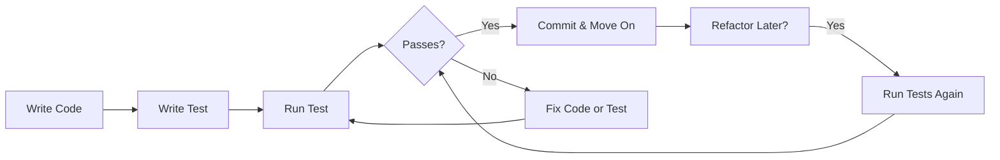

# How to Start Testing in JavaScript (If You've Never Written a Test Before)

Someone on your team just said the words you've been dreading: "We need to add tests." Maybe it was your tech lead during a sprint retro. Maybe it was that one senior dev who keeps commenting "where are the tests?" on every pull request. Either way, you've been nodding along like you know exactly what they mean  while quietly panicking inside.

I've been there. When I wrote my first test about six years ago, I spent two hours trying to figure out why `expect(result).toBe(true)` kept failing. Turns out I was testing the wrong function entirely. Classic.

Here's the good news: starting to test JavaScript is genuinely not that hard. The tooling has gotten so much better in the last couple of years that the biggest hurdle isn't the technology  it's just knowing where to begin. So let's fix that.

## Why Even Bother Testing?

Before we write a single line of test code, let's talk about *why* this matters. Because if you don't understand the why, testing just feels like busywork.

Think about the last time you pushed a "small fix" to production and it broke something completely unrelated. Maybe you changed how a utility function formats dates, and suddenly the checkout page started showing NaN everywhere. You didn't catch it because you only manually tested the page you were working on.

That's the core problem tests solve. They check the stuff you forgot to check.

But there's a more selfish reason too: **tests let you refactor without fear**. When you have a solid test suite, you can rip out an entire function, rewrite it from scratch, and know within seconds whether you broke anything. Without tests, every refactor is a gamble.

And honestly? Writing tests makes you write better code. When your function is hard to test, that's usually a sign it's doing too much. Tests push you toward smaller, more focused functions  which is just good engineering.

## What to Test First

This is where most beginners get stuck. You open your codebase, look at 50 files, and think: "Do I test... all of it?"

No. Absolutely not. Here's my rule of thumb for where to start testing JavaScript code:

**Start with your pure utility functions.** These are the functions that take an input and return an output, with no side effects. No API calls, no DOM manipulation, no database queries. Just data in, data out.

Examples of great first things to test:
- A function that formats currency
- A function that validates an email address
- A function that sorts an array by a specific property
- A function that calculates a total with tax

These are perfect because they're predictable. Same input, same output, every time. And they're usually the functions that the rest of your app depends on, so catching bugs here has outsized impact.

> **Tip:** Look at your `utils/` or `helpers/` folder first. That's almost always where the most testable code lives.

## Setting Up Vitest (It Takes 2 Minutes, Seriously)

We're going to use [Vitest](https://vitest.dev/) as our test runner. If you've heard of Jest  Vitest is basically the same thing but faster, and it works with modern ESM imports out of the box. No configuration nightmares.

Here's the entire setup:

```bash
# Install Vitest as a dev dependency
npm install -D vitest
```

Now add a test script to your `package.json`:

```json
{
  "scripts": {
    "test": "vitest",
    "test:run": "vitest run"
  }
}
```

That's it. No config files. No babel plugins. No webpack loader shenanigans. Vitest picks up sensible defaults and just works.

If you're working with TypeScript  which, honestly, you probably should be  Vitest handles `.ts` files natively. No extra setup needed. And if you're thinking about converting your JS codebase to TypeScript, [SnipShift's JS to TypeScript converter](https://snipshift.dev/js-to-ts) can help you migrate your code (including test files) without manually adding types everywhere.

## Your First Unit Test

Let's say you have this utility function:

```javascript
// src/utils/formatPrice.js
export function formatPrice(cents) {
  if (typeof cents !== 'number' || cents < 0) {
    throw new Error('Price must be a positive number');
  }
  const dollars = (cents / 100).toFixed(2);
  return `$${dollars}`;
}
```

Here's how you test it:

```javascript
// src/utils/formatPrice.test.js
import { describe, it, expect } from 'vitest';
import { formatPrice } from './formatPrice';

describe('formatPrice', () => {
  it('converts cents to dollar format', () => {
    expect(formatPrice(1099)).toBe('$10.99');
  });

  it('handles zero', () => {
    expect(formatPrice(0)).toBe('$0.00');
  });

  it('handles large amounts', () => {
    expect(formatPrice(999999)).toBe('$9999.99');
  });

  it('throws on negative numbers', () => {
    expect(() => formatPrice(-100)).toThrow('Price must be a positive number');
  });

  it('throws on non-number input', () => {
    expect(() => formatPrice('ten')).toThrow('Price must be a positive number');
  });
});
```

Run it:

```bash
npm test
```

And you should see something like:

```
 ✓ src/utils/formatPrice.test.js (5 tests) 3ms
   ✓ formatPrice > converts cents to dollar format
   ✓ formatPrice > handles zero
   ✓ formatPrice > handles large amounts
   ✓ formatPrice > throws on negative numbers
   ✓ formatPrice > throws on non-number input

 Test Files  1 passed (1)
      Tests  5 passed (5)
```

That green checkmark feeling? It never gets old.

## The AAA Pattern: Your Testing Blueprint

Every test you write should follow the **AAA pattern**: Arrange, Act, Assert. This isn't some fancy methodology  it's just a way to keep your tests organized and readable.

```javascript
it('calculates order total with tax', () => {
  // Arrange  set up the data you need
  const items = [
    { name: 'Widget', price: 1000 },
    { name: 'Gadget', price: 2500 },
  ];
  const taxRate = 0.08;

  // Act  call the function you're testing
  const total = calculateOrderTotal(items, taxRate);

  // Assert  check that the result is what you expected
  expect(total).toBe(3780);
});
```

**Arrange** is where you set up your test data  the inputs, the mocks, whatever your function needs. **Act** is where you actually call the function. **Assert** is where you check the output.

Some tests are so simple they barely need the "Arrange" step. That's fine. The pattern is a guide, not a law. But when you look at a test six months later and need to understand what it does, having that structure makes it way easier to scan.

## Your First Integration Test

Unit tests check individual functions. Integration tests check that multiple pieces work together. Here's the difference in a nutshell:

| Aspect | Unit Test | Integration Test |
|--------|-----------|------------------|
| **Scope** | Single function or module | Multiple modules working together |
| **Speed** | Very fast (milliseconds) | Slightly slower |
| **Dependencies** | Usually mocked | Real implementations |
| **What it catches** | Logic bugs in isolated code | Wiring bugs between modules |
| **Example** | "Does `formatPrice` format correctly?" | "Does the cart calculate and display the right total?" |

Let's say you have a small shopping cart module:

```javascript
// src/cart/cart.js
import { formatPrice } from '../utils/formatPrice';

export function createCart() {
  const items = [];

  return {
    addItem(name, priceCents, quantity = 1) {
      items.push({ name, priceCents, quantity });
    },
    getTotal() {
      return items.reduce(
        (sum, item) => sum + item.priceCents * item.quantity,
        0
      );
    },
    getSummary() {
      const total = this.getTotal();
      return {
        itemCount: items.length,
        total: formatPrice(total),
      };
    },
  };
}
```

An integration test would exercise the whole flow:

```javascript
// src/cart/cart.test.js
import { describe, it, expect } from 'vitest';
import { createCart } from './cart';

describe('Shopping Cart', () => {
  it('calculates summary for multiple items', () => {
    // Arrange
    const cart = createCart();

    // Act
    cart.addItem('Keyboard', 7500);
    cart.addItem('Mouse', 4500, 2);
    const summary = cart.getSummary();

    // Assert
    expect(summary.itemCount).toBe(2);
    expect(summary.total).toBe('$165.00');
  });

  it('handles an empty cart', () => {
    const cart = createCart();
    const summary = cart.getSummary();

    expect(summary.itemCount).toBe(0);
    expect(summary.total).toBe('$0.00');
  });
});
```

Notice how this test doesn't mock `formatPrice`. It uses the real implementation. That's the whole point  we're testing that `cart.js` and `formatPrice.js` work correctly *together*. If someone changes `formatPrice` to return euros instead of dollars, this test catches it.

## The Testing Flow

Here's how testing fits into your actual development workflow:



Some people write the test first, then the code. That's called Test-Driven Development (TDD), and it's great  but it's not mandatory. When you're just starting to test JavaScript, writing the code first and then adding tests is perfectly fine. The important thing is that the tests exist, not the exact order you wrote them in.

## What NOT to Test

This is just as important as knowing what to test. Beginners often waste time testing things that don't need tests. Here's what I'd skip:

**Don't test third-party libraries.** If you're using `lodash.sortBy`, you don't need to write a test proving that sorting works. The lodash team already did that. Test *your* code that uses the library, not the library itself.

**Don't test simple getters and setters.** If you have a function that literally just returns a property value, a test for that is just noise. Your testing time is better spent elsewhere.

**Don't test implementation details.** If your function uses a `for` loop internally, don't write a test that breaks when you switch to `.map()`. Test what the function *returns*, not how it gets there. This is one of the biggest mistakes I see  and it's so important that there's a whole [blog post about writing tests that survive refactoring](/blog/tests-that-dont-break-on-refactor).

**Don't aim for 100% coverage on day one.** I've seen teams burn out trying to hit arbitrary coverage numbers. Start with your most critical paths  the functions that handle money, authentication, or user data. Sixty percent coverage on the right code is worth more than 95% coverage that's mostly testing `toString()` methods.

> **Warning:** Code coverage is a useful metric, but it can be misleading. A file can have 100% line coverage and still have critical bugs if the tests don't check edge cases. Focus on *meaningful* assertions, not just making the coverage number go up.

## Quick Reference: Testing Vocabulary

When you start reading testing docs, you'll run into a lot of jargon. Here's a quick decoder:

- **Test suite:** A group of related tests (the `describe` block)
- **Test case:** A single test (the `it` or `test` block)
- **Assertion:** A check that something is true (`expect(...).toBe(...)`)
- **Mock:** A fake version of something (like a fake API call)
- **Fixture:** Pre-made test data you reuse across tests
- **Test runner:** The tool that actually runs your tests (Vitest, Jest)

If you're curious how Vitest compares to Jest and which one to pick, we've got a [detailed comparison of Vitest vs Jest in 2026](/blog/vitest-vs-jest-2026) that breaks it all down.

## Next Steps

You've got the basics down. You know why testing matters, how to set up Vitest, and how to write both unit and integration tests. That's genuinely more than a lot of developers I've worked with.

Here's what I'd do from here:

1. **Pick three utility functions** in your current project and write tests for them today. Not tomorrow. Today. The hardest part is starting.
2. **Run tests in watch mode** (`npm test` with Vitest runs watch mode by default). It re-runs your tests every time you save a file, which makes the feedback loop incredibly fast.
3. **Learn about testing React components** if you're working in React  [our guide on testing with React Testing Library](/blog/test-react-components-testing-library) covers that whole workflow.
4. **Read about the testing pyramid** to understand [how different types of tests fit together](/blog/testing-pyramid-web-application) in a real application.

The developers who are good at testing didn't start by reading a 400-page book on test theory. They started by testing one function, seeing it pass, and doing it again. So go write a test. You might actually enjoy it.

And hey  if you're also planning to move your JavaScript project to TypeScript (which makes testing even better thanks to type safety catching bugs before your tests even run), check out [SnipShift's conversion tools](https://snipshift.dev) to speed up that process.
