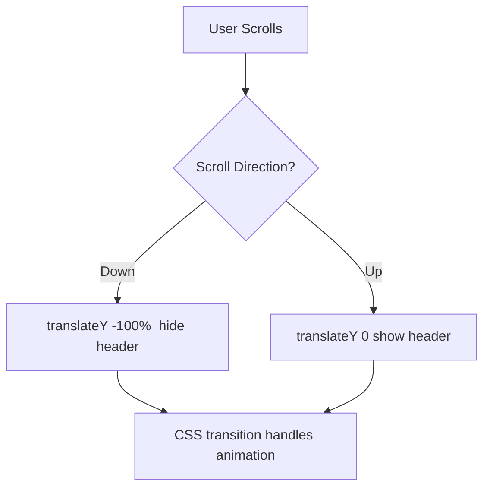

# How to Make a Sticky Header That Hides on Scroll Down, Shows on Scroll Up

This is one of those UI patterns you see everywhere  Medium, Notion, basically every modern website  but it's surprisingly fiddly to get right. The header sticks to the top, slides out of view when you scroll down (because you're reading content), and slides back in when you scroll up (because you want to navigate).

Sounds simple. And then you hit iOS momentum scroll, `requestAnimationFrame` timing, and the realization that `position: sticky` alone doesn't do this. Here's the approach that actually works, with real code you can drop into a React + Tailwind project.

## The Core Idea

You need three things:

1. **Track scroll direction**  compare the current scroll position to the previous one
2. **Toggle visibility**  apply a CSS transform to slide the header up or down
3. **Smooth transition**  use CSS transitions so it doesn't just pop in and out



That's it conceptually. The devil is in the implementation details.

## React Implementation with useRef and useEffect

Here's the full component. I'll break it down section by section after.

```tsx
import { useEffect, useRef, useState } from 'react';

export function StickyHeader() {
  const [isVisible, setIsVisible] = useState(true);
  const lastScrollY = useRef(0);
  const ticking = useRef(false);

  useEffect(() => {
    const handleScroll = () => {
      if (ticking.current) return;

      ticking.current = true;
      requestAnimationFrame(() => {
        const currentScrollY = window.scrollY;

        // Always show header at the very top of the page
        if (currentScrollY < 10) {
          setIsVisible(true);
        } else if (currentScrollY > lastScrollY.current) {
          // Scrolling down
          setIsVisible(false);
        } else {
          // Scrolling up
          setIsVisible(true);
        }

        lastScrollY.current = currentScrollY;
        ticking.current = false;
      });
    };

    window.addEventListener('scroll', handleScroll, { passive: true });
    return () => window.removeEventListener('scroll', handleScroll);
  }, []);

  return (
    <header
      className={`fixed top-0 left-0 right-0 z-50 bg-white shadow-md
        transition-transform duration-300 ease-in-out
        ${isVisible ? 'translate-y-0' : '-translate-y-full'}`}
    >
      <nav className="mx-auto max-w-7xl px-4 py-3">
        {/* Your nav content */}
      </nav>
    </header>
  );
}
```

### Why `useRef` Instead of `useState` for Scroll Position?

This is a question I get a lot. We use `useRef` for `lastScrollY` because we don't want to trigger a re-render every time the scroll position updates. We're updating this value potentially 60 times per second. Using `useState` here would cause 60 re-renders per second  your React DevTools would cry.

The `ticking` ref is a classic `requestAnimationFrame` throttle pattern. Without it, the scroll handler fires way more often than the browser can actually paint frames. This keeps things buttery smooth.

### Why `{ passive: true }` on the Event Listener?

Adding `{ passive: true }` tells the browser that your scroll handler won't call `preventDefault()`. This lets the browser optimize scrolling performance  especially important on mobile where scroll jank is very noticeable. It's a small thing, but it matters.

## The CSS That Makes It Work

The key CSS properties  expressed here as Tailwind classes  are:

| Tailwind Class | CSS | Purpose |
|---------------|-----|---------|
| `fixed top-0 left-0 right-0` | `position: fixed; top: 0; left: 0; right: 0;` | Pin header to viewport top |
| `z-50` | `z-index: 50;` | Keep it above page content |
| `transition-transform` | `transition-property: transform;` | Only animate the transform |
| `duration-300` | `transition-duration: 300ms;` | Smooth 300ms animation |
| `ease-in-out` | `transition-timing-function: ease-in-out;` | Natural acceleration curve |
| `translate-y-0` | `transform: translateY(0);` | Visible state |
| `-translate-y-full` | `transform: translateY(-100%);` | Hidden state (slides up) |

Using `transform: translateY(-100%)` instead of `display: none` or `opacity: 0` is important. Transform animations are GPU-accelerated and don't trigger layout recalculations. The header slides up smoothly at 60fps.

If you've got existing CSS for a header component and want to convert it to Tailwind utilities, [SnipShift's CSS to Tailwind converter](https://snipshift.dev/css-to-tailwind) handles that translation automatically.

## Handling Edge Cases

### Top of Page

You always want the header visible when the user is at the top of the page  even if their last scroll action was downward. That's why we check `currentScrollY < 10` first. I use a small threshold instead of `=== 0` because of sub-pixel rendering and bounce effects.

### Scroll Threshold (Preventing Flicker)

Tiny scroll movements  a 2px wobble from a trackpad  can toggle the header. Add a minimum delta:

```tsx
const handleScroll = () => {
  if (ticking.current) return;

  ticking.current = true;
  requestAnimationFrame(() => {
    const currentScrollY = window.scrollY;
    const delta = currentScrollY - lastScrollY.current;

    if (currentScrollY < 10) {
      setIsVisible(true);
    } else if (delta > 5) {
      // Only hide if scrolled down more than 5px
      setIsVisible(false);
    } else if (delta < -5) {
      // Only show if scrolled up more than 5px
      setIsVisible(true);
    }

    lastScrollY.current = currentScrollY;
    ticking.current = false;
  });
};
```

That `5px` threshold eliminates the jittery toggling you'd otherwise get on trackpads and magic mice.

### iOS Momentum Scroll (Rubber Banding)

Safari on iOS has elastic scroll  when you hit the top or bottom of the page, it bounces. This produces negative `scrollY` values (or values beyond `document.body.scrollHeight`), which can cause the header to flicker.

The fix is simple  clamp the scroll position:

```tsx
const currentScrollY = Math.max(0, window.scrollY);
```

This ignores the rubber-band zone entirely.

> **Tip:** Test on a real iOS device, not just the simulator. The momentum physics are different, and bugs you don't see in Chrome DevTools mobile mode will absolutely show up on an actual iPhone.

### Page With Little Content

If your page content is shorter than the viewport height, there's nothing to scroll. The header should just stay visible permanently. The implementation already handles this  no scroll events fire, so `isVisible` stays `true`.

## Pure CSS Approach (No JavaScript)

Can you do this without JavaScript? Sort of. The `@scroll-timeline` proposal and `animation-timeline: scroll()` are coming, but browser support in 2026 is still incomplete. For production use, the JS approach above is what I'd recommend.

But if you want a pure CSS "sticky header that shows at the top" without the scroll-direction awareness, that's trivial:

```css
.header {
  position: sticky;
  top: 0;
  z-index: 50;
}
```

This keeps the header at the top as you scroll, but it doesn't hide/show based on direction. For that behavior, you still need JavaScript.

## The Complete Pattern

Here's a summary of the approach:

1. Use `position: fixed` (not `sticky`) with `z-index`
2. Track scroll position with `useRef` (not `useState`)
3. Throttle with `requestAnimationFrame`
4. Toggle `translateY(0)` / `translateY(-100%)` with a CSS transition
5. Add a scroll threshold to prevent flicker
6. Clamp `scrollY` for iOS rubber banding
7. Always show at page top

This pattern works in every major browser, handles edge cases gracefully, and performs well even on lower-end mobile devices. I've shipped it in three different production apps, and it's been solid.

For converting any custom CSS you write for headers into Tailwind classes, [SnipShift's tools](https://snipshift.dev) can handle the translation. And if you're working on other CSS patterns like [styling scrollbars](/blog/style-scrollbar-css-cross-browser) or [gradient borders](/blog/css-gradient-border), we've got guides for those too.
