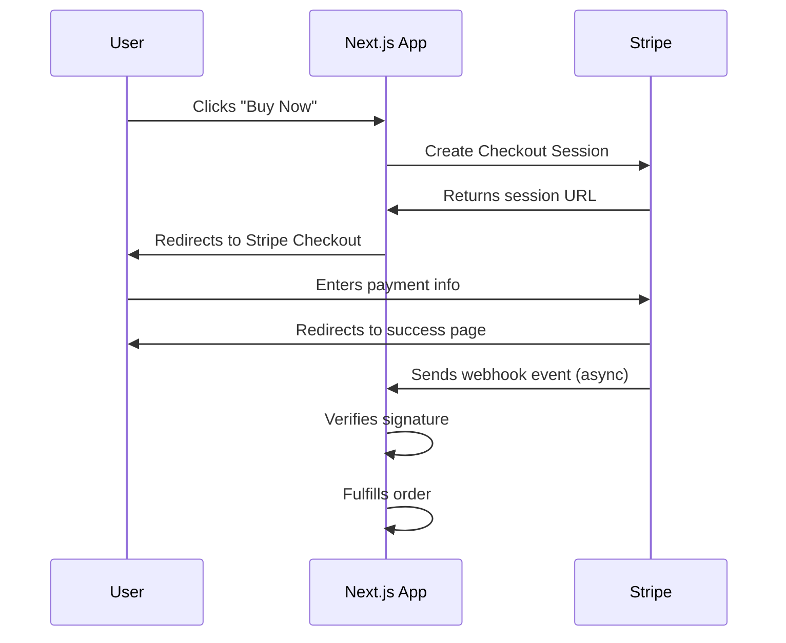

# How to Add Stripe Payments to Next.js (Checkout + Webhooks)

Payments are one of those things that feel like they should be simple. Someone gives you money, you give them access to something. But in practice, there are checkout flows, webhook events, signature verification, idempotency, test vs live modes, and about a dozen edge cases that'll burn you if you don't handle them upfront.

I've integrated Stripe into five different Next.js projects now. The first time was a mess  I missed webhook verification and spent a weekend dealing with fake purchase events from some bot. The second time was better. By the fifth time, I had a pattern that just works. Here's that pattern.

## The Full Payment Flow

Before writing code, understand what's happening:



The critical insight: **don't fulfill the order on the success page redirect**. The success page redirect is just a user experience thing  the user gets a nice "thank you" page. The actual fulfillment happens in the webhook, because webhooks are reliable and retryable. The redirect can fail (user closes browser, network issue), but Stripe will keep retrying the webhook until it succeeds.

## Project Setup

Install the Stripe packages:

```bash
npm install stripe @stripe/stripe-js
```

- `stripe`  the server-side Node.js SDK
- `@stripe/stripe-js`  the client-side loader (for redirecting to Checkout)

Add your Stripe keys to `.env.local`:

```bash
STRIPE_SECRET_KEY=sk_test_...
NEXT_PUBLIC_STRIPE_PUBLISHABLE_KEY=pk_test_...
STRIPE_WEBHOOK_SECRET=whsec_...
```

> **Warning:** The secret key (`sk_test_...`) must NEVER be exposed to the client. Only use it in server-side code (API routes, server components, server actions). The publishable key (`pk_test_...`) is safe for the client  that's what the `NEXT_PUBLIC_` prefix is for.

Create a shared Stripe instance for server-side use:

```typescript
// lib/stripe.ts
import Stripe from "stripe";

export const stripe = new Stripe(process.env.STRIPE_SECRET_KEY!, {
  apiVersion: "2024-12-18.acacia",
  typescript: true,
});
```

Always pin the `apiVersion`. Stripe rolls out breaking changes behind versioned APIs, and you don't want your payment flow to break because the default version bumped.

## Creating a Checkout Session

This is the API route that creates a Stripe Checkout session and returns the URL:

```typescript
// app/api/checkout/route.ts
import { NextResponse } from "next/server";
import { stripe } from "@/lib/stripe";

export async function POST(request: Request) {
  const { priceId, userId } = await request.json();

  if (!priceId) {
    return NextResponse.json(
      { error: "Price ID is required" },
      { status: 400 }
    );
  }

  const session = await stripe.checkout.sessions.create({
    mode: "payment", // or "subscription" for recurring
    payment_method_types: ["card"],
    line_items: [
      {
        price: priceId, // Price ID from Stripe Dashboard
        quantity: 1,
      },
    ],
    success_url: `${process.env.NEXT_PUBLIC_APP_URL}/checkout/success?session_id={CHECKOUT_SESSION_ID}`,
    cancel_url: `${process.env.NEXT_PUBLIC_APP_URL}/checkout/cancel`,
    metadata: {
      userId, // Attach your own data  you'll need this in the webhook
    },
  });

  return NextResponse.json({ url: session.url });
}
```

A few things to notice:

- **`metadata`**  this is how you link a Stripe session to your own user/order. Always include enough metadata to fulfill the order in your webhook handler.
- **`{CHECKOUT_SESSION_ID}`**  Stripe replaces this placeholder with the actual session ID when redirecting. Useful for showing order details on the success page.
- **`success_url` / `cancel_url`**  absolute URLs. Stripe redirects the user here after checkout.

## The Checkout Button (Client Side)

```tsx
"use client";
import { useState } from "react";

export function CheckoutButton({ priceId }: { priceId: string }) {
  const [loading, setLoading] = useState(false);

  const handleCheckout = async () => {
    setLoading(true);

    try {
      const response = await fetch("/api/checkout", {
        method: "POST",
        headers: { "Content-Type": "application/json" },
        body: JSON.stringify({
          priceId,
          userId: "user_123", // Get from your auth system
        }),
      });

      const { url } = await response.json();

      if (url) {
        window.location.href = url; // Redirect to Stripe Checkout
      }
    } catch (err) {
      console.error("Checkout error:", err);
    } finally {
      setLoading(false);
    }
  };

  return (
    <button
      onClick={handleCheckout}
      disabled={loading}
      className="rounded-lg bg-blue-600 px-6 py-3 text-white font-medium
                 hover:bg-blue-700 disabled:opacity-50 transition-colors"
    >
      {loading ? "Redirecting..." : "Buy Now"}
    </button>
  );
}
```

Simple and clean. Click the button, create a session on the server, redirect to Stripe. The user enters their card details on Stripe's hosted checkout page  which means you never handle raw card data, and PCI compliance is Stripe's problem, not yours.

## Success and Cancel Pages

The success page shows after a completed payment:

```tsx
// app/checkout/success/page.tsx
import { stripe } from "@/lib/stripe";

interface PageProps {
  searchParams: Promise<{ session_id?: string }>;
}

export default async function CheckoutSuccessPage({ searchParams }: PageProps) {
  const { session_id } = await searchParams;

  if (!session_id) {
    return <p>No session found.</p>;
  }

  const session = await stripe.checkout.sessions.retrieve(session_id);

  return (
    <div className="mx-auto max-w-lg py-16 text-center">
      <h1 className="text-2xl font-bold text-green-600">Payment Successful!</h1>
      <p className="mt-4 text-gray-600">
        Thanks for your purchase. A confirmation has been sent to{" "}
        <strong>{session.customer_details?.email}</strong>.
      </p>
      <p className="mt-2 text-sm text-gray-400">
        Order ID: {session.id}
      </p>
    </div>
  );
}
```

The cancel page is simpler:

```tsx
// app/checkout/cancel/page.tsx
export default function CheckoutCancelPage() {
  return (
    <div className="mx-auto max-w-lg py-16 text-center">
      <h1 className="text-2xl font-bold">Payment Cancelled</h1>
      <p className="mt-4 text-gray-600">
        No worries  you haven't been charged. You can try again whenever
        you're ready.
      </p>
      <a href="/" className="mt-6 inline-block text-blue-600 hover:underline">
        Back to home
      </a>
    </div>
  );
}
```

> **Tip:** Never rely on the success page to grant access or fulfill an order. Users can bookmark the success URL, share it, or hit it without actually paying. Always use webhooks for fulfillment  they're cryptographically verified.

## The Webhook Endpoint (The Important Part)

This is where the real logic lives. Stripe sends events to your webhook URL whenever something significant happens  payment succeeded, subscription renewed, refund issued, etc.

```typescript
// app/api/webhooks/stripe/route.ts
import { NextResponse } from "next/server";
import { stripe } from "@/lib/stripe";
import Stripe from "stripe";

export async function POST(request: Request) {
  const body = await request.text();
  const signature = request.headers.get("stripe-signature");

  if (!signature) {
    return NextResponse.json(
      { error: "No signature" },
      { status: 400 }
    );
  }

  let event: Stripe.Event;

  // Verify the webhook signature
  try {
    event = stripe.webhooks.constructEvent(
      body,
      signature,
      process.env.STRIPE_WEBHOOK_SECRET!
    );
  } catch (err) {
    console.error("Webhook signature verification failed:", err);
    return NextResponse.json(
      { error: "Invalid signature" },
      { status: 400 }
    );
  }

  // Handle specific event types
  switch (event.type) {
    case "checkout.session.completed": {
      const session = event.data.object as Stripe.Checkout.Session;
      await handleCheckoutComplete(session);
      break;
    }
    case "invoice.payment_succeeded": {
      const invoice = event.data.object as Stripe.Invoice;
      await handleInvoicePaid(invoice);
      break;
    }
    case "customer.subscription.deleted": {
      const subscription = event.data.object as Stripe.Subscription;
      await handleSubscriptionCancelled(subscription);
      break;
    }
    default:
      console.log(`Unhandled event type: ${event.type}`);
  }

  // Always return 200 to acknowledge receipt
  return NextResponse.json({ received: true });
}

async function handleCheckoutComplete(session: Stripe.Checkout.Session) {
  const userId = session.metadata?.userId;

  if (!userId) {
    console.error("No userId in session metadata");
    return;
  }

  // Fulfill the order  grant access, update database, send email
  console.log(`Fulfilling order for user ${userId}`);

  // Example: update user's subscription status in your database
  // await db.update(users)
  //   .set({ plan: "pro", stripeCustomerId: session.customer as string })
  //   .where(eq(users.id, userId));
}

async function handleInvoicePaid(invoice: Stripe.Invoice) {
  // Handle recurring payment success
  console.log(`Invoice paid: ${invoice.id}`);
}

async function handleSubscriptionCancelled(subscription: Stripe.Subscription) {
  // Handle subscription cancellation  revoke access
  console.log(`Subscription cancelled: ${subscription.id}`);
}
```

**Critical details:**

- **`request.text()`**  NOT `request.json()`. The raw body is needed for signature verification. If you parse it as JSON first, the signature check will fail every time. This one burned me for hours on my first integration.
- **Always return 200**  even if your fulfillment logic fails. If you return 500, Stripe will retry the webhook, potentially causing duplicate fulfillment. Handle errors internally and log them.
- **`stripe.webhooks.constructEvent()`**  this verifies the signature. Without it, anyone can POST fake events to your webhook URL and grant themselves free access.

## The Webhook Event Lifecycle

Here's what Stripe events you'll encounter for different payment types:

| Scenario | Events Fired |
|----------|-------------|
| One-time payment | `checkout.session.completed` → `payment_intent.succeeded` |
| New subscription | `checkout.session.completed` → `customer.subscription.created` → `invoice.payment_succeeded` |
| Recurring payment | `invoice.payment_succeeded` → `customer.subscription.updated` |
| Failed payment | `invoice.payment_failed` |
| Subscription cancel | `customer.subscription.updated` → `customer.subscription.deleted` |
| Refund | `charge.refunded` |

You don't need to handle all of these. For a basic setup, `checkout.session.completed` (for one-time) or `invoice.payment_succeeded` (for subscriptions) covers most use cases.

## Testing with the Stripe CLI

This is a part that a lot of tutorials skip, and it makes development way easier. Install the Stripe CLI:

```bash
# macOS
brew install stripe/stripe-cli/stripe

# Or download from https://stripe.com/docs/stripe-cli
```

Login and forward events to your local server:

```bash
stripe login
stripe listen --forward-to localhost:3000/api/webhooks/stripe
```

The CLI gives you a webhook signing secret (starts with `whsec_`). Use this as your `STRIPE_WEBHOOK_SECRET` during development.

Now trigger test events:

```bash
# Trigger a checkout completion
stripe trigger checkout.session.completed

# Trigger a payment success
stripe trigger payment_intent.succeeded

# See all available events
stripe trigger --help
```

This lets you test your webhook handler without going through the actual checkout flow every time. During my first Stripe integration, I was literally buying my own product repeatedly with test cards to trigger events. The CLI saves so much time.

> **Tip:** Stripe provides test card numbers for various scenarios. `4242 4242 4242 4242` always succeeds, `4000 0000 0000 0002` always declines, and `4000 0000 0000 3220` requires 3D Secure. Memorize the first one  you'll use it constantly.

## TypeScript Types for Your Payment Flow

Stripe's SDK is well-typed, but you'll want custom types for your app's domain:

```typescript
// types/payments.ts
export interface CheckoutRequest {
  priceId: string;
  userId: string;
  quantity?: number;
}

export interface CheckoutResponse {
  url: string | null;
}

export type SubscriptionStatus =
  | "active"
  | "past_due"
  | "cancelled"
  | "trialing";

export interface UserSubscription {
  stripeCustomerId: string;
  stripeSubscriptionId: string;
  status: SubscriptionStatus;
  currentPeriodEnd: Date;
  cancelAtPeriodEnd: boolean;
}
```

If you're generating TypeScript types from Stripe's JSON responses  like when you're building admin dashboards or analytics from webhook data  [SnipShift's JSON to TypeScript converter](https://snipshift.dev/json-to-typescript) can generate interfaces from any JSON payload. Paste a Stripe event object and get a typed interface instantly.

## Protecting Routes Based on Payment Status

Once you have payment data in your database, protect premium content:

```typescript
// lib/auth.ts
import { db } from "@/db";
import { users } from "@/db/schema";
import { eq } from "drizzle-orm";

export async function isPremiumUser(userId: string): Promise<boolean> {
  const user = await db
    .select({ plan: users.plan })
    .from(users)
    .where(eq(users.id, userId))
    .limit(1);

  return user[0]?.plan === "pro";
}
```

```typescript
// app/premium/page.tsx
import { isPremiumUser } from "@/lib/auth";
import { redirect } from "next/navigation";
import { getCurrentUser } from "@/lib/session";

export default async function PremiumPage() {
  const user = await getCurrentUser();

  if (!user || !(await isPremiumUser(user.id))) {
    redirect("/pricing");
  }

  return (
    <div>
      <h1>Premium Content</h1>
      {/* Your premium content here */}
    </div>
  );
}
```

## Common Mistakes to Avoid

Here are the mistakes I've made (or seen teammates make) so you don't have to:

**Parsing the request body as JSON before verification**  Use `request.text()` for the raw body. This is the single most common webhook implementation bug. The signature is computed over the raw string, not a parsed-and-re-stringified object.

**Fulfilling orders on the success page**  The success page redirect is not reliable. Use webhooks. Always.

**Not making fulfillment idempotent**  Stripe can send the same event multiple times (retries, network issues). If your `handleCheckoutComplete` grants premium access, make sure calling it twice for the same session doesn't create duplicate records or charge the user again. Check if the order was already fulfilled before doing anything.

**Forgetting to handle subscription renewals**  If you're building a subscription product, `checkout.session.completed` only fires once. For renewals, listen to `invoice.payment_succeeded`. I've seen apps where users lose access after their first billing cycle because only the initial checkout event was handled.

**Not testing with the Stripe CLI**  Seriously, install it. The feedback loop of "change code → deploy → go through checkout → check if webhook fired" is painfully slow. The CLI makes webhook development instant.

> **Warning:** In production, configure your webhook endpoint URL in the Stripe Dashboard under **Developers → Webhooks**. The CLI-forwarded endpoint is only for local development. And make sure you select exactly the events you need  don't subscribe to all events unless you actually handle them.

For more on handling API routes and building robust backend code with Next.js, our [REST API with TypeScript and Express guide](/blog/rest-api-typescript-express-guide) covers patterns that apply to any server-side TypeScript project. And if you're building a full authentication flow to pair with your payment system, our [Next.js authentication approaches guide](/blog/nextjs-authentication-approaches) has you covered.

## Putting It All Together

Stripe + Next.js is a powerful combo once you understand the pieces. The checkout session API handles the payment UI so you never touch card data. Webhooks handle fulfillment reliably and verifiably. And TypeScript types keep everything predictable.

The pattern I follow for every new project: set up the checkout route first, get the webhook handler working with the Stripe CLI, verify signatures from day one, and always make fulfillment idempotent. Get those fundamentals right and you can build any payment flow on top  one-time purchases, subscriptions, metered billing, whatever your product needs.

Check out more developer tools at [SnipShift](https://snipshift.dev)  we build utilities that save you time on exactly this kind of integration work.
