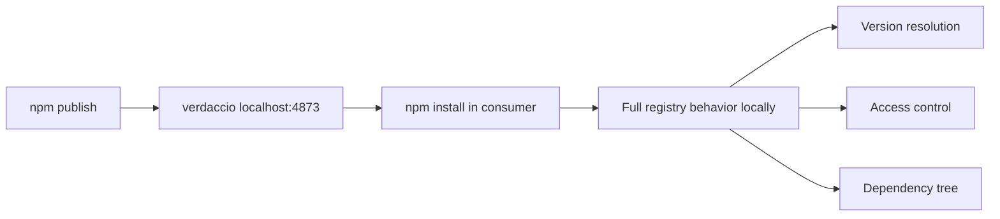

# How to Test Your npm Package Locally Before Publishing

Publishing an npm package and then immediately discovering it's broken is one of those uniquely awful feelings. Maybe the `exports` map is wrong and consumers can't import anything. Maybe you forgot to include a file in `files`. Maybe the types are missing. And now you've burned a version number and need to do a patch release for something that should have been caught before it ever hit the registry.

I've done this. More than once, if I'm being honest. The fix isn't "be more careful"  it's to test your package locally in a real consumer project *before* publishing. Here are the four ways to do it, ranked from simplest to most robust.

## Method 1: npm link (Simple but Fragile)

`npm link` creates a symlink from your package to another project's `node_modules/`. It's built into npm, requires no extra tools, and is usually the first thing people try.

```bash
# In your package directory
cd my-awesome-lib
npm link

# In your consumer project
cd ../my-app
npm link my-awesome-lib
```

Now `my-app/node_modules/my-awesome-lib` is a symlink pointing to your package's source. Changes you make to the package are immediately reflected  no rebuilding the consumer.

### Why npm link Often Breaks

Here's the thing: `npm link` has some real problems that make it unreliable for anything beyond quick testing.

- **Duplicate dependencies**  If both your package and the consumer install the same dependency (say, React), you end up with two copies. This causes the infamous "hooks can only be called inside a React component" error, among other issues.
- **Symlink resolution issues**  Some bundlers and tools don't follow symlinks correctly. Webpack needs `resolve.symlinks: false` in some configurations. Jest needs `moduleNameMapper` hacks.
- **Global state**  `npm link` modifies a global registry of linked packages. Run it in one terminal, forget about it, and wonder three weeks later why your project is using a local version of a package.
- **Fragile across npm installs**  Running `npm install` in the consumer often wipes out the symlink. Now you're back to the registry version without realizing it.

For a quick smoke test, `npm link` works. For anything serious, use yalc.

## Method 2: yalc (The Better Alternative)

[yalc](https://github.com/wclr/yalc) simulates what npm actually does when you publish  it packs your package and installs the packed version into the consumer. No symlinks, no global state weirdness.

```bash
# Install yalc globally
npm install -g yalc

# In your package directory
cd my-awesome-lib
npm run build
yalc publish

# In your consumer project
cd ../my-app
yalc add my-awesome-lib
```

This creates a `.yalc/` directory in the consumer and adds a `file:.yalc/my-awesome-lib` entry to its `package.json`. The consumer gets the exact same files it would get from npm  only the `files` listed in your `package.json`, properly packed.

When you make changes to your package:

```bash
# In your package directory
npm run build
yalc push
```

`yalc push` updates all projects that have added the package. It's like a local publish-and-update in one command.

> **Tip:** `yalc push` is particularly useful during active development. I run `tsup --watch` in one terminal and have a script that runs `yalc push` after each build. The consumer project picks up changes almost instantly.

### Why yalc is Better Than npm link

| Feature | npm link | yalc |
|---------|----------|------|
| Simulates real install | No (symlink) | Yes (packed files) |
| Duplicate dependency issues | Common | Rare |
| Survives `npm install` | No | Yes (with `--link` flag) |
| Works with all bundlers | Sometimes | Yes |
| Tests `files` field | No | Yes |
| Cleanup | Manual, easy to forget | `yalc remove` |

The biggest advantage: yalc tests your `files` field. If you forgot to include `dist/` in `package.json`'s `files` array, yalc will catch it because it uses the same packing logic as `npm pack`. With `npm link`, the consumer sees your entire project directory  symlink doesn't respect `files`.

To clean up when you're done:

```bash
cd ../my-app
yalc remove my-awesome-lib
npm install  # restore the registry version
```

## Method 3: verdaccio (Local npm Registry)

If you want to test the *actual* publish-and-install workflow end-to-end  including version resolution, access controls, and registry behavior  [verdaccio](https://verdaccio.org/) is a full npm registry you can run locally.

```bash
# Install and start verdaccio
npm install -g verdaccio
verdaccio
```

It starts a registry at `http://localhost:4873`. Now publish to it:

```bash
# In your package directory
npm publish --registry http://localhost:4873
```

And install from it in your consumer:

```bash
# In your consumer project
npm install my-awesome-lib --registry http://localhost:4873
```

This is the most faithful simulation of what happens when a real user installs your package. The package goes through npm's full pack → upload → resolve → download → install cycle, just on localhost.

### When to Use verdaccio

Honestly, for most single-package projects, yalc is enough. But verdaccio shines in specific scenarios:

- **Monorepos with cross-package dependencies**  Publish multiple packages locally and test that they install together correctly
- **Testing version ranges**  Verify that `"^1.2.0"` in a consumer resolves to the right version
- **CI/CD pipeline testing**  Run a local registry in CI to test the full publish workflow without hitting the real npm
- **Private package development**  Some teams use verdaccio permanently as a private registry proxy



## Method 4: file: Protocol and npm pack

The simplest zero-tools approach. Build your package, pack it into a tarball, and install the tarball directly:

```bash
# In your package directory
npm run build
npm pack
# Creates my-awesome-lib-1.0.0.tgz

# In your consumer project
npm install ../my-awesome-lib/my-awesome-lib-1.0.0.tgz
```

Or use the `file:` protocol in the consumer's `package.json`:

```json
{
  "dependencies": {
    "my-awesome-lib": "file:../my-awesome-lib"
  }
}
```

The tarball approach is great because `npm pack` respects your `files` field, runs `prepublishOnly` scripts, and creates the exact artifact that would go to the registry. If the tarball works, the published version will work.

> **Warning:** The `file:` protocol in `package.json` creates a symlink (similar to `npm link`), not a copy. The tarball approach (`npm install path/to/file.tgz`) actually copies files. For testing purposes, the tarball is more reliable.

### pnpm Overrides

If you're using pnpm and want to temporarily point a dependency to a local path:

```json
{
  "pnpm": {
    "overrides": {
      "my-awesome-lib": "file:../my-awesome-lib"
    }
  }
}
```

This is useful when you need to test changes in a dependency deep in the tree, not just a direct dependency.

## My Recommended Workflow

After building a few dozen packages, here's the testing flow I've settled on:

1. **During active development**  Use `yalc push` with `tsup --watch` for fast iteration
2. **Before publishing**  Run `npm pack --dry-run` to verify the file list, then install the tarball in a test project and check both ESM and CJS imports
3. **For CI testing**  Use verdaccio to run the full publish-install cycle
4. **Quick sanity check**  `npm link` is fine for a 30-second "does it import?" test

The most critical thing is step 2. Running `npm pack --dry-run` takes two seconds and has saved me from publishing broken packages more times than I can count.

```bash
npm pack --dry-run
```

Check the output. Is `dist/` there? Are `.d.ts` files included? Is the total size reasonable? Is your `.env` file accidentally in there?

If you're converting an existing JavaScript project to TypeScript for packaging, [SnipShift's JS to TypeScript converter](https://snipshift.dev/js-to-ts) can handle the initial conversion  then you can test the typed output locally using any of the methods above before publishing.

For the full build-to-publish workflow  including tsup configuration, `package.json` exports, and GitHub Actions automation  see our complete guide on [publishing a TypeScript npm package in 2026](/blog/publish-typescript-npm-package-2026). And if your `package.json` exports map is causing issues, we have a dedicated breakdown of [exports vs main vs module](/blog/package-json-exports-main-module) that covers every edge case.

Whatever method you pick, the point is the same: test locally first, publish second. Your users  and your version numbers  will thank you.
