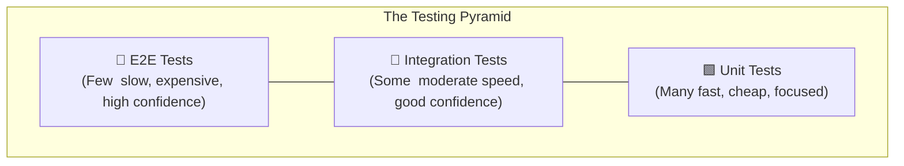
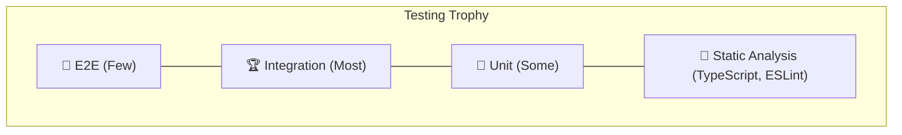

# What to Test in a Web Application (The Testing Pyramid Explained)

"We need better test coverage." You've probably heard this in a standup or retro at least once. And then someone asks the follow-up question nobody wants to answer: "Okay, but what *exactly* should we be testing?"

It's a surprisingly hard question. You can't test everything  you'd never ship. But testing the wrong things is almost worse than not testing at all, because it gives you false confidence. I've been on a team where we had 85% code coverage and still had a critical bug slip into production because all our tests were checking the wrong layer.

The testing pyramid is a mental model that helps you figure out what to test, how much of it, and at which layer. It's been around for a while, but a lot of developers either haven't seen it or kind of squint at the diagram and move on. So let's break it down with actual examples from a real web application.

## The Classic Testing Pyramid

The testing pyramid looks like this:



The idea is simple: you should have **many** unit tests at the base, **some** integration tests in the middle, and **few** end-to-end tests at the top. Each layer trades off between speed and confidence.

| Layer | Speed | Cost to Write | Cost to Maintain | Confidence Level | Typical Ratio |
|-------|-------|--------------|-----------------|-----------------|---------------|
| **Unit** | Milliseconds | Low | Low | Focused  catches logic bugs | ~70% of tests |
| **Integration** | Seconds | Medium | Medium | Good  catches wiring bugs | ~20% of tests |
| **E2E** | 10-60 seconds | High | High | Highest  catches real user flows | ~10% of tests |

Those ratios aren't laws  they're rough guidelines. The exact balance depends on your app. But the principle holds: lean heavily on fast, cheap tests and use slow, expensive tests sparingly for critical paths.

## Unit Tests: The Foundation

Unit tests check individual functions or modules in isolation. They're the fastest tests you'll write  a well-structured unit test suite of 500 tests might run in under a second.

**What belongs in unit tests:**
- Pure utility functions (formatting, validation, calculations)
- Business logic that doesn't depend on external services
- Data transformations and parsers
- State management reducers

**Practical example  testing a discount calculator:**

```javascript
import { describe, it, expect } from 'vitest';
import { calculateDiscount } from './pricing';

describe('calculateDiscount', () => {
  it('applies 10% discount for orders over $100', () => {
    expect(calculateDiscount(15000)).toBe(13500); // $150 → $135
  });

  it('applies no discount for orders under $100', () => {
    expect(calculateDiscount(5000)).toBe(5000); // $50 stays $50
  });

  it('handles the exact threshold', () => {
    expect(calculateDiscount(10000)).toBe(9000); // $100 → $90
  });
});
```

These tests run in milliseconds, are dead simple to read, and catch the exact kind of bug that sneaks into production  an off-by-one error in a discount threshold, or a rounding issue in the calculation.

**What NOT to put in unit tests:** Anything that tests how multiple pieces work together. If you're mocking five dependencies to test one function, that's a sign you need an integration test instead. Over-mocked unit tests are worse than useless  they pass even when the real code is broken.

If you're new to writing these, our [beginner's guide to JavaScript testing](/blog/start-testing-javascript-beginner) walks through setting up your first unit test step by step.

## Integration Tests: The Middle Ground

Integration tests check that multiple modules work together correctly. They're slower than unit tests but catch a whole category of bugs that unit tests miss  the "each piece works fine alone but breaks when connected" kind.

**What belongs in integration tests:**
- API route handlers (request in, response out)
- React components that fetch data and render it
- Form submission flows (input → validation → submit → feedback)
- Database queries with real (or test) databases

**Practical example  testing an API endpoint:**

```javascript
import { describe, it, expect } from 'vitest';
import { createApp } from './app';
import request from 'supertest';

describe('POST /api/orders', () => {
  it('creates an order and returns the total with discount', async () => {
    const app = createApp();

    const response = await request(app)
      .post('/api/orders')
      .send({
        items: [
          { id: 'widget-1', quantity: 3, pricePerUnit: 4999 },
        ],
        couponCode: 'SAVE10',
      });

    expect(response.status).toBe(201);
    expect(response.body.total).toBe(13497); // 3 × $49.99 = $149.97, minus 10%
    expect(response.body.discountApplied).toBe(true);
  });

  it('rejects invalid coupon codes', async () => {
    const app = createApp();

    const response = await request(app)
      .post('/api/orders')
      .send({
        items: [{ id: 'widget-1', quantity: 1, pricePerUnit: 1000 }],
        couponCode: 'FAKECODE',
      });

    expect(response.status).toBe(400);
    expect(response.body.error).toMatch(/invalid coupon/i);
  });
});
```

This test exercises the routing, the request parsing, the discount logic, the coupon validation, and the response formatting  all at once. If any of those pieces break or stop talking to each other correctly, this test catches it.

For React component integration tests, [React Testing Library](/blog/test-react-components-testing-library) is the tool of choice. It lets you render a component, simulate user interactions, and assert on what appears in the DOM  without caring about internal implementation details.

## End-to-End Tests: The Safety Net

E2E tests drive a real browser and simulate actual user journeys. They're slow, they're flaky, they're expensive to maintain  and they catch bugs that nothing else will.

**What belongs in e2e tests:**
- Critical user flows: sign up, log in, checkout, payment
- Cross-page navigation and routing
- Third-party integrations (payment forms, OAuth flows)
- Anything where a bug would cost you money or users

**Practical example  testing a checkout flow with Playwright:**

```javascript
import { test, expect } from '@playwright/test';

test('user can complete checkout', async ({ page }) => {
  await page.goto('/products');

  // Add item to cart
  await page.getByRole('button', { name: 'Add to Cart' }).first().click();

  // Go to cart
  await page.getByRole('link', { name: 'Cart (1)' }).click();

  // Proceed to checkout
  await page.getByRole('button', { name: 'Checkout' }).click();

  // Fill shipping info
  await page.getByLabel('Email').fill('test@example.com');
  await page.getByLabel('Address').fill('123 Test St');

  // Submit order
  await page.getByRole('button', { name: 'Place Order' }).click();

  // Verify confirmation
  await expect(page.getByText('Order Confirmed')).toBeVisible();
});
```

This single test touches your frontend, your API, your database, and your email service. If *any* of those systems has a problem, this test fails. That's incredibly valuable  but it's also why you should have very few of these. Every e2e test is a commitment to maintaining the entire system stack for that specific flow.

> **Warning:** Don't write e2e tests for things you can catch with integration tests. Testing that a button changes color on hover? That's not an e2e concern. Testing that clicking "Buy Now" actually creates an order in your database? That's worth the e2e cost.

## The Testing Trophy: A Modern Alternative

Kent C. Dodds proposed the "testing trophy" as an alternative to the pyramid, and I think it's worth knowing about  especially for frontend-heavy web applications.

The trophy shifts the emphasis: instead of mostly unit tests, you lean more heavily on **integration tests**. The argument is that in modern web apps, most bugs happen at the boundaries between components, not inside individual functions. So why not test those boundaries directly?



The trophy also adds a base layer: **static analysis**. TypeScript catches a huge class of bugs  null reference errors, wrong argument types, missing properties  before any test even runs. That's essentially free testing. If you're not using TypeScript yet, honestly, this is a great reason to start. [SnipShift's JS to TypeScript converter](https://snipshift.dev/js-to-ts) can help you migrate existing code without manually adding types to every file.

I personally use a blend of both models. For utility-heavy backend code, the pyramid works well  lots of unit tests, some integration tests. For React frontends, the trophy makes more sense  fewer unit tests, more integration tests with Testing Library.

## A Practical Rule of Thumb

Here's the decision tree I use when someone asks "should I write a test for this?"

1. **Is it a pure function?** → Unit test
2. **Does it involve multiple modules talking to each other?** → Integration test
3. **Is it a critical user-facing flow that would lose money if broken?** → E2E test
4. **Is it a type mismatch or null reference bug?** → TypeScript catches it. No test needed.
5. **Is it a visual layout issue?** → Visual regression testing (Chromatic, Percy) or manual QA

Not everything needs a test. The goal isn't 100% coverage  it's confidence that the important stuff works. A well-placed integration test covering your checkout flow is worth more than fifty unit tests checking string formatting edge cases.

## Putting It Together

The testing pyramid (or trophy) isn't about rigidly following ratios. It's about being intentional. When you sit down to write a test, ask yourself: "What layer of my application am I actually verifying here?" If you're writing a unit test that requires mocking eight things, you're probably at the wrong layer. If you're writing an e2e test for something a simple `expect(sum(2, 3)).toBe(5)` would catch, you're overcomplicating it.

Start with the pyramid, adjust based on your app's shape, and focus your testing effort where bugs would actually hurt.

For hands-on guides at each layer: start with [writing your first JavaScript test](/blog/start-testing-javascript-beginner) for unit testing fundamentals, move to [testing React components](/blog/test-react-components-testing-library) for integration tests, and learn to [write tests that survive refactoring](/blog/tests-that-dont-break-on-refactor) so your test suite stays useful over time.

The best test suite isn't the biggest one. It's the one that catches real bugs and doesn't slow you down. Build that, and your team will actually thank you  instead of sighing every time the CI pipeline runs for twelve minutes.
