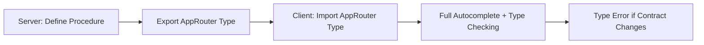

# tRPC Tutorial: Build a Type-Safe API Without Writing Types Twice

There's a specific kind of pain that TypeScript developers know well. You define your API types on the backend. Then you define them *again* on the frontend. Then someone changes a field name on the server, the frontend breaks silently, and you don't find out until a user reports that the profile page is showing "undefined" where their name should be.

I spent years working like this. REST endpoint returns an object, frontend guesses the shape, someone adds a field, someone else forgets to update the client type. The whole thing holds together with hope and good intentions.

tRPC fixes this problem completely. And not in the "oh we'll generate types from an OpenAPI spec" way. In the "you literally cannot call your API wrong because TypeScript won't let you" way.

This **tRPC tutorial** walks through everything: what tRPC actually is, how to set it up with Next.js App Router, defining procedures with Zod validation, calling them from the client, handling errors, and  just as importantly  when tRPC is the *wrong* choice.

## What tRPC Actually Is

tRPC stands for "TypeScript Remote Procedure Call." But forget the academic name. Here's the practical explanation:

**tRPC lets your frontend directly call backend functions with full type safety  no code generation, no API schema files, no REST endpoints to maintain.**

When you define a function on the server, the client automatically knows:
- What arguments it accepts
- What it returns
- What errors it can throw

This isn't code generation like GraphQL codegen or OpenAPI generators. It's pure TypeScript inference. Your server exports a type, your client imports that type, and TypeScript connects the dots at build time.



The key insight: there's no runtime overhead. tRPC doesn't generate code or API schemas. It uses TypeScript's type system to create an inference bridge between your server and client. At runtime, it's just HTTP calls  but at development time, it's as if your frontend is calling a local function.

## Setting Up tRPC with Next.js App Router

Let me walk you through a real setup. I'm using Next.js with the App Router because that's what most teams I work with are shipping in 2026. This **tRPC tutorial** uses v11, which is the current stable version.

### Install Dependencies

```bash
npm install @trpc/server @trpc/client @trpc/next @trpc/react-query @tanstack/react-query zod superjson
```

Yeah, that's a few packages. But each one does something specific  tRPC core, client adapters, React Query integration (which handles caching, loading states, and refetching), Zod for validation, and SuperJSON for serializing dates and other types that JSON can't handle natively.

### Create the tRPC Server

First, set up the core tRPC instance with context:

```typescript
// src/server/trpc.ts
import { initTRPC, TRPCError } from '@trpc/server';
import superjson from 'superjson';
import { z } from 'zod';

// Context available to every procedure
export const createTRPCContext = async (opts: { headers: Headers }) => {
  // You'd typically get the user session here
  const userId = opts.headers.get('x-user-id');
  return {
    userId,
  };
};

const t = initTRPC.context<typeof createTRPCContext>().create({
  transformer: superjson,
});

export const router = t.router;
export const publicProcedure = t.procedure;

// Middleware for authenticated routes
const isAuthed = t.middleware(({ ctx, next }) => {
  if (!ctx.userId) {
    throw new TRPCError({ code: 'UNAUTHORIZED' });
  }
  return next({
    ctx: { userId: ctx.userId },
  });
});

export const protectedProcedure = t.procedure.use(isAuthed);
```

A few things happening here. The `createTRPCContext` function runs on every request and builds a context object that all your procedures can access. The `protectedProcedure` uses middleware to ensure only authenticated requests get through  and it narrows the `ctx.userId` type from `string | null` to `string`. TypeScript knows that after the middleware check, `userId` is definitely there.

### Define Your Router

Now the fun part  defining your actual API procedures:

```typescript
// src/server/routers/tasks.ts
import { z } from 'zod';
import { router, publicProcedure, protectedProcedure } from '../trpc';

// Imagine this is your database
const tasks = new Map<string, { id: string; title: string; done: boolean; userId: string }>();

export const taskRouter = router({
  // Anyone can list tasks
  list: publicProcedure
    .input(
      z.object({
        limit: z.number().min(1).max(100).default(20),
        cursor: z.string().optional(),
      })
    )
    .query(({ input }) => {
      const allTasks = Array.from(tasks.values());
      return {
        tasks: allTasks.slice(0, input.limit),
        nextCursor: allTasks.length > input.limit ? allTasks[input.limit]?.id : null,
      };
    }),

  // Only authenticated users can create
  create: protectedProcedure
    .input(
      z.object({
        title: z.string().min(1).max(200),
      })
    )
    .mutation(({ input, ctx }) => {
      const task = {
        id: crypto.randomUUID(),
        title: input.title,
        done: false,
        userId: ctx.userId, // Typed as string, not string | null
      };
      tasks.set(task.id, task);
      return task;
    }),

  // Toggle done status
  toggle: protectedProcedure
    .input(z.object({ id: z.string() }))
    .mutation(({ input }) => {
      const task = tasks.get(input.id);
      if (!task) {
        throw new TRPCError({
          code: 'NOT_FOUND',
          message: `Task ${input.id} not found`,
        });
      }
      task.done = !task.done;
      return task;
    }),
});
```

Notice the pattern: `.input()` defines what the procedure accepts (validated at runtime by Zod), `.query()` for reads, `.mutation()` for writes. The input is fully typed in your handler  `input.title` is `string`, `input.limit` is `number`. No guessing.

### Merge into App Router

Create the root router and the API route handler:

```typescript
// src/server/routers/_app.ts
import { router } from '../trpc';
import { taskRouter } from './tasks';

export const appRouter = router({
  task: taskRouter,
});

// This type is what the client imports
export type AppRouter = typeof appRouter;
```

```typescript
// src/app/api/trpc/[trpc]/route.ts
import { fetchRequestHandler } from '@trpc/server/adapters/fetch';
import { appRouter } from '@/server/routers/_app';
import { createTRPCContext } from '@/server/trpc';

const handler = (req: Request) =>
  fetchRequestHandler({
    endpoint: '/api/trpc',
    req,
    router: appRouter,
    createContext: () => createTRPCContext({ headers: req.headers }),
  });

export { handler as GET, handler as POST };
```

That's the server side done. The `AppRouter` type export is the magic  it carries the full type information about every procedure, its inputs, and its outputs.

## Calling tRPC from the Client

### Set Up the Client Provider

```typescript
// src/lib/trpc.ts
import { createTRPCReact } from '@trpc/react-query';
import type { AppRouter } from '@/server/routers/_app';

export const trpc = createTRPCReact<AppRouter>();
```

```typescript
// src/app/providers.tsx
'use client';

import { QueryClient, QueryClientProvider } from '@tanstack/react-query';
import { httpBatchLink } from '@trpc/client';
import { useState } from 'react';
import { trpc } from '@/lib/trpc';
import superjson from 'superjson';

export function TRPCProvider({ children }: { children: React.ReactNode }) {
  const [queryClient] = useState(() => new QueryClient());
  const [trpcClient] = useState(() =>
    trpc.createClient({
      links: [
        httpBatchLink({
          url: '/api/trpc',
          transformer: superjson,
        }),
      ],
    })
  );

  return (
    <trpc.Provider client={trpcClient} queryClient={queryClient}>
      <QueryClientProvider client={queryClient}>
        {children}
      </QueryClientProvider>
    </trpc.Provider>
  );
}
```

### Using Procedures in Components

And here's where the payoff happens:

```typescript
'use client';

import { trpc } from '@/lib/trpc';

export function TaskList() {
  // Fully typed  hover over `data` and you see the exact shape
  const { data, isLoading } = trpc.task.list.useQuery({ limit: 10 });
  const createTask = trpc.task.create.useMutation({
    onSuccess: () => {
      // Invalidate the list to refetch
      utils.task.list.invalidate();
    },
  });
  const utils = trpc.useUtils();

  if (isLoading) return <p>Loading...</p>;

  return (
    <div>
      <button onClick={() => createTask.mutate({ title: 'New task' })}>
        Add Task
      </button>
      {data?.tasks.map((task) => (
        // task.title is string, task.done is boolean  TypeScript knows
        <div key={task.id}>
          {task.done ? '✓' : '○'} {task.title}
        </div>
      ))}
    </div>
  );
}
```

Try typing `trpc.task.` and watch your IDE autocomplete every procedure. Try passing `{ title: 123 }` to `createTask.mutate()`  TypeScript will yell at you immediately. Change the return type on the server, and every component that consumes that data gets a type error. No more silent contract breakage.

This is the core promise of tRPC: **the API contract is enforced by the compiler, not by convention.**

## Error Handling

tRPC errors map cleanly to HTTP status codes, and you can throw them with structured data:

```typescript
import { TRPCError } from '@trpc/server';

// In your procedure
throw new TRPCError({
  code: 'BAD_REQUEST',
  message: 'Title cannot contain special characters',
  cause: validationResult.error,
});
```

Here's the mapping of tRPC codes to HTTP status:

| tRPC Code | HTTP Status | When to Use |
|-----------|-------------|-------------|
| `BAD_REQUEST` | 400 | Invalid input that passed Zod but failed business logic |
| `UNAUTHORIZED` | 401 | No auth token or expired session |
| `FORBIDDEN` | 403 | Authenticated but lacks permission |
| `NOT_FOUND` | 404 | Resource doesn't exist |
| `CONFLICT` | 409 | Duplicate resource, version conflict |
| `TOO_MANY_REQUESTS` | 429 | Rate limiting |
| `INTERNAL_SERVER_ERROR` | 500 | Unhandled exceptions |

On the client, you catch these with the `onError` callback:

```typescript
const createTask = trpc.task.create.useMutation({
  onError: (error) => {
    if (error.data?.code === 'UNAUTHORIZED') {
      // Redirect to login
      router.push('/login');
    } else {
      toast.error(error.message);
    }
  },
});
```

> **Tip:** If you're building Zod schemas for your tRPC inputs and want to prototype them quickly, [SnipShift's JSON to Zod converter](https://snipshift.dev/json-to-zod) lets you paste a sample JSON payload and get a Zod schema back. It's especially useful when you're defining schemas for complex nested objects.

For a deeper look at API error handling patterns in general, check out our [guide to handling API errors in JavaScript](/blog/handle-api-errors-javascript).

## Subscriptions (Real-Time Data)

tRPC also supports WebSocket subscriptions if you need real-time updates:

```typescript
// Server
taskUpdated: publicProcedure.subscription(() => {
  return observable<Task>((emit) => {
    const onUpdate = (task: Task) => emit.next(task);
    taskEmitter.on('update', onUpdate);
    return () => taskEmitter.off('update', onUpdate);
  });
});

// Client
trpc.task.taskUpdated.useSubscription(undefined, {
  onData: (task) => {
    console.log('Task updated:', task.title);
  },
});
```

I don't use subscriptions in most projects  polling or React Query's `refetchInterval` is simpler for most use cases. But when you need it, it's there.

## When tRPC Is the Wrong Choice

Here's the thing nobody tells you in most **tRPC tutorials**: tRPC is not always the right answer. I've made the mistake of reaching for it on projects where it wasn't a good fit, and I've had to back out.

**Don't use tRPC when:**

- **You're building a public API.** tRPC is designed for TypeScript-to-TypeScript communication. If external consumers (mobile apps, third-party integrations, non-TS clients) need to call your API, they can't use tRPC's type inference. You want REST with OpenAPI or GraphQL instead.
- **Your frontend and backend are in separate repos.** tRPC's magic comes from importing the `AppRouter` type directly. If your backend and frontend are in different repositories, you'd need to publish the types as a package  which adds complexity and negates much of the benefit.
- **You have a polyglot backend.** If parts of your backend are in Python, Go, or another language, tRPC can't help with those endpoints. You'd end up with a mixed API surface, which is confusing.
- **You need fine-grained HTTP control.** tRPC abstracts away HTTP. If you need to set specific headers, use streaming responses, or handle multipart uploads, you'll fight the abstraction.

For those cases, a traditional REST API with proper TypeScript types  maybe using a framework like [Hono with Zod validation](/blog/build-api-hono-typescript)  is the better choice.

## Server-Side Calling (Server Components)

One pattern that works beautifully with Next.js App Router is calling tRPC procedures directly from [Server Components](/blog/server-vs-client-components-nextjs):

```typescript
// src/app/tasks/page.tsx (Server Component)
import { appRouter } from '@/server/routers/_app';
import { createTRPCContext } from '@/server/trpc';
import { headers } from 'next/headers';

export default async function TasksPage() {
  const context = await createTRPCContext({
    headers: await headers(),
  });
  const caller = appRouter.createCaller(context);

  // Direct call  no HTTP, no serialization, fully typed
  const result = await caller.task.list({ limit: 50 });

  return (
    <div>
      {result.tasks.map((task) => (
        <div key={task.id}>{task.title}</div>
      ))}
    </div>
  );
}
```

This bypasses the HTTP layer entirely. Your Server Component calls the tRPC procedure as a direct function call  same validation, same types, zero network overhead. It's one of the cleanest patterns in the Next.js + tRPC stack.

## The Full Picture

Here's how all the pieces fit together:

```mermaid
graph TD
    A[Next.js App] --> B{Component Type?}
    B -->|Server Component| C[Direct Caller - No HTTP]
    B -->|Client Component| D[tRPC React Query Hooks]
    C --> E[tRPC Router]
    D --> F[/api/trpc Endpoint]
    F --> E
    E --> G[Procedure + Zod Validation]
    G --> H[Business Logic / Database]
    E -.->|AppRouter Type| D
```

The beauty is that whether you're calling from a Server Component or a Client Component, the types are identical. Change the return type of a procedure, and both calling patterns surface the error.

If you're interested in how TypeScript generics power this kind of inference  where a type defined in one place automatically flows through function calls  our [TypeScript generics guide](/blog/typescript-generics-explained) explains the mechanics under the hood.

## Getting Started Checklist

If you want to add tRPC to an existing Next.js project, here's my recommended order:

1. Install packages and set up the tRPC instance with context
2. Define one simple router with a single `query` procedure
3. Wire up the API route handler in `app/api/trpc/[trpc]/route.ts`
4. Set up the client provider and make one call from a component
5. Verify autocomplete works  this confirms the type bridge is working
6. Add Zod validation to your inputs
7. Add middleware (auth, logging) as needed
8. Gradually migrate existing API routes to tRPC procedures

Don't try to migrate everything at once. tRPC and REST endpoints can coexist in the same Next.js app. Move one endpoint at a time, verify the types flow correctly, and build from there.

tRPC has genuinely changed how I think about the boundary between frontend and backend. When the compiler enforces your API contract, a whole category of bugs just disappears. It's not the right tool for every situation, but for TypeScript monorepos and full-stack Next.js apps, it's become my default. Try it on one router and see if it clicks for you too.
