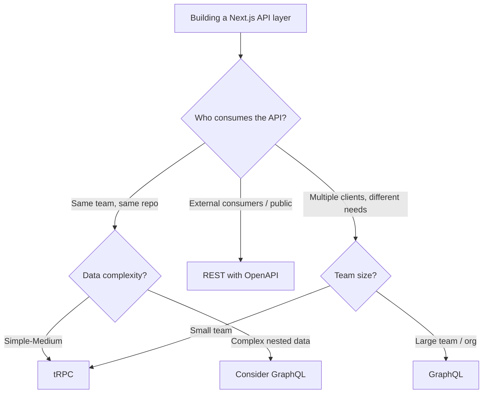

# tRPC vs REST vs GraphQL: Which API Pattern for Your Next.js App?

Every Next.js project hits the same question around week two: how do we fetch data? Server components handle the simple cases, but the moment you need mutations, real-time updates, or a proper API layer, you're choosing between tRPC, REST, and GraphQL.

I've shipped Next.js apps with all three. And after building maybe a dozen projects over the past few years, I have a pretty strong opinion about when each pattern makes sense  and when it doesn't. The answer isn't "tRPC for everything" or "REST is dead." It's more nuanced than that.

## The 30-Second Summary

Before we get into details, here's the decision in plain English:

- **tRPC**: Your frontend and backend are in the same repo, same team, same TypeScript codebase. You want end-to-end type safety with zero code generation.
- **REST**: You're building a public API, your consumers aren't JavaScript/TypeScript, or you need something dead simple that every developer on Earth already understands.
- **GraphQL**: You have complex, nested data relationships, multiple consumers with different data needs, or your frontend team wants to control exactly what data they fetch.

Now let me show you why.

## tRPC: Type Safety Without the Ceremony

tRPC is the pattern I reach for most in Next.js apps where the same team owns both frontend and backend. The pitch is simple  define a function on the server, call it from the client, get full TypeScript autocompletion and type checking across the network boundary. No code generation, no schema files, no API contracts to maintain.

```typescript
// server/routers/user.ts  define your API
import { router, publicProcedure } from '../trpc';
import { z } from 'zod';

export const userRouter = router({
  getById: publicProcedure
    .input(z.object({ id: z.string() }))
    .query(async ({ input }) => {
      const user = await db.user.findUnique({
        where: { id: input.id }
      });
      return user; // TypeScript knows this type
    }),

  create: publicProcedure
    .input(z.object({
      name: z.string().min(1),
      email: z.string().email(),
    }))
    .mutation(async ({ input }) => {
      return db.user.create({ data: input });
    }),
});
```

```typescript
// app/users/[id]/page.tsx  call it from the client
'use client';
import { trpc } from '@/lib/trpc';

export default function UserPage({ params }: { params: { id: string } }) {
  // Full autocompletion  input type, return type, error type
  const { data: user, isLoading } = trpc.user.getById.useQuery({
    id: params.id,
  });

  if (isLoading) return <div>Loading...</div>;

  // TypeScript knows user.name exists
  return <h1>{user?.name}</h1>;
}
```

The magic is that when you change the server function's return type, the client breaks *at compile time*. No more "the API changed and I found out at 3am in production." That alone is worth the setup cost.

### tRPC's Limitations

But tRPC has clear boundaries. It's TypeScript-only on both ends. If your API needs to serve a mobile app written in Swift, a partner's Python integration, or a public developer ecosystem  tRPC isn't the answer. It's an internal RPC protocol, not a public API standard.

It also couples your client and server deployments. If they need to evolve independently (different teams, different deploy cadences), that tight coupling becomes a problem.

## REST: The Boring Choice That Works

REST gets a bad rap in the TypeScript community because it lacks built-in type safety. But REST has advantages that the other two options can't match: universal understanding, incredible tooling, and zero learning curve.

```typescript
// app/api/users/[id]/route.ts  Next.js API route
import { NextRequest, NextResponse } from 'next/server';

export async function GET(
  request: NextRequest,
  { params }: { params: { id: string } }
) {
  const user = await db.user.findUnique({
    where: { id: params.id }
  });

  if (!user) {
    return NextResponse.json(
      { error: 'User not found' },
      { status: 404 }
    );
  }

  return NextResponse.json(user);
}

export async function PUT(request: NextRequest) {
  const body = await request.json();
  // validate body...
  const updated = await db.user.update({
    where: { id: body.id },
    data: body,
  });

  return NextResponse.json(updated);
}
```

```typescript
// Client-side fetch with type assertion
interface User {
  id: string;
  name: string;
  email: string;
}

async function getUser(id: string): Promise<User> {
  const res = await fetch(`/api/users/${id}`);
  if (!res.ok) throw new Error('Failed to fetch user');
  return res.json();
}
```

Yes, you're manually defining that `User` interface on the client. Yes, it can drift from what the server actually returns. But you can mitigate this with shared type packages, OpenAPI spec generation, or tools like [DevShift's JSON to TypeScript converter](https://devshift.dev/json-to-typescript) to generate interfaces from your actual API responses.

### When REST Is the Right Call

REST wins when:

- You need a **public API**  every developer knows REST, and OpenAPI/Swagger gives you documentation for free
- Your consumers include **non-TypeScript clients**  mobile apps, Python scripts, third-party integrations
- You want **HTTP semantics**  status codes, caching headers, ETags, content negotiation
- Your team is **large or distributed**  REST's simplicity means less tribal knowledge required
- You need **maximum caching**  CDNs understand GET requests natively

> **Tip:** When building or testing REST endpoints, [DevShift's cURL to Code converter](https://devshift.dev/curl-to-code) translates curl commands into fetch, axios, or any other language's HTTP client. Saves a lot of manual translation when you're moving between terminal testing and actual code.

## GraphQL: Precision Data Fetching

GraphQL solves a real problem  when different clients need different shapes of the same data. Your web app needs the user's name, email, and last 5 orders. Your mobile app needs just the name and avatar URL. With REST, you either over-fetch, under-fetch, or build custom endpoints. GraphQL lets the client specify exactly what it needs.

```typescript
// GraphQL schema
const typeDefs = `
  type User {
    id: ID!
    name: String!
    email: String!
    avatar: String
    orders(limit: Int): [Order!]!
  }

  type Order {
    id: ID!
    total: Float!
    status: OrderStatus!
    items: [OrderItem!]!
  }

  type Query {
    user(id: ID!): User
    users(page: Int, limit: Int): [User!]!
  }

  type Mutation {
    createUser(input: CreateUserInput!): User!
  }
`;
```

```typescript
// Client query  fetch exactly what this component needs
const USER_QUERY = gql`
  query GetUser($id: ID!) {
    user(id: $id) {
      name
      email
      orders(limit: 5) {
        id
        total
        status
      }
    }
  }
`;
```

The type safety story with GraphQL is strong too  tools like GraphQL Code Generator produce TypeScript types from your schema automatically. It's not as seamless as tRPC's zero-config approach, but it works across any language boundary.

### GraphQL's Cost

GraphQL is not free. The schema definition language, resolvers, the N+1 query problem, caching complexity (goodbye simple CDN caching), query complexity limits to prevent abuse  there's a lot of infrastructure that comes with it.

For a team of 3 building a Next.js SaaS? GraphQL is almost certainly overkill. For a team of 30 with a React web app, a React Native mobile app, and a partner API? It starts making a lot of sense.

If you're working with GraphQL schemas already, [DevShift's GraphQL to TypeScript tool](https://devshift.dev/graphql-to-typescript) generates TypeScript interfaces from your schema  helpful when you need types without setting up the full codegen pipeline.

## The Comparison Table

| Factor | tRPC | REST | GraphQL |
|--------|------|------|---------|
| Type safety | Automatic, end-to-end | Manual (or with codegen) | With codegen (graphql-codegen) |
| Setup complexity | Medium | Low | High |
| Learning curve | Low (if you know TS) | Very low | Medium-High |
| Public API friendly | No | Yes | Yes (but complex) |
| Multi-client support | TypeScript only | Any language | Any language |
| Over/under fetching | N/A (function calls) | Common problem | Solved by design |
| Caching | Custom | HTTP-native (CDN, ETags) | Complex (Apollo cache) |
| Real-time | Via subscriptions | WebSocket/SSE | Subscriptions built-in |
| Bundle size impact | Small (shared types) | None | Large (client library) |
| Best team size | Small-Medium | Any | Medium-Large |

## Decision Framework

Here's the mental model I use:



### My Actual Recommendations

**Solo developer or small team, single Next.js app?** Use tRPC. The type safety is incredible, the setup is quick, and you'll never manually sync API types again. I've built 4 production apps with tRPC + Next.js and the developer experience is unmatched.

**Building a public or partner-facing API?** REST. Every time. Add OpenAPI/Swagger for documentation, use Zod for runtime validation, and generate client SDKs if needed. Don't make your API consumers learn GraphQL or install a tRPC client.

**Large org with mobile + web + partner integrations?** GraphQL becomes worth the investment. The ability for each client to request exactly the data shape it needs  without building custom REST endpoints  is a genuine productivity multiplier at scale.

**Not sure yet?** Start with tRPC if you're in a TypeScript monorepo. It's the fastest to set up, and you can always extract REST endpoints later for specific public-facing needs. Starting with REST and adding tRPC later is harder because you lose the end-to-end type inference.

## A Note on Server Components

React Server Components in Next.js blur the lines a bit. For read-only data fetching, you can often skip the API layer entirely and query your database directly in a server component. That's not tRPC, REST, or GraphQL  it's just... calling a function.

But the moment you need mutations, optimistic updates, or client-side interactivity, you're back to choosing an API pattern. Server components complement all three approaches, they don't replace them. We wrote more about this in our [Server Components vs Client Components guide](/blog/server-vs-client-components-nextjs).

The API pattern you choose shapes your architecture more than almost any other decision. Take the time to match it to your actual constraints  team size, consumer diversity, data complexity  not just what's trending on Twitter.

For more context on API design, our [Express vs Fastify vs Hono comparison](/blog/express-fastify-hono-comparison) covers the server framework side of this decision. And if you're dealing with TypeScript type generation from any of these patterns, [DevShift's tools hub](https://devshift.dev) has converters for JSON, GraphQL, SQL, and OpenAPI schemas.
