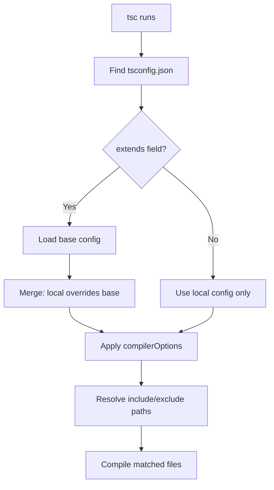

# The Complete tsconfig.json Reference (Every Option Explained Simply)

I've been working with TypeScript for about six years now, and I still find myself Googling tsconfig options more often than I'd like to admit. The official docs are... well, they're thorough, but they read like they were written for compiler engineers, not for the developer who just wants to know what `moduleResolution` should be set to in 2026.

So here's my attempt at a tsconfig.json options explained guide that actually makes sense. Every option grouped by what it does, written in plain English, with my honest take on when you should care about each one. If you've ever stared at a tsconfig and wondered "what does `esModuleInterop` actually do and will my app explode if I change it?"  this is for you.

## How tsconfig.json Actually Works

Before we get into individual options, let's clear up how TypeScript reads your config. When you run `tsc`, it walks up the directory tree looking for a `tsconfig.json`. Once it finds one, that file becomes the "project root." Everything in `compilerOptions` tells the compiler how to behave  what to check, what to output, how to resolve imports.

You can also extend other configs, which is how most frameworks give you sensible defaults:

```json
{
  "extends": "@tsconfig/node20/tsconfig.json",
  "compilerOptions": {
    "outDir": "./dist"
  },
  "include": ["src/**/*"]
}
```

The `extends` field pulls in a base config, and your local options override anything that conflicts. This is how Next.js, Vite, and most modern frameworks set things up  they give you a base, you tweak what you need.



Now let's go through every category of options you'll actually encounter.

## Strict Options  The Type Safety Knobs

This is the category that trips people up the most. TypeScript's strictness isn't binary  it's a collection of individual flags that you can toggle independently. But most of the time, you want all of them on.

### `strict`

**What it does:** Enables ALL strict type-checking options at once. It's a shorthand that flips on `noImplicitAny`, `strictNullChecks`, `strictFunctionTypes`, `strictBindCallApply`, `strictPropertyInitialization`, `noImplicitThis`, `useUnknownInCatchVariables`, and `alwaysStrict`.

**When to enable:** Always, for new projects. Seriously. If you're starting fresh in 2026 and not turning on `strict`, you're leaving half of TypeScript's value on the table.

**Common value:** `true`

For migration projects, you might start with `strict: false` and enable individual flags one at a time. But the goal should always be full strict mode eventually.

### `noImplicitAny`

**What it does:** Throws an error when TypeScript can't figure out a type and would silently fall back to `any`. Without this, TypeScript basically becomes JavaScript with extra steps  it won't catch the bugs you actually care about.

**When to enable:** Always. This is the single most important strict flag. If you only turn on one thing, make it this.

**Common value:** `true` (enabled automatically by `strict`)

### `strictNullChecks`

**What it does:** Makes `null` and `undefined` their own types instead of letting them sneak into every type. Without this, `string` actually means `string | null | undefined`, which is  and I cannot stress this enough  insane.

**When to enable:** Always. The number of "cannot read property of undefined" bugs this prevents is staggering. A team I worked with cut their production null reference errors by roughly 80% just from enabling this one flag.

**Common value:** `true`

### `strictFunctionTypes`

**What it does:** Checks function parameter types more strictly. Without it, TypeScript allows some technically-unsound function assignments that can cause runtime errors. The classic example is passing a function that expects a specific type where a broader type is expected.

**When to enable:** Always, unless you're working with a very old codebase that heavily uses function callbacks in unusual ways.

**Common value:** `true`

### `strictPropertyInitialization`

**What it does:** Requires that class properties are initialized in the constructor or have a definite assignment assertion. Catches the bug where you declare a property but forget to set it.

**When to enable:** For most projects, yes. If you're using a DI framework or ORM that handles initialization (like TypeORM with decorators), you might need the `!` assertion on some properties  but that's fine, it's still better to have the check on.

**Common value:** `true`

### `noImplicitThis`

**What it does:** Flags an error when `this` has an implicit `any` type. This mainly matters in standalone functions and callbacks where `this` could be anything.

**When to enable:** Always. If you're writing modern TypeScript with arrow functions and classes, you'll rarely hit this  but when you do, you'll be glad it's on.

**Common value:** `true`

### `useUnknownInCatchVariables`

**What it does:** Types catch clause variables as `unknown` instead of `any`. So instead of `catch (err)` where `err` is `any`, you get `unknown` and have to actually check what the error is before using it.

**When to enable:** Always. Forces you to handle errors properly instead of just assuming `err.message` exists.

**Common value:** `true`

Here's a quick reference for all the strict flags:

| Flag | What It Prevents | Pain Level to Enable |
|------|-----------------|---------------------|
| `noImplicitAny` | Silent `any` types | Medium  lots of type annotations needed |
| `strictNullChecks` | Null reference errors | High at first  many `!` or checks needed |
| `strictFunctionTypes` | Unsound function assignments | Low  rarely causes issues |
| `strictBindCallApply` | Wrong args to bind/call/apply | Low |
| `strictPropertyInitialization` | Uninitialized class properties | Medium for ORM users |
| `noImplicitThis` | `this` typed as `any` | Low |
| `useUnknownInCatchVariables` | Untyped error handling | Low  just add type checks |

> **Tip:** If you're migrating a JavaScript project to TypeScript, [SnipShift's JS to TypeScript converter](https://snipshift.dev/js-to-ts) can handle the initial conversion with proper type annotations  which makes enabling strict mode way less painful since you won't have to manually annotate everything.

## Module Options  How TypeScript Finds Your Code

Module configuration is where most tsconfig confusion lives. There are too many options, the names are confusing, and the "right" answer changes depending on your setup. Let me try to cut through the noise.

### `module`

**What it does:** Tells TypeScript what module system to use in the output. This determines whether your compiled code uses `import/export` (ESM), `require/module.exports` (CommonJS), or something else.

**Common values:**
- `"ESNext"`  for bundlers (Vite, webpack, esbuild). Keeps `import/export` as-is and lets the bundler handle it.
- `"NodeNext"`  for Node.js projects. Respects the `type` field in your `package.json` to determine ESM vs CJS.
- `"CommonJS"`  legacy Node.js. You probably don't want this in 2026 unless you have a specific reason.

**My take:** If you're using a bundler, `"ESNext"`. If you're writing a Node.js library or server, `"NodeNext"`. Everything else is legacy.

### `moduleResolution`

**What it does:** Controls how TypeScript looks up modules when you write `import { thing } from "some-package"`. This determines the algorithm used to find the actual file.

**Common values:**
- `"bundler"`  the modern choice for bundled apps. Supports package.json `exports`, doesn't require file extensions.
- `"nodenext"`  for Node.js. Requires file extensions in relative imports (`.js`, yes even for `.ts` files  I know, it's weird).
- `"node10"`  the old default. Don't use this for new projects.

**When it matters:** If you're getting "Cannot find module" errors on imports that clearly exist, this is almost always the culprit. I've seen teams lose entire afternoons to this.

### `target`

**What it does:** Sets the JavaScript version TypeScript compiles down to. If you set `"ES2015"`, TypeScript will convert arrow functions and template literals to ES5-compatible code. If you set `"ES2022"`, it leaves modern syntax alone.

**Common values:**
- `"ES2022"` or `"ESNext"`  for modern environments (Node 18+, modern browsers, bundled apps)
- `"ES2020"`  safe for Node 16+
- `"ES2015"`  only if you need to support very old environments

**My take:** Set this as high as your runtime supports. There's no reason to transpile away features your environment already has. More transpilation = bigger bundles and slower code.

### `lib`

**What it does:** Specifies which type definitions for built-in JavaScript APIs to include. This doesn't change your output  it just tells TypeScript what global APIs are available.

**Common values:**
- `["ES2022", "DOM", "DOM.Iterable"]`  for browser/frontend apps
- `["ES2022"]`  for Node.js (no DOM)

If you set `target` but not `lib`, TypeScript uses a default `lib` that matches the target. Usually you only set `lib` explicitly when you need DOM types in a non-browser target.

### `esModuleInterop`

**What it does:** Fixes compatibility between CommonJS and ES module imports. Without it, importing a CJS default export like `import React from 'react'` doesn't work correctly  you'd need `import * as React from 'react'` instead.

**When to enable:** Always. There's basically no downside, and it makes imports work the way everyone expects. This should honestly be the default, and in most framework-generated configs, it already is.

**Common value:** `true`

### `allowImportingTsExtensions`

**What it does:** Lets you import `.ts` and `.tsx` files with their actual extension. Normally TypeScript wants you to omit extensions or use `.js`. This flag removes that restriction  useful when your bundler supports it.

**When to enable:** When using a bundler that resolves `.ts` extensions directly (Vite, esbuild).

**Common value:** `true` in bundler setups, omit for Node.js

### `resolveJsonModule`

**What it does:** Allows you to import `.json` files and get type checking on their contents. Without it, `import data from './config.json'` is a compile error.

**When to enable:** Whenever you import JSON files, which is... basically every project.

**Common value:** `true`

### `isolatedModules`

**What it does:** Ensures each file can be transpiled independently without relying on cross-file type information. This is required by most build tools (Babel, esbuild, SWC, Vite) since they process files one at a time.

**When to enable:** If you use any modern bundler or transpiler  so, almost always.

**Common value:** `true`

## Path Options  Organizing Your Imports

### `baseUrl`

**What it does:** Sets the base directory for resolving non-relative imports. If you set `baseUrl: "."`, you can import from `src/utils/helpers` instead of `../../utils/helpers`.

**When to use:** Mostly for legacy setups. Modern projects use `paths` with the `bundler` module resolution instead. Next.js projects rarely need `baseUrl` explicitly.

### `paths`

**What it does:** Creates import aliases. The classic example is mapping `@/*` to your source directory:

```json
{
  "compilerOptions": {
    "paths": {
      "@/*": ["./src/*"]
    }
  }
}
```

Now `import { Button } from '@/components/Button'` resolves to `./src/components/Button`. Way cleaner than relative path hell.

**When to use:** Every project benefits from this. It makes imports readable and refactoring easier. Check out our [guide on absolute imports in Next.js](/blog/absolute-imports-nextjs-tsconfig) for a deeper look at setting this up.

> **Warning:** `paths` only tells TypeScript where to find the files  it doesn't rewrite the imports in your output. Your bundler or runtime needs to understand these aliases too. Next.js handles this automatically. Vite needs a `resolve.alias` config. Node.js needs something like `tsconfig-paths`.

### `rootDir`

**What it does:** Specifies the root directory of your source files. TypeScript uses this to calculate the output directory structure. If your source is in `src/`, setting `rootDir: "./src"` means the output mirrors that structure without the `src/` prefix.

**Common value:** `"./src"` or `"."`

### `outDir`

**What it does:** Where compiled JavaScript files go. Simple as that.

**Common value:** `"./dist"` or `"./build"`

### `rootDirs`

**What it does:** Lets you treat multiple directories as if they're a single root. Useful in monorepos or code generation setups where types live in different physical directories but should be treated as one logical tree.

**When to use:** Rarely. You'll know when you need it.

## Output Options  What TypeScript Produces

### `declaration`

**What it does:** Generates `.d.ts` type declaration files alongside your JavaScript. These files let other TypeScript projects use your code with full type information.

**When to enable:** Always for libraries. Not needed for applications (Next.js, Vite apps) since nothing else consumes their types.

**Common value:** `true` for libraries, `false` or omitted for apps

### `declarationMap`

**What it does:** Generates source maps for `.d.ts` files, so "Go to Definition" in your editor jumps to the actual TypeScript source instead of the declaration file.

**When to enable:** If you're building a library and want a good DX for consumers. Especially useful in monorepos.

**Common value:** `true` for libraries

### `sourceMap`

**What it does:** Generates `.js.map` files that map compiled JavaScript back to your TypeScript source. This makes debugging possible  without source maps, your browser DevTools and error stack traces point to the compiled output, which is basically unreadable.

**When to enable:** Almost always. The only reason to turn it off is for production builds where you want smaller bundles and don't want to expose source code.

**Common value:** `true`

### `noEmit`

**What it does:** Tells TypeScript to NOT produce any output files  no JS, no `.d.ts`, nothing. TypeScript just does type checking.

**When to enable:** When another tool handles compilation. This is the standard setup for Next.js, Vite, and anything using SWC or esbuild  they compile your code, TypeScript just checks types.

**Common value:** `true` for most modern frameworks

### `emitDeclarationOnly`

**What it does:** Only outputs `.d.ts` declaration files, not JavaScript. Useful when you want tsc to generate types but another tool (esbuild, SWC) to compile the actual JS.

**When to enable:** Library projects that use a fast bundler for JS but need tsc for type declarations.

### `removeComments`

**What it does:** Strips comments from output. Self-explanatory.

**When to enable:** If you want smaller output. Most bundlers do this anyway in production builds, so it's usually unnecessary.

### `incremental`

**What it does:** Caches compilation information to speed up subsequent builds. Creates a `.tsbuildinfo` file.

**When to enable:** Any project where `tsc` takes more than a few seconds. Especially beneficial for large codebases  I've seen build times drop 50-70% with this enabled.

**Common value:** `true`

### `composite`

**What it does:** Enables project references  a way to split a large codebase into smaller TypeScript projects that build independently. Required for monorepo setups using `tsc --build`.

**When to enable:** Monorepos with multiple packages. Check our [pnpm workspaces monorepo guide](/blog/pnpm-workspaces-typescript-monorepo) for how this fits into a real setup.

## JSX Options  React and Beyond

### `jsx`

**What it does:** Controls how JSX syntax is handled in the output. This is the one that determines whether your `<Component />` gets converted to `React.createElement` or left as JSX for something else to handle.

**Common values:**
- `"react-jsx"`  the modern React 17+ transform. Doesn't require `import React` at the top of every file. **Use this.**
- `"react-jsxdev"`  same as above but includes extra debug info. Used in development.
- `"react"`  the old transform that converts JSX to `React.createElement`. Legacy  don't use for new projects.
- `"preserve"`  leaves JSX as-is in the output. For when another tool (Babel, SWC) handles the JSX transform.

If you're using Next.js or Vite with React, this is almost certainly set correctly in the framework's base config already.

### `jsxImportSource`

**What it does:** Specifies where the JSX factory functions come from. For React, it's `"react"`. For Preact, it's `"preact"`. For Emotion's CSS prop, it's `"@emotion/react"`.

**Common values:**
- `"react"`  default, works with React 17+
- `"preact"`  for Preact projects
- `"@emotion/react"`  when using Emotion's `css` prop

You only need to set this explicitly if you're using something other than React or if your framework doesn't set it for you.

## File Inclusion Options

These aren't under `compilerOptions`  they're top-level fields in your tsconfig.

### `include`

**What it does:** Glob patterns specifying which files TypeScript should compile.

**Common value:** `["src/**/*"]` or `["**/*.ts", "**/*.tsx"]`

### `exclude`

**What it does:** Glob patterns for files to skip. `node_modules` is excluded by default.

**Common value:** `["node_modules", "dist", "build"]`

### `files`

**What it does:** An explicit list of files to include. Unlike `include`, there's no glob support  you list exact file paths.

**When to use:** Almost never. It's for very specific cases where you want to compile exactly these files and nothing else.

### `references`

**What it does:** Points to other tsconfig files in a project references setup. Used in monorepos to define build dependencies between packages.

```json
{
  "references": [
    { "path": "../shared" },
    { "path": "../utils" }
  ]
}
```

## Putting It All Together  Common Configurations

Here are the tsconfig setups I actually use in 2026, copy-paste ready.

### Next.js App

```json
{
  "compilerOptions": {
    "target": "ES2022",
    "lib": ["ES2022", "DOM", "DOM.Iterable"],
    "module": "ESNext",
    "moduleResolution": "bundler",
    "jsx": "preserve",
    "strict": true,
    "noEmit": true,
    "esModuleInterop": true,
    "resolveJsonModule": true,
    "isolatedModules": true,
    "incremental": true,
    "paths": {
      "@/*": ["./src/*"]
    }
  },
  "include": ["next-env.d.ts", "**/*.ts", "**/*.tsx"],
  "exclude": ["node_modules"]
}
```

### Node.js Library

```json
{
  "compilerOptions": {
    "target": "ES2022",
    "module": "NodeNext",
    "moduleResolution": "nodenext",
    "strict": true,
    "declaration": true,
    "declarationMap": true,
    "sourceMap": true,
    "outDir": "./dist",
    "rootDir": "./src",
    "esModuleInterop": true,
    "isolatedModules": true,
    "incremental": true
  },
  "include": ["src/**/*"]
}
```

### Vite + React App

```json
{
  "compilerOptions": {
    "target": "ES2022",
    "lib": ["ES2022", "DOM", "DOM.Iterable"],
    "module": "ESNext",
    "moduleResolution": "bundler",
    "jsx": "react-jsx",
    "strict": true,
    "noEmit": true,
    "esModuleInterop": true,
    "resolveJsonModule": true,
    "isolatedModules": true,
    "allowImportingTsExtensions": true,
    "paths": {
      "@/*": ["./src/*"]
    }
  },
  "include": ["src/**/*"]
}
```

## The Options You Can Safely Ignore

Not every tsconfig option deserves your attention. Some exist for backwards compatibility, some for edge cases. Here are the ones I almost never touch:

- **`allowJs`**  only during migration. Once everything is TypeScript, turn it off.
- **`checkJs`**  type-check JS files. Useful during migration, annoying otherwise.
- **`downlevelIteration`**  only if targeting ES5 and using `for...of` on non-arrays. In 2026, you shouldn't need this.
- **`preserveConstEnums`**  keeps const enums as objects instead of inlining. Niche.
- **`skipLibCheck`**  skips type checking of `.d.ts` files. Speeds up compilation, but can hide real errors. I use it in apps, not libraries.

If you're converting an existing JavaScript project to TypeScript and want to skip the manual configuration hassle, [SnipShift's JS to TS converter](https://snipshift.dev/js-to-ts) generates properly typed TypeScript that works with a strict tsconfig out of the box. It's a solid starting point when you don't want to fight with `any` types all day.

## Quick Decision Flowchart

Not sure which options to set? Here's my mental model:

**Are you using a framework (Next.js, Vite, Remix)?** Start with their default tsconfig. Don't reinvent the wheel.

**Building a library?** Turn on `declaration`, `declarationMap`, use `NodeNext` module resolution, set an `outDir`.

**Migrating from JavaScript?** Start with `strict: false`, `allowJs: true`, and gradually tighten. Enable `noImplicitAny` first  it gives you the most value for the least pain.

**Working in a monorepo?** Look into `composite`, `references`, and shared base configs with `extends`.

The tsconfig.json options explained here cover about 95% of what you'll ever need. The remaining 5% is so niche that if you need it, you'll find it in the TypeScript docs. But for day-to-day work  whether you're building apps, libraries, or migrating an old codebase  these are the knobs that matter.

TypeScript's configuration surface area is enormous, but you don't need to understand all of it. Pick the template closest to your use case, enable strict mode, and focus on writing actual code. The tsconfig should work for you, not the other way around.

For more TypeScript content, check out our guide on [common TypeScript mistakes](/blog/common-typescript-mistakes) or explore [all the SnipShift developer tools](https://snipshift.dev) that make working with TypeScript faster.
