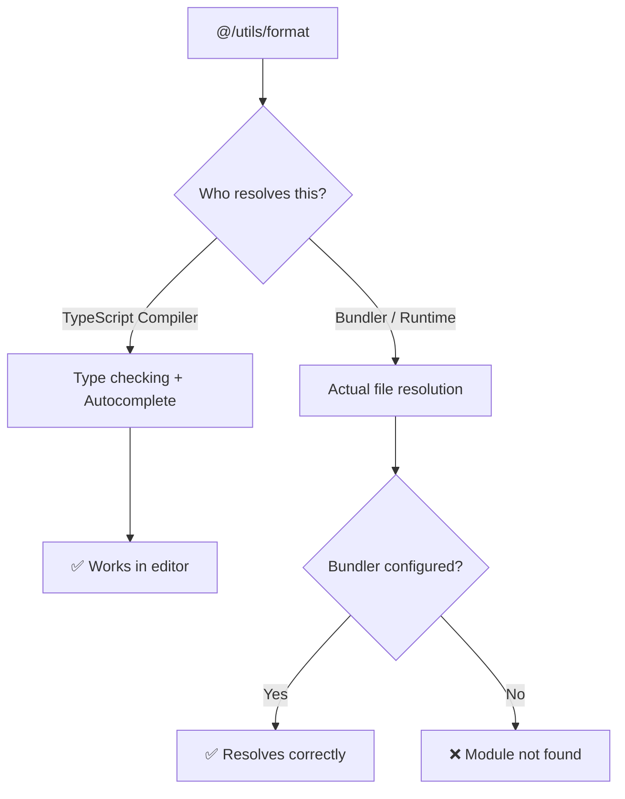

# What Is the tsconfig.json 'paths' Option? (TypeScript Import Aliases)

If you've ever written an import that looks like this, you know the pain:

```typescript
import { formatDate } from "../../../utils/formatDate";
import { Button } from "../../../components/ui/Button";
import { useAuth } from "../../../../hooks/useAuth";
```

Three dots, four dots, sometimes five. You move a file one directory deeper and suddenly half your imports break. I've spent entire afternoons fixing relative import paths after a folder restructure, and it's the kind of work that makes you question your career choices.

The tsconfig `paths` option fixes this. Instead of counting dots, you write:

```typescript
import { formatDate } from "@/utils/formatDate";
import { Button } from "@/components/ui/Button";
import { useAuth } from "@/hooks/useAuth";
```

Clean, readable, and  most importantly  they don't break when you move files around. Here's how to set up tsconfig paths and import aliases properly, including the gotchas that trip people up in different frameworks.

## How tsconfig paths and baseUrl Work

The `paths` option in `tsconfig.json` creates a mapping between an import alias and actual file paths. It works together with `baseUrl`, which sets the root directory for resolving these mappings.

Here's a basic setup:

```json
{
  "compilerOptions": {
    "baseUrl": ".",
    "paths": {
      "@/*": ["./src/*"]
    }
  }
}
```

This tells TypeScript: "When you see an import starting with `@/`, look for the file inside `./src/` relative to `baseUrl`." So `@/components/Button` resolves to `./src/components/Button`.

You can define multiple aliases too:

```json
{
  "compilerOptions": {
    "baseUrl": ".",
    "paths": {
      "@/*": ["./src/*"],
      "@components/*": ["./src/components/*"],
      "@lib/*": ["./src/lib/*"],
      "@hooks/*": ["./src/hooks/*"]
    }
  }
}
```

> **Tip:** The `@/*` catch-all pattern is usually enough. I've seen teams create a dozen specific aliases and then argue about which one to use. Keep it simple  one `@/*` alias that points to `src/` covers 95% of use cases.

### What About `baseUrl` Without `paths`?

Setting `baseUrl` alone (without `paths`) lets you import directly from the base directory:

```typescript
// With baseUrl: "src"
import { Button } from "components/ui/Button";
```

But I'd avoid this approach. It creates ambiguity  is `components/ui/Button` a node module or a local file? Import aliases with the `@` prefix make the distinction obvious. When you see `@/`, you immediately know it's a project-local import. When you see a bare name without `@`, it's a package from `node_modules`.

## The Catch: TypeScript Paths Don't Actually Resolve at Runtime

Here's the thing that confuses everyone the first time. **TypeScript's `paths` option only affects type checking and editor autocomplete.** It does NOT rewrite your import paths in the compiled output.

If you're using `tsc` to compile and then running the output with Node.js, those `@/` imports will fail at runtime because Node has no idea what `@/` means.



This means your bundler or runtime also needs to know about these aliases. The setup depends on your framework.

## Setting Up Path Aliases Per Framework

| Framework | Where to configure | Notes |
|-----------|-------------------|-------|
| **Next.js** | `tsconfig.json` only | Built-in support, no extra config needed |
| **Vite** | `vite.config.ts` + `tsconfig.json` | Use `vite-tsconfig-paths` plugin or manual `resolve.alias` |
| **webpack** | `webpack.config.js` + `tsconfig.json` | Add `resolve.alias` matching your paths |
| **esbuild** | `tsconfig.json` only | Reads paths from tsconfig automatically |
| **SWC** | `tsconfig.json` only | Reads paths from tsconfig automatically |

### Next.js (Zero Config)

Next.js reads your `tsconfig.json` paths natively. Just add the paths to your tsconfig and you're done  no plugins, no extra config:

```json
{
  "compilerOptions": {
    "baseUrl": ".",
    "paths": {
      "@/*": ["./src/*"]
    }
  }
}
```

Next.js even asks if you want to set this up when you create a new project with `create-next-app`. If you said yes during setup, it's already there.

### Vite

Vite doesn't read tsconfig paths by default. You have two options. The easier one is the `vite-tsconfig-paths` plugin:

```typescript
// vite.config.ts
import { defineConfig } from "vite";
import tsconfigPaths from "vite-tsconfig-paths";

export default defineConfig({
  plugins: [tsconfigPaths()],
});
```

Or you can configure it manually with `resolve.alias`:

```typescript
// vite.config.ts
import { defineConfig } from "vite";
import path from "path";

export default defineConfig({
  resolve: {
    alias: {
      "@": path.resolve(__dirname, "./src"),
    },
  },
});
```

I prefer the plugin approach. It reads directly from your tsconfig, so you only maintain the paths in one place.

### webpack

For webpack, add a `resolve.alias` entry that mirrors your tsconfig paths:

```javascript
// webpack.config.js
const path = require("path");

module.exports = {
  resolve: {
    alias: {
      "@": path.resolve(__dirname, "src"),
    },
  },
};
```

Or use `tsconfig-paths-webpack-plugin` to read them from tsconfig automatically:

```javascript
const TsconfigPathsPlugin = require("tsconfig-paths-webpack-plugin");

module.exports = {
  resolve: {
    plugins: [new TsconfigPathsPlugin()],
  },
};
```

If you're converting an existing JavaScript project to TypeScript and need to update hundreds of import paths, [SnipShift's JS to TypeScript converter](https://snipshift.dev/js-to-ts) can help with the migration. It handles import syntax conversion along with type inference.

## Common Gotchas

### Jest Needs `moduleNameMapper`

Jest doesn't use your bundler's resolution, so it ignores both tsconfig paths and webpack aliases. You need to add a `moduleNameMapper` to your Jest config:

```json
{
  "jest": {
    "moduleNameMapper": {
      "^@/(.*)$": "<rootDir>/src/$1"
    }
  }
}
```

This trips up basically everyone. Your app works fine, your editor shows no errors, but your tests fail with "Cannot find module '@/utils/format'." Now you know why.

### ESLint Import Resolution

If you're using `eslint-plugin-import`, it won't understand your path aliases either. Install `eslint-import-resolver-typescript`:

```bash
npm install -D eslint-import-resolver-typescript
```

And configure it in your ESLint config:

```json
{
  "settings": {
    "import/resolver": {
      "typescript": {
        "alwaysTryTypes": true
      }
    }
  }
}
```

Without this, ESLint will report false positives for "import/no-unresolved" on every aliased import. I've seen teams disable that rule entirely instead of fixing the resolver  don't do that, the rule is genuinely useful.

If you're running into "Cannot find module" errors more broadly, our [guide to fixing TypeScript module resolution errors](/blog/fix-cannot-find-module-typescript) covers the full debugging process.

### Don't Forget `include` in tsconfig

If your `tsconfig.json` has an explicit `include` array, make sure it covers all the directories your aliases point to. A common mistake:

```json
{
  "include": ["src"],
  "compilerOptions": {
    "paths": {
      "@config/*": ["./config/*"]
    }
  }
}
```

TypeScript will resolve the alias for type checking, but `config/` isn't in `include`, so files there might not get compiled. Add it to `include` or use a broader pattern.

## Why @ Imports Are Worth the Setup

I know the initial configuration feels like a lot  especially if you need to set it up in tsconfig, your bundler, Jest, AND ESLint. But once it's done, you never think about it again. And the benefits are real:

- **Refactoring is painless.** Move a file, and none of its consumers' imports break (as long as you don't rename it).
- **Code is more readable.** `@/components/Button` tells you exactly where the file lives without mental dot-counting.
- **Onboarding is faster.** New team members can understand the project structure from the imports alone.

A team I worked with last year went from spending ~2 hours per sprint fixing broken relative imports to zero. The initial setup took 20 minutes. That's a pretty good trade.

For more on structuring your project's file system in a way that works well with path aliases, check out our [Node.js project structure guide](/blog/node-js-project-structure). If you're migrating from CommonJS `require()` calls to ES module imports, our [require to import conversion guide](/blog/convert-require-to-import-typescript) walks through that process step by step. And if you're also configuring your package.json for publishing, our guide on the [package.json exports field](/blog/package-json-exports-field) covers the other half of the module resolution puzzle.

Explore more free developer tools at [SnipShift.dev](https://snipshift.dev).
