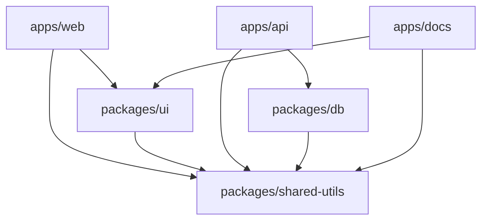

# Turborepo vs Nx: Which Monorepo Tool Should You Use in 2026?

My team moved to a monorepo about two years ago, and the tooling decision nearly split us down the middle. Half the team wanted Turborepo because "it's simpler and Vercel backs it." The other half wanted Nx because "it actually does things." We ended up trying both  Turborepo for six months, then migrated to Nx  and I have opinions about when each one makes sense.

If you're trying to decide between Turborepo and Nx in 2026, the short answer is: they've both gotten significantly better, but they still serve slightly different audiences. Let me explain.

## What They Actually Do

Both tools orchestrate tasks across packages in a monorepo. Build this, then that, cache results, don't rebuild what hasn't changed. That's the core value prop.

But the similarity kind of ends there.

**Turborepo** is a task runner. It takes your existing package.json scripts, understands dependencies between packages, runs things in the right order, and caches aggressively. That's... basically it. And that's by design.

**Nx** is a full build system. It does everything Turborepo does, plus code generation, dependency graph visualization, affected commands (only run tests for what changed), plugins for specific frameworks, and a whole lot more.

| Feature | Turborepo | Nx |
|---------|-----------|-----|
| Task orchestration | Yes | Yes |
| Local caching | Yes | Yes |
| Remote caching | Vercel Remote Cache | Nx Cloud (free tier available) |
| Dependency graph viz | Basic (`turbo ls --graph`) | Full interactive UI (`nx graph`) |
| Code generators | No | Yes (powerful) |
| Framework plugins | No | Yes (React, Angular, Node, etc.) |
| Affected commands | No (runs everything) | Yes (`nx affected`) |
| Config format | `turbo.json` | `nx.json` + `project.json` |
| Learning curve | Low | Medium-High |
| Incremental adoption | Very easy | Easy (with `nx init`) |

## Caching: The Feature That Sells Both

Caching is why most teams adopt either tool in the first place. Nobody wants to wait 8 minutes for a full build when they changed one line in a shared utils package.

Both Turborepo and Nx hash your inputs (source files, env vars, dependencies) and skip tasks when the hash matches a previous run. Both support remote caching so your CI and teammates benefit from each other's builds.

```json
// turbo.json  cache configuration
{
  "tasks": {
    "build": {
      "dependsOn": ["^build"],
      "outputs": ["dist/**", ".next/**"],
      "cache": true
    },
    "test": {
      "dependsOn": ["build"],
      "cache": true
    },
    "lint": {
      "cache": true
    }
  }
}
```

```json
// nx.json  cache and target defaults
{
  "targetDefaults": {
    "build": {
      "dependsOn": ["^build"],
      "outputs": ["{projectRoot}/dist"],
      "cache": true
    },
    "test": {
      "dependsOn": ["build"],
      "cache": true
    },
    "lint": {
      "cache": true
    }
  }
}
```

The configs look similar, and honestly, caching performance is comparable. I've benchmarked both on a monorepo with 12 packages and the cache hit times were within milliseconds of each other. The real difference is what happens *around* the caching.

## Where Turborepo Wins: Simplicity

Turborepo's biggest strength is that it gets out of your way. You add a `turbo.json` file, define your task pipeline, and run `turbo build`. That's the entire setup. No plugins to install, no project configuration files, no new CLI commands to learn.

For a team that just wants "make our monorepo builds faster," Turborepo delivers that in about 15 minutes of setup time.

```bash
# Getting started with Turborepo
npx create-turbo@latest my-monorepo
cd my-monorepo
turbo build  # that's it
```

It also plays nicely with any package manager  npm, yarn, pnpm, bun workspaces. Zero opinions about your project structure. You keep your existing setup and just layer caching on top.

If you're deploying to Vercel, the integration is seamless. Vercel automatically detects Turborepo, enables remote caching, and optimizes builds. No configuration needed. That's a genuine advantage if you're already in the Vercel ecosystem.

## Where Nx Wins: Everything Else

Nx does more. A lot more. And depending on your team size and project complexity, that "more" is either overwhelming or exactly what you need.

### Code Generators

Nx generators are genuinely useful. Need a new package in your monorepo? `nx g @nx/js:library shared-utils` scaffolds it with the right config, test setup, and build pipeline. Need a React component library? There's a generator for that too.

```bash
# Generate a new library with full config
nx g @nx/react:library ui-components --directory=packages/ui

# Generate a component inside that library
nx g @nx/react:component Button --project=ui-components
```

Turborepo has nothing equivalent. You're copying folders and editing package.json files manually, or writing your own scripts. For small repos, that's fine. For a repo with 30+ packages, generators save hours.

### Affected Commands

This is Nx's killer feature for CI pipelines. `nx affected -t test` only runs tests for packages that changed  and packages that *depend on* what changed. In a large monorepo, this can cut CI times from 20 minutes to 3.

```bash
# Only test what's affected by recent changes
nx affected -t test --base=main

# Only build affected packages
nx affected -t build --base=main
```

Turborepo doesn't have this concept. It'll run everything and rely on cache hits to skip unchanged work. In practice, the first CI run after a cache miss is slower with Turborepo because it processes every package.

### The Dependency Graph

Running `nx graph` opens an interactive visualization of your entire monorepo. Every package, every dependency, every task relationship. When you're debugging "why does building package A trigger a rebuild of package C," this graph is invaluable.



Turborepo has a basic graph output, but it's not interactive and doesn't give you the same "aha" moment when understanding your dependency structure.

## The Learning Curve Question

Here's where I have to be honest: Nx has a steeper learning curve. There's `nx.json`, `project.json`, workspace layouts, plugins, executors, generators  it's a lot of concepts to internalize.

A team I worked with spent about two weeks really "getting" Nx. With Turborepo, the same team was productive in an afternoon. That matters, especially if your team doesn't have someone who wants to own the build infrastructure.

But  and this is important  Nx has gotten much better at incremental adoption. Running `nx init` in an existing monorepo adds Nx on top of your current setup without restructuring anything. You can start with just caching and `nx affected`, then adopt generators and plugins later as you need them.

## Remote Caching and CI

Both offer remote caching, but the hosting models differ.

**Turborepo** uses Vercel Remote Cache. If you're on Vercel, it's automatic and free. If you're not, you can self-host with `turbo-remote-cache` or use Vercel's standalone caching (but it's another Vercel dependency).

**Nx** uses Nx Cloud. The free tier is generous  unlimited contributors, 500 hours of saved compute per month. The paid tiers add features like distributed task execution, where Nx automatically splits your CI across multiple machines. That's enterprise-level stuff that Turborepo simply doesn't offer.

> **Tip:** Monorepo configs often involve converting between JSON and YAML for different CI systems. [DevShift's JSON to YAML converter](https://devshift.dev/json-to-yaml) handles that  useful when you're translating turbo.json or nx.json configs into GitHub Actions YAML.

## Community and Adoption

Nx has been around longer (since 2017) and has a larger community, more plugins, and better documentation. The Nx team actively maintains plugins for React, Angular, Vue, Node, Next.js, Remix, and more.

Turborepo, acquired by Vercel in 2021, has grown rapidly but still has a smaller plugin ecosystem. That said, Turborepo doesn't *need* a plugin ecosystem in the same way  it's intentionally minimal.

GitHub stars don't tell the full story, but for context: Nx has ~24k stars, Turborepo ~27k. Both are actively maintained with frequent releases.

## My Recommendation

After using both in production:

**Start with Turborepo** if you have fewer than 10 packages, your team is small, you're on Vercel, or you just want faster builds without learning a new system. It does one thing well.

**Choose Nx** if you have 10+ packages, need code generators, want `affected` commands for CI optimization, or you're in an enterprise setting where build infrastructure needs to scale. The learning curve pays off at scale.

And honestly? Starting with Turborepo and migrating to Nx later is a perfectly valid path. That's what my team did, and the migration was mostly painless  about a day of config work.

If you're evaluating monorepo strategies more broadly, our [monorepo vs polyrepo guide](/blog/monorepo-vs-polyrepo) covers whether you should go monorepo at all. And for teams setting up their TypeScript monorepo config, check out our [TypeScript migration strategy](/blog/typescript-migration-strategy) for tips on shared tsconfig patterns across packages.

The monorepo tooling space has matured a lot. Both Turborepo and Nx are solid choices  the days of hacking together Lerna scripts and praying are thankfully behind us.
