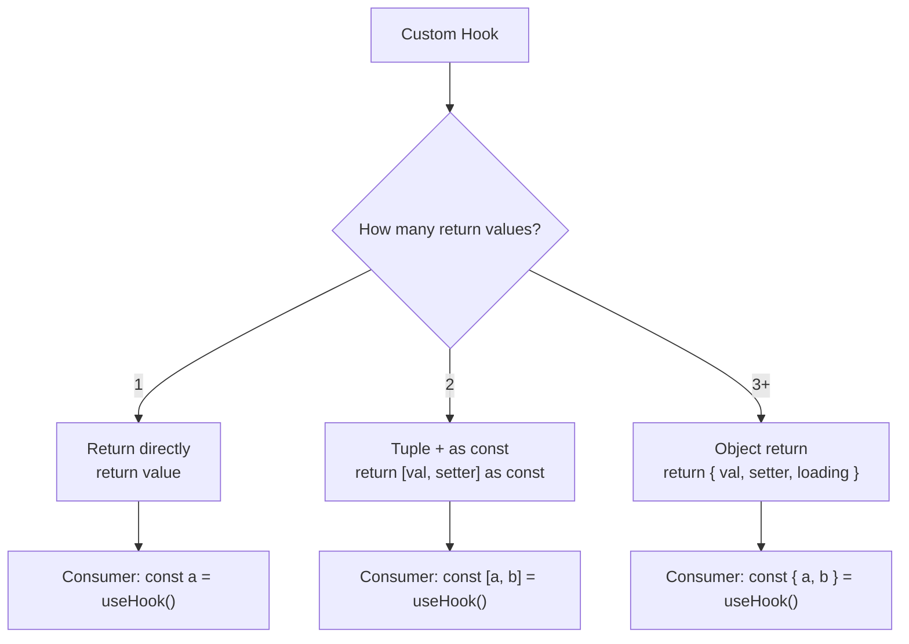

# How to Type a Custom React Hook That Returns Multiple Values

You write a custom React hook. It returns a value and a setter. Maybe a loading state too. You return them in an array, just like `useState` does. And then TypeScript decides the return type is `(string | boolean | ((value: string) => void))[]`  a union array where every element could be any of the types. Destructuring breaks. Autocomplete breaks. You spend 15 minutes fighting the type system on what should've been a one-minute task.

This is probably the most common TypeScript + React question I see in code reviews, and the fix is genuinely simple once you know it. There are two approaches: tuple returns and object returns. Here's when to use each and how to type them correctly.

## The Problem: Arrays Widen to Union Types

When you return an array from a function, TypeScript infers the *widest* possible type:

```typescript
function useToggle(initial: boolean) {
  const [value, setValue] = useState(initial);
  const toggle = () => setValue(v => !v);

  return [value, toggle];
  // Return type: (boolean | (() => void))[]
}

// Destructuring loses the individual types
const [isOpen, toggleOpen] = useToggle(false);
// isOpen is boolean | (() => void)  wrong
// toggleOpen is boolean | (() => void)  wrong
```

TypeScript sees an array containing a `boolean` and a function, so it infers a union array. It doesn't know that index 0 is always the boolean and index 1 is always the function. That's because plain arrays are variable-length  TypeScript can't assume positional types.

## Solution 1: `as const` for Tuple Returns

The simplest fix is adding `as const` to the return statement:

```typescript
function useToggle(initial: boolean) {
  const [value, setValue] = useState(initial);
  const toggle = () => setValue(v => !v);

  return [value, toggle] as const;
  // Return type: readonly [boolean, () => void]
}

const [isOpen, toggleOpen] = useToggle(false);
// isOpen is boolean ✓
// toggleOpen is () => void ✓
```

`as const` tells TypeScript to infer a **tuple**  a fixed-length array where each position has its own type. That's exactly what we want. The `readonly` modifier comes along for the ride but doesn't cause any practical issues when destructuring.

This is the approach `useState` itself uses internally. If it's good enough for React's core hooks, it's good enough for yours.

## Solution 2: Explicit Tuple Return Type

If you prefer explicit annotations (or your linter requires them), declare the return type directly:

```typescript
function useToggle(initial: boolean): [boolean, () => void] {
  const [value, setValue] = useState(initial);
  const toggle = () => setValue(v => !v);

  return [value, toggle];
}
```

Same result, slightly more verbose. I tend to use `as const` for simple hooks and explicit annotations when the return type is complex enough that I want it documented.

## Solution 3: Object Returns (For 3+ Values)

Here's my rule of thumb: if your hook returns more than two values, use an object instead of a tuple. Tuples with three or four elements become hard to read at the call site  nobody remembers what the third positional value is.

```typescript
interface UseAsyncReturn<T> {
  data: T | null;
  error: Error | null;
  isLoading: boolean;
  refetch: () => Promise<void>;
}

function useAsync<T>(asyncFn: () => Promise<T>): UseAsyncReturn<T> {
  const [data, setData] = useState<T | null>(null);
  const [error, setError] = useState<Error | null>(null);
  const [isLoading, setIsLoading] = useState(true);

  const refetch = useCallback(async () => {
    setIsLoading(true);
    setError(null);
    try {
      const result = await asyncFn();
      setData(result);
    } catch (err) {
      setError(err instanceof Error ? err : new Error(String(err)));
    } finally {
      setIsLoading(false);
    }
  }, [asyncFn]);

  useEffect(() => { refetch(); }, [refetch]);

  return { data, error, isLoading, refetch };
}
```

Usage:

```typescript
const { data: users, isLoading, error } = useAsync(fetchUsers);
// Destructured names are clear, order doesn't matter
// Easy to skip values you don't need
```

With objects, TypeScript infers each property type automatically. No `as const`, no explicit annotation needed. And the consumer can destructure only what they need  unlike tuples where you'd have to write `const [, , isLoading] = ...` to skip values.

| Return Style | Best For | Typing Approach | Example Hook |
|-------------|----------|----------------|-------------|
| Tuple (`[a, b]`) | 2 values (value + setter) | `as const` or explicit tuple | `useToggle`, `useCounter` |
| Object (`{ a, b }`) | 3+ values | Interface or inferred | `useAsync`, `useForm` |
| Single value | 1 value | Direct return | `useWindowSize` |

## Generic Custom Hooks

When your hook is generic  like the `useAsync` example above  the generic flows through naturally:

```typescript
function useLocalStorage<T>(
  key: string,
  defaultValue: T
): [T, (value: T) => void] {
  const [stored, setStored] = useState<T>(() => {
    if (typeof window === 'undefined') return defaultValue;
    try {
      const item = localStorage.getItem(key);
      return item ? (JSON.parse(item) as T) : defaultValue;
    } catch {
      return defaultValue;
    }
  });

  const setValue = (value: T) => {
    setStored(value);
    localStorage.setItem(key, JSON.stringify(value));
  };

  return [stored, setValue];
}
```

TypeScript infers `T` from the `defaultValue` you pass:

```typescript
// T is inferred as { theme: string; fontSize: number }
const [settings, setSettings] = useLocalStorage('settings', {
  theme: 'dark',
  fontSize: 14,
});

settings.theme;     // string  typed
setSettings({ theme: 'light', fontSize: 16 }); // typed
```

No need to pass the generic explicitly unless you want a narrower type:

```typescript
// Explicit generic for stricter typing
const [theme, setTheme] = useLocalStorage<'light' | 'dark'>('theme', 'dark');
// theme is 'light' | 'dark', not string
```

> **Tip:** For a more robust typed localStorage pattern with Zod validation, check out our [type-safe localStorage guide](/blog/type-safe-localstorage-typescript).

## Inferring Types from Hooks

Sometimes you need the type that a hook returns  maybe to pass it as a prop or use it in another function. TypeScript's `ReturnType` utility handles this:

```typescript
type ToggleReturn = ReturnType<typeof useToggle>;
// [boolean, () => void]

type AsyncReturn = ReturnType<typeof useAsync<User>>;
// { data: User | null; error: Error | null; isLoading: boolean; refetch: () => Promise<void> }
```

This is especially useful when you're typing component props that receive hook values:

```typescript
interface UserListProps {
  queryResult: ReturnType<typeof useAsync<User[]>>;
}

function UserList({ queryResult }: UserListProps) {
  const { data, isLoading, error } = queryResult;
  // ...
}
```



## The Cheat Sheet

Here's the quick reference:

```typescript
// Tuple return  use as const
function useToggle(init: boolean) {
  // ...
  return [value, toggle] as const;
}

// Object return  just return the object
function useAsync<T>(fn: () => Promise<T>) {
  // ...
  return { data, error, isLoading, refetch };
}

// Explicit tuple type (alternative to as const)
function useCounter(init: number): [number, () => void, () => void] {
  // ...
  return [count, increment, decrement];
}

// Infer return type
type HookReturn = ReturnType<typeof useToggle>;
```

That's really all there is to it. The `as const` trick solves 90% of custom hook typing issues, and switching to object returns handles the rest. If you're converting existing JavaScript hooks to TypeScript, [SnipShift's JS to TypeScript converter](https://snipshift.dev/js-to-ts) can add the type annotations for you automatically.

For more on typing React hooks, see our [React hooks types guide](/blog/typescript-react-hooks-types). And if you're typing hooks that use Context, our [typed React Context guide](/blog/type-react-context-typescript) covers that pattern in depth.

Two characters  `as const`. That's the whole fix. Kind of anticlimactic, but that's TypeScript for you. The hard part is knowing the trick exists.
