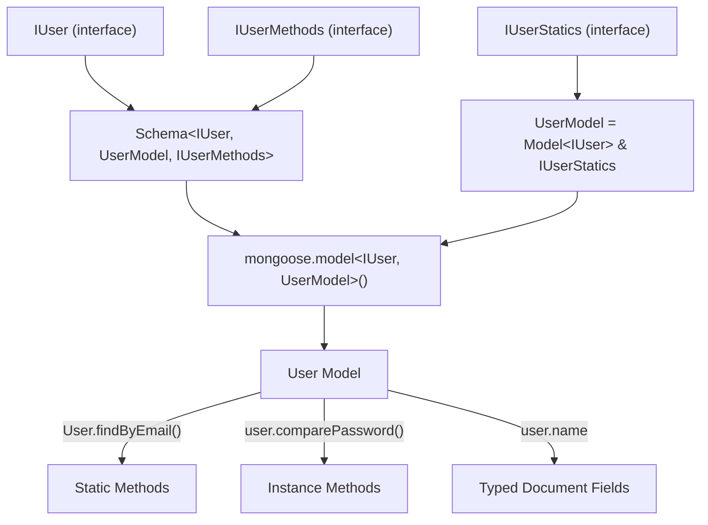

# How to Type Mongoose Models and Schemas in TypeScript

Mongoose and TypeScript have a complicated relationship. I've been using both together for about four years now, and I can say with confidence: it's gotten *better*, but it's still one of the most frustrating typing experiences in the Node.js ecosystem. The types are deeply nested, the generics are confusing, and there are at least three different approaches to typing a model depending on which version of Mongoose you're using.

The good news is that Mongoose 7+ and 8+ have significantly improved their TypeScript support. The bad news is that most of the Stack Overflow answers and blog posts out there are still written for Mongoose 5 or 6, where you had to jump through hoops with `Document` extensions and manual type assertions.

I'm going to show you the modern approach  how to type Mongoose models and schemas in TypeScript so that your documents, methods, statics, and even populate calls are all fully typed. Fair warning: this is a long one, because Mongoose has a lot of surface area to cover.

## The Foundation: Interface + Schema + Model

The basic pattern in Mongoose + TypeScript has three layers:

1. A TypeScript **interface** describing the shape of your document
2. A **Schema** that uses that interface as a generic
3. A **Model** compiled from the schema

Here's the simplest possible example:

```typescript
import mongoose, { Schema, Model } from 'mongoose';

// 1. Interface for your document data
interface IUser {
  name: string;
  email: string;
  age: number;
  isActive: boolean;
  createdAt: Date;
  updatedAt: Date;
}

// 2. Schema with the interface as generic
const userSchema = new Schema<IUser>(
  {
    name: { type: String, required: true },
    email: { type: String, required: true, unique: true },
    age: { type: Number, required: true },
    isActive: { type: Boolean, default: true },
  },
  { timestamps: true } // auto-generates createdAt/updatedAt
);

// 3. Model
const User = mongoose.model<IUser>('User', userSchema);
```

Now when you query, everything is typed:

```typescript
const user = await User.findOne({ email: 'alice@test.com' });
// user is (IUser & Document) | null

if (user) {
  console.log(user.name);    // string  typed
  console.log(user.email);   // string  typed
  console.log(user.whatever); // Error  doesn't exist
}
```

This basic pattern covers maybe 60% of use cases. But real projects need methods, statics, virtuals, and typed populate. That's where it gets interesting.

## Document Methods: Adding Instance Methods

Document methods are functions available on individual document instances  like `user.comparePassword()` or `user.fullName()`. To type them, you need a separate methods interface:

```typescript
// Define the methods interface
interface IUserMethods {
  comparePassword(candidatePassword: string): Promise<boolean>;
  getPublicProfile(): Pick<IUser, 'name' | 'email'>;
}

// The Model type now includes both the document and methods
type UserModel = Model<IUser, {}, IUserMethods>;

// Schema uses all three generics
const userSchema = new Schema<IUser, UserModel, IUserMethods>(
  {
    name: { type: String, required: true },
    email: { type: String, required: true },
    password: { type: String, required: true },
  }
);

// Implement the methods
userSchema.methods.comparePassword = async function (
  candidatePassword: string
): Promise<boolean> {
  // 'this' is typed as IUser & IUserMethods  nice
  const bcrypt = await import('bcrypt');
  return bcrypt.compare(candidatePassword, this.password);
};

userSchema.methods.getPublicProfile = function () {
  return { name: this.name, email: this.email };
};

const User = mongoose.model<IUser, UserModel>('User', userSchema);
```

Now document methods are fully typed:

```typescript
const user = await User.findById(someId);
if (user) {
  const isMatch = await user.comparePassword('secret123');
  // isMatch is boolean  typed

  const profile = user.getPublicProfile();
  // profile is { name: string; email: string }  typed
}
```

> **Tip:** The `Schema` constructor takes three generics: `Schema<DocType, ModelType, InstanceMethodsType>`. The order matters. If you skip one, use `{}` as a placeholder  don't leave it out, or the generics won't align.

## Static Methods: Model-Level Functions

Statics are methods on the Model itself, not on individual documents. Think `User.findByEmail()` or `User.getActiveCount()`. These need yet another interface:

```typescript
interface IUserStatics {
  findByEmail(email: string): Promise<(IUser & IUserMethods) | null>;
  getActiveCount(): Promise<number>;
}

// Full model type: Model<Doc, QueryHelpers, Methods, Virtuals, Statics>
// But the simpler approach uses the Model interface directly
type UserModel = Model<IUser, {}, IUserMethods> & IUserStatics;

const userSchema = new Schema<IUser, UserModel, IUserMethods>(
  {
    name: { type: String, required: true },
    email: { type: String, required: true },
    isActive: { type: Boolean, default: true },
    password: { type: String, required: true },
  }
);

// Implement statics
userSchema.statics.findByEmail = function (email: string) {
  return this.findOne({ email });
};

userSchema.statics.getActiveCount = function () {
  return this.countDocuments({ isActive: true });
};

const User = mongoose.model<IUser, UserModel>('User', userSchema);
```

Usage:

```typescript
// Static methods  called on the Model, not a document
const user = await User.findByEmail('alice@test.com');
const count = await User.getActiveCount();
// count is number  typed
```

Here's a quick visual of how all these pieces connect:



## Virtual Fields

Virtuals are computed properties that don't get stored in MongoDB. The classic example is `fullName` derived from `firstName` and `lastName`:

```typescript
interface IUser {
  firstName: string;
  lastName: string;
  email: string;
}

interface IUserVirtuals {
  fullName: string;
}

const userSchema = new Schema<IUser, Model<IUser>, {}, {}, IUserVirtuals>(
  {
    firstName: { type: String, required: true },
    lastName: { type: String, required: true },
    email: { type: String, required: true },
  }
);

userSchema.virtual('fullName').get(function () {
  return `${this.firstName} ${this.lastName}`;
});

const User = mongoose.model('User', userSchema);
```

With Mongoose 8+, virtuals in the generic chain work well. In older versions, you sometimes needed to cast  but those days are mostly behind us.

```typescript
const user = await User.findById(id);
if (user) {
  console.log(user.fullName); // string  typed, computed at access time
}
```

## Typing Populate Queries

Populate is where Mongoose typing gets genuinely hard. When you populate a field, its type changes from an `ObjectId` to the full referenced document. Here's how to handle it:

```typescript
interface IPost {
  title: string;
  content: string;
  author: mongoose.Types.ObjectId; // before populate
}

interface IPostPopulated {
  title: string;
  content: string;
  author: IUser; // after populate
}

const postSchema = new Schema<IPost>({
  title: { type: String, required: true },
  content: { type: String, required: true },
  author: { type: Schema.Types.ObjectId, ref: 'User', required: true },
});

const Post = mongoose.model<IPost>('Post', postSchema);
```

When querying with populate, you cast to the populated type:

```typescript
// Without populate  author is ObjectId
const post = await Post.findById(postId);
// post.author is mongoose.Types.ObjectId

// With populate  cast to the populated version
const populatedPost = await Post.findById(postId)
  .populate<{ author: IUser }>('author');

if (populatedPost) {
  // populatedPost.author is IUser  fully typed
  console.log(populatedPost.author.name);
  console.log(populatedPost.author.email);
}
```

The `.populate<{ author: IUser }>()` generic is the key. It tells TypeScript "after this populate call, the `author` field is an `IUser`, not an `ObjectId`." This works for nested populates too:

```typescript
const post = await Post.findById(postId)
  .populate<{ author: IUser }>('author')
  .populate<{ comments: IComment[] }>('comments');
```

Each `.populate<>()` generic is additive  TypeScript intersects them to give you the final type.

## The Full Pattern: Everything Together

Here's what a production-ready Mongoose model file looks like with all the pieces:

```typescript
import mongoose, { Schema, Model, Types } from 'mongoose';

// --- Interfaces ---
interface IUser {
  name: string;
  email: string;
  password: string;
  role: 'admin' | 'user' | 'moderator';
  posts: Types.ObjectId[];
  isActive: boolean;
  lastLoginAt?: Date;
  createdAt: Date;
  updatedAt: Date;
}

interface IUserMethods {
  comparePassword(candidate: string): Promise<boolean>;
  toPublicJSON(): Omit<IUser, 'password'>;
}

interface IUserStatics {
  findByEmail(email: string): Promise<HydratedUser | null>;
  findActiveUsers(): Promise<HydratedUser[]>;
}

interface IUserVirtuals {
  postCount: number;
}

// Hydrated document type  useful for function signatures
type HydratedUser = mongoose.HydratedDocument<
  IUser,
  IUserMethods & IUserVirtuals
>;

// Full model type
type UserModel = Model<IUser, {}, IUserMethods, IUserVirtuals> & IUserStatics;

// --- Schema ---
const userSchema = new Schema<IUser, UserModel, IUserMethods, {}, IUserVirtuals>(
  {
    name: { type: String, required: true, trim: true },
    email: { type: String, required: true, unique: true, lowercase: true },
    password: { type: String, required: true, select: false },
    role: {
      type: String,
      enum: ['admin', 'user', 'moderator'],
      default: 'user',
    },
    posts: [{ type: Schema.Types.ObjectId, ref: 'Post' }],
    isActive: { type: Boolean, default: true },
    lastLoginAt: { type: Date },
  },
  { timestamps: true }
);

// --- Methods ---
userSchema.methods.comparePassword = async function (candidate: string) {
  const bcrypt = await import('bcrypt');
  return bcrypt.compare(candidate, this.password);
};

userSchema.methods.toPublicJSON = function () {
  const obj = this.toObject();
  const { password, ...rest } = obj;
  return rest;
};

// --- Statics ---
userSchema.statics.findByEmail = function (email: string) {
  return this.findOne({ email });
};

userSchema.statics.findActiveUsers = function () {
  return this.find({ isActive: true });
};

// --- Virtuals ---
userSchema.virtual('postCount').get(function () {
  return this.posts.length;
});

// --- Model ---
export const User = mongoose.model<IUser, UserModel>('User', userSchema);
export type { IUser, HydratedUser };
```

That's the whole thing. It's verbose  I won't pretend otherwise. But every piece serves a purpose, and once you have this template, creating new models is mostly copy-paste-modify.

| Feature | Interface Needed | Schema Generic Position |
|---------|-----------------|----------------------|
| Document fields | `IUser` | 1st (`DocType`) |
| Instance methods | `IUserMethods` | 3rd (`InstanceMethods`) |
| Static methods | `IUserStatics` | Intersected with `Model` |
| Virtuals | `IUserVirtuals` | 5th (`Virtuals`) |
| Query helpers | `IUserQueryHelpers` | 2nd (`QueryHelpers`) |

## Quick Tips From the Trenches

**Don't include `_id` in your interface**  Mongoose adds it automatically, and including it can cause type conflicts. If you need to reference the `_id` type, use `mongoose.Types.ObjectId` or the `HydratedDocument` type which includes it.

**Use `HydratedDocument` for function parameters**  when you're passing a Mongoose document to a helper function, `HydratedDocument<IUser, IUserMethods>` gives you the full type including methods, `_id`, and all the Mongoose document methods like `.save()` and `.toObject()`.

**`timestamps: true` fields go in the interface, not the schema**  if you use `timestamps: true` in schema options, you still need `createdAt` and `updatedAt` in your interface for TypeScript to know about them. The schema option tells Mongoose to *generate* them; the interface tells TypeScript they *exist*.

**Consider using `InferSchemaType`**  in Mongoose 7+, you can derive the interface from the schema instead of writing it manually. It's useful for simple schemas but breaks down with methods and virtuals. I still prefer writing the interface by hand for anything non-trivial.

If you're migrating an existing JavaScript Mongoose codebase to TypeScript, the interface-writing part is the most tedious. [SnipShift's JS to TypeScript converter](https://snipshift.dev/js-to-ts) can speed that up  paste your existing model file and it'll generate the TypeScript interfaces from your schema definitions. Not perfect for complex cases, but it handles the 80% of boilerplate fields.

For more on TypeScript generics  which Mongoose leans on heavily  check out our [TypeScript generics guide](/blog/typescript-generics-explained). And if you're building a REST API on top of these models, the [Express + TypeScript typing guide](/blog/type-express-request-response-typescript) covers the request/response side.

Mongoose + TypeScript is admittedly painful. But once you've set up the pattern, you get autocomplete on every query, type errors when your schema drifts from your interface, and a much better experience for anyone joining the project. That tradeoff is worth the initial setup cost every single time.
