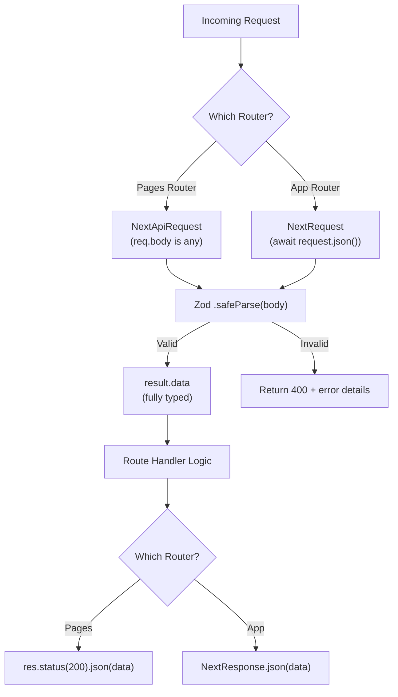

# How to Type Next.js API Routes in TypeScript (App Router + Pages Router)

Next.js has two completely different API systems, and typing them in TypeScript requires completely different approaches. If you've been trying to type your Next.js API routes and nothing seems to work, there's a good chance you're looking at docs for the wrong router.

The Pages Router uses `NextApiRequest` and `NextApiResponse`. The App Router uses `NextRequest` and `NextResponse`. They look similar, but they're different types with different generics and different capabilities. I've watched teammates confuse these more times than I can count  and the error messages don't help.

Let me break down both approaches, show you how to type request bodies, params, and query strings in each, and then cover a Zod validation pattern that works beautifully with either.

## Pages Router: `NextApiRequest` / `NextApiResponse`

If you're using the `pages/api/` directory, here's the basic pattern:

```typescript
import type { NextApiRequest, NextApiResponse } from 'next';

interface UserResponse {
  id: number;
  name: string;
  email: string;
}

interface ErrorResponse {
  error: string;
}

export default function handler(
  req: NextApiRequest,
  res: NextApiResponse<UserResponse | ErrorResponse>
) {
  if (req.method !== 'GET') {
    return res.status(405).json({ error: 'Method not allowed' });
  }

  // res.json() is typed  must match UserResponse | ErrorResponse
  res.status(200).json({ id: 1, name: 'Alice', email: 'alice@test.com' });
}
```

`NextApiResponse<T>` takes a generic that types the argument to `.json()`. That part is clean. The problem is on the request side  `NextApiRequest` doesn't have generics for the body or query in the same way Express does.

### Typing the Request Body

`req.body` on `NextApiRequest` is typed as `any`. You need to narrow it yourself:

```typescript
interface CreateUserBody {
  name: string;
  email: string;
  role: 'admin' | 'user';
}

export default function handler(
  req: NextApiRequest,
  res: NextApiResponse<UserResponse | ErrorResponse>
) {
  if (req.method !== 'POST') {
    return res.status(405).json({ error: 'Method not allowed' });
  }

  // Option 1: Type assertion (quick but unsafe)
  const body = req.body as CreateUserBody;

  // Option 2: Runtime validation (recommended  see Zod section below)
}
```

Type assertions work, but they don't validate anything at runtime. Someone sends `{ name: 123 }` and TypeScript won't catch it  the assertion just trusts you. For anything going to production, use runtime validation. I'll cover the Zod pattern in a minute.

### Typing Query Parameters

Query params on `NextApiRequest` are typed as `Partial<{ [key: string]: string | string[] }>`. That's accurate but verbose to work with:

```typescript
// pages/api/users.ts  handles /api/users?page=1&sort=name

export default function handler(
  req: NextApiRequest,
  res: NextApiResponse
) {
  const page = req.query.page;
  // page is string | string[] | undefined

  // You'll usually want to narrow it
  const pageNum = typeof page === 'string' ? parseInt(page, 10) : 1;
  const sort = req.query.sort as string | undefined;
}
```

It's not pretty. But it's honest  query params genuinely can be arrays (if the same key appears multiple times), so the type reflects reality.

## App Router: `NextRequest` / `NextResponse`

The App Router (the `app/` directory) uses a completely different API. Route handlers are exported named functions  `GET`, `POST`, `PUT`, `DELETE`  from `route.ts` files:

```typescript
// app/api/users/route.ts
import { NextRequest, NextResponse } from 'next/server';

interface UserResponse {
  id: number;
  name: string;
  email: string;
}

export async function GET(request: NextRequest) {
  const users: UserResponse[] = [
    { id: 1, name: 'Alice', email: 'alice@test.com' },
  ];

  return NextResponse.json(users);
  // Note: NextResponse.json() is not generic-typed by default
}
```

One thing that catches people off guard: `NextResponse.json()` doesn't take a generic parameter. It accepts `unknown` and serializes whatever you give it. So unlike the Pages Router's `res.json<T>()`, you don't get compile-time checking on the response shape out of the box.

### Typed Response Workaround

To get type safety on App Router responses, I use a helper:

```typescript
function jsonResponse<T>(data: T, init?: ResponseInit): NextResponse {
  return NextResponse.json(data, init);
}

// Now TypeScript checks the shape
export async function GET() {
  const user: UserResponse = { id: 1, name: 'Alice', email: 'alice@test.com' };
  return jsonResponse<UserResponse>(user);

  // This would error:
  // return jsonResponse<UserResponse>({ wrong: 'shape' });
}
```

It's a one-liner but it adds meaningful safety. Some teams go further and define a standard API response wrapper:

```typescript
interface ApiSuccess<T> {
  success: true;
  data: T;
}

interface ApiError {
  success: false;
  error: string;
}

type ApiResponse<T> = ApiSuccess<T> | ApiError;

function apiSuccess<T>(data: T): NextResponse {
  return NextResponse.json({ success: true, data } satisfies ApiSuccess<T>);
}

function apiError(message: string, status = 400): NextResponse {
  return NextResponse.json(
    { success: false, error: message } satisfies ApiError,
    { status }
  );
}
```

### Typing Route Params

Dynamic route segments in the App Router come through the second argument  not on the request object:

```typescript
// app/api/users/[id]/route.ts

interface RouteParams {
  params: Promise<{ id: string }>;
}

export async function GET(
  request: NextRequest,
  { params }: RouteParams
) {
  const { id } = await params;
  // id is string  typed

  const user = await findUser(id);
  if (!user) {
    return apiError('User not found', 404);
  }

  return apiSuccess(user);
}
```

> **Warning:** In recent Next.js versions, `params` is a Promise that must be awaited. If you're on an older version, check whether your `params` is synchronous or async  this changed and causes confusing type errors if you get it wrong.

### Typing the Request Body

`NextRequest` extends the standard `Request` API, so parsing the body is explicit:

```typescript
export async function POST(request: NextRequest) {
  const body = await request.json();
  // body is 'any'  same problem as Pages Router

  // Type assertion approach
  const { name, email } = body as CreateUserBody;

  // Better: validate with Zod (see below)
}
```

## The Zod Validation Pattern (Works with Both Routers)

This is the pattern I use on every Next.js project now. Instead of type assertions that lie to you, validate the request body at runtime and let Zod infer the TypeScript type:

```typescript
import { z } from 'zod';

const CreateUserSchema = z.object({
  name: z.string().min(1, 'Name is required'),
  email: z.string().email('Invalid email'),
  role: z.enum(['admin', 'user']).default('user'),
});

// Infer the TS type from the schema  single source of truth
type CreateUserBody = z.infer<typeof CreateUserSchema>;
// { name: string; email: string; role: 'admin' | 'user' }
```

Now use it in your route handler:

```typescript
// App Router version
export async function POST(request: NextRequest) {
  const body = await request.json();
  const result = CreateUserSchema.safeParse(body);

  if (!result.success) {
    return NextResponse.json(
      { error: 'Validation failed', details: result.error.flatten() },
      { status: 400 }
    );
  }

  // result.data is CreateUserBody  validated AND typed
  const user = await createUser(result.data);
  return NextResponse.json(user, { status: 201 });
}
```

```typescript
// Pages Router version
export default function handler(
  req: NextApiRequest,
  res: NextApiResponse
) {
  if (req.method !== 'POST') {
    return res.status(405).json({ error: 'Method not allowed' });
  }

  const result = CreateUserSchema.safeParse(req.body);

  if (!result.success) {
    return res.status(400).json({
      error: 'Validation failed',
      details: result.error.flatten(),
    });
  }

  // result.data is typed and validated
  const user = createUser(result.data);
  res.status(201).json(user);
}
```

The beauty of Zod here is the single source of truth  you define the shape once, and you get both runtime validation and compile-time types from it. No more writing an interface AND a validation function AND hoping they stay in sync.

If you want to generate Zod schemas from existing JSON response shapes, [SnipShift's JSON to Zod converter](https://snipshift.dev/json-to-zod) does exactly that  paste a sample API response and get a type-safe Zod schema back.



## Typing Middleware

Middleware typing differs between routers too.

For the **App Router**, middleware lives in `middleware.ts` at the project root:

```typescript
// middleware.ts
import { NextRequest, NextResponse } from 'next/server';

export function middleware(request: NextRequest) {
  const token = request.headers.get('authorization');

  if (!token) {
    return NextResponse.json(
      { error: 'Unauthorized' },
      { status: 401 }
    );
  }

  // Add custom headers for downstream route handlers
  const requestHeaders = new Headers(request.headers);
  requestHeaders.set('x-user-id', 'decoded-user-id');

  return NextResponse.next({
    request: { headers: requestHeaders },
  });
}

export const config = {
  matcher: '/api/:path*',
};
```

For the **Pages Router**, you can create higher-order functions that wrap your handlers:

```typescript
type ApiHandler = (
  req: NextApiRequest,
  res: NextApiResponse
) => Promise<void> | void;

function withAuth(handler: ApiHandler): ApiHandler {
  return async (req, res) => {
    const token = req.headers.authorization;
    if (!token) {
      return res.status(401).json({ error: 'Unauthorized' });
    }
    // Attach user to request (requires declaration merging)
    (req as any).userId = 'decoded-id';
    return handler(req, res);
  };
}

// Usage
export default withAuth(async (req, res) => {
  // handler logic
});
```

| Feature | Pages Router | App Router |
|---------|-------------|------------|
| Request type | `NextApiRequest` | `NextRequest` |
| Response type | `NextApiResponse<T>` | `NextResponse` (no generic) |
| Body typing | `req.body` (any) | `await request.json()` (any) |
| Response generic | Yes  types `.json()` | No  use wrapper helper |
| Route params | `req.query` | Second arg, `{ params }` |
| Middleware | HOF wrapper pattern | `middleware.ts` file |

## My Recommendation

If you're starting a new Next.js project, use the App Router with Zod validation on every route. The lack of response generics is a minor annoyance solved by a one-line helper, and you get proper Web API types (`Request`, `Response`) that transfer to other frameworks.

If you're maintaining a Pages Router project, type your `NextApiResponse<T>` generics and add Zod validation to every handler that accepts user input. That alone catches most bugs.

Either way, stop using type assertions on request bodies. That's a lie that will bite you in production  and it's always the 3am kind of bite.

For more on converting your existing JavaScript Next.js code to TypeScript, check out [SnipShift's JS to TS converter](https://snipshift.dev/js-to-ts). And if you're typing your API client on the frontend side, our [Axios response typing guide](/blog/type-axios-response-data-typescript) covers the other half of the equation. For general TypeScript patterns, the [interface vs type](/blog/typescript-interface-vs-type) post is a solid foundation.
