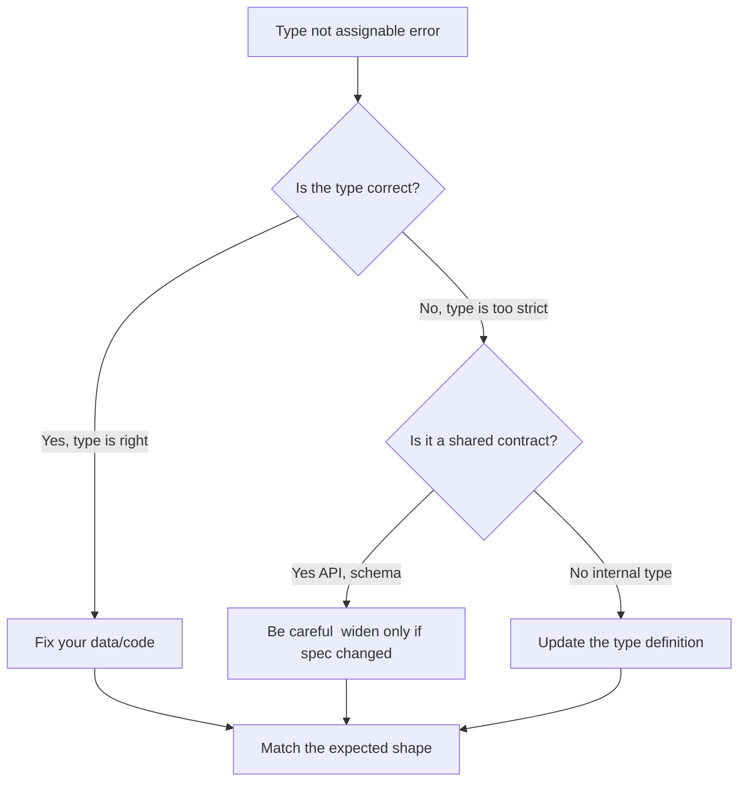

# What Does 'Type X Is Not Assignable to Type Y' Mean in TypeScript?

If you've spent more than a week writing TypeScript, you've seen this error. Probably dozens of times. Maybe hundreds. The red squiggly appears, you hover over it, and TypeScript hits you with something like:

```
Type '{ name: string; age: number; email: string; }' is not assignable to type 'User'.
  Object literal may only specify known properties, and 'email' does not exist in type 'User'.
```

And you stare at it thinking  but it's *right there*. It clearly has the right shape. What's going on?

The "type is not assignable to type" error in TypeScript is the single most common type error you'll encounter. I've seen it confuse junior devs and senior engineers alike, because the message can mean very different things depending on the context. Sometimes it's a genuine bug in your code. Other times, TypeScript is being stricter than you'd expect  and understanding *why* is the key to fixing it fast.

## Why This Error Exists: Structural Typing 101

TypeScript uses **structural typing** (also called "duck typing"). That means it doesn't care about the *name* of a type  it cares about the *shape*. If two types have the same properties with the same types, they're compatible.

```typescript
interface Dog {
  name: string;
  breed: string;
}

interface Pet {
  name: string;
  breed: string;
}

const myDog: Dog = { name: "Rex", breed: "Labrador" };
const myPet: Pet = myDog; // Works fine  same shape
```

So far so good. But structural typing has rules, and when you break them  even subtly  you get the "not assignable" error. Here are the five most common scenarios I run into.

## Scenario 1: Extra Properties on Object Literals

This is the one that trips people up first. TypeScript has a feature called **excess property checking** that only kicks in when you assign an object literal directly to a typed variable.

```typescript
interface User {
  name: string;
  age: number;
}

// This fails  excess property 'email'
const user: User = {
  name: "Alice",
  age: 30,
  email: "alice@example.com", // Error!
};
```

But this works:

```typescript
const data = {
  name: "Alice",
  age: 30,
  email: "alice@example.com",
};

const user: User = data; // No error!
```

Wait, what? Same data, different behavior. That's because excess property checks only apply to *fresh* object literals. When you assign through an intermediate variable, TypeScript just checks that the shape is compatible  and `data` has everything `User` needs, so it passes.

**The fix:** Either remove the extra property, add it to your interface, or assign through a variable if the extra property is intentional.

```typescript
interface User {
  name: string;
  age: number;
  email?: string; // Now it's part of the type
}
```

## Scenario 2: Literal Types vs. Wider Types

This one is sneaky. It comes up all the time with string literals and `const` assertions.

```typescript
interface Config {
  mode: "development" | "production";
  port: number;
}

const mode = "development"; // TypeScript infers: string
const config: Config = {
  mode: mode, // Error! Type 'string' is not assignable to type '"development" | "production"'
  port: 3000,
};
```

TypeScript inferred `mode` as `string`  not the literal `"development"`. And a `string` is wider than `"development" | "production"`, so the assignment fails.

**The fix:** Use `as const` or a type annotation to keep the literal type.

```typescript
const mode = "development" as const; // Type: "development"
// OR
const mode: "development" | "production" = "development";
```

I see this one constantly when people build config objects piece by piece instead of all at once. If you're constructing objects dynamically and passing them into typed functions, `as const` is your friend.

## Scenario 3: Missing Properties

The most obvious case  and honestly, this is TypeScript doing its job well.

```typescript
interface ApiResponse {
  data: unknown;
  status: number;
  message: string;
}

// Error: Property 'message' is missing
const response: ApiResponse = {
  data: { id: 1 },
  status: 200,
};
```

**The fix:** Add the missing property, or make it optional if it genuinely might not exist.

```typescript
interface ApiResponse {
  data: unknown;
  status: number;
  message?: string; // Optional now
}
```

> **Tip:** If you're converting a JavaScript codebase to TypeScript and hitting a wall of these errors, [SnipShift's JS to TypeScript converter](https://snipshift.dev/js-to-ts) can generate proper interfaces from your existing code  including marking optional fields where your JS uses them inconsistently.

## Scenario 4: Union Type Mismatches

When you have a union type, TypeScript needs to narrow it before you can use type-specific properties. But sometimes the error shows up during *assignment*, not usage.

```typescript
type Result =
  | { success: true; data: string }
  | { success: false; error: string };

// Error: not assignable  has both 'data' and 'error'
const result: Result = {
  success: true,
  data: "hello",
  error: "oops", // Excess property  doesn't belong on the success branch
};
```

TypeScript matches your object literal against the best-fitting union member (`success: true` matches the first branch), then applies excess property checking against *that* branch. Since the success branch doesn't have `error`, you get the error.

**The fix:** Only include properties that belong to the specific union branch you're constructing.

```typescript
const result: Result = {
  success: true,
  data: "hello",
}; // Clean
```

## Scenario 5: Incompatible Function Signatures

This one's more subtle. It shows up when you pass a callback that doesn't quite match the expected signature.

```typescript
interface EventHandler {
  (event: MouseEvent): void;
}

const handleClick: EventHandler = (e: Event) => {
  // Error! Type 'Event' is not assignable to type 'MouseEvent'
  console.log(e.clientX);
};
```

`Event` is a *parent* of `MouseEvent`. You're trying to assign a handler that accepts a broader type where a narrower one is expected. TypeScript catches this because `Event` doesn't guarantee `clientX` exists.

**The fix:** Use the correct, more specific type.

```typescript
const handleClick: EventHandler = (e: MouseEvent) => {
  console.log(e.clientX); // Works  MouseEvent has clientX
};
```

## Quick Reference: Causes and Fixes

| Cause | What Happened | Fix |
|-------|--------------|-----|
| Excess property | Object literal has extra fields | Remove field, add to type, or use intermediate variable |
| Literal vs. wide type | `string` where `"foo" \| "bar"` expected | Use `as const` or explicit annotation |
| Missing property | Required field not provided | Add the field or mark it optional |
| Union mismatch | Properties from wrong branch | Only include props for the branch you're building |
| Function signature | Parameter types don't match | Use the expected parameter type |

## When to Widen Types vs. Fix the Data

Here's the judgment call that comes with experience. When you see "type is not assignable," you have two options:

1. **Widen the type**  make it accept more shapes (add optional fields, broaden unions, etc.)
2. **Fix the data**  change your code to match the existing type

My rule of thumb: if the type represents a contract (an API response, a database schema, a shared interface between modules), don't widen it just to silence an error. Fix the data. The type is protecting you.

But if the type is your own internal definition and it's genuinely too restrictive  like you forgot to include a valid variant in a union, or you marked a field required when it's actually optional  then update the type. That's not a hack, that's correcting an incomplete definition.

The worst thing you can do is slap `as any` on it and move on. That's not a fix. That's a time bomb. If you're working with complex JavaScript objects and struggling to get the types right, tools like [SnipShift's converter](https://snipshift.dev/js-to-ts) can help you generate accurate interfaces from real data  which is a much better starting point than guessing.



## Wrapping Up

The "type is not assignable to type" error is TypeScript's way of telling you that shapes don't match. Once you understand the five common causes  excess properties, literal types, missing fields, union mismatches, and function signatures  you can usually fix it in under a minute.

And honestly? Most of the time, the error is saving you from a real bug. That's the whole point. TypeScript isn't trying to annoy you  it's trying to catch the problems that `undefined is not a function` would have caught at 2am in production instead.

If you're dealing with these errors a lot during a JavaScript-to-TypeScript migration, check out our [full migration guide](/blog/convert-javascript-to-typescript) or our deep dive on [interface vs type](/blog/typescript-interface-vs-type) to get your type definitions solid from the start.
